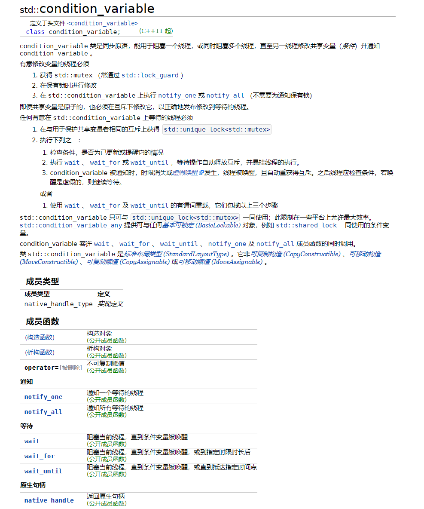
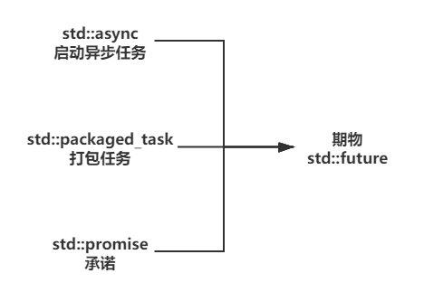
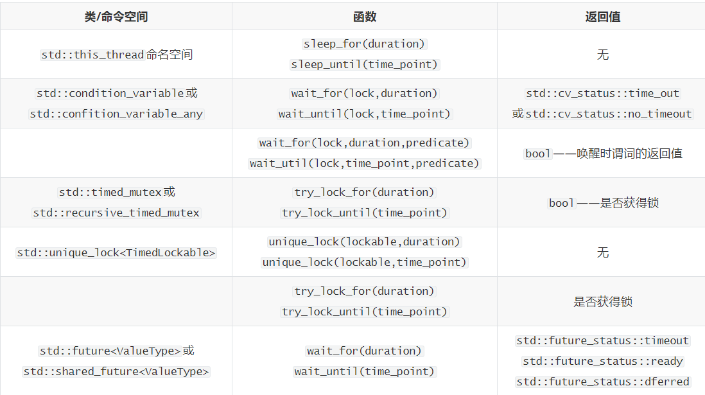
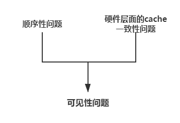
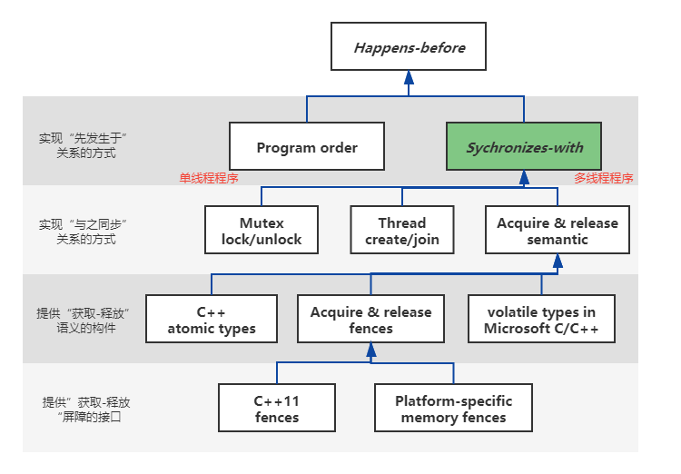
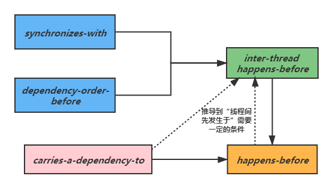
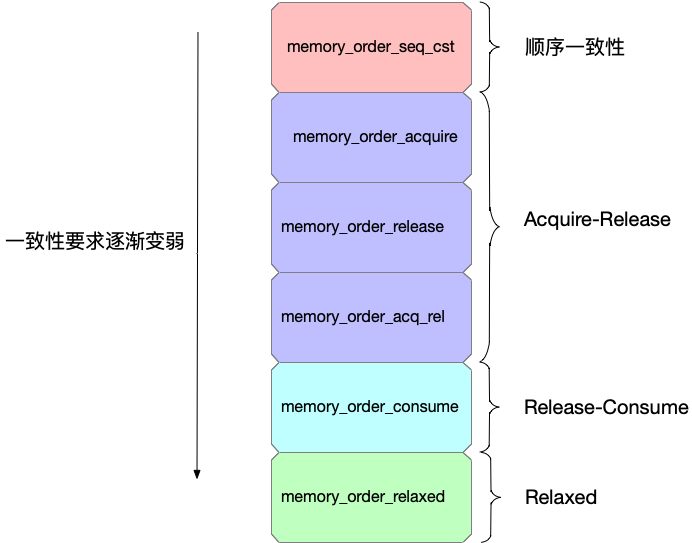

# C++并发编程

> 需要注意：C++11中线程库只提供了对线程、互斥量、条件变量、期物、单次调用等组件的支持，而POSIX库那些实际上并不常用的信号量、读写锁、闩latch、线程屏障barrier在C++20中得到支持。


## 一. 线程管理

### 1.1 线程的启动

C++11中的线程类相比于POSIX提供的线程接口而言非常简单，仅仅提供了几个常用的功能，这也意味着它实际上有一些让人不太满意的地方，但对于一般的使用它已经足够了。

我们可以通过传递一个可调用对象（函数、lambda表达式、绑定对象、成员函数等）的方式来创建一个`std::thread`。该对象一旦创建，与之相关联的线程也就相应的开始执行。且创建之后线程不可拷贝，尽可以移动。

同时如果可调用对象的调用需要一些实参，那么我们可以在线程构造函数第二个参数的位置开始向其传递。但需要注意的是这些**实参实际上是被拷贝到了线程对象的内部，这意味着线程在执行的过程中访问的不是原来我们传递进去的实参，从而可能造成一些隐蔽的错误。**例如线程执行的函数需要接受一个引用，那么如果我们不加以特殊的处理，那么实际上这个线程函数在执行的过程中实际上访问的不是原来需要引用的对象，而实`std::thread`对象内部的副本。如下所示：

```cpp
void threadFunc(std::string &str);

std::string str("hello world");
std::thread t(threadFunc, str); // 新建线程实际上访问的是thread对象中的副本字符串
```

解决这种方法就是在`str`的外面加上一个`std::ref()`函数显式的告诉编译器线程函数需要引用传进来的实参（该方法其实在`std::bind`的使用中见过）。另一个更好的方式就是使用lambda表示，这甚至能够节省编写`threadFunc()`函数的成本，我个人也更推荐使用它。


### 1.2 线程的结合和分离

当线程被创建之后如果我们对其不管不问继续执行主线程，那么主线程就有可能在子线程完成之前就调用`exit()`终止进程。如果子线程对象是在栈上对象分配的，那么线程对象就会强行调用其析构函数通过`terminate()`函数终止这个线程；如果特殊一点子线程对象是通过`new`的方式创建出来并没有被显式的`delete`掉，那么这个子线程也会最终被操作系统终止。

因此`std::thread`对象提供了**`join()`**方法来让一个线程来等待另一个线程的安全终止，并且会收回所有与该线程相关联的资源，这样`std::thread`对象就不再与现已完成的线程相关联。如果用户需要在等待线程上更加细粒度的控制或者从线程中获取其执行结果，那么可能就需要用到期物和条件变量了。

在另一方面，如果我们并不想等待线程完成，那么我们可以通过**`detach()`**方法将`std::thread`对象与相关联的线程分离，这样`std::thread`对象即使析构了也不会调用`std::terminate()`终止程序的运行。分离后的线程会在后台保持运行，此时的所有权和控制权都交给C++运行时库，它会确保与线程相关的资源在线程退出之后被正确的回收。


## 二. 线程间数据共享

### 2.1 互斥量`mutex`

#### 2.1.1 竞态条件


#### 2.1.2 正确的使用互斥量


#### 2.1.3 解决死锁


#### 2.1.4 更灵活的`unique_lock`


#### 2.1.5 恰当的锁粒度


### 2.2 其他工具

#### 2.2.1 单次调用`call_once`


#### 2.2.2 共享锁/读写锁


#### 2.2.3 递归锁


## 三. 同步并发操作

### 3.1 条件变量`condition_variable`

等待由另一个线程触发一个事件的最基本机制就是条件变量。**从概念上说，条件变量与某些事件或其他条件相关，并且一个或多个线程可以等待该条件被满足。当某个线程已经确定条件得到满足，它就可以通知一个或多个正在条件变量上等待的线程，以便唤醒它们。**

在C++11上主要有两种条件变量的实现：

- `std::condition_variable`

- `std::condition_variable_any`

其中`std::condition_variable_any`是`std::condition_variable`的泛化，它能在任何满足[*基本可锁定* *(BasicLockable)* ](https://zh.cppreference.com/w/cpp/named_req/BasicLockable)要求的锁上工作。不过，实际中用的最多的还是`std::condition_variable`，它的接口描述如下所示：




### 3.2 期物`future`

条件变量非常适合像生产者-消费者模式这样的需要不断循环等待-处理事件的场景，但有些情况下我们实际上并不需要等待多次事件，对于那些一次性事件的等待，使用期物`std::future`（有时也被称为期望、期值）更为合适。

期物允许我们将一个异步的任务交给一个背景线程去处理（也可能就是同步的在当前线程执行），但并不等待它立即执行完毕，而是立即返回继续执行别的事务，只有当调用`get()`或`wait()`接口的时候才会去显式地等待这个任务的完成（就绪）。而**期物本身实际上就是对这个异步任务的一种关联，且当异步任务完成后，期物提供了一种可以访问其返回值的能力。**

在C++11中有两类期物，如下所示：

- 唯一期物`std::future<>`：该期物的实例时仅有的一个指向其关联事件的实例。
- 共享期物`std::shared_future<>`：多个共享期物可以指向同一个事件，当任务完成后，所有期物都变为就绪，并且都可以访问与该事件相关联的数据。

虽然`std::future`被用于线程间通信，但实际上它本身是需要其他的同步机制如`std::mutex`来进行保护，不过共享期物没有这个问题。另外需要注意的是`std::xxx-future<>`这一特例化是用于无关联数据的场合，正常的期物都是有一个与之相关的返回数据。

我们知道期物本身并不是异步任务或者异步执行流，它只是对另一个异步任务的关联抽象，我们可以从异步任务中创建出期物`std::future`。它的创建方式主要有如下三种：

1. 通过`std::async`创建异步后台任务，它会返回一个期物`std::future`；
2. 通过`std::packaged_task<>`将一个期物`std::future`绑定到一个函数或可调用对象；
3. 通过`std::promise`来创建一个承诺，它可以返回一个与之关联的期物。




#### 3.2.1 通过`async`创建期物

在不需要立刻得到结果的时候，我们可以使用函数`std::async()`来启动一个异步任务，它会返回一个期物对象，而不是让用户在一个线程上等待，最终期物对象会持有函数的返回值。当需要这个值的时候，只需要在期物对象上调用`get()`成员函数，当前线程就可以阻塞到期物就绪为止然后返回该值。

至于系统是否会为这个异步任务创建一个背景线程取决于传递进去的`std::launch`类型标记：

- 如果传递给`std::async()`一个`std::launch::deferred`，那么系统并不会创建一个背景线程来执行这个异步任务，而是延迟到当前线程调用`get()`的时候同步执行。
- 如果传递给`std::async()`一个`std::launch::async`，那么系统会创建一个背景线程来执行这个异步任务。
- 如果传递给`std::async()`前两者的或（即默认情况），那么有具体实现来选择。

如下展示上述方法的使用：

```cpp
void doAsyncWork() {
  auto fut = std::async(std::launch::async,       // 异步执行一个打印字符串任务
                        [](std::string_view sv) {
                          cout << sv << endl;
                        }, "hello world");
  ...
  fut.wait();
}
```


#### 3.2.2 通过`packaged_task`将期物与可调用对象绑定

`std::packaged_task`将一个期物`std::future`绑定到一个函数或可调用对象上，我们可以通过`get_future()`接口来获取其相关联的期物。当这个打包任务对象被调用时，它就调用相关联的函数或可调用对象，并让期物就绪，同时将返回值作为关联数据存储。显然这种东西可能对于线程池的构建有一定的帮助。

作为示例，我们可以通过`std::packaged_task`+`std::thread`来实现将一个异步任务放到一个背景线程中执行，然后返回一个期物给当前的线程，从而达到类似`std::async()`的效果：

```cpp
template<typename Func, typename... Args>
decltype(auto) doAsyncWork(Func &&f, Args...args) {
  using result_type = std::result_of_t<Func(Args &&...)>;

  // 打包一个异步任务
  std::packaged_task<result_type(Args &&...)> task(std::forward<Func>(f));
  // 获取打包任务相关联的期物
  std::future<result_type> fut(task.get_future());
  // 将异步任务放到一个背景线程中执行
  std::thread backupThread(std::forward<Func>(f), std::forward<Args>(args)...);
  backupThread.detach();
  return fut;
}
```

> 其中上面的`std::result_of_t<>`的作用就是来获取一个可调用对象的返回类型。


#### 3.2.3 通过`promise`来创建期物

`std::promise`之所以会有这个名字，是因为它承诺自己会将一个有效的结果存放到它所指向的共享状态之中。显然，它是`promise-future`交流通道的“推”端，而期物`std::future`是“拉”端，从而构成了线程间通信的一种有效机制。在线程间数据交换的“推”端，承诺`std::promise`可以通过`set_value()`的方式来存放结果；而在“拉”端，`std::future`可以通过`get()`来获取这个结果。如下示例：

```cpp
int main() {
  std::vector<int> ivec{1, 2, 3, 4, 5, 6};
  std::promise<int> accPromise;
  auto fut = accPromise.get_future();

  std::thread t([](auto begin, auto end, std::promise<int> accPro) {
                  auto sum = std::accumulate(begin, end, 0);
                  accPro.set_value(sum);
                },
                ivec.begin(), ivec.end(), std::move(accPromise));

  cout << "accumulate result: " << fut.get() << endl;
  t.join();
  return 0;
}
```


#### 3.2.4 为期物保存异常

如果在期物`std::future`关联的异步任务中发生了异常，那么异常将会自动被存储在期物之中或者通过诸如`set_exception()`这样的接口显式存放。然后期物将会变为就绪状态，并且在调用`get()`的时候重新抛出这个存储的异常。


#### 3.2.5 等待自多个线程

对于唯一期物`std::future`而言，若多个线程同时访问之却不使用任何同步措施，那么就会出现数据竞争和未定义行为。为了解决这个问题，我们可以使用共享期物`std::shared_future`来解决这个问题，它可复制，共同引用相同的数据，且线程安全。其使用方法可以查看[cppreference的示例](https://zh.cppreference.com/w/cpp/thread/shared_future)。


### 3.3 有时间限制的等待

我们知道无论是对于互斥量、条件变量还是期物而言，它们的很多操作都是有可能造成线程的阻塞，并且持续一段不确定的时间，甚至有可能无限阻塞。因此对这些操作进行等待时间上的限制是非常有必要的，在C++上时间的指定主要由`std::chrono`时间库来提供。在这个时间库中主要有三个概念或者组件组成：

- 时钟*xxx_clock*：时钟可以用来帮助我们获取当前的时刻；
- 时间段*duration*：即时间长度；
- 时间点*time_point*：即时刻，内部实际上是一个起始于unix纪元的时间长度。


#### 3.3.1 时钟`xxx_clock`

如上所述，时钟的主要作用就是帮助我们获取当前的时间，但也远非如此。C++11中具体包括如下三种时钟：

1. 系统时钟`std::chrono::system_clock`，常用但不是可能存在时钟漂移，且时钟可调整；
2. 匀速时钟`std::chrono::steady_clock`，时钟匀速，但不可调整，比较稳定；
3. 高精度时钟`std::chrono::high_resolution_clock`，提供最小的节拍周期，但实际上是上述两种之一的别名。

一般我们通过该类中的静态成员函数`now()`来获取当前的具体时间点。


#### 3.3.2 时间段`duration`

如上述说，时间段就是时间长度，它是一个类模板（`std::chrono::duration<Rep, Period>`）。其中Rep用来指定记录时间计数值的数据类型，Period用来指定单位时间段表示多少秒，是一个分数`std::ratio<x,y>`。

为了使用方便，标准库实际上定义了非常多的特例化时间段版本，并为它们起了别名。包括常见的时、分、秒、毫秒、微秒、纳秒等，并且我们可以通过`std::chrono::duration_cast<>()`来实现这些特例化类对象之间的相互转换。

`std::chrono::duration`另一个方便之处在于它重载相关的运算符，无论是在时间段之间进行计算还是在时间段和时间点之间运算都非常方便。更甚之，C++11还在内联命名空间`std::literals::chrono_literals`中定义了一些字面量，包括`operator""h`、`operator""s`、`operator""ms`等，可以非常方便的给出常量时间长度。


#### 3.3.3 时间点`time_point`

如上所示，时间点本质上就是一个时间戳，记录某一个特定时刻。不过我并不喜欢C++11时间库中的这个组件，因为它竟然不支持时间字符串的生成！而这个功能实际上是时间戳类中一个非常使用的功能。如果真的要输出时间字符串，那么在原有的基础上唯一的解决方法就是使用`std::put_time()`函数，这显然很不方便。因为如果真的需要利用上面已经设计好的时钟、时间段组件，但又不想使用C++提供的时间点，那么最好重新设计一个时间戳类（这或许需要涉及到时钟的改动，因为时钟返回的是标准库中时间点类对象）。


#### 3.3.4 线程库中接受超时的函数

在C++11线程库中主要包括如下的可接受时间参数的等待函数：




## 四. 原子操作和内存模型

### 4.1 原子操作与类型

#### 4.1.1 标准原子类型和操作

从直观的角度上讲，C++11上的标准原子类型主要分成两类，一类是以`std::atomic`为代表的原子类型，并且它对常见的布尔、整型、指针等变量提供了特化；另一类就是原子标志类型，它提供了类似于原子布尔类型相似的功能。

传统意义上，标准原子类型是不可复制且不支持移动语义，相关的构造函数而赋值运算符都是deleted。它们都具有如下的三种操作，并且每一个操作均有一个可选的内存顺序参数来进行内存顺序语义的指定：

- **存储store操作**，支持`memory_order_relaxed`、`memory_order_release`和`memory_order_seq_cst`顺序；
- **载入load操作**，支持`memory_order_relaxed`、`memory_order_consume`、`memory_order_acquire`和`memory_order_seq_cst`顺序；
- **读-修改-写read-modify-write操作**（RMW），支持`memory_order_relaxed`、`memory_order_consume`、`memory_order_acquire`、`memory_order_release`、`memory_order_acq_rel`和`memory_order_seq_cst`顺序。

默认情况下这些操作都是采用`memory_order_seq_cst`顺序，不过虽然这种顺序能够提供最强的并发程序顺序性保障，但是其开销也是最大的。


#### 4.1.2 `std::atomic`

`std::atomic`是C++11中最常用的原子类型，同时标准库还为它定义了非常多的特化版本以及相应的别名。如果不考虑个别特化版本的原子类型上的特殊操作，一般而言`std::atomic`主要包括如下几个操作：

1. `is_lock_free()`：检查该原子操作是否是通过无锁实现，因为有些情况下这些所谓的原子操作可能并不是通过机器级别的原子指令来实现的（而是通过互斥量来实现的）。

2. `store()`：使用一个非原子对象去更新（存储到）该原子对象，同时为了保持C++的使用习惯还有一个等价重载运算符操作`operator=`。

3. `load()`：从指定的原子对象中加载当前值，以非原子对象的形式进行返回，同时这个加载操作还可以被隐式的使用。

4. `compare_exchange_strong()`/`compare_exchange_weak()`：强弱比较并交换操作。使用时传入一个期望值和待写入值，若原子对象的当前值等于期望值，那么待写入值会被写入到原子对象中，并同时返回true；若不相等，那么期望值会被修改成原子对象的当前值，并返回false。

   而比较并交换操作的强弱性主要体现在，弱比较并交换操作可能即使在原始值等于期望值的时候仍然发生存储失败的现象，此时原子对象的现有值不改变，然后返回false。这种现象称为伪失败，主要发生在不支持单条比较并交换指令的平台上。

5. `fetch_xxx()`：该操作主要是用来对原子对象进行更新操作（加减乘除与否非等），并同时获取更新前的原始值。

6. 原子类型还提供了重载的运算符操作（++--&=等），这些都是为了保持C++的使用惯性。

上述的内存访问操作都可以传入一个内存顺序参数，我们将在内存模型一节中介绍它们。

> 上述的操作都是以成员函数的形式给出，但实际上C++还提供了具有相同功能的非成员函数版本，不过这些操作基本用不上。


#### 4.1.3 `std::atomic_flag`

`std::atomic_flag`是一种类似于`std::atomic<bool>`的原子标志类型，相应的状态分别称为设置和清除状态。由于它的功能非常简单，所以它的操作也很少：

1. `test_and_set()`：功能类似于原子类型中的`fetch_add()`，将原子标志对象进行设置然后返回原来的状态（false或true的形式）。
2. `operator=()`：赋值运算符。
3. `clear()`：原子的清除原子标志对象上的设置状态。
4. `test()`：返回原子标志对象的当前状态。


#### 4.1.4 自定义原子类模板

如果需要使用用户自定义类型对原子类模板进行实例化，那么该自定义类型必须符合如下的要求：

1. 具有一个平凡的（trivial）拷贝赋值运算符，这意味着该类型不得支持任何虚函数或虚基类，并且拷贝赋值运算符是编译器自动合成的；
2. 类中的每个基类和非静态数据成员都必须有一个平凡的拷贝赋值运算符；
3. 该用户自定义类型必须支持按位相等可比较。

实际上这种要求即是把用户自定义类退化到类似与字面值类类型的地步，因此我个人觉得如果用户自定义的类类型稍有一点复杂的话就没有比较将其定义成原子类型，使用别的途径（互斥量去保护它）进行解决也可以。


### 4.2 ==内存模型基础==

#### 4.2.1 初识内存模型

首先我们第一个需要解决的就是什么是内存模型？在[《C++0x漫谈》系列之：多线程内存模型](https://blog.csdn.net/pongba/article/details/1659952)一文中指出：

> 从技术的角度上说“内存模型描述了给定程序的某个特定的执行轨迹是否是该程序的一个合法执行”，或者说“内存模型描述了一个给定执行轨迹上的每一个读取操作，检查该读取操作所读到的对应的写操作的结果是否违背一定的规则”。
>
> 内存模型非技术的定义指的是：*内存模型是一种高层次语言上的规定，一方面它限制了语言实现方（更多的是指编译器）的行为，指出哪些优化是被允许的；另一方面它限制了语言使用者的行为，指出需要遵守那些规则才能使自己的程序得到正确的执行*。

上面的定义很抽象，不过我认为在还未全方面的了解它之前理解这个定义确实现得有些困难，我们将在后续重新回到这里来解释内存模型的深层次含义。但有一点我们是明确的，那么就是**内存模型对程序中共享内存单元的读写执行顺序给出了一定的限制，这种限制既是对编译器、CPU的限制，也是对编程者的一种限制。**

正如我们所知的，C++11引入了内存模型的概念，但这是否意味着之前的C++没有内存模型的概念？不，之前的C++实际上是存在的，只不过原来的内存模型是针对单线程的而不是多线程。这就隐含的意思就是在这样的内存模型上编写多线程程序看上去是正确的，但实际上很有可能出现一系列未定义的错误行为，因为单线程内存模型没有对编译器做出足够的限制，使得它做出了从单线程程序角度上看是正确的但从多线程程序（或实际执行）的角度上看是错误的优化。是的，针对单线程内存模型的编译器、包括CPU都有可能对我们的多线程程序做出一定的“优化”：

1. **编译器优化**：编译器可能会考虑到访问内存会有较长时钟周期而先将数据从内存加载cache中，致使它做出调整两个在单线程上看上出没有什么数据依赖关系的内存访问指令的顺序（当然这种指令重排仅是其中一种情况）；
2. **处理器优化**：CPU会试图最大化流水线时钟周期的充分利用而对顺序发射的指令进行乱序执行（[out-of-order execution](https://en.wikipedia.org/wiki/Out-of-order_execution)），以避免因为获取下一条程序指令所引起的处理器等待，取而代之的处理下一条可以立即执行的指令，从而导致指令的重排。

但这些优化有可能是错误的！如果编程语言不能从高层次的语言角度做出对它们的优化加以限制，那么我们编写出来的多线程程序可能会出现一些我们未曾料到的未定义行为！

```cpp
std::atomic<int> count = 0;
std::atomic<bool> flag(false);
int res = 0;

// Thread1               Thread2
count = 1;              while(!flag);
flag = true;            res = count;
```

上面的多线程程序乍一看会让人以为程序完全符合我们的期望，最终变量`res`会被赋值为1。但实际上在仅支持单线程的内存模型中，有些编译器可能会自作聪明的将`flag = true;`和`count = 1;`这两条指令的顺序进行颠倒，导致`flag = true;`被先执行，这必将导致一个完全相反的结果，如下所示：

```cpp
// Thread1               Thread2
flag = true;              
                        while(!flag);
                        res = count;  // 其所见到的count仍然是0
count = 1;
```

因此从上面的例子可以得知：**如果语言不支持针对多线程的内存模型，使得我们无法对编译器的不良优化和CPU的乱序执行加以约束，那么即使多线程程序使用了原子操作，也未必能够保证我们的程序会按照想要的顺序进行执行**。这也意味着：在多线程程序中，一个线程上的操作对在另一个线程上的操作的<font color=green>**可见性**</font>、线程之间的操作之间的<font color=green>**顺序性**</font>，以及操作本身的<font color=green>**原子性**</font>都显得同样重要~~（这里假设各个线程都是在操作同一个共享变量）~~。

其中上述的原子性指的是操作要么不做要么做了，如化学中的原子一样不可再分割。顺序性指的是是否按照代码的先后顺序进行执行。可见性指的是一个线程修改了共享变量的值，其他线程能够感知到这个变量的变化。可见性不仅容易受到硬件层面的影响，而且还容易受到顺序性的影响。例如在上面的例子中，如果编译器和CPU没有对指令进行重排“优化”，那么当线程2执行到`res = count;`时它应该能够看见到该共享变量的变化。但如果指令的顺序发生了改变，那么显然线程2是根本不可能看见到该变量的任何变化。因此从这个角度上来讲**如果硬件缓存一致性上没有太大的障碍，那么顺序性问题可以说是多线程内存模型中的首要问题！**



现在再回过头来看内存模型的概念，我们可以发现实际上**内存模型定义了共享内存系统中多线程程序上读写操作行为的规范**。而C++11引入这一概念的意义也正在于它使得我们可以从高层次的编程语言层面实现对运行在多处理器上的多线程对共享内存交互时的控制（注意这里并不是指操作系统中的另一个“共享内存”概念）。


#### 4.2.2 缓存一致和顺序一致

在[为什么程序员需要关心顺序一致性而不是Cache一致性？](http://www.parallellabs.com/2010/03/06/why-should-programmer-care-about-sequential-consistency-rather-than-cache-coherence/)一文中作者已经很好的指出**顺序一致性（ Sequential Consistency）**实际上规定了两件事：

- 每个线程内部的指令都是按照程序规定的顺序（program order）执行的（单个线程的视角）
- 线程执行的交错顺序可以是任意的，但是所有线程所看见的整个程序的总体执行顺序都是一样的（整个程序的视角）

可以看出顺序一致性从高层次的角度约束了多线程程序在实际多核体系架构中的执行行为，它自顶向下不仅约束了语言还约束了编译器，以及更底层的硬件。是我们上面提出的“顺序性可以说是多线程内存模型中的首要问题”的最高解决之道，它可以保证程序的行为如我们想象中最为简单、顺序的世界观是一致的。

而**缓存一致性（Cache Conherence）**则是不像SC那样是对软件和硬件的规范，它实际上是硬件cache之间的一种同步协议。它保证对某一个地址的读操作返回的值一定是那个地址的最新值，而这个最新值可能是该线程所处的CPU核心刚刚写进去的那个最新值，也可能是另一个CPU核心上的线程刚刚写进去的最新值。实际上它解决的正是我们在上一小节中描述的可见性问题（的主要部分，另一部分在上面已经提到是由顺序性问题造成的）。正因它是硬件层面的问题，所以我们程序员的目光不用过多的关注于这一点，我们只要相信硬件能够很好的处理缓存一致性问题就可以了。不过需要注意的是，即使再好的缓存一致性解决协议，也不能保证一个共享变量更新对于所有其他线程的立即可见，延迟是必然存在，但这并不是很大的问题（就我们而言）！

所以从程序员的角度而言，顺序一致性才是程序员更应该关注的，但实际上为了达到顺序一致性要求所需要付出的代价是巨大的。此时，我们需要问顺序一致性是否真的必要吗？不。虽然顺序一致性能够保证我们想要的，但实际上为了达到程序正确执行的目的，一个局部的顺序一致性保证可能就足够了。这样模型称为**SC-DRF（sequential consistency for data race free programs）**。意思就是说对于那些存在数据竞争的地方程序员需要对其使用同步原语使程序保证没有数据竞争，并达到顺序一致性；但对于那些不存在数据竞争的地方我们并不需要对其进行特殊的处理，任由编译器去对其进行真正的优化（即不保证顺序一致性），且结果依然正确。而这样的思想正是下面获取-释放语义（acquire-release semantic）的理论依据。


#### 4.2.3 关系术语

在深入介绍C++内存模型之前，我们需要介绍一些几个重要关系术语，它们对于描述多线程程序中操作之间的执行关系有着非常有用的帮助。

##### 4.2.3.1 *happens-before*关系

**如果A *happens-before* B，那么A的内存状态**（内存效应，内存更新操作）**将在B操作执行之前就被B所在的线程可见。**这里我们主要指的是*inter-thread happens-before*关系，它表示不同线程之间的操作先后顺序，且具有非对称和可传递的性质。**从直观的角度而言，它反映着线程操作之间的可见性，但实际上它更是在反映着程序的顺序性**。而顺序性是多线程内存模型中最为重要的问题。如果不同线程上的所有操作之间有着我们期待的*happens-before*关系，那么显然多线程程序的正确执行必然能够得到充分的保证。


##### 4.2.3.2 *synchronizes-with*关系

**若一个线程对某个共享变量进行释放语义写操作，其结果被另一个线程以获取语义所读取，那么这两个（存储和加载）操作之间就存在一个*synchronizes-with*的关系。**它实际上强调的是变量被修改之后的信息传播（propagate），是两个不同线程上操作之间的**运行时先后关系**。


如果两个位于不同线程上的操作之间存在*synchronizes-with*关系，那么可以保证这两个操作之间也必然存在着*happens-before*关系。这个关系推导的意义在于它使得当前线程能够对另一个线程写操作以及之前的内存访问操作提供了可见性保证，这在上面一节已经给出了充分的描述。


一般，我们可以通过如下方式来实现两个位于不同线程之上的操作具有*synchronizes-with*的关系，并推导出*happens-before*关系：




##### 4.2.3.3 *carries-a-dependency-to*关系

**如果操作A的求值结果是操作B的操作数，那么此时我们就说操作B *carries-a-dependency-to* 操作A，可以看出”携带依赖于“实际描述的就是因同一个数据而致使指令之间形成的先后依赖关系。**同样的，他也是具有传递性。而之所以我们如此在意这一关系是因为在大多数的体系架构上CPU可以保证不会对那些具有*carries-a-dependency-to*关系的指令进行重排序，它保证了这些程序指令在局部范围内的顺序性。


> 按照个人的理解，*carries-a-dependency-to*关系的强度大于*sequenced-before*关系，而后者是可以推导出happens-before关系的。因此我认为，*carries-a-dependency-to*关系必然是可以推导出*happens-before*关系的。（注意：线程间先发生于“与单线程内的“先发生于”关系之间是不同的，其中前者的范畴更小）。


##### 4.2.3.4 *dependency-order-before*关系

”依赖先序于（*dependency-order-before*）“关系是C++释放-消费语义中存在的一种线程操作间关系，我们将在后面看到：**如果操作A在某原子对象M上执行了释放操作，而在不同的线程中，操作B在同一个原子对象上通过消费方式读取到了这个写入值，那么我们说这两个操作之间存在着*dependency-order-before*关系**。

通过*dependency-order-before*关系我们可以推导出操作A和操作B之间是存在着*happens-before*关系，而根据*happens-before*关系的传递性，我们可以进而推导出操作A之前的内存访问操作与当前线程中的操作B之间也存在着*happens-before*关系。

不过我们将在下面释放-消费顺序中看到，对于操作B之后的内存访问操作，释放-消费语义仅仅能够保证那个从消费操作开始的数据依赖指令串链对所有在另一个线程中的释放-写操作之前的内存操作可见（如果没有数据依赖关系，那么这个可见性是无法保证的！）。这些原理我们将在后续的内容中进行讲解。


> 为了理解的方便我们可以将“携带依赖于”和“发生于前”关系进行对比，将“与之同步”和“依赖先序于”关系进行对比。


##### 4.2.3.5 其他关系

其他关系我们可以在[cppreference](https://zh.cppreference.com/w/cpp/atomic/memory_order)进行查看。同时这里也总结了上面操作关系之间的推导：




### 4.3 ==C++内存模型==

#### 4.3.1 总览C++内存模型

在C++11中主要有三种内存顺序模型，分别为：**顺序一致性（sequentially-consistent）顺序模型**、**释放-获取（release-acquire）顺序模型**，以及**松弛（relaxed）模型**。但实际上应该分成四类，因为获取-释放模型内部选项又可以分成释放-获取模型和释**放-消费（release-consume）**两种类型。且这些内存顺序模型对一致性的要求逐渐减弱，但这也意味着其所带来的性能成本逐渐降低。具体如下所示：




#### 4.3.2 顺序一致顺序

在所有的内存顺序模型中，顺序一致性模型`std::memory_order_seq_cst`是最为强大的，踏入我们在先前的话题中看到的一样，意味着程序的行为与一个简单顺序的世界观是一致的。所有的原子类型实例上的操作都是顺序一致的，多线程程序的行为如同所有这些操作由单个线程以特定的顺序进行执行一样。这也意味着操作不能被重排序，其顺序对于所有线程而言都是相同可见的。

在默认的情况下它就是原子操作的默认选项，不过为了实现它所付出的代价也是最为高昂的，尤其是在那些弱内存序的体系架构上，如ARM。


#### 4.3.3 松弛顺序

松弛顺序模型`std::memory_order_relaxed`与上面的顺序一致性截然不同，它可以说仅仅提供了最基本的原子性，对于顺序性的要求可以说是非常之低。它仅使得单线程中对同一个原子变量的操作仍然服从happens-before关系，但相对于其他线程的顺序性要求几乎没有。唯一的要求如上所言就是，从同一个线程对单个原子变量的访问不能被重排，一旦给定的线程看到原子变量的特定值，该线程之后的读取就不能获取到该原子变量的旧值。

松弛顺序模型非常适合那些对于顺序性没有要求，例如递增计数值、简单的查看某一个变量的值等操作。但如果多线程程序对原子变量的操作有顺序性要求，那么松弛顺序选项可能会造成未定义行为，如下：

```cpp
std::atomic<bool> x(false), y(false);
int z = 0;

void write_x_then_y() {
  x.store(true, std::memory_order_relaxed);
  y.store(true, std::memory_order_relaxed);
}

void read_y_then_x() {
  while (!y.load(std::memory_order_relaxed));
  if (x.load(std::memory_order_relaxed)) // 不能保证自己对x更新操作的可见性
    ++z;
}

int main() {
  thread t1(write_x_then_y);
  thread t2(read_y_then_x);
  t1.join();
  t2.join();
  cout << z << endl;
  return 0;
}
```

在上面的例子中由于原子变量x和y的存储、加载都是松弛选项，因此在实际的编译、CPU执行的过程中可能造成x写入和y写入的指令顺序颠倒，因而不能保证`x.store()` *happens-before* `x.load()`（即使它们的操作是原子的也没什么用）。


#### 4.3.4 获取-释放顺序

获取-释放顺序模型胜于松弛顺序模型，它对原子操作的顺序性加以了一定程度的约束。虽然这种限制仅仅是局部的，但它确实是我们追求多线程程序对于关键操作的正确顺序性和高效的性能之间的最佳平衡。获取-释放语义的理论依据正是我们在上面<缓存一致和顺序一致>小节中提出的SC-DRF模型，它要求对于那些存在数据竞争的地方使用同步原语来保证没有数据竞争，并达到顺序一致性；但对于那些不存在数据竞争的地方并不加以特殊处理，任由编译器去对其进行优化。在保证程序正确性的同时，实现顺序性和性能之间的有效平衡。

具体而言，获取acquire和释放release语义指的是：

- 释放语义是一种只能应用于共享原子变量写操作的属性。它可以用来**防止释放-写操作**（包括读-修改-写和普通存储）**之前的任何内存读写操作重排序到其之后，使得所有的之前内存访问操作都happens-before当前操作。**

  

- 获取语义是一种只能应用于共享原子变量读操作的属性。它可以用来**防止获取-读操作**（包括读-修改-写和普通存储）**之后的任何内存读写操作重排序到其之前，使得当前操作happens-before所有之后的内存访问操作。**

  

获取-释放语义的好处在于：**它可以使得线程t1的释放-写操作A和当前线程t2的获取-读操作B之间在构成“与之同步”关系的时候，保证线程t1中先前所有的内存访问操作都*happens-before*当前线程t2获取-读操作B以及后续的内存访问操作，从保证线程之间的顺序性**。如下图所示：


这样的顺序性保证的好处在于它虽然没有保证到A之后操作和B之前操作的顺序，但这对于实现多线程程序的正确性已经足够了。如下例：

```cpp
atomic<bool> x(false), y(false);
int z = 0;

void write_x_then_y() {
  x.store(true, std::memory_order_relaxed);
  y.store(true, std::memory_order_release);
}

void read_y_then_x() {
  while (!y.load(std::memory_order_acquire));
  if (x.load(std::memory_order_relaxed))
    ++z;
}

int main() {
  thread t1(read_y_then_x);
  thread t2(write_x_then_y);
  t1.join();
  t2.join();
  cout << z << endl;
  return 0;
}
```


#### 4.3.5 释放-消费顺序


#### 4.3.6 释放序列与synchronizes-with


#### 4.3.7 内存屏障


## 五. 参考资料

1. [为什么程序员需要关心顺序一致性（Sequential Consistency）而不是Cache一致性（Cache Coherence？）](http://www.parallellabs.com/2010/03/06/why-should-programmer-care-about-sequential-consistency-rather-than-cache-coherence/)
2. [《C++0x漫谈》系列之：多线程内存模型](https://blog.csdn.net/pongba/article/details/1659952)
3. [如何理解 C++11 的六种 memory order？](https://www.zhihu.com/question/24301047)
4. [The Purpose of memory_order_consume in C++11](https://preshing.com/20140709/the-purpose-of-memory_order_consume-in-cpp11/)
5. [The Happens-Before Relation](https://preshing.com/20130702/the-happens-before-relation/)
6. [The Synchronizes-With Relation](https://preshing.com/20130823/the-synchronizes-with-relation/)
7. [Acquire and Release Semantics](https://preshing.com/20120913/acquire-and-release-semantics/)
8. [百度brpc文档-atomic_instructions](https://github.com/apache/incubator-brpc/blob/master/docs/cn/atomic_instructions.md)
9. [C++11中的内存模型下篇 - C++11支持的几种内存模型](https://www.codedump.info/post/20191214-cxx11-memory-model-2/#%E4%BF%AE%E6%94%B9%E5%8E%86%E5%8F%B2)
10. [C++11中的内存模型上篇 - 内存模型基础](https://www.codedump.info/post/20191214-cxx11-memory-model-1/)
11. [cppreference-内存顺序](https://zh.cppreference.com/w/cpp/atomic/memory_order)


这个阅读笔记必须围绕如下几个问题：

- 什么是内存模型？什么是共享内存模型？什么是消息传递模型？[《C++0x漫谈》系列之：多线程内存模型](https://blog.csdn.net/pongba/article/details/1659952)
- 为什么我们需要内存模型？[《C++0x漫谈》系列之：多线程内存模型](https://blog.csdn.net/pongba/article/details/1659952)
- 为什么说C++11之前的内存模型是单线程的，无法保证多线程程序的正确执行？[《C++0x漫谈》系列之：多线程内存模型](https://blog.csdn.net/pongba/article/details/1659952)
- 编译器和CPU对我们的程序做了什么？①编译器按照单线程内存模型对程序进行优化；②CPU使用了[乱序执行技术](https://en.wikipedia.org/wiki/Out-of-order_execution)，这么做的动机非常自然，CPU要尽量塞满每个cycle，在单位时间内运行尽量多的指令。[百度brpc文档-atomic_instructions](https://github.com/apache/incubator-brpc/blob/master/docs/cn/atomic_instructions.md)
- 如果我们显式的组织编译器的优化是否真的能够保证我们的多线程程序达到我们想要的目的？可能不行，一方面这个不行指的是即使阻止编译器对多线程程序的不良优化，也未必能保证CPU在执行我们的多线程程序时能够正确的按照我们想要的顺序执行程序并达到想要的结果（违反SC原则）；其次如果我们禁止了编译器对程序的优化，那么所有的操作严格按照代码顺序执行，所有的操作都触发*[cache coherence](http://en.wikipedia.org/wiki/Cache_coherence)*操作以确保它们的副作用在跨线程间的*visibility*顺序（也就说单单依靠硬件提供的缓存一致性所带来的性能损耗过大）。[《C++0x漫谈》系列之：多线程内存模型](https://blog.csdn.net/pongba/article/details/1659952)
- 我为什么会觉得程序执行的可见性在多个不同的线程之家是非常重要的？甚至可以说它是引出顺序一致性问题的关键！因为各个处于不同CPU核上的线程必须知道其他线程在某个关键共享变量上的执行顺序。[《C++0x漫谈》系列之：多线程内存模型](https://blog.csdn.net/pongba/article/details/1659952)
- 顺序一致性是保证我们多线程程序的正确执行的核心！[为什么程序员需要关心顺序一致性（Sequential Consistency）而不是Cache一致性（Cache Coherence？）](http://www.parallellabs.com/2010/03/06/why-should-programmer-care-about-sequential-consistency-rather-than-cache-coherence/)
- 究竟如何才能允许用户编写正确的多线程代码呢？[《C++0x漫谈》系列之：多线程内存模型](https://blog.csdn.net/pongba/article/details/1659952)
- 怎么理解缓存一致性问题和顺序一致性问题？[为什么程序员需要关心顺序一致性（Sequential Consistency）而不是Cache一致性（Cache Coherence？）](http://www.parallellabs.com/2010/03/06/why-should-programmer-care-about-sequential-consistency-rather-than-cache-coherence/)
- C++11做出了哪些改进？[官方文档memory_order](https://zh.cppreference.com/w/cpp/atomic/memory_order)
- *Acquire*语意是说所有下方的操作都不能往其上方移动，*Release*语意则相反。[百度brpc文档-atomic_instructions](https://github.com/apache/incubator-brpc/blob/master/docs/cn/atomic_instructions.md)
- “与之同步“关系和顺序一致性有着何种关联？”与之同步“关系在C++内存模型中有着何种地位？
- C++ memory consistency model 标准从语义上讲定义的是**原子变量操作之间内存可见性的顺序,** 并没有保证单个原子变量操作的内存**立即可见性.**[C++ memory consistency model 本质的理解](https://zhuanlan.zhihu.com/p/158932307)
- 顺序----执行顺序对于内存一致性模型的重要性，正是即使是原子操作的执行顺序也能够在不同的线程中有着不同的可见性？
- 释放语义和内存获取语义只保障在两个线程之间有效，使得载入操作所在的线程能够见到另一个线程写入该原子变量之前的所有内存访问操作，但这并不保证其他的线程的可见性？
- wait-free和lock-free算法的含义（它们都是用来描述一个并发算法，不是用来描述它有没有用到锁，当然前提肯定是使用了无锁操作，即原子操作）[对wait-free和lock-free的理解](https://zhuanlan.zhihu.com/p/342921323)


百度brpc的文档对获取acquire和释放release语义的描述其实非常好，我该怎么重新组织这部分的语言来描述C++11的内存模型呢？

A happens-before B表示的是程序正如我们所愿正确顺序执行的语义，而不是代表在实际多线程程序中执行时操作A真的在操作B之前完成！

