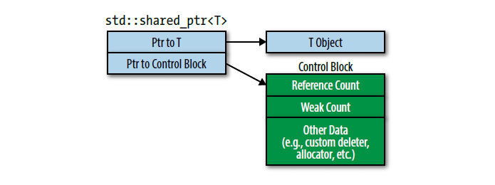

# Effective Modern C++

## 一. 类型推导

### 条款1：理解模板类型推导

```c++
template<typename T>
void f(ParamType param);
```

对于模板类型的推导主要有如下三种情况：

```c++
// 1. ParamType是一个指针或引用，但不是通用引用。例如：
template<typename T>
void f(T& param);

// 2. ParamType是一个通用引用。例如：
template<typename T>
void f(T&& param);

// 3. ParamType既不是引用也不是指针，参数以传值方式处理。例如：
template<typename T>
void f(T param);
```


对于这一条款，我们**需要记住**：

+ <font color=green>**在模板类型推导时，有引用的实参会被视为无引用，他们的引用会被忽略**</font>
+ <font color=green>**对于通用引用的推导，左值实参会被特殊对待，此时T和ParamType都会被推到为左值引用**</font>
+ <font color=green>**对于传值类型推导，实参的顶层const属性和volatile属性会被丢弃**</font>
+ 在模板类型推导时，数组名或者函数名实参会退化为指针，除非它们被用于初始化引用 


### 条款2：理解`auto`类型推导

当一个变量使用auto进行声明的时候，auto扮演着模板中T的角色，变量的类型说明符扮演着ParamType的角色。因此在绝大部分的场景下，auto的类型推导规则和模板类型推导规则是相同的。例如下面的表达式：

```c++
const auto& val = 23;

// 上述的表达式类似于函数模板中的类型推导：
template<typename T>
void f(const T& val);

f(23);
```

对于花括号的处理是`auto`类型推导和模板类型推导唯一不同的地方。当使用`auto`声明的变量使用花括号的语法进行初始化的时候，会推导出`std::initializer_list<T>`的实例化，但是对于模板类型推导这样就行不通（准确地说就是它不知道如何处理）。

```c++
auto x = { 11, 23, 9 };         // x的类型是std::initializer_list<int>

template<typename T>            // 带有与x的声明等价的
void f(T param);                // 形参声明的模板

f({ 11, 23, 9 });               // 错误！不能推导出T
```


对于这一条款，我们**需要记住：**

+ <font color=green>**`auto`类型推导通常和模板类型推导相同，但是`auto`类型推导假定花括号初始化代表`std::initializer_list`，而模板类型推导不这样做**</font>
+ **在C++14中`auto`允许出现在函数返回值或者*lambda*函数形参中，但是它的工作机制是模板类型推导那一套方案**，而不是`auto`类型推导


### 条款3：理解`decltype`

顾名思义，decltype在绝大多数的情况下的作用就是返回用户所提供的名字或表达式的类型。在C++11中，其最重要的用途就是用来声明函数模板，而这个函数的返回类型依赖于形参类型。虽然对于返回类型的推导在C++14之后可以使用auto这个关键字来实现自动类型推导，但是如上所见auto的类型推导可能会忽略顶层const属性和引用属性。

有时想要准确的推导返回类型的最好方法就是使用`decltype(auto)`，一种最好的解释方式就是：**`auto`说明符表示这个类型将会被推导，而`decltype`说明`decltype`的规则将会被用到这个推导过程中。**而decltype的类型推导推导规则在第一句话就阐明了。例如：

```c++
template<typename Container, typename Index = size_t>
decltype(auto) authAndAccess(Container&& c, Index i) {
    authenticateUser();
    return std::forward<Container>(c)[i];
}
```


对于这一条款，我们**需要记住**：

+ <font color=green>**`decltype`总是不加修改的产生变量或者表达式的类型。**</font>
+ 对于`T`类型的不是单纯的变量名的左值表达式，`decltype`总是产出`T`的引用即`T&`。
+ <font color=green>**C++14支持`decltype(auto)`，就像`auto`一样，推导出类型，但是它使用`decltype`的规则进行推导。**</font>


### 条款4：学会查看类型推导的结果

基本上没什么绝对好的查看类型推导结果的方法，关键还是需要看自己对C++类型推导规则的理解。


## 二. 再谈auto

### 条款5：优先考虑`auto`而非显式类型声明

auto对lambda产生的闭包有着更好的处理。我们不仅可以在lambda中的形参列表中使用auto，而且可以将lambda产生的闭包保存到auto声明的变量中。这样的处理方式比直接使用闭包初始化`std::function`对象，使其来记录闭包的方式更好，不仅语法间接，而且性能更高。例如：

```c++
// 不良方法
std::function<bool(const std::unique_ptr<Widget> &,
                   const std::unique_ptr<Widget> &)>
derefUPLess = [](const std::unique_ptr<Widget> &p1,
                 const std::unique_ptr<Widget> &p2)
                { return *p1 < *p2; };

// C++14中更好的处置
auto derefLess =
    [](const auto& p1,
       const auto& p2)
    { return *p1 < *p2; };
```

同时auto还可以避免类型快捷方式的问题，比如想要较好的获取vector中的下标类型最好的方式就是auto而不是直接定义int。


对于这一条款，我们**需要记住**：

+ `auto`变量必须初始化，通常它可以避免一些移植性和效率性的问题，也使得重构更方便，还能让你少打几个字。
+ 正如[Item2](https://github.com/kelthuzadx/EffectiveModernCppChinese/blob/master/1.DeducingTypes/item2.md)和[6](https://github.com/kelthuzadx/EffectiveModernCppChinese/blob/master/2.Auto/item6.md)讨论的，`auto`类型的变量可能会踩到一些陷阱。


### 条款6：若`auto`非自己所愿，则使用显式类型初始化

auto的类型推导在某些情况下的表现可能并非如人所愿，造成这种现象可能是因为程序员对自己所使用的库内部实现并不了解。

一种最为典型的场景就是`vector<bool>`的`operator[]`取下标运算符的返回值类型：它返回的是`vector<bool>::reference`——一种特别的外部不易察觉的代理类（所谓代理类就是以模仿和增强一些类型的行为为目的而存在的类）而不是bool。而作为通则，不可见的代理类通常不适用于auto，而且这样类型的对象的生命周期通常不会被设计为能活过一条语句！

因此继续使用auto的最佳途径就是**显式类型初始化惯用法（*the explicitly typed initialized idiom*)：使用auto声明一个变量，然后对表达式强制类型转换`static_cast<>()`成自己期望的类型结果**。这种方法的好处在于它不仅可以保证程序的正确性，而且还可以表明自己的意图。


对于这一条款，我们**需要记住**：

+ 不可见的代理类可能会使`auto`从表达式中推导出“错误的”类型
+ 显式类型初始器惯用法强制`auto`推导出你想要的结果


## 三. 移步现代C++

### 条款7：区别使用`()`和`{}`创建对象

在C++11中使用了统一初始化来整合原先混乱且不适用所有情景的初始化语法，而所谓统一初始化就是指使用单一初始化语法在任何地方表达对象初始化的语义。在语法上，C++使用了花括号初始化的方式来实现这一点。

使用花括号`{}`初始化的好处不仅局限于**①实现一个通用形式的初始化目的**，还可以**②避免内置类型间隐式的变窄转换（narrowing conversion）**：如果一个使用了花括号初始化的表达式的值，且这个值不能保证由被初始化的对象的类型所表示（例如可能发生溢出），那么代码就不会通过编译，例如：

```cpp
double x, y;
int sum{x + y}; // 错误！
```

同时花括号初始化还**③可以避免C++中经常出现的名字解析问题（又称为最令人头痛的解析问题，most vexing parse）**，如下所示：

```cpp
ClassType c1(); // 被编译器认为是一个函数声明
ClassType c1{}; // 默认初始化
```


但花括号`{}`统一初始化也会带来些许问题，它会使得花括号初始化、`std::initializer_list`和构造函数重载决议本来就不清不楚的暧昧关系进一步混乱。

在构造函数调用中，只要不包含`std::initializer_list`形参，那么花括号初始化和小括号初始化都会产生一样的结果。**然而，如果有一个或者多个构造函数的声明一个`std::initializer_list`形参，那么使用花括号初始化语法的调用更倾向于选择`std::initializer_list`重载函数。而且只要某个使用花括号表达式的调用能适用接受`std::initializer_list`的构造函数，编译器就会使用它**。如下所示：

```cpp
class ClassType {
public:
    ClassType(int i, bool b);
    ClassType(std::initializer_list<long double> il);
}

ClassType ct1{12, true}; // 编译器选择调用了std::initializer_list的构造函数版本！
```

甚至普通的构造函数和移动构造函数都会被`std::initializer_list`版本的构造函数所劫持。这是因为**编译器热衷于把花括号初始化与`std::initiallizer_list`版本的构造函数进行匹配，即使这种编译器所认为的最佳匹配并不能被正确的调用，它也会凑上去！**例如：

```c++
class ClassType {
public:
    ClassType(int i, double d);
    ClassType(std::initializer_list<bool> il);
    ...
}

ClassType ct{123, 32.2}; // 编译器选择std::initializer_list版本的构造函数，但由于
						 // 花括号中发生了内置类型的变窄转换，所以该调用是错误的
```

但有一点是不同的：空的花括号意味着没有实参，不是一个空的`std::initializer_list`，所以编译器会调用默认构造函数。

综上可知，虽然花括号初始化有着各种各样的好处，但同样也存在着一些不同寻常的潜在风险，无论从何种角度来看，对于它的使用还是需要审慎的看待。我个人建议是如果不是特别确定，那么最好不要定义`std::initializer_list`版本的构造函数。


对于这一条款，我们**需要记住**：

+ **括号初始化是最广泛使用的初始化语法，它防止变窄转换，并且对于C++最令人头疼的解析有天生的免疫性**
+ <font color=green>**在构造函数重载决议中，花括号初始化会被编译器尽最大可能与`std::initializer_list`参数版本的构造函数匹配，即便其他构造函数看起来是更好的选择**</font>
+ 对于数值类型的`std::vector`来说使用花括号初始化和小括号初始化会造成巨大的不同
+ 在模板类选择使用小括号初始化或使用花括号初始化创建对象是一个挑战。


### 条款8：优先考虑`nullptr`

C++11引入的nullptr的好处主要有如下几点：

1. **可以避免传统的C/C++ NULL重载整型和指针参数的函数中产生的函数解析问题**。nullptr并不是一个指针类型，它的真实类型为`std::nullptr_t`，而后者可以隐式转换为指向任何内置类型的指针，这便是nullptr为什么表现得像所有类型的指针的原因

2. **在模板中不会出现类型推导出错**，而NULL很有可能在模板类型推导的过程中被推导成int类型，而不是指针类型。例如下面的例子：

   ```cpp
   template<typename FuncType, typename MuxType, typename PtrType>
   decltype(auto) lockAndCall(FuncType func, MuxType& mutex, PtrType ptr) {
       MutexGuard g(mutex);
       return func(ptr); // func函数需要一个指针类型的实参
   }
   ```

   如果将NULL传递给`lockAndCall()`函数模板，那么模板类型推导的时候可能推断出PtrType的类型是int而不是指针类型。

3. 使得程序的表意更加清晰


对于这一条款，我们**需要记住**：

+ 优先考虑`nullptr`而非`0`和`NULL`
+ 避免重载指针和整型


### 条款9：优先考虑别名声明而非`typedef`

相比于`typedef`，使用别名声明`using`的好处主要有如下几点：

1. 相比于`typedef`，别名声明对一个冗长的类型说明符有着更好的简化表达（个人认为）

2. **别名声明可以被模板化，这也被称为别名模板（alias templates），但`typedef`做不到。如果`typedef`想要实现这一点，它就必须借用类模板来间接的实现，而且它也存在缺陷。**如下所示：

   ```cpp
   // 别名声明
   template<typename T>
   using MyAllocList = std::list<T, MyAlloc<T>>;
   
   // typedef实现别名模板类似的功能
   template<typename T>
   struct MyAllocList {
       typedef std::list<T, MyAlloc<T>> type;
   }
   
   MyAllocList<Widget> lw;
   MyAllocList<Widget>::type lw;
   ```

   不过`typedef`的这种实现形式当使用在类模板之时就很容易出现问题，因为`MyAllocList<T>::type`是一个依赖类型（dependent type），而`type`这个名字到底是什么东西具体完全取决于`T`，如果不在前面加上`typename`那么编译器可能就会认为这是一个数据成员，而不是内嵌类型。然而，别名模板就不会出现这样的问题，它是一个非依赖类型。

在C++14模板元编程TMP中就存在着很多别名模板的使用。例如类模板内为一个类型`T`去除或增加常量性、去除或增加引用性（常见的类型萃取技术type trait）原先在C++11中只能使用如下的方式：

```cpp
typename std::remove_const<T>::type rctv;
typename std::remove_reference<T>::type rrtv;
```

现在完全可以使用C++14标准库中定义的如下别名模板来实现这一点：

```c++
std::remove_const_t<T> rctv;
std::remove_reference_t<T> rctv;
```


对于这一条款，我们**需要记住**：

+ `typedef`不支持模板化，但是别名声明支持。
+ **别名模板避免了使用“`::type`”后缀，而且在模板中使用`typedef`还需要在前面加上`typename`**
+ C++14提供了C++11所有*type traits*转换的别名声明版本


### 条款10：优先考虑限域`enum`而非未限域`enum`

相比于使用C++98继承而来的非限域枚举，C++11引入的限域枚举（scoped enum）有着如下几个好处：

1. 限域枚举可以避免命名空间污染，防止枚举名泄露
2. **限域枚举在它的作用域中是强类型，不会发生隐式转换为整型或浮点型的现象**。如果需要进行转型，着需要用到`static_cast<>()`进行显式转换
3. 限域枚举可以被前置声明，这样就可以避免enum造成的编译依赖，而C++98中的非限域`enum`只能定义。

同时，在C++中所有的`enum`都有一个由编译器决定的整型底层类型。一般为了高效地使用内存，编译器通常在确保能包含所有枚举值的前提下为`enum`选择一个最小的底层类型。一般来说，限域`enum`的底层类型是已知的，默认就是`int`。如果我们想要显式指定为限域或非限域`enum`指定底层类型，则可以通过如下的方式在声明或定义时进行指定：

```c++
enum class Status: std::uint32_t;
```


但非限域`enum`也并非是毫无用处。例如使用非限域`enum`将名字和字段编号关联，然后以此作为去获取指定位置上的数据远比于直接记住该数据所在的下标方便了很多。如下暂时将错误编码转换成错误解释字符串的一种常见函数实现：

```c++
enum Error { kERROR1, kERROR2, kERROR3, kERRORNUM };

const char* errorString[] = {
    "error 1",
    "error 2",
    "error 3"
};

inline const char* errnoToString(Error e) {
    return errorString[e] 
}
```


### 条款11： 优先考虑`deleted`函数而非未定义私有声明


### 条款12：使用`override`重写函数


### 条款13：优先考虑`const_iterator`而非`iterator`


### 条款14：如果函数不抛出异常请使用`noexcept`

给一个保证不会抛出异常的函数加上`noexpect`关键字主要有如下的好处：

1. **更好的接口设计，一个函数被声明为`noexcept`与否可以影响到调用代码的异常安全性和效率**。就本身而言，函数`noexcept`是否被声明与成员函数是否被声明为`const`一样重要

2. **可以允许编译器生成更好的目标代码**。在C++98的异常说明中，一个函数加上了`nothrow()`但却在函数执行的过程中抛出了异常，那么调用栈会展开至该函数的调用者，在执行一些不相关的动作后程序就会被终止。而在C++11的异常说明中其行为有所不同，调用栈只是可能在程序终止前展开，这也意味着它可能完全不进行栈展开，而是直接终止程序。

   这两者对于代码的生成有着非常大的影响，**在一个`noexcept`函数中，当异常可能传播到函数外时，优化器不需要保证运行时栈（the runtime stack）处于可展开状态**（逐层向上匹配catch的过程）**；也不需要保证当异常离开`noexcept`函数时，`noexcept`函数中的对象按照构造的反序析构。**

3. **对于移动语义、`swap()`、内存释放函数和析构函数非常有用**。

   首先STL中的容器会根据元素移动语义相关的函数是否提供了`noexcept`保证才会调用移动构造函数或者移动赋值运算符（根据`std::move_if_noexcept`判断），这样容器才能知道在数据移动的过程中不会抛出异常使得程序步入到进退两难的地步。

   标准库中的`swap()`函数是一个非常重要的组件，常使用在拷贝赋值运算符重载中，而它的`noexcept`与否有时依赖于用户定义的`swap()`是否提供了不抛出异常保证。例如`std::pair`的`swap()`的不抛出异常保证就非常依赖于低层次数据结构的`noexcept`与否：

   ```cpp
   template<typename T1, typename T2>
   struct pair {
       ...
       void swap(pair& p) noexcept(noexcept(first, p.first) && 
                                   noexcept(second, p.second));
   }
   ```

   而对于内存释放函数`operator delete`/`operator delete[]`和析构函数而言，它们就不应该被抛出异常，如果它们能够抛出异常，那么这是一个非常糟糕的设计。而且这种代码作风在C++11中已经成为语言规则，在默认的情况下内存释放函数和析构函数都会被隐式地声明为`noexcept`。

除此之外，大部分的函数都是异常中立（*exception neutral*）的。这些函数自己不抛异常，但是它们内部的调用可能抛出。此时，异常中立函数允许那些抛出异常的函数在调用链上更进一步直到遇到异常处理程序，而不是就地终止。此时，函数就不应该加上`noexcept`关键字。


对于这一条款，我们**需要记住**：

+ `noexcept`是函数接口的一部分，这意味着调用者可能会依赖它
+ `noexcept`函数较之于non-`noexcept`函数更容易优化
+ <font color=green>**`noexcept`对于移动语义，`swap`，内存释放函数和析构函数非常有用**</font>
+ **大多数函数是异常中立的（译注：可能抛也可能不抛异常）而不是`noexcept`**


### 条款15：尽可能使用`constexpr`

在C++17中，`constexpr`关键字主要有如下几个用处：

1. **当一个值被`constexpr`修饰时，它表明一个值不仅仅是常量，而且还是编译器可知**，这样就可能使得它被存放到只读存储空间中（例如.rodata）。而`const`并不能达到这样的效果，因为`const`对象不需要在编译期初始化它的值。一般来说，`constexpr`对象主要还是使用在数组的创建、非类型模板实参的传递（例如`std::array`的第二个指定数组大小的实参）上。

2. 而当一个函数的返回类型被`constexpr`修饰时，其表现就有可能和自己想象的有一些出入。我们不能假设`constexpr`函数的结果是`const`的，也不能保证它们的值能够在编译器即可知。**对于`constexpr`函数，如果实参是编译器常量，那么函数就会产出编译器常量；如果实参是运行时才能知道的值，那么函数就只能在运行时获得相应的值。**

   从中我们也可以知道这样的函数远远超过了普通C++函数的使用范围——可以将函数的计算放到编译器中进行解决，当然这也意味着编译的时间大大增加。

   不过`constexpr`函数还是有一些实现上的限制。C++11中，`constexpr`函数的代码不超过一行语句：一个`return`。听起来很受限，但实际上有两个技巧可以扩展`constexpr`函数的表达能力。第一，使用三元运算符“`?:`”来代替`if`-`else`语句，第二，使用递归代替循环。例如`constexpr`函数`pow()`可以通过如下的方式实现：

   ```cpp
   constexpr int pow(int base, int exp) noexcept {
       return (exp == 0 ? 1 : base * pow(base, exp - 1));
   }
   ```

   不过这样的限制在C++14之后就宽松了很多，甚至可以使用if-else、for等语句。

3. **`constexpr`可以用来修饰类的构造函数和成员函数，使之成为字面值类**。如同`constexpr`函数一样，如果传入的参数是在编译期可知，那么对象的数据成员，成员函数的调用在编译期都能够得到确认。例如下面的自定义字面值类：

   ```cpp
   class Point {
   public:
       constexpr Point(double xVal = 0, double yVal = 0) noexcept
       	: x(xVal), y(yVal) {}
   
       constexpr double xValue() const noexcept { return x; } 
       constexpr double yValue() const noexcept { return y; }
   
       void setX(double newX) noexcept { x = newX; } // C++11
       void setY(double newY) noexcept { y = newY; } // C++11
       
       constexpr void setX(double newX) noexcept { x = newX; } // C++14
       constexpr void setY(double newY) noexcept { y = newY; } // C++14
   
   private:
       double x, y;
   };
   ```

   在C++11中，有两个限制使得`Point`的成员函数`setX`和`setY`不能声明为`constexpr`。第一，它们修改它们操作的对象的状态， 并且在C++11中，`constexpr`成员函数是隐式的`const`；第二，它们有`void`返回类型，`void`类型不是C++11中的字面值类型。不过，这两个限制在C++14中放开了，因此我们现在能够定义上面字面值类的成员函数`setX()`和`setY`。

4. 在C++17中，还有一个特别的**`if constexpr`语法，它能够用来在代码中判断常量表达式的布尔值，使之在编译期就进行决定**。例如下面的代码：

   ```cpp
   template<typename T>
   auto add_32(T value) {
       if constexpr (std::is_integral_v<T>)
           return value + 32;
       else return value + 32.0;
   }
   ```

因此`constexpr`的出现使得以前相对严格的编译期完成的工作和运行时完成的工作的界限变得模糊，一些传统上在运行时的计算过程能并入编译时。越多这样的代码并入，程序就越快，但付出的代价就是编译的时间也就越长。


对于这一条款，我们**需要记住**：

+ **`constexpr`对象是`const`，它被在编译期可知的值初始化**
+ <font color=green>**当传递编译期可知的值时，`cosntexpr`函数可以产出编译期可知的结果**</font>
+ `constexpr`对象和函数可以使用的范围比non-`constexpr`对象和函数要大
+ `constexpr`是对象和函数接口的一部分


### 条款16：让`const`成员函数线程安全

因为多个线程可能同时在同一个对象上执行一个`const`成员函数，那么此时编写的`const`成员函数就有必要使之具有线程安全性。

使用互斥量和原子变量是最常见的解决途径：对于需要同步的是单个的变量或内存位置，使用`std::atomic`就足够了；但若需要对两个以上的变量或内存位置作为一个单元来操作的话，就应该使用互斥量。如下所示：

```c++
class Widget {
 public:
  int magicValue() const {
    if (!cacheValid) {
      std::lock_guard<std::mutex> guard(mutex_);
      if (!cacheValid) {
        auto val1 = expensiveComputation1(32);
        auto val2 = expensiveComputation2(534);
        cacheValue_ = val1 + val2;
        cacheValid = true;
      }
    }
    return cacheValue_;
  }

 private:
  mutable std::mutex mutex_;
  mutable int cacheValue_;
  mutable bool cacheValid{false};
};
```

不过互斥量`std::mutex`本身也存在一些问题，一方面是它相比于原子变量而言具有更大的性能开销，同时它由于它是一种只可移动（*move-only type*）的数据类型，所以使用它的代价就是用户类失去了可复制的能力。


对于这一条款，我们**需要记住**：

+ 确保`const`成员函数线程安全，除非你**确定**它们永远不会在并发上下文（*concurrent context*）中使用。
+ 使用`std::atomic`变量可能比互斥量提供更好的性能，但是它只适合操作单个变量或内存位置。


### 条款17：理解特殊成员函数的生成

在C++11中，类的特殊成员函数指的是C++自己能够生成的函数，包括：默认构造函数、析构函数、拷贝构造函数、拷贝赋值运算符，以及新加入移动构造函数和移动赋值运算符。

>  有一点需要我们注意，那就是：**当我们对一个数据成员或基类使用移动构造或移动赋值时，没有任何保证移动一定会发生**。它仅仅是请求，因为对于不可移动类型而言它的“移动”操作实际上执行的是拷贝操作。**逐成员移动的核心是对对象使用`std::move`，然后函数决议时会选择执行移动还是拷贝操作。**

这些特殊的成员函数有着如下的生成规则：

1. **两个拷贝操作是相互独立的，声明其中一个不会限制编译器生成另一个**。

2. **两个移动操作不是相互独立的，如果你声明了其中一个，那么编译器就不会再生成另一个**。因为声明一个移动构造函数，就表明对于移动操作应怎样实现，这与编译器应生成的默认逐成员移动有些区别。如果逐成员移动构造有问题，那么逐成员移动赋值同样也可能有问题。因此声明移动构造函数阻止移动赋值运算符的生成。

3. **如果一个类显式的声明了拷贝操作，那么编译器就不会生成移动操作**。这是因为如果声明拷贝操作（构造或者赋值）就暗示着平常拷贝对象的方法（逐成员拷贝）不适用于该类，编译器会明白如果逐成员拷贝对拷贝操作来说不合适，逐成员移动也可能对移动操作来说不合适。

4. **声明移动操作（构造或赋值）使得编译器禁用拷贝操作**（禁用的是编译器自动生成的拷贝操作，对于用户声明的拷贝操作不受影响）。毕竟，如果逐成员移动（自动生成版本的默认行为）对该类来说不合适，也没有理由指望逐成员拷贝操作是合适的。

5. **三法则（*Rule of Three*）告诉我们如果你声明了拷贝构造函数，拷贝赋值运算符，或者析构函数三者之一，你应该也声明其余两个**。这代表这代表着只要出现用户定义的析构函数就意味着简单的逐成员拷贝操作不适用于该类。那意味着如果一个类声明了析构，拷贝操作可能不应该自动生成，因为它们做的事情可能是错误的。

   **但C++的语言规则本身并没有做如此的代码生成限定**，这也就意味着在C++98中用户定义了析构函数，它不会禁用拷贝操作的生成，即使在C++11之后仍然如此（考虑到代码兼容性），但我们需要心里清楚这一点。

6. 根据三法则背后的思想，**C++11不会为那些有用户定义的析构函数的类生成移动操作**。相比于析构函数定义拷贝操作生成的无能为力，移动操作上的规则倒确确实实纳入了C++语言规则本身。而且这也引申出了**五法则（*Rule of Five*）**：如果你声明了拷贝构造函数、拷贝赋值运算符、移动构造函数、移动赋值运算符或者析构函数三者之一，你应该也声明其余四个。

   因此我们可以知道，仅有当下面的条件成立时才会生成移动操作：

   - 类中没有拷贝操作
   - 类中没有移动操作
   - 类中没有用户定义的析构函数

7. **如果我们想要编译器显式的生成某一个特殊成员函数，那么我们可以使用`= default`来表达这一点**。即使有时候它看上去有点多余，但却可以使程序的意图更加明确，且能够避免一些微妙的bug。


对于这一条款，我们**需要记住**：

+ 特殊成员函数是编译器可能自动生成的函数：默认构造函数，析构函数，拷贝操作，移动操作。
+ <font color=green>**移动操作仅当类没有显式声明移动操作，拷贝操作，析构函数时才自动生成。**</font>
+ <font color=green>**拷贝构造函数仅当类没有显式声明拷贝构造函数时才自动生成，并且如果用户声明了移动操作，拷贝构造就是*delete*。拷贝赋值运算符仅当类没有显式声明拷贝赋值运算符时才自动生成，并且如果用户声明了移动操作，拷贝赋值运算符就是*delete***</font>。当用户声明了析构函数，拷贝操作的自动生成已被废弃。
+ 成员函数模板不抑制特殊成员函数的生成。


## 四. 智能指针

### 条款18：对于独占资源使用`std::unique_ptr`

`std::unique_ptr`是一个具有独占式所有权语义资源的智能指针，它的设计高效简洁，快速而小巧，且只可移动不可拷贝。在一些工厂函数的实现中，`std::unique_ptr`经常能够派上用场，而且若将一个`std::unique_ptr`从函数中返回，那么它的移动操作就会自动生效。

在默认情况下，`std::unique_ptr`的析构会通过`std::default_delete`（它实际上就是一个简单使用`delete`的函数对象）来实现对其所指向的对象进行销毁。实际上，在`std::unique_ptr`构造的时候也可以自定义删除器：当资源需要销毁时可调用的任意函数（或者函数对象，包括*lambda*表达式），如下：

```cpp
template<typename... Ts>
auto makeInvestment(Ts&&... params) {
    auto deleter = [](Investment* p) {
        doSomething(p);
        delete p;
    };
    return std::unique_ptr<Investment*,
    					   decltype(deleter)>(
           new Investment(std::forward<Ts>(params)...), deleter);
}
```

**当使用默认删除器时（如`delete`），你可以合理假设`std::unique_ptr`对象和原始指针大小相同。当自定义删除器时，情况可能不再如此**。如果使用函数指针形式的删除器，那么`std::unique_ptr`中就必须为这个函数指针增加一个字大小的存储空间；而对于函数对象形式的删除其而言，变化的大小取决于函数对象中存储的状态多少，其中无状态函数（stateless function）对象（比如不捕获变量的*lambda*表达式）对大小没有影响。这意味**当自定义删除器可以实现为函数或者*lambda*时，应尽量使用*lambda***。


对于这一条款，我们需要记住：

- `std::unique_ptr`是轻量级、快速的、只可移动（*move-only*）的管理专有所有权语义资源的智能指针
- <font color=green>**默认情况，资源销毁通过`delete`实现，但是支持自定义删除器。有状态的删除器和函数指针会增加`std::unique_ptr`对象的大小**</font>
- 将`std::unique_ptr`转化为`std::shared_ptr`非常简单


### 条款19：对于共享资源使用`std::shared_ptr`

`std::shared_ptr`与独一指针相反，它是一种具有共享所有权语义资源的智能指针。其资源的自动回收机制是通过引用计数的方式来实现的（在实际中是通过**控制块**的一个结构来完成的，它的内部就有一个引用计数），而引用计数也就意味着`std::shared_ptr`存在着如下的一些特点或者问题：

- `std::shared_ptr`的大小是原始指针的两倍：一个是指向资源的原始指针，一个是指向控制块的原始指针（大多数的标准库即是如此）
- 递增/递减引用计数必须是原子性的
- 引用计数的内存必须动态分配

类似`std::unique_ptr`，`std::shared_ptr`使用`delete`作为资源的默认销毁机制，但它也支持自定义的删除器。这种支持有别于`std::unique_ptr`。①**对于`std::unique_ptr`来说，删除器类型是智能指针类型的一部分，而对于`std::shared_ptr`则不是**。如下所示：

```cpp
std::unique_ptr<Widget, decltype(deleter)> upw(new Widget, deleter);
std::shared_ptr<Widget> spw(new Widget, deleter);
```

另一个不同于`std::unique_ptr`的地方是，指定自定义删除器不会改变`std::shared_ptr`对象的大小。②**不管删除器是什么，一个`std::shared_ptr`对象都是两个指针大小，因为`std::shared_ptr`初始化时指定的删除器是存储在控制块上，而不是共享指针对象本身**。


控制块的内容除了包含最基本的引用计数外，还包含一个弱计数（它与`std::weak_ptr`有关），以及自定义删除器、分配器等这样的数据。它和`std::shared_ptr`的关系类似如下，但在实际的实现中，远比于这个复杂！



当指向对象的`std::shared_ptr`一创建，对象的控制块就建立了，至少我们期望是如此（不过从源代码可以得知**默认构造的`std::shared_ptr`并不分配控制块**）。通常，对于一个创建指向对象的`std::shared_ptr`的函数来说不可能知道是否有其他`std::shared_ptr`早已指向那个对象，所以控制块的创建会遵循下面几条规则：

- `std::make_shared`总是会创建一个控制块

- 当从独占指针上构造出`std::shared_ptr`时会创建控制块

- 当从原始指针上构造出`std::shared_ptr`时会创建控制块。这一点也很容易引发多个不同的共享指针指向的同一个对象关联着多个控制块，从而造成**重复释放**的问题。

  **其中一种情况就是使用同一个指针变量初始化多个共享指针**，如下所示：

  ```cpp
  auto pw = new Widget;
  std::shared_ptr<Widget> spw1(pw, loggingDel);
  std::shared_ptr<Widget> spw2(pw, loggingDel);
  ```

  对于这一点我们常有如下两条建议：

  1. 避免传给`std::shared_ptr`构造函数原始指针。通常替代方案是使用`std::make_shared`
  2. 如果必须传给`std::shared_ptr`构造函数原始指针，直接传`new`出来的结果，不要传指针变量

  **另一种比较隐蔽的情况就是在类的成员函数内使用`this`构造`std::shared_ptr`，而不顾类的外部可能已经有别的共享指针指向了这一个`this`对象**，这样就很容易造成上述多个控制块关联同一个资源的情况。如下所示：

  ```cpp
  class Widget {
  public:
      auto process() {
          doSomething();
          return std::make_shared<Widget>(this);
      }
  }
  ```

  **解决上述问题的最好方法就是让一个试图在成员函数内部创建`std::shared_ptr`管理自我的类继承一个名为`std::enable_shared_from_this`的模板基类，并且这个模板的实参总是那个继承自它的类（这便是奇异递归模板模式*CRTP*技术）**。`std::enable_shared_from_this`定义了一个成员函数`shared_from_this()`，该函数会创建指向当前对象的`std::shared_ptr`却不创建多余控制块。例如下面的代码：
  
  ```cpp
  class Widget: public std::enable_shared_from_this<Widget> {
  public:
      auto process() {
          doSomething();
          return std::shared_from_this();
      } 
  }
  ```
  
  **从内部原理来说，`shared_from_this`会查找当前对象控制块，然后创建一个新的`std::shared_ptr`关联这个控制块。设计的依据是当前对象已经存在一个关联的控制块。要想符合设计依据的情况，必须已经存在一个指向当前对象的`std::shared_ptr`。**如果没有`std::shared_ptr`指向当前对象（即当前对象没有关联控制块），使用`std::shared_from_this()`是未定义的，通常会抛出一个异常。
  
  要想防止客户端在存在一个指向对象的`std::shared_ptr`前先调用含有`shared_from_this`的成员函数，继承自`std::enable_shared_from_this`的类通常将它们的构造函数声明为`private`，并且让客户端通过返回`std::shared_ptr`的工厂函数创建对象。


对于独占指针和共享指针，除了上面提到的一些区别之外，两者还有着如下的差别：

1. 从`std::unique_ptr`可以转换到`std::shared_ptr`，而反之不成立
2. `std::unique_ptr`能够管理C++语言中原始的数组，而`std::shared_ptr`不能（不过，在C++17中还是妥协了，共享指针也同样加入了对指向数组指针和下标运算符的支持）。


对于这一条款，我们需要记住：

+ `std::shared_ptr`为有共享所有权的任意资源提供一种自动垃圾回收的便捷方式。
+ **较之于`std::unique_ptr`，`std::shared_ptr`对象通常大两倍，控制块会产生开销，需要原子性的引用计数修改操作。**
+ <font color=green>**默认资源销毁是通过`delete`，但是也支持自定义删除器。删除器的类型是什么对于`std::shared_ptr`的类型没有影响。**</font>
+ <font color=green>**如果想在类的成员函数内部构造共享指针，那么应该让该类继承`enable_shared_from_this<T>`模板基类，然后再在内部使用`std::shared_from_this()`创建之。**</font>
+ 避免从原始指针变量上创建`std::shared_ptr`。


### 条款20：当`std::shared_ptr`可能悬空时使用`std::weak_ptr`

`std::weak_ptr`通常从`std::shared_ptr`上创建。当从`std::shared_ptr`上创建`std::weak_ptr`时两者指向相同的对象，但是`std::weak_ptr`不会影响所指对象的引用计数。

按照通常的想法，一般检查一个`std::weak_ptr`是否过期的方法应该是先使用`expired()`检测是否有效，然后再提升、解引用。但是**将检查和提升、解引用分开会引入竞态条件**。因此一种原子检查`std::weak_ptr`是否过期的最好方式就是使用`std::weak_ptr::lock()`函数，既可以完成过期检测，也可以同时完成提升到共享指针的任务。

`std::weak_ptr`主要解决的问题在于：

- 解决原始指针悬空和不支持有效性检测的问题。原文指出`std::weak_ptr`是为了解决共享指针悬空的问题，我个人并不认同，因为只要`std::shared_ptr`使用得当怎么可能出现共享指针悬空的问题？。它（配合共享指针）真正解决的应该是原始指针遗留下来的问题。

- 解决共享指针循环引用的问题。一个最典型的问题就是类自引用，如下所示：

  ```cpp
  class Widget: public std::enable_shared_from_this<Widget> {
  public:
      void refSelf() {
       	sp_ = std::shared_from_this();
      }
  private:
      std::shared_ptr<Widget> sp_;
  };
  
  std::shared_ptr<Widget> spw = std::make_shared<Widget>();
  spw.refSelft(); // 出现自引用的现象，导致最终这个Widget对象所占的内存泄漏
  ```


对于这一条款，我们**需要记住**：

- 用`std::weak_ptr`替代可能会悬空的`std::shared_ptr`（？？）。
- `std::weak_ptr`的潜在使用场景包括：缓存、观察者模式中的观察者列表、打破`std::shared_ptr`环状结构（引用循环）。


### 条款21：优先考虑`std::make_unique`和`std::make_shared`而非`new`

`std::make_unique`和`std::make_shared`是三个**`make`函数**中的两个：**接收任意的多参数集合，完美转发到构造函数去动态分配一个对象，然后返回这个指向这个对象的指针**（其中`std::make_unique`是C++14中才引入进来的）。第三个`make`函数是`std::allocate_shared`。它行为和`std::make_shared`一样，只不过第一个参数是用来动态分配内存的*allocator*对象。

相比于直接使用`new`来创建智能指针而言，使用`make`函数的好处在于：

- **避免重复代码**，可以通过配合`auto`可以避免重复写类型

- **防止令人可能存在且隐蔽的资源泄漏问题**。例如下面这个情况中`computePriority()`可能在`new`和智能指针初始化之间执行，并抛出一个异常，此时就会造成资源的泄漏：

  ```cpp
  processWidget(std::shared_ptr<Widget>(new Widget),  // 潜在的资源泄漏！
                computePriority());
  ```

- **对于`std::shared_ptr`而言，使用`std::make_shared`允许编译器生成更小、更快的代码，并使用更简洁的数据结构**。因为`std::make_shared`会通过以此内存分配调用分配一块足以同时容纳所期望对象和控制块的内存，这种优化减少了程序的静态大小，提高了可执行代码的速度。

不过，`make`函数也并不是万能的，也同样存在着一些缺点：

- **`make`函数不支持原始数组的创建，也不允许指定自定义删除器**。
- **在`make`函数中，完美转发使用小括号，而不是花括号**。如果想用花括号初始化指向的对象，那么必须直接使用`new`。使用`make`函数会需要能够完美转发花括号初始化的能力，但是正如[Item30](https://github.com/kelthuzadx/EffectiveModernCppChinese/blob/master/5.RRefMovSemPerfForw/item30.md)所说，花括号初始化无法完美转发。
- **`make`函数不应该去创建重载了`operator new`和`operator delete`类的对象**。因为这些类重载了`operator new`和`operator delete`，这意味着对这些类型的对象的全局内存分配和释放是存在问题的。
- **对于那些非常大的对象而言，`make`函数创建的内存可能存在延迟释放的现象**。因为`std::make_shared`在大小和速度上的优势源于`std::shared_ptr`的控制块与指向的对象放在同一块内存中。当对象的引用计数降为0，对象被销毁（即析构函数被调用）。但是，因为控制块和对象被放在同一块分配的内存块中，直到控制块的内存也被销毁（根据控制块中的弱计数*weak count*），对象占用的内存才被释放。因此如果对内存的把控非常严格，且分配的对象非常大，那么就不应该使用`make`函数。


对于这一条款，我们**需要记住**：

- <font color=green>**和直接使用`new`相比，`make`函数消除了代码重复，提高了异常安全性。对于`std::make_shared`和`std::allocate_shared`，生成的代码更小更快。**</font>
- **不适合使用`make`函数的情况包括需要指定自定义删除器、希望用花括号初始化和创建数组。**
- **对于`std::shared_ptr`s，其他不建议使用`make`函数的情况包括(1)有自定义内存管理的类；(2)特别关注内存的系统，非常大的对象，以及`std::weak_ptr`s比对应的`std::shared_ptr`s活得更久。**


### 条款22：当使用Pimpl惯用法时，请在实现文件中实现特殊成员函数

Pimpl（pointer to implementation）惯用法指的是将类中的数据成员替换成一个指向具体包含实现的类或结构体的指针，然后将原先放在主类（primary class）中的数据成员移动到实现类（implementation class）去，而这些数据成员的访问完全通过指针进行间接访问。如果这些接口的实现发生了改变（在`.cpp`文件中修改），只需要编译这个改变的源文件而不需要重新编译所有`#include`该头文件的其他源文件，从而达到减少编译依赖，加速编译的目的。

在现在C++中，更为恰当的实现方式是使用智能指针而不是原始指针。但需要注意，使用`std::unique_ptr`来实现Pimpl惯用法存在着一些潜在的、难以发现的错误。例如下面的代码：

```cpp
// file: Widget.h
class Widget {
public:
    Widget();
    ...
private:
    struct Impl;
    std::unique_ptr<Impl> impl_;
}

// file: main.cpp
Widget w;
```

由于我们只是在头文件中声明了实现类，致使其成为了一个**未完整类型（*incomplete type*）**，且在类定义中由于我们没有自定义类的析构函数，所以**当编译器遇到一个使用上述类（例如`Widget w;`）的代码时，会自动生成一个`inline`析构函数并在其中插入`std::unique_ptr`的析构代码。但在这生成的析构函数代码中会使用`static_assert`要求编译器检查`std::unique_ptr`内部的原始指针是否是一个完整类型，如果不是直接报错。**因此，上面的编译单元（`main.cpp`）在编译时是无法通过的。

**解决上面问题的有效途径就是在类定义的头文件中声明析构函数，阻止编译器自动生成析构函数，然后在源文件中的内部实现类的后面定义这个析构函数**。如下所示：

```cpp
// file: Widget.h
class Widget {
public:
    Widget();
    ~Widget();
    ...
private:
    struct Impl;
    std::unique_ptr<Impl> impl_;
}

// file: Widget.cpp
struct Widget::Impl {
    ...
};

Widget::~Widget() = default;
```

同样的问题也出现在使用Pimpl惯用法类的移动赋值运算符和移动构造函数身上。编译器生成的移动赋值操作符，在重新赋值之前，需要先销毁指针`pImpl`（原先）指向的对象，因此它也会在编译单元内部引入一个编译器自动生成的析构函数。而移动构造函数的问题是编译器自动生成的代码里，包含有抛出异常的事件，在这个事件里会生成销毁`pImpl`的代码。然而，销毁`pImpl`需要`Impl`是一个完成类型。因此解决的方法也是相同的，即在使用Pimpl惯用法的类所在头文件中声明这些特殊成员函数，然后在源文件的实现类定义后面定义它们！

不过`std::shared_ptr`却并没有像`std::unqiue_ptr`一样的问题，其深层原因在于，它们支持自定义删除器的方式不同。** <font color=4169e1>**对`std::unique_ptr`而言，删除器的类型是这个智能指针的一部分，这让编译器有可能生成更小的运行时数据结构和更快的运行代码。 这种更高效率的后果之一就是`std::unique_ptr`指向的类型，在编译器的生成特殊成员函数（如析构函数，移动操作）被调用时，必须已经是一个完成类型**</font>。（其实这是因为`std::unique_ptr`的模板在实例化的时候必须知道它的每一个模板实参！？）


对于这一条款，我们需要记住：

- Pimpl惯用法通过减少在类实现和类使用者之间的编译依赖来减少编译时间。
- <font color=green>**对于`std::unique_ptr`类型的`pImpl`指针，需要在头文件的类里声明特殊的成员函数，但是在实现文件里面来实现它们。即使是编译器自动生成的代码可以工作，也要这么做。**</font>
- 以上的建议只适用于`std::unique_ptr`，不适用于`std::shared_ptr`。


## 五. 右值引用，移动语义，完美转发

