# CSAPP：链接与加载

## 1. 了解链接

### 1.1 链接的概念

描述链接的作用和链接相关的简单过程

链接就是将各种代码和数据片段收集并合并成一个单一文件的过程，这个文件可被加载到内存并执行。具体的，链接的过程可以发生在编译时（**传统的静态链接**），也可以发生在加载时（**加载时的共享库动态链接**），更甚之可以发生在运行时（**运行时的共享库动态链接**）。

C/C++程序从编写完成到可执行文件主要有如下几个步骤：

1. **预处理**：将文件中的宏、编译指令进行处理，相关命令`gcc -E`或`cpp`。
2. **编译**：将预处理后的文件经过词法分析和语法分析，翻译成汇编代码文件，相关命令`gcc -S`。
3. **汇编**：将汇编代码文件根据固定的汇编语言到二进制指令文件的翻译规则，转换成可重定位目标文件，相关命令`gcc -c`或`as`。
4. **链接**：将各个编译模块组合归并成可执行目标文件，相关命令`ld`。

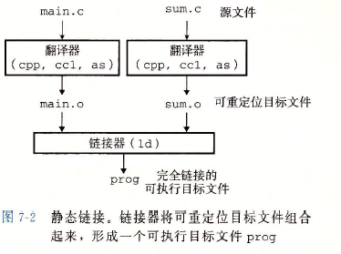


### 1.2 静态链接

像上述这种将所有编译模块中的代码和数据都整合在同一个可执行目标文件的链接方式称为静态链接，有时也被称为完全链接。为了实现静态链接，静态链接器在链接的时候必须完成如下两个任务：

- **符号解析**：每一个编译模块都会定义和引用符号，每个符号对应于一个函数或是一个全局变量或是一个静态变量，而符号解析的目的就是将各个编译模块文件中的符号引用与一个符号定义关联起来。
- **重定位**：在编译的时候编译器和汇编器会生成从0地址开始的代码和数据节，当链接器完成符号解析之后，就会为每个符号定义与一个内存位置关联起来，从而重定位这些节，然后修改所有对这些符号的引用，使得它们指向这个内存位置，填充上链接器为其分配的虚地址。具体的，链接器会利用汇编器产生的*重定位条目*来完成上述的目的。


## 2. 目标文件格式

目标文件主要有三种类型：

- **可重定位目标文件**：包含二进制代码和数据，它可以与其他可重定位目标文件进行合并从而生成下面的可执行目标文件。
- **可执行目标文件**：包含二进制代码和数据，其形式可以被直接复制到内存并执行。
- **共享目标文件**：一种特殊的可重定位目标文件，它可以在加载或只形式被动态的加载进内存并链接。

在Linux/Unix上目标文件采用可执行可链接格式ELF进行存储。


### 2.1 可重定位目标文件

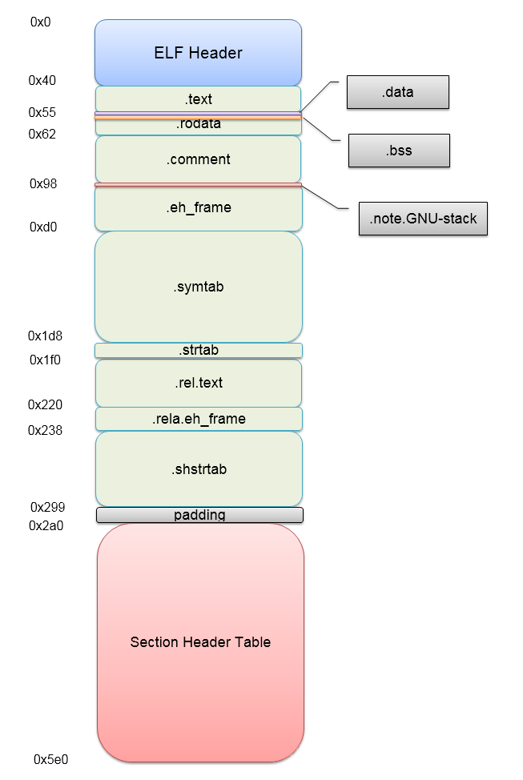

上图展示了一个典型的可重定位目标文件ELF的格式内容。其中最开始部分的ELF头由如下几部分组成：

1. 描述该文件的系统字大小、字节序和机器类型

   （除此之外的内容，也就是下面的东西都是用来帮助链接器语法分析和解析目标文件信息）

2. ELF头大小、目标文件类型

3. 节头部表的文件偏移

4. 节头部表中条目的大小和数量

   （目标文件中的不同节的位置和大小都是由节头部表$Section\ Headers$来描述）

```bash
$ readelf main.o -h
ELF Header:
  Magic:   7f 45 4c 46 02 01 01 00 00 00 00 00 00 00 00 00
  Class:                             ELF64
  Data:                              2's complement, little endian
  Version:                           1 (current)
  OS/ABI:                            UNIX - System V
  ABI Version:                       0
  Type:                              REL (Relocatable file)
  Machine:                           Advanced Micro Devices X86-64
  Version:                           0x1
  Entry point address:               0x0
  Start of program headers:          0 (bytes into file)
  Start of section headers:          784 (bytes into file)
  Flags:                             0x0
  Size of this header:               64 (bytes)
  Size of program headers:           0 (bytes)
  Number of program headers:         0
  Size of section headers:           64 (bytes)
  Number of section headers:         14
  Section header string table index: 13
```


除了上述的ELF头之外，ELF可重定位目标文件主要有如下几个节组成：

|   节名称    |                             作用                             |
| :---------: | :----------------------------------------------------------: |
|   `.text`   |                 代码段，存放已编译的机器指令                 |
|  `.rodata`  |                    只读数据，如常量字符串                    |
|   `.data`   |                  已初始化的全局和静态C变量                   |
|   `.bss`    |                  未初始化的全局和静态C变量                   |
|  `.symtab`  |       符号表，存储程序中定义和引用的函数、全局变量信息       |
| `.rel.text` | 代码段的重定位条目信息，任何调用外部函数或引用外部全局变量<br />的指令都需要修改相关的地址并使用到这些条目 |
| `.rel.data` |        被模块引用或定义的所有全局变量的重定位条目信息        |

> 注意：符号表不存储局部变量的符号，它们完全没有必要链接器的参与，在地址和内容在编译的时候就已经确定了。


### 2.2 符号与符号表

每一个可重定位目标文件都会有一个符号表`.symtab`，这个符号表在下面的符号解析过程中起到非常重要的作用。该表中主要包含如下三种类型的符号：

- **由模块m定义并能被其他模块引用的全局符号**：这些符号对应于非静态的全局函数和变量
- **由其他模块定义并被模块m所引用的全局符号**：这些符号对应外部模块定义的非静态全局函数和变量
- **只能被模块m定义和引用的局部符号**：这些符号对应本模块定义的静态全局/局部变量或函数

例如下面C文件中对应的符号表是长这样子的：

```c
extern int extern_global_value;
static int static_global_value;
int this_global_value;

int func(int v) {
        static int static_local_value = 2;
        return v + static_local_value + extern_global_value +
                        static_global_value + this_global_value;
}
```

```bash
$ readelf -s main.o

Symbol table '.symtab' contains 14 entries:
   Num:    Value          Size Type    Bind   Vis      Ndx Name
     0: 0000000000000000     0 NOTYPE  LOCAL  DEFAULT  UND
     1: 0000000000000000     0 FILE    LOCAL  DEFAULT  ABS main.c
     2: 0000000000000000     0 SECTION LOCAL  DEFAULT    1
     3: 0000000000000000     0 SECTION LOCAL  DEFAULT    3
     4: 0000000000000000     0 SECTION LOCAL  DEFAULT    4
     5: 0000000000000000     4 OBJECT  LOCAL  DEFAULT    4 static_global_value
     6: 0000000000000000     4 OBJECT  LOCAL  DEFAULT    3 static_local_value.1916
     7: 0000000000000000     0 SECTION LOCAL  DEFAULT    6
     8: 0000000000000000     0 SECTION LOCAL  DEFAULT    7
     9: 0000000000000000     0 SECTION LOCAL  DEFAULT    8
    10: 0000000000000000     0 SECTION LOCAL  DEFAULT    5
    11: 0000000000000004     4 OBJECT  GLOBAL DEFAULT  COM this_global_value
    12: 0000000000000000    48 FUNC    GLOBAL DEFAULT    1 func
    13: 0000000000000000     0 NOTYPE  GLOBAL DEFAULT  UND extern_global_value
```

上面readelf命令输出的符号表有如下几个字段：

1. Num：用来指出这是当前模块中第几个符号
2. Value：表示该符号距定义目标节的起始位置的偏移量
3. Size：表示符号的字节大小
4. Type：表示指出该符号表示符号的类型，对象或函数，或者特别是文件，或者不知道的类型
5. Bind：表示符号是本地的还是全局的
6. Vis：表示可见性，一般都是默认可见性
7. Ndx：表示该符号被分配到目标文件的哪个节，实际上就是一个到节头部表的索引。但特别的会有三个特殊的伪节：
   1. ABS：表示该符号不该被重定位
   2. UND：表示该符号未定义
   3. COM：表示该符号是一个未分配未初始化的全局变量。在现代GCC中，未初始化的全局变量应该分配到COMMON段中，而未初始化的静态变量、初始化为0的全局变量和静态变量应该分配到`.bss`段中

在上面的C程序中：

1. `static_global_value`是一个未初始化的静态全局变量，所以根据符号表的描述我们可以知道它被分配在`.bss`段中；
2. `static_local_value`是一个显式初始化的局部静态变量，它被分配在`.data`段中；
3. `this_global_value`是一个未初始化的全局变量，它被分配在`COM`段中，这是一个伪节，我们不能保证它在程序运行之时有一个确定的初始值；
4. `func`是一个全局函数名，函数产生的二进制指令代码占48字节大小，根据Ndx字段描述我们可以知道它确实是分配在`.text`段中；
5. `extern_global_value`是一个外部全局变量，当前编译文件中没有它的定义，所以它被分配在伪节UNF段中。


### 2.3. 节头部表

如上所言，节头部表（*Section Headers Table*）记录着目标文件中的不同节的位置和大小，它对应可重定位目标文件的各个节的信息具有着非常重要的纵览作用。下面就展示了上一节源文件生成的可重定位目标文件中的节头部表：

```bash
$ readelf -S main.o
There are 13 section headers, starting at offset 0x390:

Section Headers:
  [Nr] Name              Type             Address           Offset
       Size              EntSize          Flags  Link  Info  Align
  [ 0]                   NULL             0000000000000000  00000000
       0000000000000000  0000000000000000           0     0     0
  [ 1] .text             PROGBITS         0000000000000000  00000040
       0000000000000030  0000000000000000  AX       0     0     1
  [ 2] .rela.text        RELA             0000000000000000  000002a8
       0000000000000060  0000000000000018   I      10     1     8
  [ 3] .data             PROGBITS         0000000000000000  00000070
       0000000000000004  0000000000000000  WA       0     0     4
  [ 4] .bss              NOBITS           0000000000000000  00000074
       0000000000000004  0000000000000000  WA       0     0     4
  [ 5] .comment          PROGBITS         0000000000000000  00000074
       000000000000002b  0000000000000001  MS       0     0     1
  [ 6] .note.GNU-stack   PROGBITS         0000000000000000  0000009f
       0000000000000000  0000000000000000           0     0     1
  [ 7] .note.gnu.propert NOTE             0000000000000000  000000a0
       0000000000000020  0000000000000000   A       0     0     8
  [ 8] .eh_frame         PROGBITS         0000000000000000  000000c0
       0000000000000038  0000000000000000   A       0     0     8
  [ 9] .rela.eh_frame    RELA             0000000000000000  00000308
       0000000000000018  0000000000000018   I      10     8     8
  [10] .symtab           SYMTAB           0000000000000000  000000f8
       0000000000000150  0000000000000018          11    11     8
  [11] .strtab           STRTAB           0000000000000000  00000248
       000000000000005f  0000000000000000           0     0     1
  [12] .shstrtab         STRTAB           0000000000000000  00000320
       000000000000006c  0000000000000000           0     0     1
Key to Flags:
  W (write), A (alloc), X (execute), M (merge), S (strings), I (info),
  L (link order), O (extra OS processing required), G (group), T (TLS),
  C (compressed), x (unknown), o (OS specific), E (exclude),
  l (large), p (processor specific)
```

每一个节头部表中的条目分别记录了目标文件中各个节的名字、类型、地址、偏移量、节大小、条目大小、标志信息、链接信息和对齐等信息。


## 3. ==符号解析==

在上面的描述中我们已经阐明了静态链接的过程中链接器主要会做两个重要的步骤，其中第一个就是符号的解析。链接器解析符号的方法就是将每个引用与它输入的可重定位目标文件的符号表中的一个确定的符号定义关联起来，但是从具体的角度而言，又分成两种。一种是对目标模块内已定义的符号进行解析，显然这些符号的解析是容易的；另一种就是对全局符号的解析，编译器会假设该符号是在其他某个模块上定义，因此它会生成上一节中提到的符号表，它对后续静态链接器的链接功能起到了非常重要的作用。

符号解析的原理实际非常简单，就是从左向右依次遍历挨个扫描符号表，从而实现符号引用与定义的一一定义。如果静态链接器在输入的多个编译模块中都找不到该全局符号的定义，那么链接器最终会输出一条错误信息：`undefined reference`。


### 3.1 多重定义解析规则


### 3.2 与静态库链接

#### 3.2.1 静态库的生成与链接

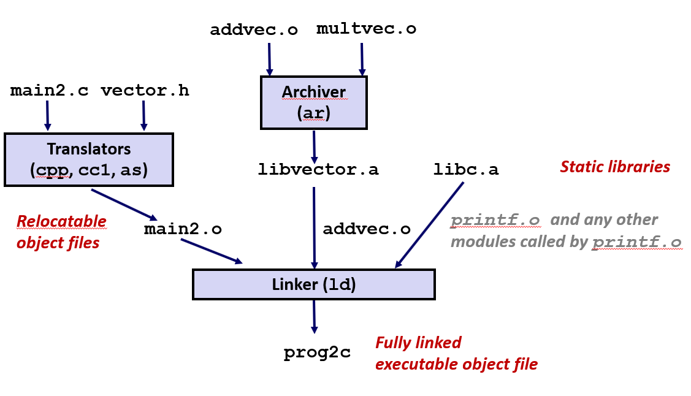

静态库指的是那些将所有相关的编译模块打包成要给单独的文件。当需要静态链接的时候，链接器会从静态库中复制被程序引用的目标模块。我们可以通过存档命令`ar`生成相应的静态库：

```bash
# 生成静态库
$ ar rcs libsum.a sumOfArr.o
# 链接使用静态库
$ gcc -o useSumOfArr useSumOfArr.c ./libsum.a -static
```

不过静态库也是存在非常大的缺点：一是它会造成每一个链接相同静态库的程序生成的可执行文件都会包含一些重复的目标模块数据，尤其是在完全链接的情况；二是一旦程序需要升级，实现发生了改变，即静态库发生了改变，那么我们就不得不对程序进行重新编译。

> 因此在实际中我们更多的是使用动态链接或者动态链接+静态链接的方式生成可执行文件。


#### 3.2.2 使用静态库进行符号解析

当我们需要对程序进行静态链接并处于符号解析的阶段时，链接器会从左到右按照它在编译器驱动程序命令行上出现的顺序来扫描可重定位目标文件和存档文件。在扫描的过程中，链接器会维护一个可重定位目标文件的集合$F$，一个未解析的符号集合$U$（未定义但已引用），一个在前面输入文件中已定义的符号集合$D$。然后链接器执行如下的步骤：

- 依次输入命令行上的文件$f$，判断它是否是目标文件还是存档文件（静态库）。若是目标文件，着将该文件$f$加入到集合$F$中，并修改未解析符号集合$U$和已解析符号集合$D$。
- 若是存档文件，那么链接器就会尝试匹配$U$中未解析的符号和由存档文件成员模块$m$定义的符号。如果某个存档文件成员模块$m$定义了相对应的符号，那么就将这个模块$m$加入到文件集合$F$中，并修改未解析符号集合$U$和解析符号集合$D$。
- 当链接器完成对命令行上输入文件的扫描后，如果$U$是非空的，那么链接器就会输出一个错误并终止。否则它会合并和重定位$F$中的目标文件，构建最终的可执行文件。

由于上述扫描的过程从左往右，如果一个目标文件引用的符号s的定义在前面一个目标文件中而不是后续目标文件中，那么链接就会出错，因此链接的时候对命令行上输入的文件是有顺序性的要求的。

> 最终，符号解析直观的结果就是所有输入目标文件的符号表会共同组成了一个全局的符号表，也即可执行目标文件中的符号表。


## 4. ==重定位==

当上述的符号解析完成之后，链接器就知道了最终的可执行文件中代码段和数据段需要多大的空间，因此它可以开始最后的内存空间分配工作，即重定位。在这个过程中，将合并输入模块，并未每一个符号分配运行时地址。重定位由如下步骤组成：

- <font color=green>**重定位节和符号定义**</font>：在这一步中，**链接器将所有相同类型的节合并成同一类型的新的聚合节，并为新的聚合节、聚合节中定义的符号（全局函数/变量）分配一个唯一的运行时内存地址**（可以认为该步骤又分成了节的重定位和符号定义的重定位这两步，但实际上是一起的）。
- <font color=green>**重定位节中的符号引用**</font>：在这一步中，**链接器修改代码节和数据节中每一个符号引用，使得它们指向正确的运行时地址**，而这一步会利用到*重定位条目（relocation entry）*。

> 一般，前一步重定位符号定义处理的是数据段`.data`或`.bss`段中的内容，而后一步处理则是代码段`.text`中的内容。


### 4.1 重定位条目

当编译器生成一个目标模块时，它并不知道数据和代码最终会放在内存中的什么位置，它也不知道该模块引用的任何外部定义的函数或全局变量的位置。因此，汇编器一旦遇到对最终位置不可知的目标引用，它就会生成一个重定位条目，告诉链接器在将目标文件合并成可执行文件的时候如何修改这些引用。

一般而言最为常见的就是`.rela.text`和`.rela.en_frame`。其中，`.rela.text`记录着代码段中引用的外部函数和全局变量的重定位条目；而`.rela.eh_frame`记录着`.eh_frame`（它以DWAF格式保存着一些调试信息）的重定位条目。由于符号引用一般只出现在代码中，所以我们经常看到最多的就是`.rela.text`，即代码段的重定位条目。

下面展示了之前符号表中提到的源文件生成的可重定位目标文件的重定位条目：

```bash
$ readelf -r main.o

Relocation section '.rela.text' at offset 0x2a8 contains 4 entries:
  Offset          Info           Type           Sym. Value    Sym. Name + Addend
00000000000d  000300000002 R_X86_64_PC32     0000000000000000 .data - 4
000000000018  000d00000002 R_X86_64_PC32     0000000000000000 extern_global_value - 4
000000000020  000400000002 R_X86_64_PC32     0000000000000000 .bss - 4
000000000028  000b00000002 R_X86_64_PC32     0000000000000004 this_global_value - 4

Relocation section '.rela.eh_frame' at offset 0x308 contains 1 entry:
  Offset          Info           Type           Sym. Value    Sym. Name + Addend
000000000020  000200000002 R_X86_64_PC32    0000000000000000 .text + 0
```

其中重定位条目有如下字段：

1. Offset：表示该符号在被重定位节中的偏移量
2. Info：其高4字节表示该符号在符号表中的索引index，低4字节表示该引用的重定位类型
3. Type：就是对上述后4字节重定位类型的具现化描述
4. Sym.Value：符号值，暂不知具体作用
5. Sym.Name：符号名称
6. Addend：偏移调整量，一些重定位类型需要使用到它

其中上述的重定位类型Type对于如何重定位影响最大，一般我们最常见的就是PC相对寻址和绝对寻址：

- **R_X86_64_PC32**：重定位一个使用32位PC相对地址的引用。也就说使用一个PC相对地址来修改原来符号引用上的指令数据，其中PC相对寻址指的是距程序计数器PC当前运行位置的偏移量。
- **R_X86_64_32**：重定位一个使用32位绝对地址的引用。通过绝对寻址，CPU直接使用在指令编码中的32位值作为有效地址。

> 上述两种重定位类型支持x86-64小型代码模型，该模型假设可执行目标文件中数据和代码的总体大小都小于2GB，因此可以在运行时使用32位PC相对地址来访问。


### 4.2 重定位符号引用

#### 4.2.1 符号引用重定位算法

如上所言，当链接器执行完重定位节和符号定义之后，它就会使用重定位条目使得符号引用指向正确的运行时地址。而在这个过程中，符号引用的重定位类型对于符号引用最终的修改值是非常重要的，下面的伪代码展示了符号引用重定位算法：

```python
# 遍历每一个节/段
for s in sections:
    # 挨个处理每一个节中符号引用对应的重定位条目
    for en in s.relocation_entries:
        # 计算符号引用的地址
        refptr = s + r.offset
        
        # 如果重定位类型为32位PC相对寻址
        if en.type == R_X86_64_PC32:
            # 计算符号引用的运行时地址
            refaddr = ADDR(s) + en.offset
            # 将符号定义的地址 - 符号引用的运行时地址得到的相对地址作为符号引用的新值
            *refptr = (unsigned)(ADDR(en.symbol) + r.addend - refaddr)
            
        # 如果重定位类型为32位绝对地址
        if en.type == R_X86_64_32:
            # 将符号定义的绝对地址作为符号引用的新值
            *refptr = (unsigned)(ADDR(r.symbol) + r.addend)
```

对于每一个需要符号重定位的节而言，都会有一些相应的重定位条目与之相对，因此我们可以认为重定位条目的组成类似于一个二维数组（`sections = [[rela_ent00, .., rela_ent0N], .., [rela_entN0, ..]]`）（虽然实际中并不是这样的，但如此考虑会便于我们的理解）。其中，这个二维数组名为sections，即节，而每一个节都有一些对应需要使用到的重定位条目，即上面数组中的relocation entries。

当算法运行时链接器会逐节挨个处理每一个符号引用，并根据相应的重定位条目的重定位类型来做具体的重定位处理。为了展示这两种常见的重定位类型对符号引用重定位的影响，我们以如下的程序来进行演示：

```c
// main.c
int sum(int* arr, int n);

int array[2] = { 1, 2 };

int main() {
    int val = sum(array, 2);
    return 0;
}

// sum.c
int sum(int *arr, int n) {
    int s = 0;
    for(int i = 0; i < n; ++i)
        s += arr[i];
    return s;
}
```


#### 4.2.2 重定位PC相对引用

**链接前：**

上面的main.c程序生成的可重定位目标文件通过反汇编和ELF文件解析的方式产生了如下的汇编代码和重定位条目：

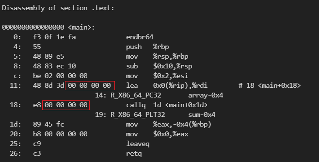

```bash
$ readelf -a main.o

Section Headers:
  [Nr] Name              Type             Address           Offset  
       Size              EntSize          Flags  Link  Info  Align  
  ...
  [ 1] .text             PROGBITS         0000000000000000  00000040
       0000000000000027  0000000000000000  AX       0     0     1   
  [ 2] .rela.text        RELA             0000000000000000  00000260
       0000000000000030  0000000000000018   I      10     1     8   
  [ 3] .data             PROGBITS         0000000000000000  00000068
       0000000000000008  0000000000000000  WA       0     0     8   
  [ 4] .bss              NOBITS           0000000000000000  00000070
       0000000000000000  0000000000000000  WA       0     0     1

Relocation section '.rela.text' at offset 0x260 contains 2 entries:
  Offset          Info           Type           Sym. Value    Sym. Name + Addend
000000000014  000900000002 R_X86_64_PC32     0000000000000000 array - 4
000000000019  000c00000004 R_X86_64_PLT32    0000000000000000 sum - 4

Relocation section '.rela.eh_frame' at offset 0x290 contains 1 entry:
  Offset          Info           Type           Sym. Value    Sym. Name + Addend
000000000020  000200000002 R_X86_64_PC32     0000000000000000 .text + 0

Symbol table '.symtab' contains 13 entries:
   Num:    Value          Size Type    Bind   Vis      Ndx Name
    ...
     9: 0000000000000000     8 OBJECT  GLOBAL DEFAULT    3 array
    10: 0000000000000000    39 FUNC    GLOBAL DEFAULT    1 main
    11: 0000000000000000     0 NOTYPE  GLOBAL DEFAULT  UND _GLOBAL_OFFSET_TABLE_
    12: 0000000000000000     0 NOTYPE  GLOBAL DEFAULT  UND sum
```

从上面的结果可以看到在编译汇编之后、链接之前可重定位目标文件中一旦二进制指令涉及到一个符号引用，由于在链接之前无法确定具体的运行时地址，因此相应的指令内容都会被填充为0，等待后续链接——重定位符号引用阶段由链接器进行修改，使其指向正确的地址。

在该程序中主要有两个符号引用需要在链接——重定位符号引用阶段进行处理：一个是全局数组array，另一个是外部全局函数sum，前者正是使用了PC32位相对寻址方式来重定位的。


**链接时：**

在链接器执行到重定位符号引用阶段时，链接器会查看全局数组array的重定位条目，其内容为：

1. 距所在节的offset为`0x14`：根据重定位条目Info高4字节——>再查符号表的所在节索引Ndx——>再查节头部表可以知道这个节指的是数据段`.data`。
2. 偏移调整量addend为`-4`。
3. 重定位类型为PC32相对寻址。

由于在前面的符号定义重定位阶段已经为符号的定义生成了唯一的运行时地址，因此我们知道array的内存地址为`0x4010`，代码段`.text`的起始地址为`0x1129`，所以我们首先计算得到main函数中对array的符号引用的地址为：
$$
refaddr = ADDR(.text) + ent.offset \\
= 0x1129 + 0x14 = 0x113d
$$
 然后链接器接着计算该符号引用相对于全局变量array的32位PC相对地址：
$$
relative\ addr = (unsigned)(ADDR(array) + ent.addend - refaddr) \\
= (unsigned)(0x4010 + (-4) - 0x113d) = 0x2ecf
$$
计算完成后我们就得到了原来符号引用array的二进制指令中需要填充的内容了，此时我们就可以将其赋给`*refptr`了。


**链接后：**

此时我们再来检查链接完成之后的可执行目标文件的反汇编指令，就可以看到原来符号引用array上填充的0000..被填充上了`0x00002ecf`：

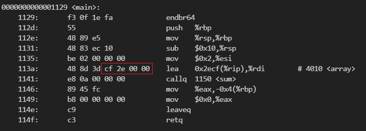


#### 4.2.3 重定位绝对引用

> 由于上面的程序没有出现绝对引用的重定位类型，因此我们这里就不演示这种重定位类型了。


### 4.3 静态链接过程总结

一个程序文件从编写完毕、预处理、编译、汇编、静态链接，到最终的可执行目标文件的生成有着如下的大致过程：

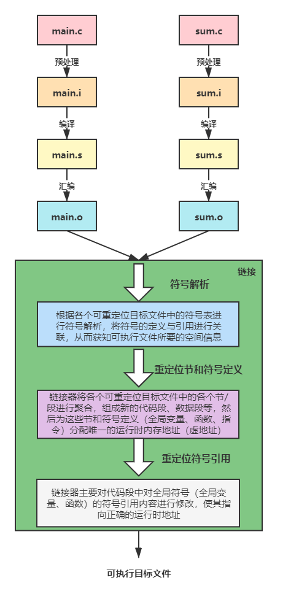


## 5. 可执行目标文件

### 5.1 可执行目标文件格式

下面展示了一个链接生成的可执行目标文件的ELF文件结构：

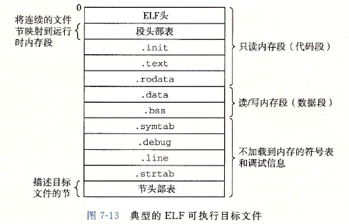

与可重定位目标文件相似，可执行目标文件中仍然存在着`.text`、`.rodata`、`.data`、`.bss`、`.symtab`、段头部表等内容。不过与之前相比，可执行目标文件中有了一些如下的不同之处：

1. ELF头中的程序的入口点不再是0，而是变成了程序第一条指令的地址。如下所示：

   ```bash
   $ readelf -h main
   ELF Header:
     Magic:   7f 45 4c 46 02 01 01 00 00 00 00 00 00 00 00 00
     ...
     Entry point address:               0x1040  # ELF头中指出的程序第一条指令地址
     Start of program headers:          64 (bytes into file)
     ...
   
   $ objdump -d main        
   
   ...
   
   Disassembly of section .text:
   
   0000000000001040 <_start>:  # 程序第一个需要执行的过程_start的起始地址正好是0x1040
       1040:       f3 0f 1e fa             endbr64
       1044:       31 ed                   xor    %ebp,%ebp
       1046:       49 89 d1                mov    %rdx,%r9
       1049:       5e                      pop    %rsi
   ```

2. 会存在一个`.init`的节，内部含有一个名为`_init()`的小函数，会在程序初始化的时候得到执行。

3. 由于上述操作下的可执行目标文件是完全链接的，所以不会再存在重定位条目，即不会再有`.rela`节。

4. ELF可执行文件中连续的片chunk会被映射到连续的内存段，因此会使用名为程序头部表Program Headers（也叫段头部表）的结构来记录这一信息：

   ```bash
   $ readelf -l main 
   
   Program Headers:
     Type           Offset             VirtAddr           PhysAddr
                    FileSiz            MemSiz              Flags  Align     
     PHDR           0x0000000000000040 0x0000000000000040 0x0000000000000040
                    0x00000000000002d8 0x00000000000002d8  R      0x8       
     INTERP         0x0000000000000318 0x0000000000000318 0x0000000000000318
                    0x000000000000001c 0x000000000000001c  R      0x1       
         [Requesting program interpreter: /lib64/ld-linux-x86-64.so.2]      
     LOAD           0x0000000000000000 0x0000000000000000 0x0000000000000000
                    0x00000000000005c8 0x00000000000005c8  R      0x1000    
     LOAD           0x0000000000001000 0x0000000000001000 0x0000000000001000
                    0x0000000000000225 0x0000000000000225  R E    0x1000
     LOAD           0x0000000000002000 0x0000000000002000 0x0000000000002000
                    0x0000000000000158 0x0000000000000158  R      0x1000
     LOAD           0x0000000000002df0 0x0000000000003df0 0x0000000000003df0
                    0x0000000000000228 0x0000000000000230  RW     0x1000
     DYNAMIC        0x0000000000002e00 0x0000000000003e00 0x0000000000003e00
                    0x00000000000001c0 0x00000000000001c0  RW     0x8
     NOTE           0x0000000000000338 0x0000000000000338 0x0000000000000338
                    0x0000000000000020 0x0000000000000020  R      0x8
     NOTE           0x0000000000000358 0x0000000000000358 0x0000000000000358
                    0x0000000000000044 0x0000000000000044  R      0x4
     GNU_PROPERTY   0x0000000000000338 0x0000000000000338 0x0000000000000338
                    0x0000000000000020 0x0000000000000020  R      0x8
     GNU_EH_FRAME   0x0000000000002004 0x0000000000002004 0x0000000000002004
                    0x0000000000000044 0x0000000000000044  R      0x4
     GNU_STACK      0x0000000000000000 0x0000000000000000 0x0000000000000000
                    0x0000000000000000 0x0000000000000000  RW     0x10
     GNU_RELRO      0x0000000000002df0 0x0000000000003df0 0x0000000000003df0
                    0x0000000000000210 0x0000000000000210  R      0x1
   
   # 这也提示我们section节和segment段是不一样的概念
    Section to Segment mapping:
     Segment Sections...
      00
      01     .interp
      02     .interp .note.gnu.property .note.gnu.build-id .note.ABI-tag .gnu.hash .dynsym .dynstr .gnu.version .gnu.version_r .rela.dyn
      03     .init .plt .plt.got .text .fini
      04     .rodata .eh_frame_hdr .eh_frame
      05     .init_array .fini_array .dynamic .got .data .bss
      06     .dynamic
      07     .note.gnu.property
      08     .note.gnu.build-id .note.ABI-tag
      09     .note.gnu.property
      10     .eh_frame_hdr
      11
      12     .init_array .fini_array .dynamic .got
   ```

   上面的程序头部表显示可执行文件被加载后会映射到13个内存段中，每一个段都会使用程序头部表的字段来进行描述：

   1. Type：段的类型
   2. Offset：本段在目标文件中的偏移
   3. VirtAddr/PhysAddr：本段的虚拟/物理内存地址
   4. FileSiz：本段在目标文件中的大小
   5. MemSiz：本段在内存中的大小
   6. Flags：本段的权限标志（读写）
   7. Align：本段的内存对齐要求

   一般来说可执行目标文件可能存在一个节映射到一个内存段中，也可能存在多个节映射到一个内存段中。例如在上述的可执行目标文件中，`.init`、`.plt`、`.plt.got`、`.text`、`.fini`这多个节都被映射到了编号为03的内存段（实际上就是代码段）中，权限标志告诉我们这个段可读不可写。


### 5.2 加载可执行目标文件

当我们在命令行中输入了可执行目标文件时，就开始了程序的加载过程，在这期间它会执行如下的步骤：

1. shell程序调用fork程序创建子进程，并分配、复制父进程的地址空间。
2. 子进程调用execve系统调用启动加载器。
3. 加载器删除子进程中现有的虚拟内存段，并创建一组新的代码、数据、堆和栈段，新的栈段和堆段会被初始化为0。
4. 通过将虚拟地址空间中的页映射到可执行文件的页大小的片，新的代码段和数据段被初始化为可执行文件的内容。
5. 接着，加载器跳转到程序的入口地址，即_start函数的地址，该函数会调用`__libc_start_main`函数，完成执行环境的初始化，并调用用户层的main函数，并在最后处理main函数的返回值，并且在需要的时候把控制返回给内核。

如下是Linux x86-64程序加载完成后运行的内存映像：

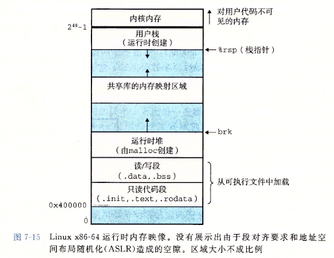


## 6. 动态链接库

### 6.1 了解动态链接

从上面的内容中我们已经了解到静态链接的原理，可以看到静态链接很好的将分离式编译、接口和实现分离的观点进行贯彻。不过它的缺点也是很多，最大的两点就是更新实现时必须重新链接以及对硬盘和内存空间的浪费，因此有了共享库。

共享库也是一个目标模块，但它可以在运行或加载时加载到任意的内存地址，并和在内存中的程序进行链接起来。这个过程称为动态链接，由名为动态链接器（`/lib64/ld-linux-x86-64.so.2`）的程序来负责执行。如我们所言，动态链接库可以保证在程序运行的过程中，即使有多个程序链接到它，内存中也仅会有一个共享库副本（具体的是`.text`代码副本），程序/可执行文件本身也不会像静态链接那样复制共享库中的数据和代码。

动态库的创建和链接如下所示：

```bash
$ gcc -c sum.c
$ gcc -c main.c 
$ gcc -shared -fpic -o libsum.so sum.o 
$ gcc -o main main.o libsum.so
$ gcc -o main main.o ./libsum.so 
```

> 其实在上述的动态链接的过程中可能发生一些问题，例如加载时无法找到该共享库的问题，可能需要用到`-Wl,rpath`这样的选项。


### 6.2 加载时链接

当我们需要创建可执行目标文件时，`$ gcc -o main main.o ./libsum.so `会静态地执行一些链接工作，但需要知道我们在此期间没有任何共享库中的代码和数据节真的被复制到生成的可执行目标文件中。相应的，它只是复制了一些符号表和重定位信息到可执行目标文件中（PLT和GOT表的内存分配正是在这个阶段发生的），使得它们在加载时可以用来解析对`libsum.so`共享库中的代码和数据引用。如下所示：

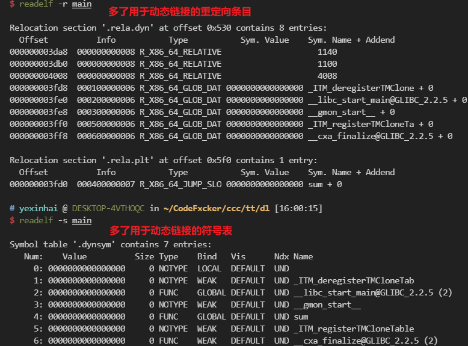

当该可执行目标文件需要加载时，由于目标文件中存在一个`.interp`节，这一节包含着动态链接器的路径名，而动态链接器本身就是一个共享目标（`ld-linux.so`），于是加载器就会加载并运行这个动态链接器，后者则执行如下的动作：

1. 重定位libc.so的代码和数据到某个内存段中。

2. 重定位libsum.so的代码和数据到另一个内存段中。

   如果在shell中键入了程序名后出现了如下的提示，那么说明错误就发生在这一步，即动态链接器无法加载共享库到内存段中并重定位，这主要是因为动态加载器获得的共享库路径有问题，也就是说用户输入的编译命令有错误：

   > ./main: error while loading shared libraries: libsum.so: cannot open shared object file: No such file or directory

3. 重定位当前程序中所有对libc.so和libsum.so定义的符号引用。

   这里重定位与静态链接中的重定位机制不同，因为这与动态链接中的位置无关代码机制有关。不过动态链接的工作并不是完全都会在加载的时候做完，这是由于延迟绑定机制的存在所造成的

4. 最后将控制权返回给应用程序。

> 在上述的动态链接操作由于发生在加载后、程序执行前，所以被称为加载时链接。


通过`readelf -d main`命令我们可以查看关于动态节（Dynamic Section）的信息，对于当前这个程序需要链接的共享目标为`libc.so`和`libsum.so`，它们会被映射在介于堆、栈之间的存储映射区中。

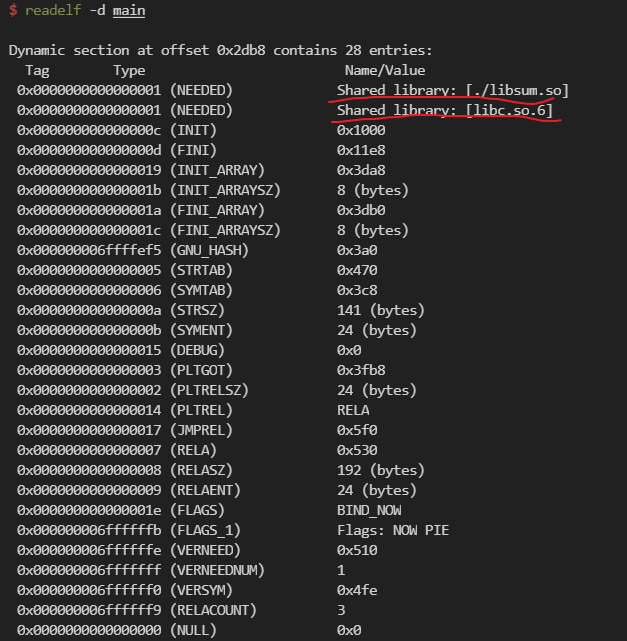


### 6.3 运行时链接

上述的动态链接过程是发生在加载之时，执行之前，但有时候其实我们想要的一种能够在运行时加载、链接共享库的方式。因此在Linux上动态链接器提供了如下几个接口来方便应用程序在运行时加载、链接共享库，其最大的好处在于具有更大灵活性，而且不需要在执行前与共享库显式链接：

```c
// 打开共享库，获得共享库句柄。其中flag为RTLD_NOW表示打开即执行符号解析，
// RTLD_LAZY表示延迟解析，直到需要真正执行时才操作
void *dlopen(const char *filename, int flag);

// 加载共享库中指定符号的地址
void *dlsym(void *handle, char *symbol);

// 关闭共享库
int dlclose(void *handle);

// 翻译前几个接口时产生的错误信息
const char *dlerror(void);
```

例如我们可以使用如下的函数调用上面`libsum.so`中的`sum()`函数：

```c
#include <stdio.h>
#include <stdlib.h>
#include <dlfcn.h>

static void sys_err(const char *msg) {
  fprintf(stderr, "%s\n", msg);
  exit(EXIT_FAILURE);
}

int x[2] = {1, 2};

int main() {
  void *handle;
  int (*sum)(int *, int);
  char *error;

  // 打开共享库
  handle = dlopen("./libsum.so", RTLD_LAZY);
  if (!handle) sys_err(dlerror());

  // 获取共享库中符号的地址
  sum = dlsym(handle, "sum");
  if ((error = dlerror()) != NULL)
    sys_err(error);

  // 使用共享库中的函数
  int s = sum(x, 2);
  printf("sum: %d\n", s);

  // 关闭共享库
  if (dlclose(handle) < 0)
    sys_err(dlerror());

  return 0;
}
```


### 6.4 位置无关代码

在上面的讨论中我们讲述了如何创建和使用共享库，我们仅仅知道共享库在内存中只需要加载一个副本即可，多个进程都可以同时访问它，内核通过存储映射的方式将同一个共享库占用的物理页映射到不同进程的不同虚拟地址空间上实现代码段的共享（共享库的目的就是允许多个正在运行的进程共享内存中相同的代码，共享库中的数据段是分配在各个进程自己的地址空间上的）。

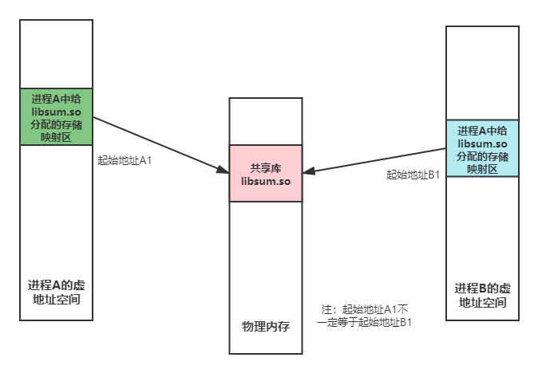

虽然虚拟内存机制使得我们能够方便的使用共享库，但这也意味着动态链接器在链接共享库中的代码时不能再使用传统静态链接的方法来进行符号解析和内存重定位工作。例如我们共享库中的代码引用了一个外部定义的符号，那么如果使用传统重定位方式之后这个符号引用就会被修改成当前进程地址空间中的某一个绝对地址，但该地址显然对于另一个进程而言绝对是无效的（因为这是在做跨进程间访问）。因此如果我们真的想要使用共享库，就必须使共享库生成与位置无关的代码（仅使用相对寻址方式），这称为Position-Independent Code（PIC）。

我们知道链接的主要目的就是为了处理如下4种符号的引用和重定位：1、模块内定义的变量；2、模块外定义的变量；3、模块内定义的函数；4、模块外定义的函数。为了实现上述的这几点，PIC机制会采用如下的思想来处理并生成共享库：

- **共享库模块中的静态全局变量和函数不需要特殊的处理**，因为它们本身就会通过PC相对寻址来进行访问，因此它们在构造共享目标文件的时候直接会被分配在共享库的数据段中。

- **共享库模块中定义的全局变量不会分配在共享库的数据段中，而是会在一个共享库的数据段中加入一个全局偏移量表GOT**（Global Offset Table，在目标文件中一般显示为`.got`）**，在共享库加载、链接后由此表中的条目记录各个引用的全局变量的绝对地址，然后通过它来访问变量**。共享库模块中引用的外部全局变量更是如此。

  > 使用之所以将这个GOT表分配在数据段中是因为目标模块中的代码段中的任何指令和数据段中的任何变量之间的距离都是一个运行时常量，这样方便编译器处理。

- **共享库模块中定义的全局函数依然是分配在共享库的代码段中，各个进程都可以共享之，但为了能够使得各个进程都能够正常的访问它，共享库的数据段中会引入一个全局偏移量表GOT**，它的目的就是用来记录全局函数的绝对地址；**同时还会在共享库的代码段中引入一个过程链接表PLT**（Procedure Linkage Table，在目标文件中一般显示为`.plt`），它内含多个16字节大小的条目，每个条目记录一段代码，主要是用来设置GOT中符号的绝对地址以及实现间接调用。

  上述两个表与动态链接的延迟绑定（lazy binding）机制有关。当共享库中的模块函数需要访问另一个模块内定义的全局函数，它必须先访问PLT表，然后再访问GOT表获得该全局函数的入口地址，最后调用该函数。

  虽然这种GOT+PLT的PIC函数访问机制增加了一定的*间接性*，但确确实实是使得共享库代码段能够被多个进程共享的好方法。同样的当共享库模块需要访问外部定义的全局函数时也需要如此。

上述是对共享库的处理，而对于生成可执行目标文件则有所不同，其不同之处在于：

- **可执行目标文件中的代码不需要借助GOT来访问共享库中的全局变量**，因为这些变量本身就分配在当前目标文件中的数据段中。
- **对于共享库中的全局函数，还是需要使用GOT+PLT的方式来访问共享库中的全局函数**，这里所指的GOT和PLT表分配在当前进程的数据段中，而不是分配在共享库的映射区中。


为了展示上面的思想，我以如下的代码为例进行展示：

```c
// sum.c，用来创建共享库libsum.so
extern int sum2(int, int);

extern int main_g_value;
int shared_g_value = 1;
static int static_g_value = 10;

int sum3(int a, int b) {
  return a + b;
}

int sum(int *arr, int n) {
  int s = sum3(shared_g_value, sum2(main_g_value, static_g_value));
  for (int i = 0; i < n; ++i)
    s += arr[i];
  return s;
}

// main.c，主函数
extern int sum(int *arr, int n);

extern int shared_g_value;
int main_g_value = 5;

int main() {
  int arr[2] = {1, 2};

  int s1 = sum(arr, 2);
  shared_g_value = 5;
  int s2 = sum(arr, 2);
  return s1 + s2;
}
```

我们按照上面理论的思想可以想象，该进程一旦运行，它应该会有着如下的地址空间布局：

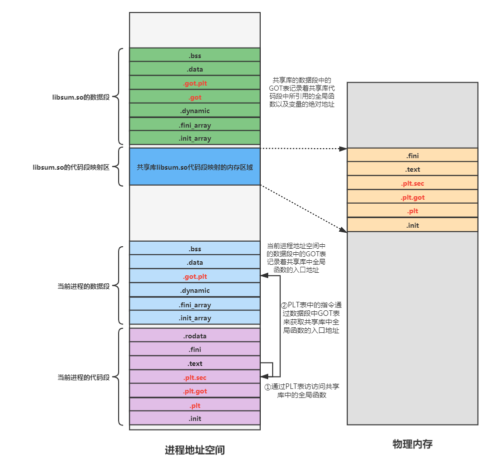

其中GOT是属于数据段的范畴，而PLT表是属于代码段的范畴。同时我们还可以通过`cat`进程的maps来查看大致的布局：


#### 6.4.1 使用GOT访问全局变量

在上面PIC机制核心思想中我们就指出共享库中定义的全局变量并不是分配在共享库自己的数据段中，实际上是分配在进程自己的数据段空间中。这个完全是在创建可执行目标文件时决定的，虽然在创建可执行目标文件的时候虽然链接器没有拷贝共享库中的代码和数据段，但至少复制了其中的符号表和重定位信息，因此共享库中全局变量完全是可以分配在可执行目标文件的数据段中。

因此为了方便共享库中的代码访问它所引用的全局变量，PIC机制会在它的数据段中加入一个全局偏移量表GOT，每个条目中记录着它所引用全局变量的地址，而这些全局变量地址信息放入GOT条目的动作完全是在动态链接时由动态链接器负责放入的。我们可以用CSAPP中的图进行演示：

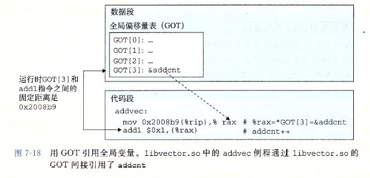

我们可以通过gdb进入共享库中的`sum()`函数中对其引用的共享库自己定义的全局变量`shared_g_value`和外部全局变量`main_g_value`，来验证上述的观点：

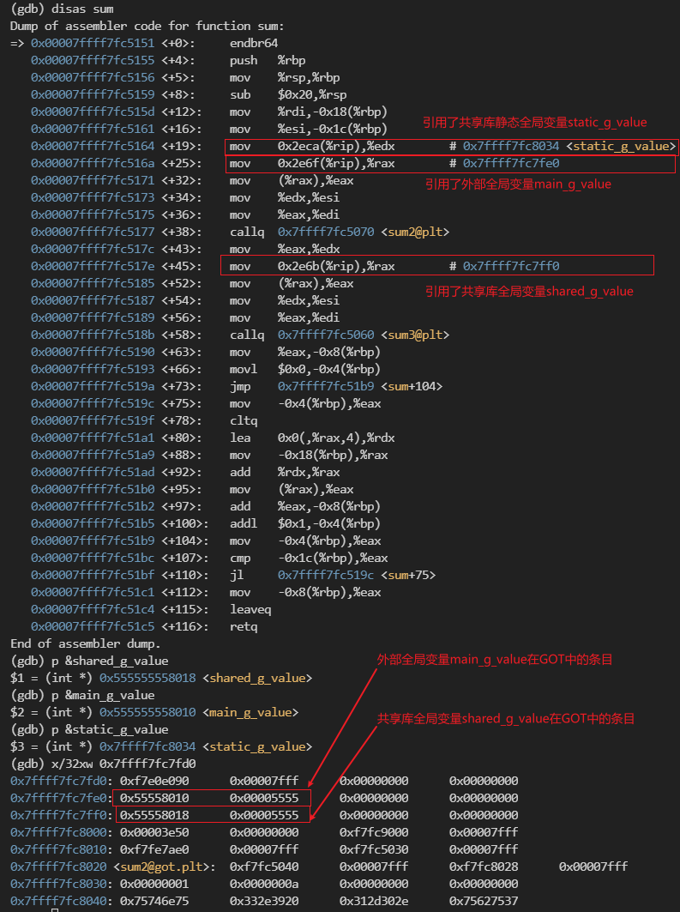

我们可以看到无论是共享库全局变量还是外部全局变量，这些变量的地址都非常接近，都以`0x55555555`起头，而相比较而言，共享库全局静态变量所处在的位置就高了很多，以`0x7ffff7fc`起头。通过查看进程maps表也可以知道共享库全局变量和外部全局变量都分配在进程的数据段中，而共享库的全局静态变量就分配在共享库自己的数据段中，而且共享库数据段中的GOT表也没有关于静态变量的条目。

> 不过上述的观点是对于共享库代码访问全局变量而言的，如果是进程本身的代码引用全局变量就不会出现这样的问题，也就意味着在进程的数据段中根本就不需要关于全局变量的GOT表，编译器本身就会解决这个问题（指的是在创建可执行目标文件那个阶段）。


#### 6.4.2 使用GOT+PLT访问共享库函数

上面描述的是共享库代码访问全局变量的机制原理，而对于共享库中全局函数的访问则需要全局偏移量表GOT+过程链接表PLT的帮助。

其中**GOT表**是在用来在加载时动态链接后存放共享库全局函数的入口地址（当对于共享库数据段而言，他还要存放共享库代码段所引用的全局变量地址），而**PLT表**则是用来实现延迟绑定（lazy binding）功能的，它可以在共享库函数第一次真正需要被使用时将该函数的入口地址装入到GOT表对应的条目上，这样后续访问该函数时再次使用PLT表然后直接跳到GOT表对应条目记录的函数入口地址。使用延迟绑定机制的好处在于它可以降低共享库全局函数动态链接的开销，因为大多数情况下进程的代码只会调用共享库中一小部分的函数，所以在加载共享库的时候不一定需要对所有的符号进行动态链接，只有用到时才链接从而大幅度降低了因动态链接导致的性能延时。

具体的，GOT表和PLT表也是有着一定的放置顺序的。对于GOT表：

1. GOT[0]和GOT[1]一般用来存放动态链接器在解析函数地址时会使用的信息。其中GOT[0]存放动态节`.dynamic`的起始地址，GOT[1]存放的是重定位条目的起始地址。
2. GOT[2]存放的是动态链接器ld-linux.so的起始地址。
3. 而从GOT[3]开始的位置就放置那些共享库中的全局函数的入口地址。

我们可以通过gdb来对直接使用计算出的虚地址显示出上述进程数据段中的GOT表的内容：

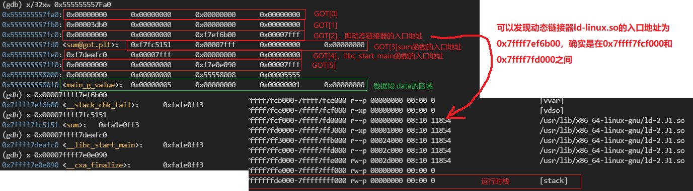

从上图可以看出当前进程数据段中的GOT表确实在前三个条目中存放着关于动态链接器相关的信息，而后续的条目放置着共享库中的全局函数的入口地址，这不仅包含我们自己创建的`libsum.so`中的`sum()`函数的入口地址，还包含着C标准库`libc.so`中常用的全局函数入口地址。

而对于PLT表，它与GOT表不同，它内部的条目实际上是一些代码片段，因此它不属于数据段的范畴，而是分配在代码段之中，这些节常以`.plt`开头。并且它一般有着如下的规范：

1. PLT[0]是一个特殊的条目，它的目的调用动态链接器，让其来负责某个共享库中全局函数入口地址设置到GOT表的事宜。实际上这就是一个关于一个符号动态链接的过程。

2. PLT[1]中的条目是用来调用进程启动函数`__libc_start_main()`，它负责初始化进程执行函数，完成后调用用户的`main()`函数，并负责处理该函数的返回值。

3. PLT[2]开始的条目就负责调用用户代码调用的函数，条目中的第一条指令就是`jmp`到GOT表中对应函数条目记录的函数入口地址处。

   不过第一次调用该共享库函数时并非如此，它会先跳转到PLT[0]条目中的某一个初始化指令位置，并执行这些初始化指令。这些指令负责将真正需要调用的共享库全局函数的入口地址装入到GOT表对应的条目中（即动态链接的过程）。然后重新执行PLT[i]（i>=2)中的指令，此时执行一定是直接跳转到共享库函数的入口地址！

我们可以通过objdump工具直接在代码段中看到这些`.plt`代码片段，如下所示：

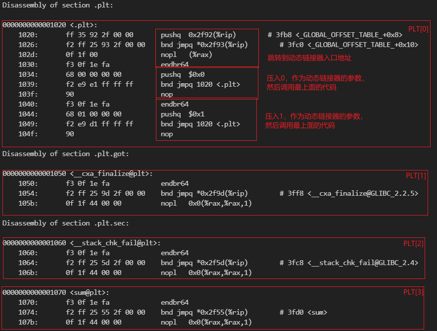


为了清晰的描述main函数中对共享库中全局函数的第一次调用以及后续调用发生了什么，我以上面的`sum()`函数调用为例。

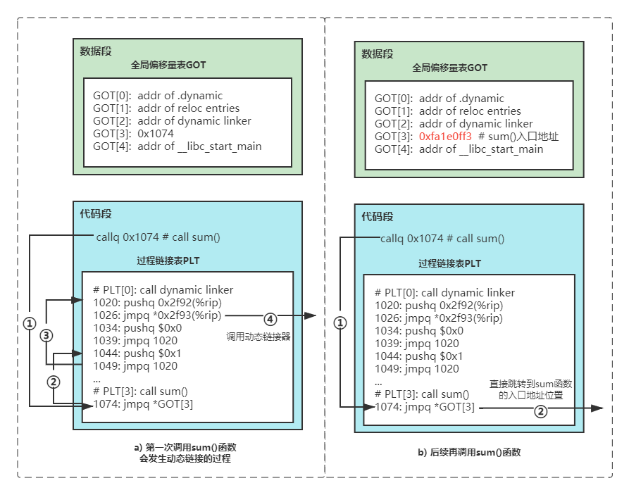

对应第一次的共享库全局函数调用：

1. 首先，当前进程的代码第一次访问`sum()`函数的时候会跳转到代码段的PLT[3]条目中，执行到GOT[3]条目所指出地址的间接跳转。
2. 但由于延迟绑定机制的存在，所以初始时的GOT[3]条目中并没有记录`sum()`函数真正的入口地址，而是记录了一个到PLT[0]中某一代码片段的地址。此时执行流跳转到此处，并压入参数，随即调用动态链接器`ld-linux.so`。
3. 动态链接器负责实现`sum()`函数的解析链接工作，最后将它的入口地址填充到GOT[3]条目之中，然后将将控制传递给`sum()`函数，执行之。

对于后续的共享库全局函数调用：

1. 当前进程的代码访问`sum()`函数的时候同样的跳转到代码段的PLT[3]条目中，但此时GOT[3]中已经填充了实际函数的入口地址。
2. 因此这次的间接跳转就直接跳到了`sum()`函数的入口地址，不需要第一次那么复杂的过程。


## 7. 库打桩机制

>  库打桩机制这个中文名字很容易让初学者一头雾水，根据英文原名library interpositioning，最好翻译成库干涉机制这样的名字其实是最好的。

库打桩机制的目的很简单，就是**允许用户截获对共享库中的函数调用，并取而代之执行自己的代码**。

例如在腾讯的开源协程库libco实现中就是用了库打桩机制，使得程序在执行可能会阻塞进程的Linux系统调用之前对其进行截获，转而执行libco库中自己定义的同名函数，直到程序确定此时调用这个函数不会导致进程进入阻塞状态的时候才会调用这个函数，从而避免进程进入阻塞状态。不过该项目并没有称之为库打桩技术，而是使用了hook这个名字。


### 7.1 编译时打桩


### 7.2 链接时打桩


### 7.3 运行时打桩


## 8. 参考资料

1. [深入理解计算机系统CSAPP](https://book.douban.com/subject/26912767/)
2. [why does the plt exist in  addition to the got instead of just using the got](https://stackoverflow.com/questions/43048932/why-does-the-plt-exist-in-addition-to-the-got-instead-of-just-using-the-got)
3. [计算机原理系列之四 ——– 可重定位文件详解](https://luomuxiaoxiao.com/?p=192)

