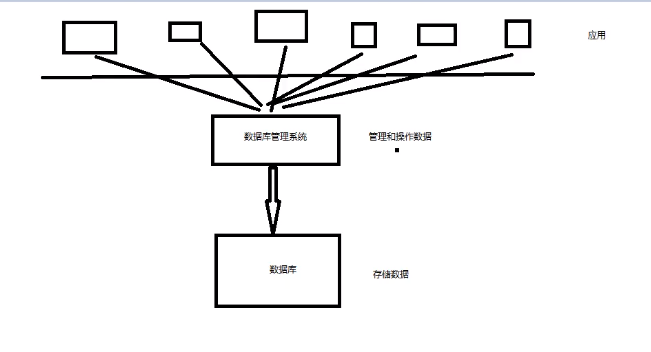

# MySQL必知必会

## 一、初识MySQL

### 1.1 数据库概念

前端：页面展示数据

后台：连接数据库，向前端提供处理接口、连接前端（控制视图跳转，和给前端传递数据）

数据库：存数据


什么是数据库？

数据库是所有软件体系中最核心的存在。

作用：存储数据，管理数据的软件。


数据库分类？

**关系型数据库：**

- postgresql、MySQL等
- 通过表与表之间、行与列之间的关系进行数据的存储。
- 关系型数据库将数据保存在不同的表中，而不是将所有的数据放在一个大仓库中，它可以增加数据并提高灵活性

**非关系型数据库：**

- redis、mongdb等not only sql
- 对象存储，通过对象自身的属性来决定（特别是相对于SQL而言比较灵活动态）。


数据库管理系统DBMS？

- 数据库的管理软件，可以科学有效的管理我们的数据，维护和获取数据
- 我们使用的本质是一个数据库管理系统DBMS，因为它可以管理和操作我们的数据。





### 1.2 数据库基本操作

连接MySQL数据库管理系统（对于SQL的使用我个人推荐使用vscode中的MySQL插件进行使用，而且它可以支持多种数据库，包括PostgreSQL）：

```bash
$> mysql -u <username> -p[password]
```

修改MySQL数据库密码：

```mysql
-- 修改密码，该密码会通过md5算法进行加密然后存储到mysql的user表中
update mysql.user
set authentication_string=password('yourrpasswd')
where user='root'
    and host='localhost';
-- 刷新权限
flush privileges;
```

MySQL数据库本身相关的基本操作：

```mysql
-- 查看所有的数据库
show databases;

-- 选择/切换数据库
use <database_name>;

-- 查看数据库中所有的表
show tables;

-- 创建数据库
create database <database_name> character set utf8 collate utf8_general_ci;
```


## 二、操作数据库

结构化查询语言中主要有4种类型的语言命令组成，包括：

- **数据定义语言DDL**：<u>它用来负责创建或删除存储数据用的数据库以及数据库以及数据库中的表等对象</u>，包括常见的create、drop、alter指令。
- **数据查询/操纵语言DQL/DML**：<u>它用来负责查询或变更表中的记录</u>，包括常见的select、insert、update、delete指令。
- **数据控制语言DCL**：<u>它用来负责确认或取消对数据库中的数据进行的变更</u>，包括常见的commit、rollback、grant、revoke指令。

不过我们主要接触的SQL语句还是数据操纵语言DML，即CRUD增删改查。


### 2.1 创建和操作表DDL

#### 2.1.1 表的创建

表的创建可以通过`create table`命令来完成：

```mysql
CREATE TABLE [IF NOT EXISTS] <表名> (
    <列名> <数据类型> [字段属性] [索引] [注释],
    <列名> <数据类型> [字段属性] [索引] [注释],
    ...
    <列名> <数据类型> [字段属性] [索引] [注释],
    PRIMARY KEY (主键字段)
) [驱动引擎] [字符集编码] [注释];
```

当表创建完毕之后我们可以通过`show`命令来查看创建这个表的MySQL语句，与之类似，对于数据库的创建实际上我们也可以使用`show`命令来进行查看，如下所示：

```mysql
-- 查看创建表的SQL语句
SHOW CREATE TABLE class;

-- 查看创建数据库的SQL语句
SHOW CREATE DATABASE crashcourse;
```


下面以一个实例进行演示：

```mysql 
CREATE TABLE IF NOT EXISTS class (
    student_id INT NOT NULL AUTO_INCREMENT comment '学号',
    student_name CHAR(64) NOT NULL,
    student_country CHAR(32) NOT NULL DEFAULT 'China',
    student_gender CHAR(12) NOT NULL,
    student_home_addr CHAR(255) NULL,
    PRIMARY KEY (student_id, student_name)
) ENGINE = InnoDB default charset=utf8;
```

在上面的MySQL语句中我们使用了如下的一些常用关键字：

1. `if not exists`指出这个表只有在同名表不存在的情况下创建；
2. `auto_increment`指出在每一次添加一行新的数据的时候，这个id号会自动增一，所以我们对于这一列的值我们可以不加以指定，让你自动生成即可；
3. `comment`是用在建表时使用的内置注释，方便后续查看；
4. `null`和`not null`指出表中的列在添加的时候是否可以为空；
5. `default`表明了在添加新行时若对这一行该列中的值加以指定，那么该列就会被指定默认值；
6. `primary key`指定了表的主键，它必须与其他行同列中的值不同，且主键可以由多个列名共同组成；
7. `engine`指出这个表由哪一个引擎进行驱动。
8. `deafult charset`用来指定表使用何种字符编码。

> 在阿里巴巴的数据库规范中必须会包含如下几个字段：主键id、版本号version（用于乐观锁）、伪删除is_delete、创建时间gmt_create、修改时间gmt_update。
>
> 同时还有一个建议就是在创建表的时候尽可能使用"``"这两个符号来对表名、字段名进行括定，这样对于中间含有空格的字符串就可变得合法。


#### 2.1.2 数据类型

在MySQL中主要有如下4种数据类型，包括**①串数据类型；②数值数据类型；③日期和时间类型；④二进制数据类型**。

- 串数据类型，具体可以分成定长串数据类型和可变长串数据类型，常用的如下所示：

|   数据类型   |          描述           |
| :----------: | :---------------------: |
|    `char`    | 可指定1~255长度的定长串 |
|  `varchar`   |   最大为255的可变长串   |
|    `text`    |   最长可达64k的文本串   |
|  `tinytext`  |  最大长度为255的文本串  |
| `mediumtext` |  最大长度为16k的文本串  |
|  `longtext`  | 最大长度可为4G的文本串  |

- 数值数据类型，常用的如下所示：

|  数据类型   |                          描述                          |
| :---------: | :----------------------------------------------------: |
|  `boolean`  |                        布尔类型                        |
|  `tinyint`  |                      1字节整数值                       |
| `smallint`  |                      2字节整数值                       |
| `mediumint` |                      3字节整数值                       |
|    `int`    |                      4字节整数值                       |
|  `bigint`   |                      8字节整数值                       |
|   `float`   |                      单精度浮点数                      |
|  `double`   |                      双精度浮点数                      |
|  `decimal`  | 字符串形式的浮点数，精度可变，<br />在金融领域经常使用 |

- 日期和时间数据类型，常见的如下所示：

|  数据类型   |            描述            |
| :---------: | :------------------------: |
|   `date`    |   日期，格式为YYYY-MM-DD   |
|   `time`    |    时间，格式为HH:MM:SS    |
| `datetime`  |          日期时间          |
| `timestamp` | 时间戳，自1970.1.1的微秒数 |
|   `year`    |             年             |

- 二进制数据类型，常见的如下所示：

|   数据类型   |            描述             |
| :----------: | :-------------------------: |
|    `blob`    |    最长64K二进制数据类型    |
|  `tinyblob`  | 最长255字节的二进制数据类型 |
| `mediumblob` |   最长64M的二进制数据类型   |
|  `longblob`  |   最长4G的二进制数据类型    |

> 还有一个需要注意的就是NULL这个特殊值，它并没有“值”，任何数据类型的值与之运算的结果都是NULL！


#### 2.1.3 表的字段属性

在创建表的时候常会使用一些字段属性来限制表中的列（或者称其为字段），常见的如下所示：

|     字段属性      |                             描述                             |
| :---------------: | :----------------------------------------------------------: |
|    `unsigned`     |               无符号整数，适用于整数值类型字段               |
|    `zerofill`     | 对不足的位数进行零填充，适用于整数值类型。<br />例如定义int(5)，并将值设为34，则前面的位会填充0 |
| `auto_increment`  | 对数值在插入新行时进行自增，默认+1，适用于作为主键的整数类型 |
| `not null`/`null` |                 插入新行时必须设值/不必设值                  |
|     `default`     |       新行中未显式设定的字段默认设定建表时指定的默认值       |

同时我们可以在MySQL中可以通过`desc`命令来查看某一张指定表的字段属性值，如下：

```mysql
DESC <表名>;
```


#### 2.1.4 数据库引擎

在驱动表的过程中起到最为重要的东西就是创建表时设置（或默认设置）的数据库引擎。在MySQL中有多种引擎可以选择，但是最使用的主要有InnoDB、MyISAM、MEMORY和其他的一些。

其中InnoDB是一个可靠的事务处理引擎，但缺点就是不支持全文本搜索，同时它也是MySQL的默认数据库引擎；而MyISAM是早先年MySQL的默认引擎，性能极高，支持全文本搜索，不过不支持时下热门的事务处理；最后就是MEMORY，它的功能类似于MyISAM，特点就是数据存储在内存而不是硬盘当中。下面对比了InnoDB和MyISAM的区别：

|    功能    | MyISAM |    InnoDB     |
| :--------: | :----: | :-----------: |
|  事务支持  |   ❌    |       ✔       |
| 数据行锁定 |   ❌    |       ✔       |
|  外键约束  |   ❌    |       ✔       |
| 全文本搜索 |   ✔    |       ❌       |
| 表空间大小 |  较小  | 较大，约为2倍 |

对于两者主要根据它们各自的特点进行选择：如果希望节约空间且较快的速度，那么可以选择MyISAM；如果希望有着较高的安全性、支持事务处理且能够多表多用户操作，那么选择InnoDB。而且两者产生的实际存储文件也各不相同，这些不同引擎驱动的表都位于mysql的data目录下，相比之下MyISAM会产生更多的文件。

> 随便提一句，MySQL的全局默认字符集编码设定是放在MySQL安装目录下的my.ini文件中，配置为character-set-server，一般被设置为utf8。


#### 2.1.5 表的更新

表的更新可以通过`alter table`来完成：

```mysql
-- 修改表名
ALTER TABLE <old_tablename> RENAME AS <new_tablename>;

-- 添加新列（或字段）
ALTER TABLE <tablename>
ADD <column_name> <type>;

-- 修改表中字段的属性或约束
ALTER TABLE <tablename>
MODIFY <column_name> <新的字段属性>;

-- 修改表中字段名以及它的字段属性
ALTER table <tablename>
CHANGE <old_column_name> <new_column_name> <新的字段属性>;

-- 删除列（或字段）
ALTER TABLE <tablename>
DROP <column_name>;

-- 定义表的外键（使得该列与另一个表中的列进行关联）
ALTER TABLE <tablename>
ADD CONSTRAINT fk_<tablename>_<another_tablename>
FOREIGN KEY (column_name) REFERENCES <another_tablename> (column_name);
```

一般来说我们并不建议在定义表之后再去对表进行更新修改，而是更建议在创建表的时候就对表的结构进行良好的设计。

除此之外，修改表名的命令我们还可以通过如下命令完成：

```mysql
RENAME TALBE <old_tablename> TO <new_tablename>;
```


#### 2.1.6 表的删除

表的删除可以通过`drop table`命令来完成：

```mysql
DROP TABLE IF EXISTS <tablename>;
```

> 随便提示下，对于这些表的创建和删除最好添加一个if exists这样的判断语句，这样可以防止报错发生。


### 2.2 数据的操纵DML

#### 2.2.1 外键约束

在MySQL中外键约束的作用就是将表中的某个或某些字段对另一个表中的字段进行引用，使得两个表形成关联，这样就可以控制存储在外键表中的数据，使得该表外键所在列的数据要不就是所引用表中字段已存在的值，要不就是NULL，从而维护数据的一致性和完整性。其中引用另一个表中的字段的表称为从表，而在被引用的表被称为主表。

一个典型的案例就是员工的部门，若存在两个表，一个是员工信息表，另一个是部门信息表，那么员工表中的部门信息一定存在于部门信息表之中，因此两者存在着一定的关联。如果愿意，我们就可以使用关键约束来限制员工信息表中的部门信息字段。

我们可以通过如下两种方式来向一个表中的某个或某些字段添加外键约束：

- 一种方式是在**创建表时添加外键约束**，使得其中的某些字段对另一个表中的字段进行引用。不过这种方式略显笨重，不是经常使用。其具体语法如下：

```mysql
CREATE TABLE [IF NOT EXISTS] <tablename> (
    ...
	[外键字段名] <数据类型> [字段属性] [索引] [注释] ,
    ...
    KEY <外键约束名> (外键字段名) ,
    CONSTRAINT <外键约束名> FOREIGN KEY (外键字段名) REFERENCES <另一个表>(外键字段名)
) ENGINE = InnoDB DEFAULT CHARSET = utf8;
```

上面的constraint一行的意思就是为当前表添加一个外键约束，使得当前表中的外键字段引用另一个表中的外键字段，这样当前表中该外键字段列的值必须是主表中该字段值中之一或者NULL，否则无法添加新的数据。我们以如下实例来展示外键约束的使用：

```mysql
-- 创建主表
CREATE TABLE IF NOT EXISTS grade (
    gradeID INT NOT NULL AUTO_INCREMENT ,
    gradeName CHAR(16) NOT NULL ,
    PRIMARY KEY (gradeID)
) ENGINE = InnoDB DEFAULT CHARSET = utf8;

-- 创建从表，并在创建之时添加外键约束
CREATE table IF NOT EXISTS student (
    id INT NOT NULL AUTO_INCREMENT ,
    name CHAR(32) NOT NULL ,
    gender CHAR(8) NOT NULL ,
    gradeID INT NOT NULL ,
    address VARCHAR(64) NULL,
    email CHAR(32)  NULL ,
    PRIMARY KEY (id) ,
    KEY fk_gradeID (gradeID) ,
    CONSTRAINT fk_gradeID FOREIGN KEY (gradeID) REFERENCES grade(gradeID)
) ENGINE = InnoDB DEFAULT CHARSET = utf8;
```

- 另一种方式就是在表创建之后通过ALTER命令来添加外键约束。这也是最常见的实现外键约束的方式，其格式在上面<创建和操作表>一节中已经讲述：

```mysql
ALTER TABLE <tablename>
ADD CONSTRAINT <外键约束名>
FOREIGN KEY (column_name) REFERENCES <another_tablename> (column_name);
```


> 上述的外键称为物理外键，属于数据库级别的外键，不建议使用。因为这种关联关系很容易造成不必要的困扰。最佳的实践就是数据库中存储单纯的表，只用来存储数据，单单含有行（数据）和列（字段），一般在实际中都是通过程序来实现逻辑上的外键关系。


#### 2.2.2 数据的插入

向表中插入数据（新的一行）的基本语法如下：

```mysql
INSERT INTO <tablename> (
    ...
    [字段n],
    [字段m],
    ...
)
VALUES (
	...
    [字段n所对应的值],
    [字段m所对应的值],
    ...
);
```

一般来说上面的字段名可以选择性添加，除非这些字段具有非空约束或默认值，这样我们在添加新的一行时必须给它指定的数据。同时上面给定的值必须与字段一一对应，否则就无法向其添加数据。更甚至我们可以将第一个`()`取消，只留下VALUES后面的部分，那么此时我们就必须从第一个字段开始提供每一个值，除非最后几个字段可以为空或具有默认值。

如果我们想添加多条数据，那么最好的方式如下所示：

```mysql
INSERT INTO <tablename> (
    ...
    [字段n],
    [字段m],
    ...
)
VALUES (
	...
    [字段n所对应的值],
    [字段m所对应的值],
    ...
)
...
, (
	...
    [字段n所对应的值],
    [字段m所对应的值],
    ...
);
```


####  2.2.3 数据的更新和删除

对于数据（准确点说就是表中的某一行）的更新我们可以通过如下的SQL语句来更新：

```mysql
UPDATE <tablename>
SET <column1> = <newVal1>,
    ...
	<columnN> = <newValN>
WHERE <指定条件>;
```

而对于数据的删除则可以通过如下的命令

```mysql
DELETE FROM <tablename>
WHERE <指定条件>;
```

其中where子句中常常涉及到一些逻辑/比较操作符，如下展示了一些比较常见的：

|        操作符         |     描述     |
| :-------------------: | :----------: |
|          `=`          |     相等     |
|      `!=`或`<>`       |     不等     |
|          `<`          |     小于     |
|         `<=`          |   小于等于   |
|          `<`          |     大于     |
|         `>=`          |   大于等于   |
| `between ... and ...` | 在指定范围内 |
|    `in (..,..,..)`    |  在集合之内  |
|         `and`         |      与      |
|         `or`          |      或      |
|         `not`         |      非      |
|         `is`          |      是      |

如果我们在上面的delete子句中没有指定删除的条件的话，那么这个delete子句就会将整个表中的数据全部删除，不过它并不会删除表本身。如果用户的目的就是为了清空表中的所有数据，那么最好的方法就是使用truncate语句而不是delete，如下所示：

```mysql
TRUNCATE TABLE <tablename>; -- TABLE可以省略
```

`TRUACATE`与`DELETE`子句的不同之处在于`TRUACATE`会复位自增列计数器，使其归零；同时还不影响事务的处理。


### 2.3 数据的查询DQL

select完整语法：

``` mysql
SELECT [ALL | DISTINCT]
{* | table.* | [table.field1[ as alias1][, table.field2[ as alias]][, ...]]}
FROM table_name [as table_alias]
	[left | right | inner join table_name2]                 -- 联结查询
	[WHERE ...]                                             -- 条件过滤
	[GROUP BY ...]                                          -- 分组
	[HAVING ...]                                            -- 过滤分组
	[ORDER BY ...]                                          -- 排序
	[LIMIT {[offeset,] row_count | row_countOFFSET offset}] -- 输出限定
```


#### 2.3.1 简单查询

```mysql
-- 查询表中的所有数据
select * from <table_name>;

-- 查询指定字段
select column1, column2,.. from <table_name>;

-- 给字段或表取别名
select column1 as <column1_alias>, ... from <table_name> as <table_alias>;
```

数据去重和输出结果行数限制：

```mysql
-- 数据去重
select distinct column_name from <table_name>;
```

其他用法：

```mysql
-- 查询系统版本
select version()

-- 计算表达式
select 1000*2+1 as result;

-- 查询自增的步长
select @@auto_increment_increment;
```


#### 2.3.2 where子句

```mysql
-- 匹配或不匹配查询
select ... from <table_name>
where column1 != <some_value>; -- 也可以用not


-- 范围查询
select ... from <table_name>
where column1 between value1 and value2;

-- 空值查询
select ... from <table_name>
where column1 is not NULL;
```

**组合where子句**使得我们可以通过`or`/`and`/`in`/`not`操作符将多个条件where子句组合成一个限制条件更加强大的数据过滤语句。

```mysql
-- and、or等操作符将多个条件进行组合
select ... from <table_name>
where column1 != 'value1' and column2 is not null;

-- 通过in操作符指定列必须不等于给定集合中的一个值
select ... from <table_name>
where not column1 in (1,2...34,832);
```

**模糊查询**允许我们可以通过MySQL中提供的通配符‘%’和‘\_’来实现对数据的模糊匹配，其中百分号‘%’表示任何字符出现任意次数，而下划线‘\_’表示一个任意的字符，但这个字符不能多也不能少。

```mysql
-- 查询对某一列执行前面可以为任意长度字符串、中间必须为somevalue，
-- 最后必须有一个任意字符的模糊匹配
select ... from <table_name>
where column1 like '%somevalue_''
```


#### 2.3.3 联结查询


联结两张表的过程实际上就是将第一个表中的每一行与第二张表中的每一行进行配对，ON子句作为过滤条件，使得那些匹配给定条件的行得到保留。在MySQL中的联结查询如上显示有7种类别，但实际上我们最常感知的只有如下几种可言：

- **内部联结INNER JOIN**：它也被称为等值联结，它的目的就是**从两张表中根据ON条件查找出那些同时存在于两张表中的数据并汇集成行**。（实际上就是*取交集*）

  

  ```mysql
  -- 内部联结
  select t1.student_id, t1.student_name, t2.student_grade
  from class t1 inner join exams t2
  on t1.student_id = t2.student_id
  order by t1.student_id;
  ```

- **外部联结OUTER JOIN**：这类联结主要分成左联结LEFT JOIN和右联结RIGHT JOIN两种。

  其中**左联结会取出左表中的所有数据，如果右表中有存在与左表根据ON条件相同的值行，那么它们会组成新的一行输出，但若没有则左表会与NULL组成新的一行输出**。（可以简单的认为就是*以左表为基准*）

  

  ```mysql
  -- 外左联结
  select t1.student_id, t1.student_name, t2.student_grade
  from class t1 left outer join exams t2
  on t1.student_id = t2.student_id
  order by t1.student_id;
  ```

  而**右联结与左联结相反，它会取出右表中所有的数据，如果左表中存在着与右表根据ON条件相同的值行，那么它们组成新的一行输出，但若没有则右表会与NULL组成新的一行输出**。（可以简单的认为就是*以右表为基准*）

  

  ```mysql
  -- 外右联结
  select t1.student_id, t1.student_name, t2.student_grade
  from class t1 right outer join exams t2
  on t1.student_id = t2.student_id
  order by t1.student_id;
  ```

- **交叉联结CROSS JOIN**：交叉联结实际上就是笛卡尔积，它使得左表中的每一行都需与右表中的每一行相联结成新的一行输出。当左表有N行时，右表有M行时，输出的结果必然具有M*N行数据。

  ```mysql
  -- 交叉联结
  select t1.student_id, t1.student_name, t2.student_grade
  from class t1, exams t2;
  ```

- **自联结**：自联结指的就是自己跟自己联结，它常常用来将当前表中的某一字段与另一个字段进行关联。例如有一张表中有一个字段记录了当前数据的所述的分类id，另一个字段记录了当前数据的父分类id，以及一个字段记录当前分类的名字，那么我们就可以通过将父分类id与当前分类id进行连接，从而得知每一个数据的父分类名字。

  ```mysql
  -- 自联结
  select t1.current_id, t2.current_name, t1.parent_id, t2.parent_id
  from category_table as t1, category_table as t2;
  ```

- **自然联结**：自然联结指的是能够排除重复多次出现数据行的联结查询。


#### 2.3.4 排序和结果限制

排序比较简单，我们可以使用order by进行解决，默认情况下可以使用的是升序asc：

```mysql
-- 对查询结果进行排序
select * from <table_name> 
order by <column1>, <column2> desc; -- 默认的排序为asc
```

limit有时被叫做分页，实际上就是限制输出数据的数量，分页只是其中的一种表现，它的目的主要是为了缓解数据库的压力。limit有着固定的使用方式：`limit <offset>,<pagesize>`。例如leetcode中有一道查询员工中第二高薪水的题目，其解答就是用到了limit：

```mysql
select (
    select distinct Salary
    from Employee
    order by Salary desc
    limit 1,1
) as SecondHighestSalary;
```


#### 2.3.5 子查询

子查询本质上就是在where语句中在嵌套一个查询语句，使得外层where的判断条件依赖于内层子查询的计算结果。执行时由内到外，同时子查询可以嵌套，不过嵌套使用下性能并不是很好。例如我们想查询学校中某班级成绩大于400的所有学生的相关信息，此时我们就可以使用子查询：

```mysql
-- 查询班级class中考试成绩大于400的学生的相关信息
select t1.student_id, t1.student_name, t2.student_grade
from class t1 inner join exams t2
on t1.student_id=t2.student_id
where t1.student_id in (
    select student_id from exams
    where student_grade > 400 )
order by t1.student_id;
```

但实际上上述的子查询语句是可以被联结查询所替代的，且联结查询更被推荐、性能也更好：

```mysql
select t1.student_id, t1.student_name, t2.student_grade
from class t1 inner join exams t2
on t1.student_id=t2.student_id
where t2.student_grade > 400
order by t1.student_id;
```

> 其实上述的例子并不是很好，但确实SQL语句实现同一个功能可能存在多种写法。


#### 2.3.6 常用函数

其中聚合函数使用最为频繁，它运行在行组上，计算和返回单个值的函数：


> 其中count(*)不会忽略null值，而count(column)、count(1)会忽略null值。

数值型函数：


字符串型函数：


日期时间函数：


控制流函数：


#### 2.3.7 CASE表达式

[TODO]


#### 2.3.8 分组过滤

我们可以使用`group by`子句根据某一字段值或者多个字段组合的值来对数据进行分组，而`having`子句可以负责对分组之后的数据进行再次过滤。（where是分组前过滤，而having是在分组后进行过滤的）

需要特别注意的是：**在使用group by时只能在select子句中包含①常数；②聚合函数；③group by子句中指定的字段这三种元素**。其中将聚合键之外的列名书写到select子句中是最常见的错误。

此时子句的执行顺序为：from->where->group by->having->select->order by。

```mysql
-- 查询班级学生每门课的平均分、最高分、最低分，且只显示平均分大于等于80的科目
select subject_name as 科目,
         avg(subject_grade) as 平均分,
         min(subject_grade) as 最低分,
		 max(subject_grade) as 最高分
from results 
group by subject_name
having 平均分 >= 80;
```


#### 2.3.9 组合查询

[TODO]


#### 2.3.10 使用视图

[TODO]


#### 2.3.11 MD5加密数据

如果我们向数据进行加密，我们则可以使用`md5()`函数来实现对数据的加密：

```mysql
-- 将用户所有的明文密码进行加密
update `t.user.passwd`
set passwd=md5(passwd);
```


#### 2.3.12 select总结

对于select语句而言，顺序非常重要：

```mysql
select 去重 要查询的字段 from 表 （可以取别名）
xxx join 要联结的表 on 等值判断
where （具体的值、子查询语句）
group by （通过哪个字段来分组）
having （过滤分组的条件，类似于where子句，不过having中可以使用聚合函数）
order by （通过哪些字段进行排序） [升序/降序]
limit startindex, pagesize;
```


## 三、事务和高级功能

### 3.1 事务原则

- **原子性Atomicity**：一个事务要么全部提交成功，要么全部失败回滚，不能只执行其中的一部分操作。
- **一致性Consistency**：事务的执行不能破坏数据库数据的完整性和一致性，一个事务在执行之前和执行之后，数据库都必须处于一致性状态。如果数据库系统在运行过程中发生故障，有些事务尚未完成就被迫中断，这些未完成的事务对数据库所作的修改有一部分已写入物理数据库，这是数据库就处于一种不正确的状态，也就是不一致的状态。
- **隔离性Isolation**：事务的隔离性是多个用户并发访问数据库时，数据库为每一个用户开启的事务，不能被其他事务的操作数据所干扰，多个并发事务之间要相互隔离。（事物之间不会相互影响）
- **持久性Durability**：持久性是指一个事务一旦被提交，它对数据库中数据的改变就是永久性的，接下来即使数据库发生故障也不应该对其有任何影响。（事务一旦提交就不可逆）

事务中的并发问题：

1. **脏读**：事务A读取了事务B更新的数据，然后B回滚操作，那么A读取到的数据是脏数据
2. **不可重复读**：事务 A 多次读取同一数据，事务 B 在事务A多次读取的过程中，对数据作了更新并提交，导致事务A多次读取同一数据时，结果 不一致。
3. **幻读**：系统管理员A将数据库中所有学生的成绩从具体分数改为ABCDE等级，但是系统管理员B就在这个时候插入了一条具体分数的记录，当系统管理员A改结束后发现还有一条记录没有改过来，就好像发生了幻觉一样，这就叫幻读。

其中：不可重复读的和幻读很容易混淆，不可重复读侧重于修改，幻读侧重于新增或删除。解决不可重复读的问题只需锁住满足条件的行，解决幻读需要锁表


### 3.2 使用事务

在默认的情况下mysql是默认开启事务自动提交的，我们可以通过设置`autocommit`来进行修改。

```mysql
set autocommit = 0; -- 关闭
set autocommit = 1; -- 开启
```

事务的使用过程：

```mysql
-- 开启事务
start transaction;

... -- 使用mysql语句

-- 提交事务
commit;
```

如果我们在事务编写的过程中想要放弃这个开启的事务，那么我们可以使用`rollback`来撤销事务。如果我们想要部分地撤销事务，那么我们可以使用保留点。我们可以通过`savepoint`来在事务中创建一个保留点，然后通过在部分撤销的时候使用`rollback to`来撤销到一个指定的保留点。如果我们不想要一个保留点，那么我们可以通过`release`来删除之：

```mysql
-- 标记一个保留点
savepoint delete1;

... -- 事务中的具体操作集合

-- 回滚到指定的保留点
rollback to delete1;

-- 删除某一个保留点
release savepoint delete1;
```


### 3.3 存储过程

[TODO]


### 3.4 使用游标

[TODO]


### 3.5 使用触发器

[TODO]


## 四、索引

MySQL官方对索引的定义为：**索引（index）是帮助MySQL高效获取数据的数据结构。**在查询标有主键的字段会相比于不标注有主键的索引会快很多。

### 4.1 索引的分类

- **主键索引（PRIMARY KEY）**： 特殊的唯一索引，不允许为空，只能有一个，一般是在建表时指定
- **唯一索引（UNIQUE KEY）**：类似普通索引，索引列的值必须唯一（可以为空，这点和主键索引不同），但是标记为唯一索引的字段可以有多个
- **组合索引（COMPOSITE KEY）**：也叫复合索引，在多个字段上创建索引，遵循最左前缀原则。
- **常规索引（KEY/INDEX）**：即普通的索引，创建表时自动设定，可以通过key或index设置
- **全文索引（FullText）**：只有在特定的数据库引擎中有，例如MyISAM。主要用来查找文本中的关键字，不是直接与索引中的值相比较，像是一个搜索引擎，配合match against使用，现在只有char，varchar，text上可以创建全文索引。


### 4.2 索引的使用

我们可以使用两种方式设置索引：

1. 在创建表的时候给字段增加索引：一般它们有着很如下的定义方式`key <该列索引名字>(<列名>)`，例如我们想要创建一个学生表，并为学生名字添加一个普通的索引：

   ```mysql
   create table if not exists students (
       student_id int auto_increment not null,
       student_name varchar(32) not null,
       student_gender varchar(16) not null,
       student_email varchar(32),
       primary key (student_id), 
       key student_name_index(student_name) -- 为student_name添加一个普通索引
       -- 实际上我们也不一定需要为全文索引、索引取一个名字，直接使用fulltext(<column>)
       -- 向为主键索引定义那样也可以。
   ) engine = innodb default charset = utf8;
   ```

2. 创建表之后增加索引：导入数据时更推荐使用这种方式。

   ```mysql
   -- 给某一个指定的字段增加一个全文索引
   alter table <table_name> add fulltext index <this_index_name>(<column_name>);
   
   -- 例如我们想给class表中的student_name一列增加一个全文索引
   alter table class add fulltext index student_name_index(student_name);
   
   -- 使用create index在某一个表中创建索引，格式为：
   create index <index_name> on <table_name>(<column_name>);
   ```
   
   通过实际的数据测试（尤其是在那些数量巨大的表中，在小数据集上效果不是很好）可以看到为表中的字段添加索引可以显著的提高对该字段的查询速度。

除了上面的操作之外，我们还经常会用到如下的一些常用命令：

```mysql
-- 显示所有的索引信息
show index from <table_name>;

-- 使用explain分析sql的执行状况
explain select * from class; 

-- 删除索引
drop index <index_name> on <table_name>;
```


### 4.3 索引原则

- 索引不是越多越好
- 不要对经常变动的数据加索引
- 小数据量上不需要加索引
- 索引一般加载常用来查询的字段上

Btree：InnoDB的底层数据结构。


### 4.4 全文本搜索

全文本搜索相对于普通的通配符、正则表达式来实现文本数据的匹配的好处在于它可以实现更高的查询性能、可以明确的控制单词的匹配程度，能够返回更智能的查询结果。在使用全文本搜索之前我们需要让相应的字段支持全文本搜索，开启的两种方法在上面已经给出，这里我们讲述下全文本搜索的使用：

```mysql
-- 我们可以使用match-against函数对来实现全文本搜索
select note_text
from crashcourse.productnotes
where match(note_text) against('anvils');
```

全文本搜索还可以使用查询拓展功能来实现搜索功能的增强，它会使得MySQL对数据和索引进行两表扫描来完成搜索：

1. 首先，进行一个基本的全文本搜索，找出与搜索条件匹配的所有行；
2. 其次，MySQL检查这些匹配行并选择所有有用的词；
3. 最后，MySQL再次进行一个全文本搜索，这次不仅使用原来的条件，而且还使用所有有用的词。

例如我们可以对productnotes这表中的note_text查询与“anvils”相匹配的行：

```mysql
select note_text
from crashcourse.productnotes
where match(note_text) against('anvils' with query expansion);
```

除此之外，全文本搜索还有一些其他的高级用法，例如布尔文本搜索，它可以对我们需要匹配的单词之外再加上一些其他的匹配条件，比如包含某某单词的行不能再包含另一个其他的单词等等，这里不再介绍。


## 五、其他

### 5.1 用户管理

所有的用户都存放在mysql数据库中的user表中。常见的用户创建、修改、删除操作如下：

```mysql
-- 创建一个用户
create user <user_name> identified by '<passwd>';

-- 修改密码（为当前用户）
set password = password('<new_passwd>');

-- 修改密码（为指定用户）
set password for <user_name> = password('<new_passwd>');

-- 给用户重命名
rename user <old_user_name> to <new_user_name>;

-- 删除用户
drop user <user_name>;
```

用户权限设置可以使用grant语句，为设置权限，我们至少需要给定以下的信息：

- 要授予的权限；
- 被授予访问权限的数据库或表；
- 用户名

```mysql
-- 查看用户权限
show grants for <user_name[@hostname]>;

-- 给指定用户设置权限
grant <privileges> on <database_name>.<table_name> to <user_name>;

-- 例如我们想给用户userA授予在所有数据库表中上的查询权限，那么可以使用如下的命令：
grant select on *.* to userA;

-- 撤销权限，授予权限的反操作
revoke <privileges> on <database_name>.<table_name> to <user_name>;
```


### 5.2 数据库维护

MySQL数据库备份的方式：

- 直接拷贝物理文件

- 使用可视化工具中的导出选项

- 使用mysqldump命令进行转储

  ```bash
  $> mysqldump  -h <hostname> -u <username> -p <passwd> <database_name> \
  <table_name> > output_file
  ```

  导入命令：

  ```bash
  -- 进入mysql-client中，然后在指定的数据库位置中输入如下命令：
  > source <dump_file>;
  
  -- 或者在Linux命令行中
  $> mysql -u <username> -p <passwd> <database_name> < <dumpfile>
  ```


### 5.3 数据库设计

糟糕的数据库设计：

- 数据库冗余
- 数据库插入和删除都比较麻烦，异常
- 程序的性能差

良好的数据库设计：

- 节省内存空间
- 保证数据库的完整性
- 方便我们开发系统

软件开发中，关于数据库的设计：

- 分析需求：分析业务和需要处理的数据库的需求
- 概要设计：设计关系图E-R图


### 5.4 三大范式

为什么需要数据规范化？

1. 信息重复
2. 更新异常
3. 插入异常，例如无法正常显示信息
4. 删除异常：丢失有效的信息

三大范式（用来规范数据库的设计）指的是：

- ***第一范式（1NF）：***

  **要求数据库表的每一列都是不可分割的原子数据项。**例如用户的地址信息最好不要使用一个字段表示，使用多个字段（省、市、街道）来表示会更好。

- ***第二范式（2NF）：***

  **在满足第一范式的基础上，要求确保数据库表中的每一列都和主键相关，而不能只与主键的某一部分相关（主要是针对联合主键）。**例如订单表中的字段都应该跟订单号这个主键相关，而不应该再描述别的产品等信息。

- ***第三范式（3NF）：***

  **在第二范式的基础上，要求确保数据表中的每一列数据都和主键直接相关，而不能间接相关，从消除依赖传递。**例如在学生表中每一个学生都有一个班主任，但在这个表中不应该对班主任做过多的描述，班主任的信息应该放在另一个表中记录。


规范性和性能的问题：

三大范式要求我们尽可能将数据分表存储，但这样的话就有可能会影响到关联查询的性能。阿里要求，关联查询的表不得超过三张表。（也就是说为了提高用户体验，牺牲下规范性也是可以的）

- 考虑商业化的需求和目标（成本和用户体验），数据库的性能更加重要
- 在考虑规范和性能问题的时候，需要适当的考虑一下规范性
- 故意给某些表增加一些冗余的字段（从多表查询变为单表查询，提高性能）
- 故意增加一些计算列（从大数据量降低为小数据量的查询）


## 六、参考资料

1. [7张图学汇SQL](https://mp.weixin.qq.com/s/ALeg7IMisSB8Ir-pSJzFDQ)
