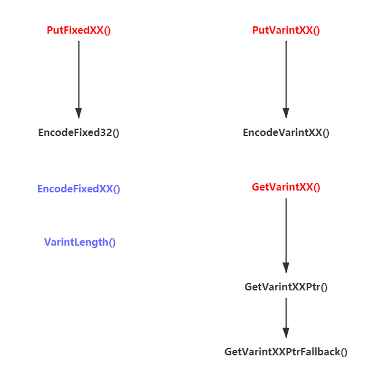
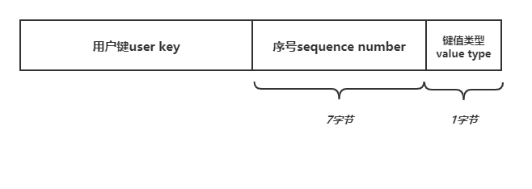

# leveldb

## 一. 项目文件结构

- leveldb头文件库include：

  ```bash
  $ tree include
  include
  └── leveldb
      ├── c.h              # 留给C语言的接口
      ├── cache.h
      ├── comparator.h     # 比较器接口
      ├── db.h             # leveldb数据库接口
      ├── dumpfile.h
      ├── env.h
      ├── export.h
      ├── filter_policy.h
      ├── iterator.h
      ├── options.h
      ├── slice.h          # slice接口
      ├── status.h         # 状态接口
      ├── table.h          #
      ├── table_builder.h  #
      └── write_batch.h    # （写）批处理接口
  ```

- 基础组件库util

  ```bash
  $ tree util
  util
  ├── arena.{h|cc}
  ├── bloom.{h|cc}
  ├── cache.cc
  ├── coding.{h|cc}
  ├── comparator.cc
  ├── crc32c.{h|cc}
  ├── env.cc
  ├── env_posix.cc
  ├── env_windows.cc
  ├── filter_policy.cc
  ├── hash.{h|cc}
  ├── histogram.{h|cc}
  ├── logging.{h|cc}
  ├── mutexlock.h
  ├── no_destructor.h
  ├── options.cc
  ├── posix_logger.h
  ├── random.h
  ├── status.cc
  ├── testutil.cc
  ├── testutil.h
  └── windows_logger.h
  ```

- 数据库核心库db

  ```bash
  $ tree db
  db
  ├── builder.cc
  ├── builder.h
  ├── db_impl.cc
  ├── db_impl.h
  ├── db_iter.cc
  ├── db_iter.h
  ├── dbformat.cc
  ├── dbformat.h
  ├── dumpfile.cc
  ├── filename.cc
  ├── filename.h
  ├── leveldbutil.cc
  ├── log_format.h
  ├── log_reader.cc
  ├── log_reader.h
  ├── log_writer.cc
  ├── log_writer.h
  ├── memtable.cc
  ├── memtable.h
  ├── recovery_test.cc
  ├── repair.cc
  ├── skiplist.h
  ├── snapshot.h
  ├── table_cache.cc
  ├── table_cache.h
  ├── version_edit.cc
  ├── version_edit.h
  ├── version_set.cc
  ├── version_set.h
  ├── write_batch.cc
  ├── write_batch_internal.h
  ```

  


## 二. 基础数据结构

### 1.1 Slice


### 1.2 Varint

```cpp
/* 编码相关 */
void PutFixedXX(); // 放入固定长度的数据，如int32
void PutVarintXX(); // 放入变长数据，如varint32
void PutLengthPrefixedSlice(); // 放入一个字符串的varint32长度编码，已经字符串数据本身

/* 解码相关 */
void GetVarintXX(); // 对变长整型数据进行解码
void GetLengthPrefixedSlice(); // 对一个字符串varint32数据和字符串数据进行解码

/* 其他辅助函数 */
int VarintLength(); // 计算一个int数据编码为varint32需要多少字节
```

函数实现依赖图：




### 1.3 InterKey

内部键InterKey是leveldb内部真正存储用户给定的键（字符串）的数据结构，结构如下：



相关数据结构和函数：

```cpp
class InternalKey; // 内部键，实际就是一个字符串，内部存储着一些编码后的内部键数据
class InternalKeyComparator: public Comparator; // 内部键比较器
struct ParsedInternalKey; // 存储一个解析完成的内部键

void AppendInternalKey(); // 将一个ParsedInternalKey中的数据编码成内部键的格式到字符串中
void ParseInternalKey(); // 从一个字符串数据中解析出内部键到ParsedInternalKey
inline Slice ExtractUserKey(); // 从字符串表示的内部键中提取出用户键（也就是真正的键）
```


### 1.4 LookupKey

LookupKey是leveldb数据库查找`DBImpl::Get()`函数的辅助类，因为leveldb在不同的level层级中以不同的格式表示键值，所以LookupKey同时以三个char数组分类记录不同形式本质上相同内容的键值，方便从上到下的查找过程中的使用不同形式的“键值”来进行查找。

```cpp
class LookupKey; // 它是DBImpl::Get()的辅助类，因为在leveldb中不同的层表中的键值是以不同的
				 // 方式表示的，所以LookupKey通过三个char数组来记录各个不同形式但本质上相同
				 // 内容的键值

class InternalFilterPolicy; // 暂时未知
```


### 1.5 Comparator

比较器Comparator是leveldb内部用来比较键值的，最典型的就是`InternalKeyComparator`，即内部键比较器。

```cpp
class InternalKeyComparator : public Comparator {
 private:
  const Comparator* user_comparator_;

 public:
  explicit InternalKeyComparator(const Comparator* c) : user_comparator_(c) {}
  const char* Name() const override;
  int Compare(const Slice& a, const Slice& b) const override;
  void FindShortestSeparator(std::string* start,
                             const Slice& limit) const override;
  void FindShortSuccessor(std::string* key) const override;

  const Comparator* user_comparator() const { return user_comparator_; }

  int Compare(const InternalKey& a, const InternalKey& b) const;
};
```

衍生的比较器除了`InternalKeyComparator`之外，还有`BytewiseComparatorImpl`逐比特比较器：

```cpp
class BytewiseComparatorImpl : public Comparator;
```

