# redis入门指南

当今时代MySQL这样的关系型数据库的面临的问题：

- 当前时代的数据量很大，变化很快；
- 关系型数据库无法保存一些比较大的文件，即使存入，数据库中表的压力也会变得非常大；
- 在大数据的I/O压力下，表几乎无法修改，必须在表设计的时候面面俱到；

因此我们需要一种另外的数据库来先对数据进行缓存，然后等一段时间之后再持久化，这种数据库就是指redis这样的NoSQL。那什么是NoSQL呢？

NoSQL=not only SQL，泛指非关系型数据库。其中关系型数据库的使用非常局限于行跟列这样的场景。而非关系型数据库，并不需要一个固定的格式，不需要多余的操作就可以横向拓展。它具有如下的特点：

- 方便拓展（数据之间没有关系，很好拓展）

- 大数据量高性能（redis一秒可以写8万次，读取11万，NoSQL的缓存记录级，是一种细粒度的缓存，性能非常高）

- 数据类型多样，不需要事先设计数据库，随取随用

- 传统的RDBMS和NoSQL的区别：

  > 传统的RDBMS：
  >
  > - 结构化组织
  > - 需要使用结构化查询语言SQL
  > - 数据和关系都存在于单独的表中，row col
  > - 数据定义语言
  > - 严格的事务一致性
  >
  > NoSQL：
  >
  > - 不仅仅是数据
  > - 没有固定的查询语言
  > - 键值对存储，列存储，文档存储，图形数据库
  > - 最终一致性
  > - CAP定理和BASE（异地多活）
  > - 高性能、高可用、高可扩展

  大数据时代的3V和3高：

  大数据时代的3V，主要是描述问题：

  1.  海量Volume
  2. 多样Variety
  3. 实时Velocity

  大数据时代的3高，主要是对程序的要求：

  1. 高并发
  2. 高可拓展性（随时可以水平拆分）
  3. 高性能

  实际中的使用：NoSQL+RDBMS

  


## 一. 基础命令

### 1.1 键处理

这套基本处理对于每一种数据类型都是成立的。

|         命令         |           功能            |
| :------------------: | :-----------------------: |
|   `keys <pattern>`   |         获取键名          |
|    `exists <key>`    |      判断键是否存在       |
|  `move <key> <num>`  | 将指定键移动到数据库num中 |
| `del <key> [key...]` |          删除键           |
|     `type <key>`     |     获取键的数据类型      |
|      `flushdb`       |      清空当前数据库       |
|      `flushall`      |      清空所有数据库       |
|    `select <num>`    |        数据库选择         |
|   `scan <cursor>`    | 迭代当前数据库中的key集合 |


### 1.2 字符串类型string

|                             命令                             |          功能           |
| :----------------------------------------------------------: | :---------------------: |
| `set <key> <value>`<br />`mset <key> <value> [key value...]` |   赋值/同时设置多个值   |
|       `setex <key> <value>`<br />`setnx <key> <value>`       |  根据存在与否进行设置   |
|            `get <key>`<br />`mget <key> [key...]`            |   取值/同时获取多个值   |
|                    `getset <key> <value>`                    |  设置新值然后返回旧值   |
|         `incr <key>`<br />`incrby <key> <increment>`         | 递增数值/增加指定的数值 |
|         `decr <key>`<br />`decrby <key> <decrement>`         | 递减数值/减少指定的数值 |
|               `incrbyfloat <key> <increment>`                |    增加指定的浮点数     |
|                    `append <key> <value>`                    |      向尾后追加值       |
|                        `strlen <key>`                        |     获取字符串长度      |
| `getbit <key> <offset>`<br />`setbit <key> <offset> <value>`<br />`bitcount <key> [start] [end]`<br />`bitop <operation> <destkey> <key> [key...]` |         位操作          |


### 1.3 列表类型list

|                             命令                             |              功能              |
| :----------------------------------------------------------: | :----------------------------: |
| `lpush <key> <value> [value...]`<br />`rpush <key> <value> [value...]` |       向列表两端添加元素       |
|                `lpop <key>`<br />`rpop <key>`                |       从列表两端弹出元素       |
|                         `llen <key>`                         |      获取列表中元素的个数      |
|                `lrange <key> <start> <stop>`                 |          获取列表片段          |
|                 `lrem <key> <count> <value>`                 |       删除列表中指定的值       |
|   `lindex <key> <index>`<br />`lset <key> <index> <value>`   |   获取/设置指定索引的元素值    |
|                 `ltrim <key> <start> <end>`                  |     只保留列表中指定的片段     |
|        `linsert <key> <before|after> <pivot> <value>`        |        向列表中插入元素        |
|              `rpoplpush <source> <destination>`              | 将元素从一个列表转到另一个列表 |


### 1.4 散列类型hash

散列数据类型主要包括如下几个部分：**键**key、**字段**field**和字段值映射**value，其中对于键我们推荐使用键名:ID的方式进行命名。我们可以认为散列实际上就是类似于STL中的unordered_map。

|                             命令                             |          功能          |
| :----------------------------------------------------------: | :--------------------: |
| `hset <key> <field> <value>`<br />`hmset <key> <field> <value> [field value...]` |   赋值/同时赋多个值    |
| `hget <key> <field>`<br />`hmget <key> <field> <value> [field value...]` |   取值/同时去多个值    |
|                       `hgetall <key>`                        | 获取散列中所有的键值对 |
|                   `hexists <key> <field>`                    |    判断字段是否存在    |
|                `hsetnx <key> <field> <value>`                |   当字段不存在时赋值   |
|             `hincrby <key> <field> <increment>`              |      增加指定数值      |
|               `hdel <key> <field> [field...]`                |        删除字段        |
|               `hkeys <key>`<br />`hvals <key>`               | 单独获取字段名或字段值 |
|                         `hlen <key>`                         |      获取字段数量      |


### 1.5 集合类型set

集合类似于STL中的unordered_set。

|                             命令                             |           功能           |
| :----------------------------------------------------------: | :----------------------: |
| `SADD <key> <member> [member...]`<br />`srem <key> <member> [member...]` |      添加/删除元素       |
|                       `smembers <key>`                       |   获取集合中的所有元素   |
|                  `SISMEMBER <key> <member>`                  |   判断元素是否在集合中   |
| `sdiff <key> [key...]`<br />`sinter <key> [key...]`<br />`sunion <key> [key...]` |        集合间元素        |
|                        `scard <key>`                         |   获取集合中元素的个数   |
| `sdiffstore <destination> <key> [key...]`<br />`sinterstore <destination> <key> [key...]`<br />`sunionstore <destination> <key> [key...]` | 进行集合运算并将结果存储 |
|                 `srandmember <key> [count]`                  |   随机获得集合中的元素   |
|                         `spop <key>`                         | 从集合中随机弹出一个元素 |


### 1.6 有序集合类型sorted_set

redis的有序集合功能上类似于STL中的set，但与我们编程语言中固有的观念不同，它是由散列表+跳表的方式进行实现的（而不是红黑树），时间复杂度`O(log(N))`。redis的有序集合主要由键key、分值scores和元素名member组成，其中redis有序集合正是通过分子scores来对集合中的元素进行排序。需要注意的是：分值才是我们传统意义上认为的键，而元素名才是值！

|                             命令                             |              功能              |
| :----------------------------------------------------------: | :----------------------------: |
|       `zadd <key> <score> <member> [score member...]`        |            增加元素            |
|                   `zscore <key> <member>`                    |            获取元素            |
| `zrange <key> <start> <stop> [withscores]`<br />`zrevrange <key> <start> <stop> [withscores]` | 获取排名在某个指定范围内的元素 |
| `zrangebyscore <key> <min> <max> `<br />`[withscores] [limit offset count]` |    获取指定分数范围内的元素    |
|             `zincrby <key> <increment> <member>`             |       增加某个元素的分数       |
|                        `zcard <key>`                         |      获得集合中元素的数量      |
|                  `zcount <key> <min> <max>`                  |  获得指定分数范围内的元素个数  |
|              `zrem <key> <member> [member...]`               |       删除一个或多个元素       |
|            `zremrangebyrank <key> <start> <stop>`            |      按照排名范围删除元素      |
|             `zremrangebyscore <key> <min> <max>`             |      按照分数范围删除元素      |
|    `zrank <key> <member>`<br />`zrevrank <key> <member>`     |         获取元素的排名         |
| `zinterstore <destination> <numkeys> <key> [key...]`<br />`WEIGHTS weight [weight...] [aggrate sum|min|max]` |       计算有序集合的交集       |


### 1.7 地理空间

redis中的地理空间如其名就是用来记录某一些地点的经纬度信息，例如我们可以使用geo来记录中国所有城市的地理位置（经纬度），然后用来查询它们之间的距离、附近的城市等等，功能较为单一。

需要注意的是，redis的地理空间功能实际底层就是由有序集合支撑的，所以我们也可以使用sorted set中的命令来操作地理空间，例如地理空间没有显式的删除地理空间位置的命令，但实际上我们可以通过zset总的`zrem`命令来删除相应的地点信息。

|                             命令                             |                  功能                  |
| :----------------------------------------------------------: | :------------------------------------: |
|         `geoadd <key> <longitude> <latitude> [...]`          |   添加一个地理空间的位置到有序集合中   |
|             `geohash <key> <member> [member...]`             |      返回一个地理空间的hash字符串      |
|             `geopos <key> <member> [member...]`              |       返回某一个地理空间的经纬度       |
|         `geodist <key> <member1> <member2> [km|mi]`          |       返回两个地理空间之间的距离       |
| `georadius <key> <longitude> <latitude> `<br />`  <radius> km|mi [withcoord] [withdist]...` | 查询指定经纬度半径内所有地理空间的集合 |
| `georaiusbymember <key> <member> <radius>`<br />` km|mi [withcoord] [withdist]...` |  查询指定地理空间内所有地理空间的集合  |


### 1.8 Hyperloglogs

Hyperloglog主要是用来做基数统计算法使用。对于像用户量统计（例如网页的uv，即 unique visitor，一个人访问一个网站多次，还是算一个人），传统的方法就是使用set这样的基础组件来完成，然后就可以统计set中的元素数量来进行判断，但是这种方式的缺点在于太消耗内存，而且我们的目的不是为了记录用户的ID，而是为了统计用户的数量！所以我们可以使用redis的Hyperloglog，它占用的内存空间是固定的，只需要12KB的内存就可以统计2^64的元素数量，不过可能具有0.81%的错误率。

|                      命令                      |                        功能                        |
| :--------------------------------------------: | :------------------------------------------------: |
|      `pfadd <key> <element> [element...]`      |           将指定的元素添加到hyperloglogs           |
|            `pfcount <key> [key...]`            |          获取指定hyperloglogs中的元素数量          |
| `pfmerge <destkey> <sourcekey> [sourcekey...]` | 合并两个或以上的hyperloglogs到一个目标hyperloglogs |


### 1.9 Bitmaps

对于像统计用户上线与否、登录与否、365天打卡状态这样的应用需求，这样具有两个状态的情况，我们都可以使用redis中的Bitmaps（位图）来进行解决。它都是通过直接操作二进制位来完成。

|                   命令                   |                      功能                      |
| :--------------------------------------: | :--------------------------------------------: |
|     `setbit <key> <offset> <value>`      |              设置位图中的某一个位              |
|         `getbit <key> <offset>`          |              获取位图中的某一个位              |
|       `bitcount <key> [start end]`       |              统计位图中的有效位数              |
| `bitop <operation> destkey key [key...]` | 操作多个位图并进行位运算并将结果放到指定的键中 |
|     `bitpos <key> <bit> [start end]`     |   从位图指定范围中获取第一个值为bit的偏移量    |


## 二. 进阶

### 2.1 事务

#### 2.1.1 事务的概念

redis的事务指的是一组命令的集合。一个事务中的所有命令都会被序列化，在事务执行的过程中，会按照顺序执行。它具有一次性、顺序性、排他性的特性。但是Redis的事务并没有隔离级别的概念，也就是说所有命令在事务中，并没有直接被执行，只有发起执行命令的时候才会被真正的执行。

同时**Redis单条命令是保证原子性的，但是事务是不保证原子性的**！redis的事务按照如下的步骤进行操作：

- 开启事务（multi）
- 命令入队（...）
- 执行事务（exec）

|          命令          |              功能               |
| :--------------------: | :-----------------------------: |
|        `multi`         |          开启一个事务           |
|       `discard`        |            取消事务             |
|         `exec`         |         提交事务并执行          |
| `watch <key> [key...]` | 锁定key直到执行了multi/exec命令 |
|       `unwatch`        |    取消监视所有之前监视的key    |

事务可能出现两种错误：

1. **语法错误**：事务中的命令存在问题，此时所有提交的事务中的命令都不会被执行。
2. **运行错误**：事务中的命令没有问题，但是命令存在逻辑上的错误，此时有问题的命令不会被执行，但其他没有问题的命令都会被正常执行。

运行时错误也是MySQL和redis这样的数据库一个差别比较大的不同，因为redis中的命令可能存在逻辑上不可靠的问题，而MySQL绝对不会使得事务中的命令出现问题的情况下还能够正常执行其他命令。


#### 2.1.2 WATCH命令

悲观锁和乐观锁：

- 悲观锁：很悲观，认为什么时候都会出问题，所以无论做什么都加锁
- 乐观锁：很乐观，认为什么时候都不会出现问题，所以不会上锁。跟数据的时候去判断一下，在此期间判断是否有人修改过这个数据。MySQL中获取version，更新的时候比较version

而watch就类似于乐观锁操作，起到监视键的作用。如果在一个客户端（一个线程）开始监视了一个键，那么在其事务开始执行之前若别的客户（线程或者自己）修改了这个键，那么监视watch命令就会使得当前客户对指定键的事务操作不被执行！但若在事务执行之前没有被其他客户修改，那么当前客户的事务就会被正常提交执行。

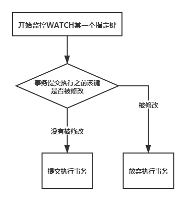

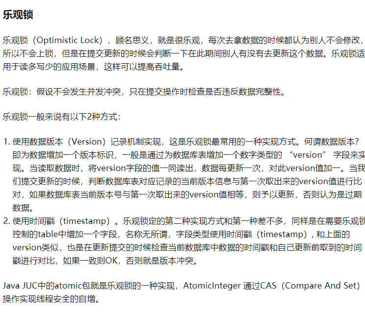

redis中watch的实现估计就和MySQL中的乐观锁类似。


### 2.2 过期时间

在redis中我们可以使用过期时间这一概念来对指定的键进行定时，当一个键被指定过期时间，那么时间一到这个键就会被删除。若一个键被watch，那么当这个键过期之后并不会被watch认为是发生了改变。

|                    命令                    |            功能            |
| :----------------------------------------: | :------------------------: |
|          `expire <key> <seconds>`          |      设置键存活的秒数      |
|       `pexpire <key> <milliseconds>`       |     设置键存货的毫秒数     |
|        `expireat <key> <timestamp>`        |   设置一个unix过期秒时间   |
| `pexpireat <key> <milliseconds-timestamp>` |  设置一个unix过期毫秒时间  |
|                `ttl <key>`                 |   检查键剩余的过期时间数   |
|                `pttl <key>`                | 检查键剩余的过期毫秒时间数 |


### 2.3 排序

#### 2.3.1 SORT命令

按照正常的思维，如果我们需要对指定的数据进行排序，最简单的方式就是使用redis中提供的有序集合类型来实现对数据的自动排序。确实如此，对于大数据的排序zset是一种很好的方法，但除此之外redis还提供了sort命令。

SORT命令可以对redis中的链表类型list、集合类型set以及有序集合zset进行排序，同时它的功能也非常强大，可以完成类似于MySQL关系型数据库中的联结join查询相类似的操作。其命令格式具体如下：

```bash
sort <key> [by <pattern>] [limit <offset> <count>] 
			[get <pattern>] [asc|desc] [alpha] [store <output_key>]
# 其中：
# by参数选项指定了外键模式-元素根据什么排序，这个功能非常类似于关系数据库中的联结join操作
# limit参数选项可以用来限制结果输出的数量，表示从偏移offset开始输出count个元素
# get参数选项用来指定到与之相关的键上获取键值，一般和by参数一起使用
# asc|desc参数用来指定是顺序输出还是逆序输出
# alpha参数告知redis使用字典序进行排序，而不是默认的数字类型
# store参数参数选项用来告知将结果输出到键output_key这个链表类型上，而不是直接显示输出
```


我们必须明确，sort命令在默认的情况下是针对“值”来进行排序的！对于链表list和集合set我们很好理解，而对于有序集合它并不是根据有序集合中的元素分数进行排序，而是根据原书自身的值来进行排序，因而输出的效果也是不同于有序集合`zrange`命令本身的输出的！

```bash
127.0.0.1:6379> zadd zset 1 23 2 43 3 12
(integer) 3
# 使用sort命令根据元素本身值产生的结果
127.0.0.1:6379> sort zset 
1) "12"
2) "23"
3) "43"
# 使用zrange根据元素分数进行排序得到的结果
127.0.0.1:6379> zrange zset 0 -1
1) "23"
2) "43"
3) "12"
```


#### 2.3.2 参数BY/GET/STORE

**参数by：**在sort命令中的所有参数中无疑by参数是功能最为强大的。在默认的情况下，我们对链表或集合或有序集合默认是根据它们元素本身的值来进行排序，但是一旦使用了by参数，我们就可以通过**外键模式：对每个元素使用元素的值替换by后面指定键中的第一个“*”并获取其值，然后根据该值来对元素进行排序**。我们可以发现这个功能与关系型数据库中join联结功能类似。

例如在一个集合class中我们记录了一把班级中所有同学的名字，而在另外一些散列键class:student_name中记录了各个同学某一次期末考试成绩，此时我们需要根据它们的数学成绩对集合class中的同学进行排名，那么我们就可以使用sort命令的by参数来完成上述的任务。如下所示：

```bash
# 在集合class中添加班级同学名单
127.0.0.1:6379> sadd class james mary tom peter linda
(integer) 3
127.0.0.1:6379> smembers class
1) "james"
2) "mary"
3) "tom"
4) "peter"
5) "linda"
# 在散列class:*中添加班级同学相关的性别、成绩信息
127.0.0.1:6379> hmset class:peter gender male math 78
(integer) 2
127.0.0.1:6379> hmset class:james gender male math 88
(integer) 2
127.0.0.1:6379> hmset class:mary gender female math 77
(integer) 2
127.0.0.1:6379> hmset class:tom gender male math 90
(integer) 2
127.0.0.1:6379> hmset class:linda gender female math 94
(integer) 2
# 使用外键模式根据期末考试的数学成绩对班级同学进行排序。我们可以看到
# linda数学考了94分所以排在后面，而mary数学只考了77分所以排在最前面
127.0.0.1:6379> sort class by class:*->math 
1) "mary"
2) "peter"
3) "james"
4) "tom"
5) "linda"
```

> 需要注意的是：如果在集合中有两个元素它们相关的外键键值相同，那么sort命令此时就会根据元素本身的值来对元素进行排序。而如果参考键（也就是外键）不存在的话，sort命令就会默认将其认定是0。


**参数get：**在sort命令中，参数get一般与by参数一同使用，它的作用是使得sort命令不再返回元素本身的值，而是get参数中指定的值，这个值一般与元素本身的值相关联。例如在上面的班级例子中，我们可以通过get参数在排序之后返回各个同学的数学分数，而不再是他们的名字，如下所示：

```bash
# 此时返回的是各个同学的数学分数
127.0.0.1:6379> sort class by class:*->math get class:*->math
1) "77"
2) "78"
3) "88"
4) "90"
5) "94"
```

如果我们不仅想要sort命令返回班级中同学的名字，还要同时返回各个同学所对应的数学成绩，那么我们就可以在get命令后面加个符号#，如下所示：

```bash
# 此时返回返回各个同学的名字以及对应的数学成绩
127.0.0.1:6379> sort class by class:*->math get # get class:*->math
 1) "mary"
 2) "77"
 3) "peter"
 4) "78"
 5) "james"
 6) "88"
 7) "tom"
 8) "90"
 9) "linda"
10) "94"
```


### 2.4 消息通知

#### 2.4.1 任务队列


#### 2.4.2 发布/订阅模式

redis发布/订阅模式是一种消息通信模式：发布者publisher发送消息，订阅者subscriber接收消息。

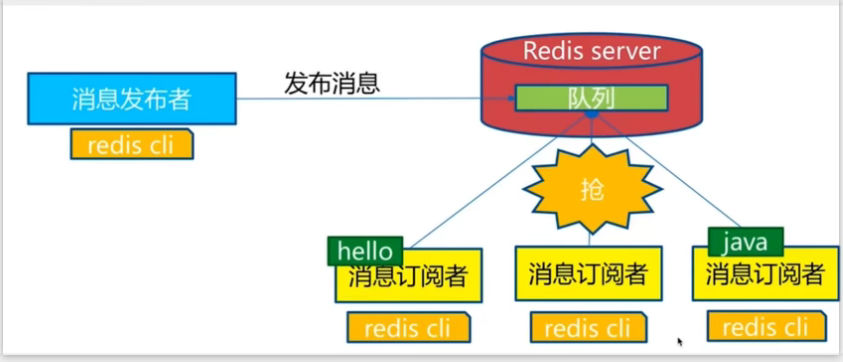

这个发布/订阅模式本质就是由一个队列实现，而队列又实际上是由链表实现的（订阅者以链表的方式包含在频道所维护的链表中）。在redis发布/订阅模式中主要由如下三个成员参与：①消息发布者；②频道；③消息订阅者。下图展示了三者之间的关系：

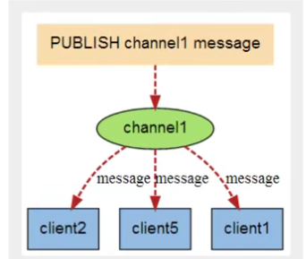

redis发布/订阅模式有如下几个常用命令：

|                 命令                 |            功能            |
| :----------------------------------: | :------------------------: |
|    `publish <channel> <message>`     |     发布一条消息到频道     |
|  `pubsub <subcommand> [arg [arg..`   |     检查发布/订阅情况      |
|  `subscribe <channel> [channel...]`  |     订阅频道发布的消息     |
| `psubscribe <pattern> [pattern...]`  |   订阅与模式串匹配的频道   |
| `unsubscribe <channel> [channel...]` |        停止订阅频道        |
| `punsubscribe [pattern [pattern...`  | 停止订阅与模式串匹配的频道 |

redis发布/订阅模式的使用场景：

1. 实时消息系统
2. 实时聊天，频道可以认为是聊天室
3. 订阅、关注系统


### 2.5 管道和redis内部编码

#### 2.5.1 管道

redis的底层通信协议对管道提供了支持。通过管道可以一次性发送多条命令并在执行一次性将结果返回，当一组命令中每条命令都不依赖于之前的命令的执行结果时就可以将这组命令一起通过管道发出。管道通过减少客户端与redis的通信次数来实现降低往返时延累计值的目的。


#### 2.5.2 数据类型内部编码

>  这部分的内容更推荐到《redis设计与实现》中了解。

在下面我们将来讨论redis中是如何对键值进行编码的（或者说它大致是如何实现的），不过我们需要指出这里的内部编码实现是针对键值中的“值”如何实现的！而不是键怎么实现的。例如`set foo bar`，我们这里讨论的数据类型内部编码（实现）是描述这个`bar`怎么实现的而不是`foo`怎么记录的！

在redis中每一个键值（特指”值“）都是通过一个叫做redis对象redisObject来进行表示的。其中有一个指针成员ptr指向存储实际值的对象，源代码如下所示：

```c
typedef struct redisObject {
    unsigned type:4; // 类型
    unsigned encoding:4; // 编码
    // 对象最后一次被访问的时间
    unsigned lru:REDIS_LRU_BITS; /* lru time (relative to server.lruclock) */
    int refcount; // 引用计数
    void *ptr; // 指向实际值的指针
} robj;
```


对于不同的redis数据类型，每一种数据类型都有着不同的内部编码（也就代表着有着不同的实现方式），我们可以通过`object encoding <key>`命令来查看键值所对应的当前编码方式。而下表则展示了所有的redis数据类型内部编码方式：

|   数据类型   |                         内部编码方式                         |                       当前键值实现方式                       |
| :----------: | :----------------------------------------------------------: | :----------------------------------------------------------: |
|  字符串类型  | REDIS_ENCODING_RAW<br />REDIS_ENCODING_INT<br />REDIS_ENCODING_EMBSTR | 简单动态字符串编码方式<br />直接int编码方式<br />嵌套简单动态字符串编码方式 |
|   列表类型   |    REDIS_ENCODING_ZIPLIST<br />REDIS_ENCODING_LINKEDLIST     |          zip压缩链表编码方式<br />双向链表编码方式           |
|   散列类型   |        REDIS_ENCODING_ZIPLIST<br />REDIS_ENCODING_HT         |           zip压缩链表编码方式<br />哈希表编码方式            |
|   集合类型   |         REDIS_ENCODING_HT<br />REDIS_ENCODING_INTSET         |            有序intset编码方式<br />哈希表编码方式            |
| 有序集合类型 |     REDIS_ENCODING_ZIPLIST<br />REDIS_ENCODING_SKIPLIST      |            zip压缩链表编码方式<br />跳表编码方式             |

从上面的表格我们也可以看出来，在redis中即使是同一种数据类型，redis也会在不同的情况下采用不同的编码方式来对它进行实现。

- 对于字符串类型：
  1. 当字符串中存储的是数值数据且在一定的限度范围内，那么redis就会采用直接int编码方式来对其进行存储，即直接在上面的redisObject.ptr中存储数据，而不是让其指向数值数据对象；
  2. 而当字符串中存储的是短字符串且不进行修改，那么就会使用嵌套简单动态字符串编码方式进行实现；
  3. 一旦对上述的字符串进行了修改或者字符串过长，那么就会使用简单动态字符串编码方式进行实现。
- 对于列表类型：
  1. 当链表中存储的数据元素个数较小时，redis就会使用ziplist压缩链表以连续存储的方式对元素进行存储；
  2. 一旦元素个数达到上限，redis就会改用双向链表来对其进行存储。
- 对于散列类型：
  1. 同样的当元素数量较小时，redis就会使用ziplist压缩链表以连续存储的方式对元素进行存储；
  2. 一旦元素个数达到上限，redis就会使用哈希表的方式对其进行存储。
- 对于集合类型：
  1. 当集合中数据元素的个数较小时，redis就会使用intset这种类型编码方式来对元素进行存储，同样的这种编码方式也会使得元素得到有序的存储；
  2. 一旦元素的个数达到上限，redis就会使用哈希表来对其进行存储。
- 对于有序集合类型：
  1. 当集合中数据元素的个数较小时，redis就会采用ziplist压缩链表的方式来对元素进行存储；
  2. 一旦元素的个数达到了上限，redis就会使用跳表的方式来实现对元素的存储。


### 2.6 C连接redis

在C语言中我们可以使用hiredis来处理对redis的连接工作。

https://www.cnblogs.com/52fhy/p/9196527.html

除此之外，实际上redis的官方网站上还介绍了各种各样语言下所支持连接到redis-server的库，包括C++、Java等：http://www.redis.cn/clients.html#c--。


### 2.7 redis配置文件

redis的配置文件默认叫做redis.conf，主要是位于/etc/redis/redis.conf。它主要是由如下几个部分组成（分别按照配置文件自上到下的分布来描述）：

1. 介绍

2. 包含：告诉用户怎么包含另外的配置文件

3. 模块加载

4. 网络：包括redis服务器套接字绑定地址、保护模式、端口号、backlog、

5. 通用配置：

   守护进程：

   1. 守护进程化
   2. 单实例守护进程pid文件，apue其实讲过，这是用来维护单实例守护进程的运行

   日志：

   1. 日志级别
   2. 日志文件名，默认只是输出到stdout
   3. 是否显示logo

   快照：

   1. 持久规则，包括save参数（分别为时间窗口大小和改动键的个数）或者可以称为自动快照频率设置
   2. rdb输出文件名、输出目录

   主从复制：

   1. 是否使从数据库只读
   2. 复制优先权等

   AOF模式：

   1. 是否开启aof持久化模式，默认不开启，而是使用rdb持久化模式
   2. aof持久化输出文件名
   3. aof文件同步频率

   安全性：

   1. 默认配置这里为空

   客户端：

   1. 最大可连接客户端数量，默认不配置

   内存管理：

   1. 默认不配置

   惰性删除：

   1. 默认什么都不开启

   lua脚本：

   1. lua脚本最大执行时间

   集群：

   1. 是否开启集群，默认不开启
   2. 其他

   慢日志：

   延时监控器：

   事件通知：

   高级配置：

   其他：


 ##  三. lua脚本

略，用到时再到《redis入门指南》中了解。


## 四. 持久化

### 4.1 RDB方式

在指定的时间间隔内将内存中的数据集快照写入到硬盘中，即快照snapshot，而在恢复时会自动快照读入到内存中，这便是RDB（redis database）持久化方式。RDB持久化的过程如下图所示：

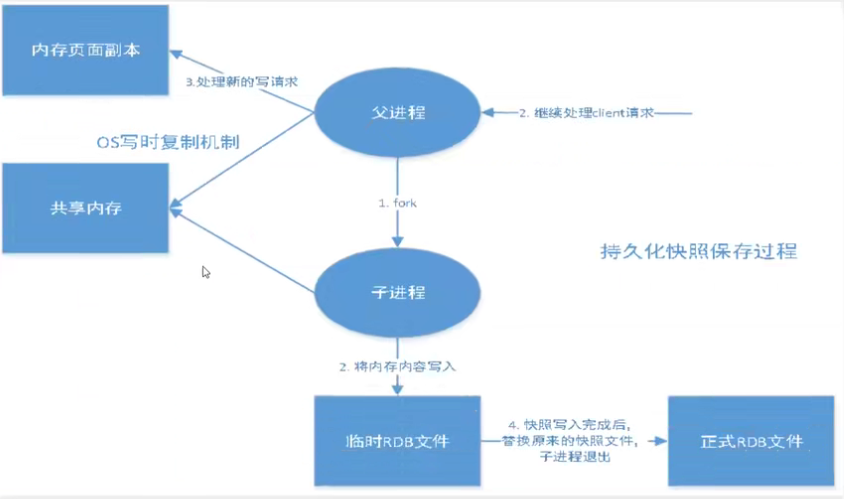

1. Redis使用fork函数复制一份当前进程的副本（子进程）
2. 父进程继续接收并处理客户端发送过来的命令，而子进程开始将内存中的数据写入到硬盘中的临时文件中
3. 当子进程写入完毕之后就会用该临时文件替换旧的RDB文件，至此完成快照操作。

RDB持久化方式对数据的完整性并不是很敏感，它允许一定程度的数据损失。其所保存的文件为dump.rdb。

**RDB持久化触发条件**：

1. 根据redis.conf配置文件所在的规则执行的自动快照
2. 用户执行save或者bgsave命令
3. 执行flushall命令
4. 执行复制命令
5. 退出redis时

而redis-server进程会在如下的情况下自动从dump.rdb文件中进行恢复：

1. 只需要将dump.rdb文件放在我们redis启动目录下就可以了，redis就会在启动的时候自动检查dump.rdb恢复其中的数据。我们可以通过config get dir查看redis-server启动目录。

RDB持久化优点：

1. 适合大规模的数据恢复
2. 对数据的完整性要求不高

缺点：

1. 无法做到实时性的数据保存，需要一定的时间间隔才能进行操作
2. fork子进程时需要一定的时间空间成本


### 4.2 AOF方式

AOF持久化方式指的是Append Only File，即将redis-server执行过程中收到的所有**写**的命令记录下来，类似于shell中命令历史history，输出的文件默认为appendonly.aof文件。

AOF持久化模式默认是不开启的，需要使用者手动在配置文件redis.conf中设置，当然也可以通过`config set appendonly yes`的方式在客户端中进行手动设置。AOF持久化方式实际很少使用。

如果redisAOF持久化文件appendonly.aof文件中存在错误，那么redis-server是无法启动成功的。此时我们可以通过`redis-check-aof --fix <aof-file-name>`命令进行自动修复。

AOF持久化优点：

1. 若每一次修改都同步，文件的完整性更好
2. 若每秒同步一次，那么可能丢失一秒的数据
3. 从不同步，那么性能是最好的。

AOF缺点：

1. 相对于数据文件来说，AOF持久化输出文件远远大于rdb文件，修复的速度比rdb慢
2. AOF运行效率也要比RDB慢，所以redis也正是将redis的默认配置设置为rdb持久化。

AOF重写机制：。。。

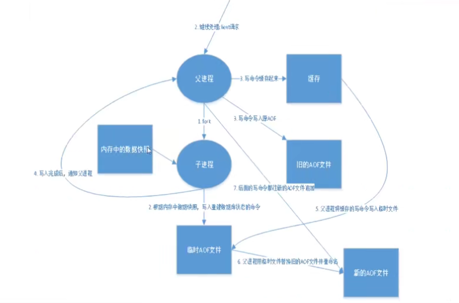

**拓展：**

1. RDB持久化方式能够在指定的时间间隔内对你的数据进行快照存储。
2. AOF持久化方式记录每次对服务器写的操作，当服务器重启的时候会重新执行这些命令来恢复原始的数据，AOF命令以Redis协议追加保存每次的写操作到文件末尾，**Redis还能对AOF文件进行后台重写，是的AOF文件的体积不至于过大**。
3. 只做缓存，如果你只希望你的数据在服务器运行的时候存在，你也可以不使用任何持久化。
4. 同时开启上述AOF和RDB两种持久化方式
   - 在这种情况下，当redis重启的时候会优先载入AOF文件来恢复原始的数据，因为在通常情况下AOF文件保存的数据集要比RDB文件保存的数据集更加完整。
   - RDB的数据不实时，同时使用两者时服务器重启也只会找AOF文件，那要不要只使用AOF？作者建议不要，因为RDB持久化方式更适合用于备份数据库（AOF在不断变化不好备份），快速重启，而且不会有AOF可能潜在的bug，留着作为一个万一的手段。
5. 性能建议：
   - 因为RDB文件只用作后背用途，建议只在从数据库中持久化RDB文件，而且只要15分钟备份一次就够了，只保留save 900 1这一条规则。
   - 如果启动了AOF，好处是在最恶劣的情况下也只会丢失不超过两秒的数据，启动脚本较为简单只加载自己的AOF文件就可以了，代价一是带来了持续的IO，二是AOF重写的最后将重写的过程中产生的新数据写到了新文件造成的阻塞几乎不可避免。只要硬盘许可，应该尽量减少AOF重新的频率，AOF重写的基础大小默认值64M太小，可以设到5G以上，默认超过原大小100%重写可以改到适当的数值。
   - 如果不启动AOF，仅依靠主从复制机制实现高可用性也是可以的，可以省掉一大笔IO，也减少了重写时带来的系统波动。代价是如果主从同时dump，会丢掉十几分钟的数据，启动脚本也要比较两个主从中的RDB文件，载入较新的那个。


## 五. 集群

### 5.1 主从复制

主从复制，读写分离。主数据库可以进行读写操作，当写操作导致数据变化时会自动将数据同步到从数据库中，而从数据库一般只负责读，并接受主数据库同步过来的数据。这样可以减缓服务器的压力，在实际项目架构中经常使用。最低配置一般为一主二从。

主从复制的主要作用：

1. 数据冗余：实现对数据的热备份，是持久化之外的另一种数据冗余方式
2. 故障恢复：当主节点出现问题时，可以由从节点提供服务，实现快速的故障恢复，实现一种服务上的冗余
3. 负载均衡：在此基础上，配合读写分离，可以由主节点提供写服务，由从节点提供读服务，分担服务器负载。尤其是在写少读多的情况下，通过多个从节点分担负载，可以大大提高redis服务器的并发量
4. 高可用（集群）基石：主从复制还是哨兵和集群能够实施的基础，因此说主从复制是redis高可用的基础。

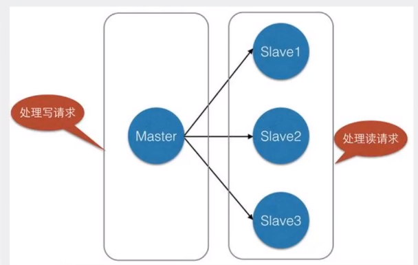

我们可以通过`info replication`命令查看主从复制状态：

```bash
127.0.0.1:6379> info replication
# Replication
role:master  # 当前角色
connected_slaves:0 # 没有从机
master_replid:5cff5e190f19fcadf6bb0a254e5bafbbf650dc39
master_replid2:0000000000000000000000000000000000000000
master_repl_offset:0
second_repl_offset:-1
repl_backlog_active:0
repl_backlog_size:1048576
repl_backlog_first_byte_offset:0
repl_backlog_histlen:0
```


#### 5.1.1 主从复制配置

为了启用主从复制机制，我们需要使用多个redis.conf文件（这里以一主二从为例），主要修改如下几个参数：①端口号；②pid文件（该文件保证单实例守护进程）；③log文件；④dump.rdb文件。这些文件要保证文件名字各不相同。然后通过redis-server的--slaveof参数来启动各个从数据库：

```bash
DESKTOP-4VTHOQC$ redis-server redis79.conf  # 启动主数据库
DESKTOP-4VTHOQC$ redis-server redis80.conf --slaveof 127.0.0.1 6379 # 启动从数据库
DESKTOP-4VTHOQC$ redis-server redis81.conf --slaveof 127.0.0.1 6379 # 启动从数据库

# 通过redis-cli分别连接各个数据库，查看它们的replication信息
# 进入redis主数据库
DESKTOP-4VTHOQC# redis-cli 
127.0.0.1:6379> info replication
# Replication
role:master
connected_slaves:2
slave0:ip=127.0.0.1,port=6380,state=online,offset=28,lag=1
slave1:ip=127.0.0.1,port=6381,state=online,offset=28,lag=1

# 进入redis从数据库1
DESKTOP-4VTHOQC# redis-cli -p 6380
127.0.0.1:6380> info replication
# Replication
role:slave
master_host:127.0.0.1
master_port:6379
master_link_status:up

# 进入redis从数据库2
DESKTOP-4VTHOQC# redis-ci -p 6381
127.0.0.1:6381> info replication
# Replication
role:slave
master_host:127.0.0.1
master_port:6379
master_link_status:up
```

除了上面这种在redis-server启动的时候指定master主数据库的方法之外，我们还可以通过redis-cli连接到一台状态为master的服务器，然后通过`SAVEOF <ip> <port>`命令的方式去指定主数据库，从而完成主从复制方式的配置。

实际的过程中并不是采用上面的方式进行配置的，更多的时候是在redis配置文件redis.conf中如下的一行中配置（默认的情况下这一行是被注释掉的，且是给从数据库使用的。当我们需要设置的时候可以解注释，然后填写相应的主数据库地址ip和主数据库端口号port）：

> replicaof <masterip> <masterport>


#### 5.1.2 复制原理

当我们配置好一主二从的布局之后，我们可以发现如下的现象：

> 1. 若主数据库断开了连接，从数据库仍然来会连接到主数据库，但不会由写操作。若此时主数据库又重新上线，那么从数据库依旧可以获取到主数据库的写入信息；
> 2. 若从数据库断开连接，且原先的主从配置实通过命令行参数或者命令的方式配置的，那么该数据库上线后就会变成主数据库master，只有再次配置成从数据库才能从主数据库中获取到写入的信息；而若主从配置的是通过配置文件的方式设置的，那么启动后就会自动变成从数据库，自然地它可以获取到主数据库的数据。

当从数据库slave启动连接到主数据库master后会发送一个SYNC同步命令。而主数据库接收到这个命令之后，就会启动后台存盘进程（和RDB持久化的过程相同），同时缓存所有接收到在快照期间接收到的命令。在后台进程执行完毕之后，主数据库master会将传送整个数据文件到slave，并完成一次完全同步。从数据库接收到后，就会载入快照文件并执行收到的缓存的命令。这个过程就被称为**复制初始化**。

- 全量复制：从数据库在接收到完整的数据库文件之后，将其加载到内存
- 增量复制：主数据库继续将新的缓存的修改命令依次传给从数据库slave，完成同步

全量复制一般发生在从数据库连接（包括初始时或者重连时）。


#### 5.1.3 树状主从配置

除了一般的分支主从配置方式之外，redis还支持树状类型的主从配置组织方式，不过这种方式很少在实际中有所使用。

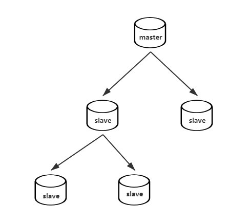


#### 5.1.4 宕机后手动重组复制

在redis还未引入哨兵模式之前，当主数据库master发生了宕机时我们只能通过如下的方式进行手动恢复主从配置的工作：

1. 在从数据库slave中使用`slaveof no one`命令将从数据库提升成主数据库继续服务；
2. 启动之前崩溃的主数据库，然后使用slaveof命令将其设置成新的主数据库的从数据库，这样数据就会同步回来。

同时为了性能的提升，建立主从配置的过程中会在从数据库中启用持久化，而在主数据库中禁用持久化，这样从数据库一旦崩溃，那么它在重启之后主数据库master就会自动将数据同步给它，从而完成恢复。


### 5.2 哨兵模式

#### 5.2.1 哨兵模式的概念

在上面中介绍了普通的宕机后手动恢复主从复制配置的方法，但是实际中这种方式并不会被采用，缺点太多。在实际中更多的是使用哨兵（Sentinel）模式来处理主从复制宕机的问题。

哨兵的作用主要是用来监控redis系统的运行状况，可以认为是自动挡的宕机处理机制，包括如下两个功能：

- **监控**：主数据库master和从数据库slave是否正常运行
- **提醒**：当被监控的某个 Redis 服务器出现问题时， Sentinel 可以通过 API 向管理员或者其他应用程序发送通知
- **自动故障迁移**：主数据库出现故障时自动将从数据库转换为主数据库

哨兵是一个独立进程，作为进程，它会独立运行。其原理时哨兵通过发送命令，等待redis服务器响应，从而监控运行的多个redis实例。如下图所示（分别为单哨兵和多哨兵模式）：


哨兵模式的优缺点，优点：

1. 哨兵集群，基于主从复制模式，所有的主从配置优点，它都有
2. 主从可以切换，故障可以转移，系统的可用性更好
3. 哨兵模式就是主从模式的升级，手动到自动，更加健壮

缺点：

1. redis不好在线扩容，集群容量一旦达到上限，在线扩容会十分的麻烦
2. 实现哨兵模式的配置非常麻烦，里面有很多的选项


#### 5.2.2 配置哨兵模式

配置redis哨兵模式的过程如下：

1. 编写哨兵配置文件sentinel.conf：

   ```bash
   # sentinel monitor <name> <ip> <port> <quorum>
   # 最后一个参数为投票的票数阈值
   sentinel monitor mymaster 127.0.0.1 6379 1
   ```

2. 哨兵启动后开始监控一个系统，它只需要配置其监控的主数据库即可，哨兵会自动发现所有复制该主数据库的从数据库（实际上正是通过发送`info`命令来获取这些信息的）。

   ```bash
   # root @ DESKTOP-4VTHOQC in ~yexinhai/CodeFxcker/RedisTest/redis [17:49:04] 
   $ redis-sentinel ./sentinel.conf                    
   3386:X 23 May 2021 17:49:13.986 # oO0OoO0OoO0Oo Redis is starting oO0OoO0OoO0Oo
   3386:X 23 May 2021 17:49:13.986 # Redis version=5.0.7, bits=64, commit=00000000, modified=0, pid=3386, just started
   3386:X 23 May 2021 17:49:13.986 # Configuration loaded
   3386:X 23 May 2021 17:49:13.986 * Increased maximum number of open files to 10032 (it was originally set to 1024).
                   _._                                                  
              _.-``__ ''-._                                             
         _.-``    `.  `_.  ''-._           Redis 5.0.7 (00000000/0) 64 bit
     .-`` .-```.  ```\/    _.,_ ''-._                                   
    (    '      ,       .-`  | `,    )     Running in sentinel mode
    |`-._`-...-` __...-.``-._|'` _.-'|     Port: 26379
    |    `-._   `._    /     _.-'    |     PID: 3386
     `-._    `-._  `-./  _.-'    _.-'                                   
    |`-._`-._    `-.__.-'    _.-'_.-'|                                  
    |    `-._`-._        _.-'_.-'    |           http://redis.io        
     `-._    `-._`-.__.-'_.-'    _.-'                                   
    |`-._`-._    `-.__.-'    _.-'_.-'|                                  
    |    `-._`-._        _.-'_.-'    |                                  
     `-._    `-._`-.__.-'_.-'    _.-'                                   
         `-._    `-.__.-'    _.-'                                       
             `-._        _.-'                                           
                 `-.__.-'                                               
   
   3386:X 23 May 2021 17:49:13.991 # Sentinel ID is 9d21758b6555b3883cedcb0061b8ab20a9b3afa0
   3386:X 23 May 2021 17:49:13.991 # +monitor master mymaster 127.0.0.1 6379 quorum 1
   3386:X 23 May 2021 17:49:13.992 * +slave slave 127.0.0.1:6380 127.0.0.1 6380 @ mymaster 127.0.0.1 6379
   3386:X 23 May 2021 17:49:13.995 * +slave slave 127.0.0.1:6381 127.0.0.1 6381 @ mymaster 127.0.0.1 6379
   ```

此时我们可以做如下的测试，将redis主从复制结构中的主数据库进行强制下线，就可以通过如下的输出看到哨兵模式执行了故障转移，选择了工作在端口号6380的从数据库提升为主数据库：

```bash
# 强制将主数据库下线
$ redis-cli                     
127.0.0.1:6379> shutdown
not connected> exit

# 哨兵进程输出如下
3386:X 23 May 2021 17:51:31.946 # +sdown master mymaster 127.0.0.1 6379
3386:X 23 May 2021 17:51:31.946 # +odown master mymaster 127.0.0.1 6379 #quorum 1/1
3386:X 23 May 2021 17:51:31.946 # +new-epoch 1
# 开始故障转移工作
3386:X 23 May 2021 17:51:31.946 # +try-failover master mymaster 127.0.0.1 6379
3386:X 23 May 2021 17:51:31.955 # +vote-for-leader 9d21758b6555b3883cedcb0061b8ab20a9b3afa0 1
3386:X 23 May 2021 17:51:31.955 # +elected-leader master mymaster 127.0.0.1 6379
3386:X 23 May 2021 17:51:31.955 # +failover-state-select-slave master mymaster 127.0.0.1 6379
3386:X 23 May 2021 17:51:32.018 # +selected-slave slave 127.0.0.1:6380 127.0.0.1 6380 @ mymaster 127.0.0.1 6379
3386:X 23 May 2021 17:51:32.018 * +failover-state-send-slaveof-noone slave 127.0.0.1:6380 127.0.0.1 6380 @ mymaster 127.0.0.1 6379
3386:X 23 May 2021 17:51:32.096 * +failover-state-wait-promotion slave 127.0.0.1:6380 127.0.0.1 6380 @ mymaster 127.0.0.1 6379
3386:X 23 May 2021 17:51:32.482 # +promoted-slave slave 127.0.0.1:6380 127.0.0.1 6380 @ mymaster 127.0.0.1 6379
3386:X 23 May 2021 17:51:32.482 # +failover-state-reconf-slaves master mymaster 127.0.0.1 6379
3386:X 23 May 2021 17:51:32.531 * +slave-reconf-sent slave 127.0.0.1:6381 127.0.0.1 6381 @ mymaster 127.0.0.1 6379
3386:X 23 May 2021 17:51:33.486 * +slave-reconf-inprog slave 127.0.0.1:6381 127.0.0.1 6381 @ mymaster 127.0.0.1 6379
3386:X 23 May 2021 17:51:33.486 * +slave-reconf-done slave 127.0.0.1:6381 127.0.0.1 6381 @ mymaster 127.0.0.1 6379
3386:X 23 May 2021 17:51:33.545 # +failover-end master mymaster 127.0.0.1 6379
3386:X 23 May 2021 17:51:33.545 # +switch-master mymaster 127.0.0.1 6379 127.0.0.1 6380
3386:X 23 May 2021 17:51:33.545 * +slave slave 127.0.0.1:6381 127.0.0.1 6381 @ mymaster 127.0.0.1 6380
3386:X 23 May 2021 17:51:33.545 * +slave slave 127.0.0.1:6379 127.0.0.1 6379 @ mymaster 127.0.0.1 6380

# 在redis客户端一侧查看6380的redis-server
# root @ DESKTOP-4VTHOQC in /home/yexinhai/CodeFxcker [17:51:27] 
$ rredis-cli -p 6380
127.0.0.1:6380> info replication
# Replication
role:master # 此时工作在端口号6380的从数据库变成了主数据库
connected_slaves:1
slave0:ip=127.0.0.1,port=6381,state=online,offset=7879,lag=1
master_replid:9cb2cb6f65ee3efc7d1e26fd05abcee7f0a16a1e
master_replid2:206f7da7fad961514a3c5e4fe057fb5c4e7000ca
master_repl_offset:7879
second_repl_offset:7178
repl_backlog_active:1
repl_backlog_size:1048576
repl_backlog_first_byte_offset:1
repl_backlog_histlen:7879
127.0.0.1:6380> 
```

此时我们重新让旧的主数据库上线就会发现该数据库只能成为新的主数据库的从数据库了！

```bash
# root @ DESKTOP-4VTHOQC in /home/yexinhai/CodeFxcker/RedisTest/redis [17:58:51] 
$ redis-server redis79.conf                         

# root @ DESKTOP-4VTHOQC in /home/yexinhai/CodeFxcker/RedisTest/redis [17:58:59] 
$ redis-cli                 
127.0.0.1:6379> info replication
# Replication
role:slave
master_host:127.0.0.1
master_port:6380
master_link_status:up
master_last_io_seconds_ago:0
master_sync_in_progress:0
slave_repl_offset:37769
slave_priority:100
slave_read_only:1
connected_slaves:0
master_replid:9cb2cb6f65ee3efc7d1e26fd05abcee7f0a16a1e
master_replid2:0000000000000000000000000000000000000000
master_repl_offset:37769
second_repl_offset:-1
repl_backlog_active:1
repl_backlog_size:1048576
repl_backlog_first_byte_offset:37770
repl_backlog_histlen:0
127.0.0.1:6379> 

# 哨兵进程输出如下，表明旧的主数据库变成了新的主数据库的从数据库了！
3386:X 23 May 2021 17:59:09.808 * +convert-to-slave slave 127.0.0.1:6379 127.0.0.1 6379 @ mymaster 127.0.0.1 6380
```


#### 5.2.3 哨兵模式原理

当哨兵进程启动后，会与要监控的主数据库建立两条连接：

- 一条用来订阅该主数据库的`__sentinel__::hello`频道以获取其他同样监控该数据库的哨兵结点的信息，另外哨兵也需要定期向主数据库发送INFO等命令来获取主数据库本身的信息；
- 另一条是用来发送上述命令的。

同时在启动之后，它会执行一个节点发现的过程，其主要就是通过上述info命令来获取，一旦获知到从数据库的信息，它就会将其记录并创建与它们的连接；同样的对于其他的哨兵，当前的哨兵进程会通过订阅的频道信息来获取到其他哨兵的存在，一旦发现就会将其记录并建立与之的连接。

当主数据库master发生了宕机，哨兵1会先检测到这个结果，系统并不会立即进行failover的过程，因为只有哨兵1主观的认为主数据库服务器不可用，则称为主观下线。当后面的哨兵也检测到主数据库不再可用时，并且数量达到一定值后，哨兵就会认为其客观下线。此时哨兵之间就会进行依次投票，投票的结果由一个哨兵发起，并根据raft算法选举一个领头哨兵，选举完成后领头哨兵会进行failover（故障转移）的操作，该过程如下：

1. 领头哨兵进程会挑选出一个合适的从数据库，并向其发送`slaveof no one`命令将其升格为主数据库
2. 然后领头哨兵进程就会向其他从数据库发送`slaveof`命令来使其称为新主数据库master的从数据库
3. 最后更新内部记录，将已经停止的原主数据库更新为新的主数据库的从数据库，使得其恢复服务时自动以从数据库的身份继续服务
4. 此时如果我们手动重启那个旧的主数据库，我们就可以发现它此时只能成为新的主数据库的从数据库。


### 5.3 集群

到目前而言上面介绍的主从复制和哨兵模式虽然可以达到了读写分离的目的，自动的故障恢复，但是这样的redis服务器构建形式仍然存在着一些不足，尤其是高可用方面的能力。无法满足水平扩容，无法满足高可用的能管理，redis主从复制的能力具有木桶效应，可缓存的数据能力受限于具有最小内存的服务器主机，且无法在主数据库宕机下线的时候弥补这个时间窗口造成的服务缺失。

所以需要redis同样也需要有集群的存在，不仅需要有多个从数据库来处理数据的读请求，还需要多个主数据库来处理数据的写，**将客户端的写入的数据进行自动分片写入到不同的负责写数据的主数据库之中，而各个负责写的主数据库又会和它自己的从数据库一同组成一个集群。**

redis集群是由一系列的主从节点群组成的分布式服务器群，它具有复制、高可用和分片特性。redis的集群不仅拥有和单机实例同样的性能，同时在网络分片后能够提供一定的可访问性以及对主数据库故障恢复的支持（且不需要哨兵的支持）。


##### 5.3.1 集群的配置搭建

在搭建集群之前我们必须对redis的配置文件redsi.conf进行设置，如果我们试图构建一个3主3从的redis集群，我们就需要准备6个redis.conf，在其中开启对redis集群的支持：

```bash
# 注意在redis.conf中不要设置replicaof这个选项，否则redis-server不会启动的

# 是否开启集群
cluster-enabled yes
# 集群配置文件
cluster-config-file "nodes-79.conf"
# 集群断连后的重连时间
cluster-node-timeout 15000
```

然后依次启动这6个redis-server，在启动之后我们通过redis-cli连接上去会发现，其中的`info replication`显示输出各个redis-server都处于主数据库的状态，同时`info cluster`显示输出我们的redis-server集群功能是开启的。而且通过`netstat -antp`命令我们还可以发现，开启了集群的redis-server会比不开启的redis-server多占用一个端口。

```bash
$ redis-server redis79.conf
$ redis-server redis80.conf
$ redis-server redis81.conf
$ redis-server redis82.conf
$ redis-server redis83.conf
$ redis-server redis84.conf
```

然后使用redis-cli命令搭建集群（注意：在redis 5.0版本中redis可以通过redi-cli命令去构建集群，而不一定需要redis-trib.rb脚本），其中--cluster create命令表示需要创建一个集群，--cluster-replicas n表示每一个主数据库下面跟着n个从数据库，由于我们这里需要构建3主3从的数据库，所以我们这里设置n为1。

```bash
# root @ DESKTOP-4VTHOQC in ~yexinhai/CodeFxcker/RedisTest/redis [15:42:23]
$ redis-cli --cluster create 127.0.0.1:6379 127.0.0.1:6380 127.0.0.1:6381 \
127.0.0.1:6382 127.0.0.1:6383 127.0.0.1:6384 --cluster-replicas 1
# 下面是程序的输出：
>>> Performing hash slots allocation on 6 nodes...
Master[0] -> Slots 0 - 5460
Master[1] -> Slots 5461 - 10922
Master[2] -> Slots 10923 - 16383
Adding replica 127.0.0.1:6383 to 127.0.0.1:6379
Adding replica 127.0.0.1:6384 to 127.0.0.1:6380
Adding replica 127.0.0.1:6382 to 127.0.0.1:6381
>>> Trying to optimize slaves allocation for anti-affinity
[WARNING] Some slaves are in the same host as their master
M: 1b0c0582e3ae8cc6fc4d3d6e46d6bbf2563278c3 127.0.0.1:6379
   slots:[0-5460] (5461 slots) master
M: 7ca25aaf92e8df87ca51288255b83271364c9b3e 127.0.0.1:6380
   slots:[5461-10922] (5462 slots) master
M: bd12a419692c40fa30b139db75819f02cf773407 127.0.0.1:6381
   slots:[10923-16383] (5461 slots) master
S: e3b45fb80792a627f64f51d6c25a6864799c8b38 127.0.0.1:6382
   replicates 7ca25aaf92e8df87ca51288255b83271364c9b3e
S: d7b77103fd84afff463e8bd16dfd84139566d5f1 127.0.0.1:6383
   replicates bd12a419692c40fa30b139db75819f02cf773407
S: 523f382548aef4510b69cc84796603227a7e0a11 127.0.0.1:6384
   replicates 1b0c0582e3ae8cc6fc4d3d6e46d6bbf2563278c3
Can I set the above configuration? (type 'yes' to accept): yes
>>> Nodes configuration updated
>>> Assign a different config epoch to each node
>>> Sending CLUSTER MEET messages to join the cluster
Waiting for the cluster to join
.........
>>> Performing Cluster Check (using node 127.0.0.1:6379)
M: 1b0c0582e3ae8cc6fc4d3d6e46d6bbf2563278c3 127.0.0.1:6379
   slots:[0-5460] (5461 slots) master
   1 additional replica(s)
M: bd12a419692c40fa30b139db75819f02cf773407 127.0.0.1:6381
   slots:[10923-16383] (5461 slots) master
   1 additional replica(s)
S: 523f382548aef4510b69cc84796603227a7e0a11 127.0.0.1:6384
   slots: (0 slots) slave
   replicates 1b0c0582e3ae8cc6fc4d3d6e46d6bbf2563278c3
M: 7ca25aaf92e8df87ca51288255b83271364c9b3e 127.0.0.1:6380
   slots:[5461-10922] (5462 slots) master
   1 additional replica(s)
S: e3b45fb80792a627f64f51d6c25a6864799c8b38 127.0.0.1:6382
   slots: (0 slots) slave
   replicates 7ca25aaf92e8df87ca51288255b83271364c9b3e
S: d7b77103fd84afff463e8bd16dfd84139566d5f1 127.0.0.1:6383
   slots: (0 slots) slave
   replicates bd12a419692c40fa30b139db75819f02cf773407
[OK] All nodes agree about slots configuration.
>>> Check for open slots...
>>> Check slots coverage...
[OK] All 16384 slots covered.
```

中间输入一个yes，这样整个集群的工作就完成了。对于一个集群而言，redis-cli如果需要连接上去并对其进行读写操作，则必须加上-c参数，表示我们现在是以集群的方式来访问redis服务，如下所示：

```bash
# root @ DESKTOP-4VTHOQC in ~yexinhai/CodeFxcker/RedisTest/redis [15:49:03]
$ redis-cli -c
127.0.0.1:6379> keys *
(empty list or set)
127.0.0.1:6379> set key value
-> Redirected to slot [12539] located at 127.0.0.1:6381
OK
127.0.0.1:6381> lpush lis third second first
-> Redirected to slot [4428] located at 127.0.0.1:6379
(integer) 3
127.0.0.1:6381> lrange lis 0 -1
-> Redirected to slot [4428] located at 127.0.0.1:6379
1) "first"
2) "second"
3) "third"
```

如果我们需要查看redis集群节点的状态，我们可以通过cluster系列的命令来进行查看，例如cluster nodes可以用来查看集群节点的简要信息，cluster info可以查看集群基本信息等等。

```bash
# root @ DESKTOP-4VTHOQC in ~yexinhai/CodeFxcker/RedisTest/redis [15:49:03]
$ redis-cli -c
127.0.0.1:6379> cluster nodes
bd12a419692c40fa30b139db75819f02cf773407 127.0.0.1:6381@16381 master - 0 1622190229063 3 connected 10923-16383
1b0c0582e3ae8cc6fc4d3d6e46d6bbf2563278c3 127.0.0.1:6379@16379 myself,master - 0 1622190230000 1 connected 0-5460
523f382548aef4510b69cc84796603227a7e0a11 127.0.0.1:6384@16384 slave 1b0c0582e3ae8cc6fc4d3d6e46d6bbf2563278c3 0 1622190231069 6 connected
7ca25aaf92e8df87ca51288255b83271364c9b3e 127.0.0.1:6380@16380 master - 0 1622190232071 2 connected 5461-10922
e3b45fb80792a627f64f51d6c25a6864799c8b38 127.0.0.1:6382@16382 slave 7ca25aaf92e8df87ca51288255b83271364c9b3e 0 1622190231000 4 connected
d7b77103fd84afff463e8bd16dfd84139566d5f1 127.0.0.1:6383@16383 slave bd12a419692c40fa30b139db75819f02cf773407 0 1622190230065 5 connected
```

从上面输出的信息中我们可以很好的看到，哪些节点是从数据库，哪些节点是主数据库。


##### 5.3.2 集群构建的原理

我们以redis-trib.rb命令为基准来介绍redis构建集群的原理或者过程（实际上直接使用redis-cli命令所达到的效果是相同的）：

1. 首先redis-trib.rb会以客户端的形式尝试连接所有的节点，并发送ping命令以确定节点能够正常服务。若正常，则同时发送info命令获取每个节点的运行ID以及是否开启了集群功能。
2. 准备就绪后，集群会向每个节点发送cluster meet命令，格式为`cluster meet ip port`，这个命令用来告诉当前节点指定ip和port上在运行的节点也是集群的一部分，从而使得所有节点最终可以归为一个集群。
3. 然后redis-trib.rb会分配主从数据库节点，分配的原则是尽量保证每个主数据库运行在不同的IP地址上，同时每个从数据库和主数据库均不运行在同一个IP地址上，以保证系统的容灾能力。
4. 分配完成后，会为每个数据库分配插槽，分配插槽的过程其实就是分配哪些键有哪些节点负责。之后对每个想要成为子数据库的节点发送`cluster replicate 主数据库运行ID`来将当前节点转换成从数据库并复制指定运行ID的节点（主数据库）。以此，redis集群构建完成。


##### 5.3.3 向集群添加新节点

如果我们需要向redis集群中添加新的节点，那么我们同样的也需要为这个节点编写新的redis配置文件redis.conf，然后启动，最后通过redis-cli命令将其添加进集群之中。

- 如果我们需要添加一个新的redis主节点到已存在的redis集群中，那么我们需要通过如下的命令来添加：`redis-cli --cluster add-node <新节点ip:port> <已存在集群中的任意一个节点的ip:port>`，具体操作如下所示：

  ```bash
  # 启动两个redis-server节点
  # root @ DESKTOP-4VTHOQC in ~yexinhai/CodeFxcker/RedisTest/redis [16:36:38]
  $ redis-server redis85.conf
  # root @ DESKTOP-4VTHOQC in ~yexinhai/CodeFxcker/RedisTest/redis [16:40:07]
  $ redis-server redis86.conf
  
  # 添加其中一个新的redis主节点到redis集群中
  # root @ DESKTOP-4VTHOQC in ~yexinhai/CodeFxcker/RedisTest/redis [16:40:36]
  $ redis-cli --cluster add-node 127.0.0.1:6385 127.0.0.1:6379
  >>> Adding node 127.0.0.1:6385 to cluster 127.0.0.1:6379
  >>> Performing Cluster Check (using node 127.0.0.1:6379)
  M: 1b0c0582e3ae8cc6fc4d3d6e46d6bbf2563278c3 127.0.0.1:6379
     slots:[0-5460] (5461 slots) master
     1 additional replica(s)
  M: bd12a419692c40fa30b139db75819f02cf773407 127.0.0.1:6381
     slots:[10923-16383] (5461 slots) master
     1 additional replica(s)
  S: 523f382548aef4510b69cc84796603227a7e0a11 127.0.0.1:6384
     slots: (0 slots) slave
     replicates 1b0c0582e3ae8cc6fc4d3d6e46d6bbf2563278c3
  M: 7ca25aaf92e8df87ca51288255b83271364c9b3e 127.0.0.1:6380
     slots:[5461-10922] (5462 slots) master
     1 additional replica(s)
  S: e3b45fb80792a627f64f51d6c25a6864799c8b38 127.0.0.1:6382
     slots: (0 slots) slave
     replicates 7ca25aaf92e8df87ca51288255b83271364c9b3e
  S: d7b77103fd84afff463e8bd16dfd84139566d5f1 127.0.0.1:6383
     slots: (0 slots) slave
     replicates bd12a419692c40fa30b139db75819f02cf773407
  [OK] All nodes agree about slots configuration.
  >>> Check for open slots...
  >>> Check slots coverage...
  [OK] All 16384 slots covered.
  >>> Send CLUSTER MEET to node 127.0.0.1:6385 to make it join the cluster.
  [OK] New node added correctly.
  ```

- 如果我们需要添加一个新的redis从节点到已存在的redis集群中，那么我们需要通过如下的命令来添加：

  `redis-cli --cluster add-node <新节点ip:port> <已存在集群中的任意一个节点的ip:port> --cluster-slave --cluster-master-id <需要复制的主节点运行ID>`，具体操作如下：

  ```bash
  # 添加上面启动的一个新节点到redis集群，并将其设定为另一个主节点的从节点
  # root @ DESKTOP-4VTHOQC in ~yexinhai/CodeFxcker/RedisTest/redis [16:51:40]
  $ redis-cli --cluster add-node 127.0.0.1:6386 127.0.0.1:6385 --cluster-slave \
  --cluster-master-id eff926ea3d4b0322b853cc1f13869927c5b45bbc
  # 下面是程序的输出：
  >>> Adding node 127.0.0.1:6386 to cluster 127.0.0.1:6385
  >>> Performing Cluster Check (using node 127.0.0.1:6385)
  M: eff926ea3d4b0322b853cc1f13869927c5b45bbc 127.0.0.1:6385
     slots: (0 slots) master
  M: 7ca25aaf92e8df87ca51288255b83271364c9b3e 127.0.0.1:6380
     slots:[5461-10922] (5462 slots) master
     1 additional replica(s)
  M: 1b0c0582e3ae8cc6fc4d3d6e46d6bbf2563278c3 127.0.0.1:6379
     slots:[0-5460] (5461 slots) master
     1 additional replica(s)
  S: 523f382548aef4510b69cc84796603227a7e0a11 127.0.0.1:6384
     slots: (0 slots) slave
     replicates 1b0c0582e3ae8cc6fc4d3d6e46d6bbf2563278c3
  S: e3b45fb80792a627f64f51d6c25a6864799c8b38 127.0.0.1:6382
     slots: (0 slots) slave
     replicates 7ca25aaf92e8df87ca51288255b83271364c9b3e
  M: bd12a419692c40fa30b139db75819f02cf773407 127.0.0.1:6381
     slots:[10923-16383] (5461 slots) master
     1 additional replica(s)
  S: d7b77103fd84afff463e8bd16dfd84139566d5f1 127.0.0.1:6383
     slots: (0 slots) slave
     replicates bd12a419692c40fa30b139db75819f02cf773407
  [OK] All nodes agree about slots configuration.
  >>> Check for open slots...
  >>> Check slots coverage...
  [OK] All 16384 slots covered.
  >>> Send CLUSTER MEET to node 127.0.0.1:6386 to make it join the cluster.
  Waiting for the cluster to join
  
  >>> Configure node as replica of 127.0.0.1:6385.
  [OK] New node added correctly.
  
  # root @ DESKTOP-4VTHOQC in ~yexinhai/CodeFxcker/RedisTest/redis [16:52:33]
  $ redis-cli -c -p 6386
  # 连接到这个从节点后查看具体的集群信息可以发现这个节点已经加入到集群之中，
  # 且成为指定主节点的从节点
  127.0.0.1:6386> cluster nodes
  523f382548aef4510b69cc84796603227a7e0a11 127.0.0.1:6384@16384 slave 1b0c0582e3ae8cc6fc4d3d6e46d6bbf2563278c3 0 1622191965000 1 connected
  d7b77103fd84afff463e8bd16dfd84139566d5f1 127.0.0.1:6383@16383 slave bd12a419692c40fa30b139db75819f02cf773407 0 1622191964000 3 connected
  e3b45fb80792a627f64f51d6c25a6864799c8b38 127.0.0.1:6382@16382 slave 7ca25aaf92e8df87ca51288255b83271364c9b3e 0 1622191964000 2 connected
  58c46ac2c538d8aabff23edda56faf35933a6ef2 127.0.0.1:6386@16386 myself,slave eff926ea3d4b0322b853cc1f13869927c5b45bbc 0 1622191963000 7 connected
  1b0c0582e3ae8cc6fc4d3d6e46d6bbf2563278c3 127.0.0.1:6379@16379 master - 0 1622191965793 1 connected 0-5460
  7ca25aaf92e8df87ca51288255b83271364c9b3e 127.0.0.1:6380@16380 master - 0 1622191964790 2 connected 5461-10922
  bd12a419692c40fa30b139db75819f02cf773407 127.0.0.1:6381@16381 master - 0 1622191963000 3 connected 10923-16383
  eff926ea3d4b0322b853cc1f13869927c5b45bbc 127.0.0.1:6385@16385 master - 0 1622191962000 0 connected
  ```

不过需要注意的是，我们上面添加进去的主节点6385是并没有占有任何插槽，这也就意味着当客户端像这个集群中写入任何数据的时候都不会将任何数据写入到这个节点中，此时这个节点没有什么用。因此为了使得这个主节点和它的从节点能够得到有效的利用，必须从已有的主节点中分配一些插槽到新的主节点中！


##### 5.3.4 插槽的概念与分配

如上所述，我们知道集群的目的是在读写分离的基础上实现数据写的分离，将不同的键以及相关的值信息写入到不同的主节点（主数据库）中，但是同时要保证客户端在写入和查找总是会分配到同一个节点（或者它的从节点）中。不难发现，这种思想实际上和Hashtable的计算hash值的原理非常相似，而redis的集群设计也是如此。

在redis集群中会具有16384个插槽，我们可以把这些插槽类比哈希表中的桶，为了建立键和插槽之间的映射关系，redis会将每个键的键名的有效部分（怎么命名有效部分也是门学问）使用CRC16算法计算出散列值，然后取对16384的余数。这样使得每个键可以分配到16384个插槽，进而分配到指定的一个节点中进行处理。这一个正常运行的redis集群中，这16384个插槽会按照一定的配比分配到不同的主节点中。

在redis-cli中我们可以通过`cluster slots`命令来查看插槽的分配情况，如下所示：

```bash
$ redis-cli -c -p 6386
127.0.0.1:6386> cluster slots
1) 1) (integer) 0
   2) (integer) 5460
   3) 1) "127.0.0.1"
      2) (integer) 6379
      3) "1b0c0582e3ae8cc6fc4d3d6e46d6bbf2563278c3"
   4) 1) "127.0.0.1"
      2) (integer) 6384
      3) "523f382548aef4510b69cc84796603227a7e0a11"
2) 1) (integer) 5461
   2) (integer) 10922
   3) 1) "127.0.0.1"
      2) (integer) 6380
      3) "7ca25aaf92e8df87ca51288255b83271364c9b3e"
   4) 1) "127.0.0.1"
      2) (integer) 6382
      3) "e3b45fb80792a627f64f51d6c25a6864799c8b38"
3) 1) (integer) 10923
   2) (integer) 16383
   3) 1) "127.0.0.1"
      2) (integer) 6381
      3) "bd12a419692c40fa30b139db75819f02cf773407"
   4) 1) "127.0.0.1"
      2) (integer) 6383
      3) "d7b77103fd84afff463e8bd16dfd84139566d5f1"
```

我们从上面的结果可以看到，在端口6379和6384的主从节点占据了0\~5460这一范围的插槽，在端口6380和6382的主从节点占据了5461\~10922这一范围的插槽，在端口6381和6383的主从节点占据了10923~16383这一范围的插槽，但我们却发现最后新添加的主从节点并没有占据任何的插槽！因此为了使得它们能够得到有效的作业，我们必须使用为这其中的主节点分配相应的插槽！


我们重新分配插槽，我们可以使用如下的命令来进行实现：

`redis-cli --cluster reshard <目的新节点ip:port> --cluster-from <原先占有插槽的节点的运行ID,...> --cluster-to <新节点的运行ID> --cluster-slots <需要移动的插槽个数>`

```bash
# root @ DESKTOP-4VTHOQC in ~yexinhai/CodeFxcker/RedisTest/redis [17:50:47]
$ redis-cli --cluster reshard 127.0.0.1:6385 --cluster-from \
1b0c0582e3ae8cc6fc4d3d6e46d6bbf2563278c3, \ 
7ca25aaf92e8df87ca51288255b83271364c9b3e, \ 
bd12a419692c40fa30b139db75819f02cf773407 --cluster-to \
eff926ea3d4b0322b853cc1f13869927c5b45bbc --cluster-slots 3000
# 以下是程序输出，中间需要输入yes进行确认
>>> Performing Cluster Check (using node 127.0.0.1:6385)
M: eff926ea3d4b0322b853cc1f13869927c5b45bbc 127.0.0.1:6385
   slots: (0 slots) master
   1 additional replica(s)
M: 7ca25aaf92e8df87ca51288255b83271364c9b3e 127.0.0.1:6380
   slots:[5461-10922] (5462 slots) master
   1 additional replica(s)
M: 1b0c0582e3ae8cc6fc4d3d6e46d6bbf2563278c3 127.0.0.1:6379
   slots:[0-5460] (5461 slots) master
   1 additional replica(s)
S: 58c46ac2c538d8aabff23edda56faf35933a6ef2 127.0.0.1:6386
   slots: (0 slots) slave
   replicates eff926ea3d4b0322b853cc1f13869927c5b45bbc
S: 523f382548aef4510b69cc84796603227a7e0a11 127.0.0.1:6384
   slots: (0 slots) slave
   replicates 1b0c0582e3ae8cc6fc4d3d6e46d6bbf2563278c3
S: e3b45fb80792a627f64f51d6c25a6864799c8b38 127.0.0.1:6382
   slots: (0 slots) slave
   replicates 7ca25aaf92e8df87ca51288255b83271364c9b3e
M: bd12a419692c40fa30b139db75819f02cf773407 127.0.0.1:6381
   slots:[10923-16383] (5461 slots) master
   1 additional replica(s)
S: d7b77103fd84afff463e8bd16dfd84139566d5f1 127.0.0.1:6383
   slots: (0 slots) slave
   replicates bd12a419692c40fa30b139db75819f02cf773407
[OK] All nodes agree about slots configuration.
>>> Check for open slots...
>>> Check slots coverage...
[OK] All 16384 slots covered.

Ready to move 3000 slots.
  Source nodes:
    M: 1b0c0582e3ae8cc6fc4d3d6e46d6bbf2563278c3 127.0.0.1:6379
       slots:[0-5460] (5461 slots) master
       1 additional replica(s)
  Destination node:
    M: eff926ea3d4b0322b853cc1f13869927c5b45bbc 127.0.0.1:6385
       slots: (0 slots) master
       1 additional replica(s)
  Resharding plan:
    Moving slot 0 from 1b0c0582e3ae8cc6fc4d3d6e46d6bbf2563278c3
    Moving slot 1 from 1b0c0582e3ae8cc6fc4d3d6e46d6bbf2563278c3
	......
    Moving slot 2999 from 1b0c0582e3ae8cc6fc4d3d6e46d6bbf2563278c3
Do you want to proceed with the proposed reshard plan (yes/no)? yes
Moving slot 0 from 127.0.0.1:6379 to 127.0.0.1:6385:
Moving slot 1 from 127.0.0.1:6379 to 127.0.0.1:6385:
Moving slot 2 from 127.0.0.1:6379 to 127.0.0.1:6385:
......
Moving slot 2999 from 127.0.0.1:6379 to 127.0.0.1:6385:
```

此时移动插槽到新的主节点之后我们就可以通过redis-cli中的`cluster slots`命令再次查看插槽的分配情况，如下，可以看出插槽顺利的分配到了目的主节点之中：

```bash
# root @ DESKTOP-4VTHOQC in ~yexinhai/CodeFxcker/RedisTest/redis [17:51:10]
$ redis-cli -c
127.0.0.1:6379> cluster slots
1) 1) (integer) 10923
   2) (integer) 16383
   3) 1) "127.0.0.1"
      2) (integer) 6381
      3) "bd12a419692c40fa30b139db75819f02cf773407"
   4) 1) "127.0.0.1"
      2) (integer) 6383
      3) "d7b77103fd84afff463e8bd16dfd84139566d5f1"
2) 1) (integer) 3000
   2) (integer) 5460
   3) 1) "127.0.0.1"
      2) (integer) 6379
      3) "1b0c0582e3ae8cc6fc4d3d6e46d6bbf2563278c3"
   4) 1) "127.0.0.1"
      2) (integer) 6384
      3) "523f382548aef4510b69cc84796603227a7e0a11"
3) 1) (integer) 0
   2) (integer) 2999
   3) 1) "127.0.0.1"
      2) (integer) 6385
      3) "eff926ea3d4b0322b853cc1f13869927c5b45bbc"
   4) 1) "127.0.0.1"
      2) (integer) 6386
      3) "58c46ac2c538d8aabff23edda56faf35933a6ef2"
4) 1) (integer) 5461
   2) (integer) 10922
   3) 1) "127.0.0.1"
      2) (integer) 6380
      3) "7ca25aaf92e8df87ca51288255b83271364c9b3e"
   4) 1) "127.0.0.1"
      2) (integer) 6382
      3) "e3b45fb80792a627f64f51d6c25a6864799c8b38"
```


##### 5.3.5 节点删除与插槽回收

若我们需要删除一个从节点，会比较方便些，我们可以通过如下的命令来实现从节点的安全删除 ：`redis-cli --cluster del-node <欲删除从节点的ip:port> <欲删除从节点运行ID>`，具体操作如下所示：

```bash
# root @ DESKTOP-4VTHOQC in ~yexinhai/CodeFxcker/RedisTest/redis [18:09:24] C:1
$ redis-cli --cluster del-node 127.0.0.1:6386 58c46ac2c538d8aabff23edda56faf35933a6ef2
>>> Removing node 58c46ac2c538d8aabff23edda56faf35933a6ef2 from cluster 127.0.0.1:6386
>>> Sending CLUSTER FORGET messages to the cluster...
>>> SHUTDOWN the node.
```


若我们需要删除一个主节点，这必须保证这个主节点中不再占有任何的插槽才可以进行删除，因此我们在删除这个主节点之前需要将其中占有的插槽重新分配到其他的主节点之中。我们可以通过如下的命令完成删除操作：

1. 重新分配待删除节点中的插槽（如果插槽不连续，可能需要多次操作）：

   `redis-cli --cluster reshard <待删除主节点的ip:port> --cluster-from <待删除主节点的运行ID> --cluster-to <目标主节点的运行ID> --cluster-slots <插槽数量>`；

2. 从集群中删除待删除主节点（同时要保证在此之前没有从节点复制之）：

   `redis-cli --cluster del-node <欲删除主节点的ip:port> <欲删除主节点的运行ID>`。

```bash
# 重新分配待删主节点中的插槽
# root @ DESKTOP-4VTHOQC in ~yexinhai/CodeFxcker/RedisTest/redis [19:42:56] C:1
$ redis-cli --cluster reshard 127.0.0.1:6385 --cluster-from \ 
eff926ea3d4b0322b853cc1f13869927c5b45bbc \
--cluster-to 1b0c0582e3ae8cc6fc4d3d6e46d6bbf2563278c3 --cluster-slots 3000
# 下面是程序输出：
>>> Performing Cluster Check (using node 127.0.0.1:6385)
M: eff926ea3d4b0322b853cc1f13869927c5b45bbc 127.0.0.1:6385
   slots:[0-2999] (3000 slots) master
M: 7ca25aaf92e8df87ca51288255b83271364c9b3e 127.0.0.1:6380
   slots:[5461-10922] (5462 slots) master
   1 additional replica(s)
M: 1b0c0582e3ae8cc6fc4d3d6e46d6bbf2563278c3 127.0.0.1:6379
   slots:[3000-5460] (2461 slots) master
   1 additional replica(s)
S: 523f382548aef4510b69cc84796603227a7e0a11 127.0.0.1:6384
   slots: (0 slots) slave
   replicates 1b0c0582e3ae8cc6fc4d3d6e46d6bbf2563278c3
S: e3b45fb80792a627f64f51d6c25a6864799c8b38 127.0.0.1:6382
   slots: (0 slots) slave
   replicates 7ca25aaf92e8df87ca51288255b83271364c9b3e
M: bd12a419692c40fa30b139db75819f02cf773407 127.0.0.1:6381
   slots:[10923-16383] (5461 slots) master
   1 additional replica(s)
S: d7b77103fd84afff463e8bd16dfd84139566d5f1 127.0.0.1:6383
   slots: (0 slots) slave
   replicates bd12a419692c40fa30b139db75819f02cf773407
[OK] All nodes agree about slots configuration.
>>> Check for open slots...
>>> Check slots coverage...
[OK] All 16384 slots covered.

Ready to move 3000 slots.
  Source nodes:
    M: eff926ea3d4b0322b853cc1f13869927c5b45bbc 127.0.0.1:6385
       slots:[0-2999] (3000 slots) master
  Destination node:
    M: 1b0c0582e3ae8cc6fc4d3d6e46d6bbf2563278c3 127.0.0.1:6379
       slots:[3000-5460] (2461 slots) master
       1 additional replica(s)
  Resharding plan:
    Moving slot 0 from eff926ea3d4b0322b853cc1f13869927c5b45bbc
    Moving slot 1 from eff926ea3d4b0322b853cc1f13869927c5b45bbc
    ......
	Moving slot 2998 from eff926ea3d4b0322b853cc1f13869927c5b45bbc
    Moving slot 2999 from eff926ea3d4b0322b853cc1f13869927c5b45bbc
Do you want to proceed with the proposed reshard plan (yes/no)? yes
Moving slot 0 from 127.0.0.1:6385 to 127.0.0.1:6379:
Moving slot 1 from 127.0.0.1:6385 to 127.0.0.1:6379:
Moving slot 2 from 127.0.0.1:6385 to 127.0.0.1:6379:
......
Moving slot 2998 from 127.0.0.1:6385 to 127.0.0.1:6379:
Moving slot 2999 from 127.0.0.1:6385 to 127.0.0.1:6379:

# 删除待删主节点，删除后该redis-server会自动终止
# root @ DESKTOP-4VTHOQC in ~yexinhai/CodeFxcker/RedisTest/redis [19:43:56]
$ redis-cli --cluster del-node 127.0.0.1:6385 eff926ea3d4b0322b853cc1f13869927c5b45bbc
>>> Removing node eff926ea3d4b0322b853cc1f13869927c5b45bbc from cluster 127.0.0.1:6385
>>> Sending CLUSTER FORGET messages to the cluster...
>>> SHUTDOWN the node.
```

此时再次连接集群并输入`cluster nodes`命令，就会发现此时的集群又回到了3主3从的结构，插槽也得到了重新分配：

```bash
# root @ DESKTOP-4VTHOQC in ~yexinhai/CodeFxcker/RedisTest/redis [19:47:20]
$ redis-cli -c
127.0.0.1:6379> cluster nodes
bd12a419692c40fa30b139db75819f02cf773407 127.0.0.1:6381@16381 master - 0 1622202445977 3 connected 10923-16383
1b0c0582e3ae8cc6fc4d3d6e46d6bbf2563278c3 127.0.0.1:6379@16379 myself,master - 0 1622202441000 9 connected 0-5460
523f382548aef4510b69cc84796603227a7e0a11 127.0.0.1:6384@16384 slave 1b0c0582e3ae8cc6fc4d3d6e46d6bbf2563278c3 0 1622202444000 9 connected
7ca25aaf92e8df87ca51288255b83271364c9b3e 127.0.0.1:6380@16380 master - 0 1622202446979 2 connected 5461-10922
e3b45fb80792a627f64f51d6c25a6864799c8b38 127.0.0.1:6382@16382 slave 7ca25aaf92e8df87ca51288255b83271364c9b3e 0 1622202446000 4 connected
d7b77103fd84afff463e8bd16dfd84139566d5f1 127.0.0.1:6383@16383 slave bd12a419692c40fa30b139db75819f02cf773407 0 1622202444000 5 connected
127.0.0.1:6379> cluster slots
1) 1) (integer) 10923
   2) (integer) 16383
   3) 1) "127.0.0.1"
      2) (integer) 6381
      3) "bd12a419692c40fa30b139db75819f02cf773407"
   4) 1) "127.0.0.1"
      2) (integer) 6383
      3) "d7b77103fd84afff463e8bd16dfd84139566d5f1"
2) 1) (integer) 0
   2) (integer) 5460
   3) 1) "127.0.0.1"
      2) (integer) 6379
      3) "1b0c0582e3ae8cc6fc4d3d6e46d6bbf2563278c3"
   4) 1) "127.0.0.1"
      2) (integer) 6384
      3) "523f382548aef4510b69cc84796603227a7e0a11"
3) 1) (integer) 5461
   2) (integer) 10922
   3) 1) "127.0.0.1"
      2) (integer) 6380
      3) "7ca25aaf92e8df87ca51288255b83271364c9b3e"
   4) 1) "127.0.0.1"
      2) (integer) 6382
      3) "e3b45fb80792a627f64f51d6c25a6864799c8b38
```


## 六. 缓冲穿透和雪崩

redis缓存的使用，极大的提升了应用程序的性能和效率，特别是数据查询方面。同时他也带来了一些问题。其中最要害的就是数据一致性问题。从严格意义上讲，这个问题无解。如果对数据一致性要求很高，那么就不应该使用缓存。

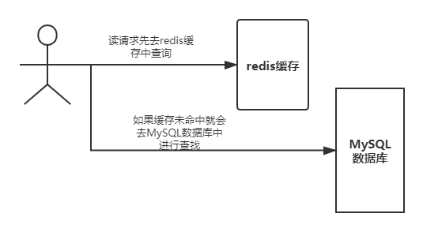

下面的缓存穿透、缓存击穿、缓存雪崩都属于服务器高可用问题。


### 6.1 缓存穿透

**缓存穿透的概念指的是用户想要查询一个数据，但是发现redis内存数据库中并没有，也就是缓存未命中，于时就会向持久层数据库进行查询，同样的在持久层数据库中也发现没有，于时本次查询失败。当用户很多的时候，缓存都没有命中，于是都去请求持久层数据库。这会给持久层数据库造成很大的压力，此时就会发生缓存穿透的现象。**（缓存穿透是数据查不到导致的！）

解决方案：

- 使用布隆过滤器：它是一种特殊的数据结构，对所有可能查询的参数以hash的形式存储，在控制层先进行校验，不符合则丢弃，从而避免了对底层存储系统的查询压力。

  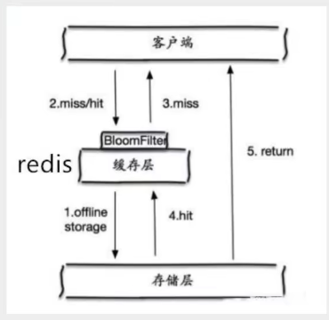

- 缓存空对象：当存储层未命中后，即是返回的空对象也将其缓存起来，同时会设置一个过期时间，之后在访问这个数据将会从缓存中获取，从而保护了后端的数据源的安全性。

  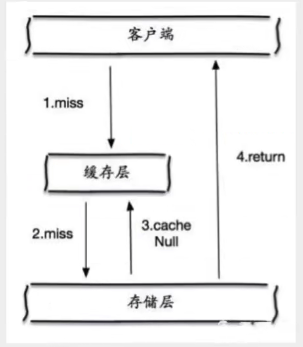

  但是这种方法会存在如下两个问题：

  1. 如果空值能够被缓存起来，这就意味着缓存需要更多的空间存储更多的键，因为这当中可能会有很多空值的键，这看起来没有什么意义；
  2. 即使对空值设置了过期时间，还是会存在缓存层和存储层的数据有一段时间窗口的不一致，这对于需要保持一致性的业务会有一定的影响。


### 6.2 缓存击穿

这里需要注意和缓存穿透的区别，缓存击穿是指一个key非常热点，在不停的扛着大并发，大并发几种对这一点进行访问，当这个key在失效的瞬间，持续的大并发就击穿缓存（由于redis为其在初始之时设置了过期时间），导致不得不直接请求数据库，就像在一个屏障上凿开了一个大洞。

当某个key在过期的瞬间，有大量的请求并发访问，这类数据一般是一个热点数据，但由于缓存过期的原因，会同时访问数据库来查询最新的数据，并会写缓存，导致持久层数据库的压力过大。

（缓存击穿是访问量大，缓存过期导致的！）

解决方案：

- 设置热点数据永不过期：从缓存层面来看，因为没有设置过期时间，所以就不会出现热点key过期后产生的问题。
- 加互斥锁：使用分布式锁，保证对于每个key同时只有一个线程去查询后端服务，其他线程没有获得分布式锁的权限，因此只需要等待即可。这种方式将高并发的压力转移到了分布式锁身上，因此对分布式锁的考验非常大。


### 5.4.3 缓存雪崩

缓存雪崩，是指在某一个事件段，缓存集中过期失效，从而导致redis宕机。

产生雪崩的原因之一，在双十一中，马上就要到双十一零点，很快就进行商品抢购，这波商品信息会比较集中的放入到缓冲中。假设缓存一个小时，那么到了凌晨一点钟，这批商品的缓存就会发生过期。而对于这批商品的访问查询，都落到了数据库身上，对于数据库而言，就会产生周期性的压力波峰。于是所有的请求都会达到存储层，存储层的调用量会暴增，造成存储层可能发生宕机的事件。

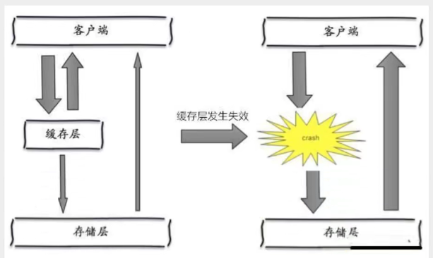

其实redis缓存中数据的集中过期，倒不是最致命的，比较知名的缓存雪崩是缓存服务器中某个节点宕机或者断网。因为自然形成的缓存雪崩，一定是在某个时间段集中创建缓存的，这个时候数据库也是可以顶住压力，无非就是对数据库产生周期性的压力而已。而缓存服务节点的宕机，对于数据库服务器造成的压力是不可预知的，很有可能就会把数据库压垮。

解决方案：

- redis高可用：这个思想的含义是，多增设几台redis服务器，这样一台挂掉之后其他的服务器就还可以继续工作，即搭建集群（异地多活）。
- 限流降级：在缓存失效之后，通过假说或者队列的方式来控制读数据库/写缓存的线程数量。比如对于某个key只允许一个线程查询数据和写缓存，其他线程等待。同时我们还可以将一些不常用的服务停止，这样可以留出更多的资源其中进行服务某一个热点服务。
- 数据预热：在正式部署之前，将可能的数据预先访问一遍，这部分可能大量访问的数据就加载到缓存中，在即将发生大并发访问前手动触发加载缓存不同的key的动作，设置不同的过期时间，让缓存失效的时间点尽量均匀一点。

