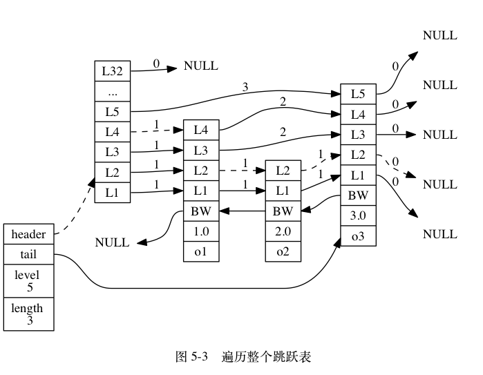

# Redis设计与实现

## 一、数据结构和对象

下面数据结构和对象涉及如下文件：1、`sds.h/c`；2、`adlist.h/c`；3、`dict.h/c`；4、`redis.h`以及`t_zset.h`。


### 1.1 简单动态字符串

```c
struct sdshdr {
    // buf 中已占用空间的长度
    int len;
    // buf 中剩余可用空间的长度
    int free;
    // 数据空间
    char buf[];
};
```

简单动态字符串SDS实机上可以认为是在C语言之上实现一个类似于C++的动态字符串`std::string`相同的功能。特点也是类似的：

1.  常数复杂度获取字符串长度
2. 杜绝缓冲区溢出
3. 通过预分配和惰性删除的方式减少修改字符串长度时所需的重分配次数
4. 二进制安全
5. 兼容部分C字符串函数


### 1.2 链表

```c
/* 双端链表节点 */
typedef struct listNode {
    // 前置节点
    struct listNode *prev;
    // 后置节点
    struct listNode *next;
    // 节点的值
    void *value;
} listNode;

/* 双端链表迭代器 */
typedef struct listIter {
    // 当前迭代到的节点
    listNode *next;
    // 迭代的方向
    int direction;
} listIter;

/* 双端链表结构 */
typedef struct list {
    // 表头节点
    listNode *head;
    // 表尾节点
    listNode *tail;
    // 节点值复制函数
    void *(*dup)(void *ptr);
    // 节点值释放函数
    void (*free)(void *ptr);
    // 节点值对比函数
    int (*match)(void *ptr, void *key);
    // 链表所包含的节点数量
    unsigned long len;
} list;
```


redis中的链表是一个典型的非环状双向链表，具有如下的特点：

1. 双端无环
2. 带表头指针和表尾指针
3. 带链表长度计数器
4. 多态：可以使用void*指针保存不同类型的节点值


### 1.3 字典

redis的字典底层使用哈希表来实现，其哈希表、哈希表节点以及字典本身有着如下的结构：

```c
/* 哈希表节点 */
typedef struct dictEntry {   
    // 键
    void *key;
    // 值
    union {
        void *val;
        uint64_t u64;
        int64_t s64;
    } v;
    // 指向下个哈希表节点，形成链表
    struct dictEntry *next;
} dictEntry;

/* 哈希表: 每个字典都使用两个哈希表，从而实现渐进式 rehash */
typedef struct dictht {
    // 哈希表数组
    dictEntry **table;
    // 哈希表大小
    unsigned long size;
    // 哈希表大小掩码，用于计算索引值
    // 总是等于 size - 1
    unsigned long sizemask;
    // 该哈希表已有节点的数量
    unsigned long used;
} dictht;

/* 字典类型特定函数 */
typedef struct dictType {
    // 计算哈希值的函数
    unsigned int (*hashFunction)(const void *key);
    // 复制键的函数
    void *(*keyDup)(void *privdata, const void *key);
    // 复制值的函数
    void *(*valDup)(void *privdata, const void *obj);
    // 对比键的函数
    int (*keyCompare)(void *privdata, const void *key1, const void *key2);
    // 销毁键的函数
    void (*keyDestructor)(void *privdata, void *key);
    // 销毁值的函数
    void (*valDestructor)(void *privdata, void *obj);
} dictType;

/* 字典 */
typedef struct dict {
    // 类型特定函数
    dictType *type;
    // 私有数据
    void *privdata;
    // 哈希表
    dictht ht[2];
    // rehash 索引，当 rehash 不在进行时，值为 -1
    int rehashidx; /* rehashing not in progress if rehashidx == -1 */
    // 目前正在运行的安全迭代器的数量
    int iterators; /* number of iterators currently running */
} dict;
```

在字典dict结构体中，type属性和privdata属性是针对不同类型的键值对，为创建多态字典而设置的。type属性指向一个dictType的结构体，每个结构体保存一簇特定操作的函数指针。而privdata属性用来保存需要传给特定类型函数的可选参数。ht属性包含两个哈希表，默认情况下字典只会使用第一个哈希表，而第二个哈希表只有在第一个哈希表进行rehash的时候才会使用。如下图所示：


当我们需要进行键-值查询或者插入的时候，redis的字典dict会按照如下的方式计算索引值（默认情况下redis使用的是murmurHash算法）：

```c
hash = dict->type->hashFunction(key);
index = hash & dict->ht[0].sizemask; // 假设这里使用的是第一个哈希表
```


#### 1.3.1 rehash操作

一般情况下当redis字典中的键值对数量大于负载因子时，就会启动redis的拓展操作执行rehash。它首先会在`dict.hash[1]`创建一个具有更大空间的然后将`dict.hash[0]`中的键值对移入到前者中，最后销毁`hash[1]`并进行交换。

一般情况下redis的dict的rehash拓展只有在如下情况下发生：

1. 服务器没有执行BGSAVE命令或BGREWRITEAOF命令时，哈希表的负载因子大于等于1
2. 服务器当前在执行BGSAVE命令或BGREWRITEAOF命令时，且哈希表的负载因子大于等于5

之所以如此设计，其主要的目的是为了避免在子进程存在期间进行哈希拓展操作，这样可以避免因为写时拷贝机制造成的不必要内存写入操作，最大限度节约内存。


#### 1.3.2 渐进式rehash

在上述的描述中rehash操作好像可以简单粗暴的从`hash[0]`移入到`hash[1]`中（一次性完成），但实际上当哈希表中的数据量达到了一定规模时这种方法显然就不再高效。redis于是采用了渐进式rehash的方式来解决这一问题，即在移动键值对的时候它会采用如下的步骤：

1. 为`hash[1]`分配空间，让字典同时持有`hash[0]`和`hash[1]`；
2. 在字典中维持一个索引计数器变量rehashidx，并将它的值设置为0，表示rehash工作开始；
3. 在rehash进行期间，每次对字典的插入、删除、查找或更新操作时，程序除了执行指定的操作外还会顺带将`hash[0]`在rehashidx索引上的键值对rehash到`hash[1]`中。当rehash工作完成时，程序将rehashidx值加一；
4. 随着字典操作的不断执行，最终在某个时间点上，`hash[0]`上的所有键值对都被rehash到`hash[1]`上，这时程序将rehashidx值设置为-1（销毁原空间和交换操作内含在其中），表示rehash工作完成。

使用渐进式rehash的好处在于它采取分而治之的思想，将rehash键值对所需要的计算工作均摊到对字典的每个添加、删除、查找和更新操作上，从而避免集中式rehash带来的庞大计算量。


### 1.4 跳表

redis上的调表skiplist有着如下的结构：

```c
/* redis对象结构，可以是任何一种redis类型，也可以是数值类型 */
typedef struct redisObject {
    // 类型
    unsigned type:4;
    // 编码
    unsigned encoding:4;
    // 对象最后一次被访问的时间
    unsigned lru:REDIS_LRU_BITS; /* lru time (relative to server.lruclock) */
    // 引用计数
    int refcount;
    // 指向实际值的指针
    void *ptr;
} robj;

/* 跳跃表节点 */
typedef struct zskiplistNode {
    // 成员对象
    robj *obj;
    // 分值
    double score;
    // 后退指针
    struct zskiplistNode *backward;
    // 层
    struct zskiplistLevel {
        // 前进指针
        struct zskiplistNode *forward;
        // 跨度
        unsigned int span;
    } level[];
} zskiplistNode;

/* 跳跃表 */
typedef struct zskiplist {
    // 表头节点和表尾节点
    struct zskiplistNode *header, *tail;
    // 表中节点的数量
    unsigned long length;
    // 表中层数最大的节点的层数
    int level;
} zskiplist;
```

一般而言，redis跳表的节点分值是可以重复的，但是相同分值的情况下成员对象所指向的sds字符串的内容必须是不重复的，且按照字典序进行排序。但在平常情况下其其有如下的结构：




### 1.5 整数集合

整数集合intset主要是用来优化集合在仅使用整数且数据规模不大的情况下的一种优化手段，其实现如下所示：

```c
typedef struct intset {
    // 编码方式
    uint32_t encoding;
    // 集合包含的元素数量
    uint32_t length;
    // 保存元素的数组
    int8_t contents[];
} intset;
```

其中intset中的encoding决定了集合中元素的编码方式，而length指出集合中有多少个元素，contents虽然是一个整数数组，但整数元素的大小和编码方式完全由前面的编码方式决定。如下图所示：


由于整数集合中的元素的数据类型完全取决于encoding字段，所以在一开始intset会尽可能使用更小的数据类型来存储整数集合中的元素。但如果向这样的整数集合中加入一个更大类型的数据时，就会发生”升级“的过程，然后将新的元素添加到整数集合中去。


