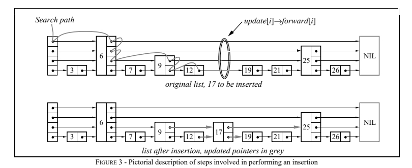
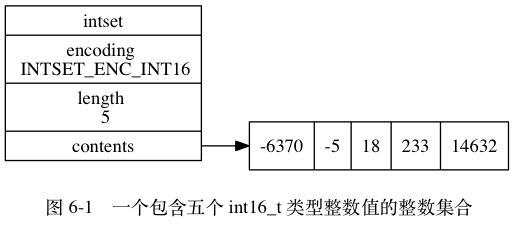
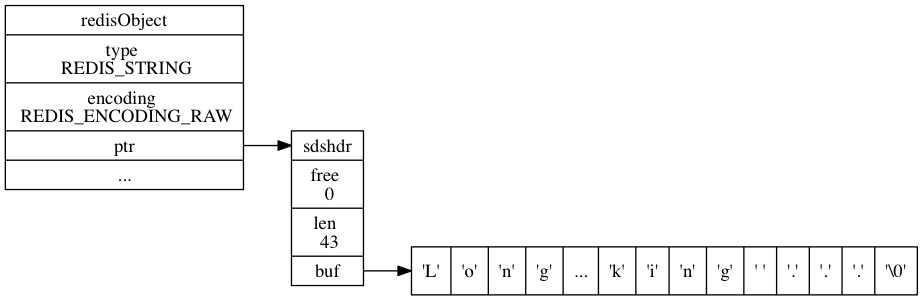

# Redis设计与实现

## 一、数据结构和对象

下面数据结构和对象涉及如下文件：1、`sds.h/c`；2、`adlist.h/c`；3、`dict.h/c`；4、`redis.h`以及`t_zset.h`。


### 1.1 简单动态字符串

redis简单动态字符串结构如下所示，其结构定义在`sds.h`，实现放在`sds.c`

```c
struct sdshdr {
    // buf 中已占用空间的长度
    int len;
    // buf 中剩余可用空间的长度
    int free;
    // 数据空间
    char buf[];
};
```


简单动态字符串SDS实机上可以认为是在C语言之上实现一个类似于C++的动态字符串`std::string`相同的功能。特点也是类似的：

1.  常数复杂度获取字符串长度
2. 杜绝缓冲区溢出
3. 通过**预分配**和**惰性删除**的方式减少修改字符串长度时所需的重分配次数
4. 二进制安全
5. 使用一些自身特定的API的同时又兼容部分C字符串函数


### 1.2 链表

redis链表的节点和链表本身结构如下所示，其结构定义在`adlist.h`，实现放在`adlist.c`中：

```c
/* 双端链表节点 */
typedef struct listNode {
    // 前置节点
    struct listNode *prev;
    // 后置节点
    struct listNode *next;
    // 节点的值
    void *value;
} listNode;

/* 双端链表迭代器 */
typedef struct listIter {
    // 当前迭代到的节点
    listNode *next;
    // 迭代的方向
    int direction;
} listIter;

/* 双端链表结构 */
typedef struct list {
    // 表头节点
    listNode *head;
    // 表尾节点
    listNode *tail;
    // 节点值复制函数
    void *(*dup)(void *ptr);
    // 节点值释放函数
    void (*free)(void *ptr);
    // 节点值对比函数
    int (*match)(void *ptr, void *key);
    // 链表所包含的节点数量
    unsigned long len;
} list;
```


redis中的链表是一个典型的非环状双向链表，具有如下的特点：

1. 双端无环
2. 带表头指针和表尾指针
3. 带链表长度计数器
4. 多态：可以使用void*指针保存不同类型的节点值


### 1.3 字典

哈希表、节点以及字典本身有着如下的结构，其结构定义在`dict.h`，实现放在`dict.c`中：

```c
/* 哈希表节点 */
typedef struct dictEntry {   
    // 键
    void *key;
    // 值
    union {
        void *val;
        uint64_t u64;
        int64_t s64;
    } v;
    // 指向下个哈希表节点，形成链表
    struct dictEntry *next;
} dictEntry;

/* 哈希表: 每个字典都使用两个哈希表，从而实现渐进式 rehash */
typedef struct dictht {
    // 哈希表数组
    dictEntry **table;
    // 哈希表大小
    unsigned long size;
    // 哈希表大小掩码，用于计算索引值
    // 总是等于 size - 1
    unsigned long sizemask;
    // 该哈希表已有节点的数量
    unsigned long used;
} dictht;

/* 字典类型特定函数 */
typedef struct dictType {
    // 计算哈希值的函数
    unsigned int (*hashFunction)(const void *key);
    // 复制键的函数
    void *(*keyDup)(void *privdata, const void *key);
    // 复制值的函数
    void *(*valDup)(void *privdata, const void *obj);
    // 对比键的函数
    int (*keyCompare)(void *privdata, const void *key1, const void *key2);
    // 销毁键的函数
    void (*keyDestructor)(void *privdata, void *key);
    // 销毁值的函数
    void (*valDestructor)(void *privdata, void *obj);
} dictType;

/* 字典 */
typedef struct dict {
    // 类型特定函数
    dictType *type;
    // 私有数据
    void *privdata;
    // 两个哈希表
    dictht ht[2];
    // rehash 索引，当 rehash 不在进行时，值为 -1
    int rehashidx; /* rehashing not in progress if rehashidx == -1 */
    // 目前正在运行的安全迭代器的数量
    int iterators; /* number of iterators currently running */
} dict;
```

在字典dict结构体中，type属性和privdata属性是针对不同类型的键值对，为创建多态字典而设置的。type属性指向一个dictType的结构体，每个结构体保存一簇特定操作的函数指针。而privdata属性用来保存需要传给特定类型函数的可选参数。ht属性包含两个哈希表，默认情况下字典只会使用第一个哈希表，而第二个哈希表只有在第一个哈希表进行rehash的时候才会使用。字典总体结构如下图所示：


当我们需要进行键-值查询或者插入的时候，redis的字典dict会按照如下的方式计算索引值（默认情况下redis使用的是murmurHash算法，由于该算法可以保证产生的Hash值呈现均匀的分布，所以在redis的实现中并不需要保证dictht中table的大小一定像C++实现那样保证其为质数）：

```c
hash = dict->type->hashFunction(key);
// 这一步实际上就是一个模运算（假设这里使用的是第一个哈希表）
index = hash & dict->ht[0].sizemask;
```


**rehash操作**

一般情况下当redis字典中的键值对数量大于负载因子时，就会启动redis的拓展操作执行rehash。它首先会在`dict.hash[1]`创建一个具有更大空间的然后将`dict.hash[0]`中的键值对移入到前者中，最后销毁`hash[1]`并进行交换。

一般情况下redis的dict的rehash拓展只有在如下情况下发生：

1. 服务器没有执行BGSAVE命令或BGREWRITEAOF命令时，哈希表的负载因子大于等于1
2. 服务器当前在执行BGSAVE命令或BGREWRITEAOF命令时，且哈希表的负载因子大于等于5

之所以如此设计，其主要的目的是为了避免在子进程存在期间进行哈希拓展操作，这样可以避免因为写时拷贝机制造成的不必要内存写入操作，最大限度节约内存。


**渐进式rehash**

在上述的描述中rehash操作好像可以简单粗暴的从`hash[0]`移入到`hash[1]`中（一次性完成），但实际上当哈希表中的数据量达到了一定规模时这种方法显然就不再高效。redis于是采用了渐进式rehash的方式来解决这一问题，即在移动键值对的时候它会采用如下的步骤：

1. 为`hash[1]`分配空间，让字典同时持有`hash[0]`和`hash[1]`；
2. 在字典中维持一个索引计数器变量rehashidx，并将它的值设置为0，表示rehash工作开始；
3. **在rehash进行期间，每次对字典的插入、删除、查找或更新操作时，程序除了执行指定的操作外还会顺带将`hash[0]`在rehashidx索引上的键值对rehash到`hash[1]`中。当rehash工作完成时，程序将rehashidx值加一；**
4. 随着字典操作的不断执行，最终在某个时间点上，`hash[0]`上的所有键值对都被rehash到`hash[1]`上，这时程序将rehashidx值设置为-1（销毁原空间和交换操作内含在其中），表示rehash工作完成。

使用渐进式rehash的好处在于它采取分而治之的思想，将rehash键值对所需要的计算工作均摊到对字典的每个添加、删除、查找和更新操作上，从而避免集中式rehash带来的庞大计算量。


### 1.4 跳表

redis上的调表skiplist有着如下的结构，其结构定义在`redis.h`中，具体实现放在`t_zset.c`中：

```c
/* redis对象结构，可以是任何一种redis类型，也可以是数值类型 */
typedef struct redisObject {
    // 类型
    unsigned type:4;
    // 编码
    unsigned encoding:4;
    // 对象最后一次被访问的时间
    unsigned lru:REDIS_LRU_BITS; /* lru time (relative to server.lruclock) */
    // 引用计数
    int refcount;
    // 指向实际值的指针
    void *ptr;
} robj;

/* 跳跃表节点 */
typedef struct zskiplistNode {
    // 成员对象
    robj *obj;
    // 分值
    double score;
    // 后退指针
    struct zskiplistNode *backward;
    // 层
    struct zskiplistLevel {
        // 前进指针
        struct zskiplistNode *forward;
        // 跨度
        unsigned int span;
    } level[];
} zskiplistNode;

/* 跳跃表 */
typedef struct zskiplist {
    // 表头节点和表尾节点
    struct zskiplistNode *header, *tail;
    // 表中节点的数量
    unsigned long length;
    // 表中层数最大的节点的层数
    int level;
} zskiplist;
```

一般而言，redis跳表的节点分值是可以重复的，但是相同分值的情况下成员对象所指向的sds字符串的内容必须是不重复的，且按照字典序进行排序。但在平常情况下其有如下的结构：


 **跳表插入操作**

跳表的插入、查找、删除等操作可以参考提出[跳表的论文](http://www.cl.cam.ac.uk/teaching/0506/Algorithms/skiplists.pdf)，但其中理解其实现过程的最佳案例就是跳表节点的插入操作，其步骤可以总结为如下：

1. 根据插入元素的分值score在跳表从上往下找到所有插入位置前一个节点的指针集合，并记录到update数组中；

2. 然后使用幂次定律生成新的跳表节点高度，如果该高度超过所有节点的高度，那么进行相应的高度更新；

   > 每次创建一个新的跳跃表节点的时候，程序都根据幂次定律（power law，越大的数出现的概率越小）随机生成一个介于1和32之间的值作为level数组的大小，这个大小就是该新跳表节点层level的“高度”。

3. 创建新的跳表节点，并接入到跳表之中更新相应的前后节点的指针等相应数据，最终完成插入工作。



```c
/*
 * 创建一个成员为 obj ，分值为 score 的新节点，
 * 并将这个新节点插入到跳跃表 zsl 中。
 * 
 * 函数的返回值为新节点。
 *
 * T_wrost = O(N^2), T_avg = O(N log N)
 */
zskiplistNode *zslInsert(zskiplist *zsl, double score, robj *obj) {
    zskiplistNode *update[ZSKIPLIST_MAXLEVEL], *x;
    unsigned int rank[ZSKIPLIST_MAXLEVEL];
    int i, level;

    redisAssert(!isnan(score));

    // 在各个层查找节点的插入位置
    // T_wrost = O(N^2), T_avg = O(N log N)
    x = zsl->header;
    for (i = zsl->level-1; i >= 0; i--) {

        /* store rank that is crossed to reach the insert position */
        // 如果 i 不是 zsl->level-1 层
        // 那么 i 层的起始 rank 值为 i+1 层的 rank 值
        // 各个层的 rank 值一层层累积
        // 最终 rank[0] 的值加一就是新节点的前置节点的排位
        // rank[0] 会在后面成为计算 span 值和 rank 值的基础
        rank[i] = i == (zsl->level-1) ? 0 : rank[i+1];

        // 沿着前进指针遍历跳跃表
        // T_wrost = O(N^2), T_avg = O(N log N)
        while (x->level[i].forward &&
            (x->level[i].forward->score < score ||
                // 比对分值
                (x->level[i].forward->score == score &&
                // 比对成员， T = O(N)
                compareStringObjects(x->level[i].forward->obj,obj) < 0))) {

            // 记录沿途跨越了多少个节点
            rank[i] += x->level[i].span;

            // 移动至下一指针
            x = x->level[i].forward;
        }
        // 记录将要和新节点相连接的节点
        update[i] = x;
    }

    /* 
     * zslInsert() 的调用者会确保同分值且同成员的元素不会出现，
     * 所以这里不需要进一步进行检查，可以直接创建新元素。
     */

    // 获取一个随机值作为新节点的层数
    // T = O(N)
    level = zslRandomLevel();

    // 如果新节点的层数比表中其他节点的层数都要大
    // 那么初始化表头节点中未使用的层，并将它们记录到 update 数组中
    // 将来也指向新节点
    if (level > zsl->level) {

        // 初始化未使用层
        // T = O(1)
        for (i = zsl->level; i < level; i++) {
            rank[i] = 0;
            update[i] = zsl->header;
            update[i]->level[i].span = zsl->length;
        }

        // 更新表中节点最大层数
        zsl->level = level;
    }

    // 创建新节点
    x = zslCreateNode(level,score,obj);

    // 将前面记录的指针指向新节点，并做相应的设置
    // T = O(1)
    for (i = 0; i < level; i++) {
        
        // 设置新节点的 forward 指针
        x->level[i].forward = update[i]->level[i].forward;
        
        // 将沿途记录的各个节点的 forward 指针指向新节点
        update[i]->level[i].forward = x;

        /* update span covered by update[i] as x is inserted here */
        // 计算新节点跨越的节点数量
        x->level[i].span = update[i]->level[i].span - (rank[0] - rank[i]);

        // 更新新节点插入之后，沿途节点的 span 值
        // 其中的 +1 计算的是新节点
        update[i]->level[i].span = (rank[0] - rank[i]) + 1;
    }

    /* increment span for untouched levels */
    // 未接触的节点的 span 值也需要增一，这些节点直接从表头指向新节点
    // T = O(1)
    for (i = level; i < zsl->level; i++) {
        update[i]->level[i].span++;
    }

    // 设置新节点的后退指针
    x->backward = (update[0] == zsl->header) ? NULL : update[0];
    if (x->level[0].forward)
        x->level[0].forward->backward = x;
    else
        zsl->tail = x;

    // 跳跃表的节点计数增一
    zsl->length++;

    return x;
}
```


### 1.5 整数集合

整数集合intset主要是用来优化集合在仅使用整数且数据规模不大的情况下的一种优化手段，其结构如下所示，相关的定义和实现分别放置在`intset.h`和`intset.c`：

```c
typedef struct intset {
    // 编码方式
    uint32_t encoding;
    // 集合包含的元素数量
    uint32_t length;
    // 保存元素的数组
    int8_t contents[];
} intset;
```

其中intset中的encoding决定了集合中元素的编码方式，而length指出集合中有多少个元素，contents虽然是一个整数数组，但整数元素的大小和数据类型（例如int16、int32）完全由前面的编码方式决定，且数组中的元素都是有序的（我们可以非常方便的时候使用二分法实现一个整数的查找、删除、插入等操作）。如下图所示：



由于整数集合中的元素的数据类型完全取决于encoding字段，所以在一开始intset会尽可能使用更小的数据类型来存储整数集合中的元素。但如果向这样的整数集合中加入一个更大类型的数据时，就会发生”**升级**“的过程，然后将新的元素添加到整数集合中去。


### 1.6 压缩列表

压缩列表是Redis为了节约内存而开发的，是由一系列特殊编码的连续内存块组成的顺序型数据结构。一个压缩列表可以包含任何多个节点（entry），**每个节点保存一个字节数组或者一个整数值**。压缩列表ziplist的组成如下图所示：

![digraph {      label = "\n 图 7-1    压缩列表的各个组成部分";      node [shape = record];      ziplist [label = " zlbytes | zltail | zllen | entry1 | entry2 | ... | entryN | zlend "];  }](http://redisbook.com/_images/graphviz-fe42f343a3f32f477efb5e895da547d476a7c97d.png)

其中：

1. zlbytes：长度4字节，记录整个压缩列表所占用的内存字节数；
2. zltail：长度4字节，记录压缩列表标尾节点距离压缩列表表头的起始地址的字节量；
3. zllen：长度2字节，记录压缩列表中节点的数量；
4. entry[1...N]：长度不定，每个节点字节量也不定，但都是由previous_entry_length、encoding和content三个部分组成，在其解码后redis会使用`zlentry`结构存放这个entry的相关信息；
5. zlend：长度1字节，表示压缩列表的结尾，存放特殊值0xFF。

> 由于ziplist是在连续地址的内存块上直接实现的，所以ziplist的源代码中并没有定义什么结构体，这一点与下面的`struct zlentry`的并没有任何关系。


**压缩列表节点**

![digraph {      label = "\n 图 7-4    压缩列表节点的各个组成部分";      node [shape = record];      n [label = " previous_entry_length | encoding | content "];  }](http://redisbook.com/_images/graphviz-cc6b40e182bfc142c12ac0518819a2d949eafa4a.png)

而压缩列表中的每一个条目元素entry都是由如上图所示的三个部分组成，其中：

1. **previous_entry_length**：长度可能为1字节或者5字节，表示当前压缩列表元素的前一个节点元素的长度。

   - 若previous_entry_length字段第一个字节**＜254**，则该属性字段总长就为1字节，且前一个节点的长度就保存在该字节中；
   - 若previous_entry_length字段第一个字节 **≧ 254**，则该属性字段总长就为5字节，第一个字节不启用，后4个字节实际保存前一节点的长度。

   因为压缩列表节点的previous_entry_length字段记录着前一个节点的长度，所以程序可以通过指针运算，根据当前节点的起始地址来计算前一个节点的起始地址。

2. **encoding**：长度可能为1字节、2字节或者5字节，表示当前节点content字段所保存的数据类型以及长度。

   - 若encoding第一个字节的最高两位为**00**，则encoding字段长度为1字节，此时content字段中存储的是长度小于等于63字节的字节数组，具体长度由encoding剩余比特位上的数据决定；
   - 若encoding第一个字节的最高两位为**01**，则encoding字段的长度为2字节，此时content字段中存储的是长度小于等于16383字节的字节数组，具体长度由encoding剩余比特位上的数据决定；
   - 若encoding第一个字节的最高两位为**10**，则encoding的字段的长度为5字节，此时content字段中存储的是长度小于等于429496795字节的字节数组，具体长度有encoding的后4个字节决定；
   - 若encoding第一个字节的最高两位为**11**，则encoding的字段的长度为1字节，此时content字段中保存的是整数，其数据类型由encoding的后6比特信息决定。

3. content：该字段部分记录着节点中的实际数据，具体长度由encoding字段决定。

虽然我们在上面介绍了redis压缩列表的实际构成，但我们发现对于任意的压缩列表元素，获取前一个元素的长度，判断存储的数据类型，获取数据内容，都需要经过复杂的解码运算才行，其解码后的结果应该被缓存起来。为此redis定义了结构体`zlentry`，用于表示解码后的压缩列表元素：

```c
/* 保存 ziplist 节点信息的结构 */
typedef struct zlentry {

    // prevrawlen ：前置节点的长度
    // prevrawlensize ：编码 prevrawlen 所需的字节大小
    unsigned int prevrawlensize, prevrawlen;

    // len ：当前节点值的长度
    // lensize ：编码 len 所需的字节大小
    unsigned int lensize, len;

    // 当前节点 header 的大小
    // 等于 prevrawlensize + lensize
    unsigned int headersize;

    // 当前节点值所使用的编码类型
    unsigned char encoding;

    // 指向当前节点的指针
    unsigned char *p;

} zlentry;
```

该结构体定义了7个字段，其中：previous_entry_length字段的长度（字段prevrawlensize表示）、previous_entry_length字段存储的内容（字段prevrawlen表示）、encoding字段的长度（字段lensize表示）、encoding字段的内容（字段len表示数据内容长度，字段encoding表示数据类型），以上这些字段都是由于压缩列表节点的可变性决定的。除此之外还有，当前元素首地址（字段p表示）。而headersize字段则表示当前元素的首部长度，即previous_entry_length字段长度与encoding字段长度之和。


**连锁更新现象**

添加新节点到压缩列表，或者从压缩列表中删除节点可能会引发连锁更新操作。造成这一现象的主要原因正是因为上述ziplist中存储的压缩列表节点的previous_entry_length和encoding会根据前一个节点的大小和当前存储内容的大小发生改变，一旦前一个节点发生了改变，那么当前节点的previous_entry_length也很有可能发生改变，又因为当前节点大小发生了改变又故而导致后续节点的更新，因此造成了**连锁更新**现象。但这种操作出现的几率并不高。


### 1.7 redis对象

redis并不是直接通过使用上述的数据结构来构建K-V数据库，而是基于这些数据结构设计了一个对象系统，即**将所有的数据结构/对象抽象化，使用一个单一的`redisObject`结构体来进行管理各种不同具体类型的对象**。这个对象系统中，主要包括如下5种类型的对象：

1. 字符串对象String
2. 列表对象List
3. 哈希对象Hash
4. 集合对象Set
5. 有序集合对象Sorted-Set

设计redis对象系统的好处就在于这样可以针对不同的使用场景，为对象使用多种不同的数据机构实现，优化对象在不同场景下的使用效率；同时还可以方便类型的检查；实现基于引用计数的内存回收机制、对象共享机制；实现带有访问时间记录信息的机制等功能。

由于redis是一个K-V数据库，所以redis上的所有数据都是以键值对key-value的形式呈现。每在redis上创建一个键值对，redis就会为自动的为它创建一个键对象key和值对象value，这些对象都是通过`redisObject`这个结构体来进行抽象的表示，如下代码所示。至于这个redis对象是什么类型的，那就完全取决于该对象中的`type`字段的设置了，但有一点可以肯定的就是在这个键值对中，**键对象key一定是字符串对象String。而当redis键值对的值是何种类型时，那么我们一般就会将这个键值对中的键称为“何种类型“的键**。例如`set msg "hello world"`中，键对象是String，值对象也是String，那么我们就称这个键为”字符串键“。

```c
typedef struct redisObject {
    // 类型
    unsigned type:4;

    // 编码
    unsigned encoding:4;

    // 对象最后一次被访问的时间
    unsigned lru:REDIS_LRU_BITS; /* lru time (relative to server.lruclock) */

    // 引用计数
    int refcount;

    // 指向实际值的指针
    void *ptr;

} robj;
```

在数据结构`redisObject`中，由如下5个字段组成：

- **类型type**：决定了当前redis对象所属的类型，由如下5个常量定义：

  

- **编码encoding**：决定了当前redis对象使用何种数据结构来实现相应的功能，也即决定了另一个结构体成员ptr指向的数据结构类型，这实际上就是一种多态思想在C语言上的引用。相关常量如下所示：

  

  我们可以看到，每一种redis对象实际上都是由两种或以上的数据结构来实现的。

- **对象最后一次访问时间lru**：该成员是用来在redis上实现最近最少置换算法的。

- **引用计数refcount**：来用实现redis对象的引用计数-内存自动释放功能和对象共享功能的。

- **指向底层数据结构的指针ptr**：该指针的实际类型由encoding编码决定。


#### 1.7.1 字符串对象

当redis对象中的type成员为`REDIS_STRING`时，我们就称这样的redis对象为字符串对象。字符串对象有如下三种编码方式，在三种编码方式是用来在存储不同形式的字符串内容时所采用的三种不同的策略，从而提高实际的存储访问性能：

- int编码：如果一个字符串对象保存的是整数值，且这个整数值可以用long保存，那么redis就会将`redisObject`结构体中的ptr指针强制从`void*`转换成`long`来保存这个整数值字符串，如下所示：

  

- raw编码：如果一个字符串对象保存的是一个长度大于39字节的字符串，那么redis就是让`redisObject`结构体中的ptr指针指向一个简单动态字符串sds，如下所示：

  

- embstr编码：如果一个字符串对象保存的是一个长度小于等于39字节的字符串，那么redis就会使用一种特殊的名为embstr的编码方式来实现String对象，在这种对象中`redisObject`结构体和`sdshdr`结构体的空间会被一次性连续的分配，从而减少花费在因内存分配/释放的系统时间开销，也是在有效地在利用cache。该结构如下所示：

  

上述总结可以通过如下图来进行表达：


当然一个字符串对象在用户使用redis的过程中并不总是以一种形式进行实现的，在不同的情况上述的编码方式会存在转换的过程，规则如下：

1. 如果对一个int编码的字符串对象执行了一些操作使得其不再为整数值，那么该字符串对象的编码将会转换为raw；
2. 由于embstr编码的字符串对象是只读的，所以一旦对该种编码的字符串对象执行了修改操作，那么其编码就会自动转换为raw。


#### 1.7.2 列表对象

当redis对象中的type成员为`REDIS_LIST`时，我们就称这样的redis对象为列表对象。


#### 1.7.3 哈希对象


#### 1.7.4 集合对象


#### 1.7.5 有序集合对象


#### 1.7.6 redis命令实现


#### 1.7.7 内存回收和对象共享


## 二、单机数据库实现

### 2.1 数据库

```c
struct redisServer {

    /* General */

    // 配置文件的绝对路径
    char *configfile;           /* Absolute config file path, or NULL */

    // serverCron() 每秒调用的次数
    int hz;                     /* serverCron() calls frequency in hertz */

    // 数据库
    redisDb *db;

    // ...
    
        /* Configuration */
    
    // ...

    int dbnum;                      /* Total number of configured DBs */

    /
};
```


#### 2.1.1 数据库组成

```c
typedef struct redisDb {

    // 数据库键空间，保存着数据库中的所有键值对
    dict *dict;                 /* The keyspace for this DB */

    // 键的过期时间（又名过期键空间），字典的键为键，字典的值为过期事件 UNIX 时间戳
    dict *expires;              /* Timeout of keys with a timeout set */

    // 正处于阻塞状态的键
    dict *blocking_keys;        /* Keys with clients waiting for data (BLPOP) */

    // 可以解除阻塞的键
    dict *ready_keys;           /* Blocked keys that received a PUSH */

    // 正在被 WATCH 命令监视的键
    dict *watched_keys;         /* WATCHED keys for MULTI/EXEC CAS */

    struct evictionPoolEntry *eviction_pool;    /* Eviction pool of keys */

    // 数据库号码
    int id;                     /* Database ID */

    // 数据库的键的平均 TTL ，统计信息
    long long avg_ttl;          /* Average TTL, just for stats */

} redisDb;
```


#### 2.1.2 设置过期时间


#### 2.1.3 过期键删除策略


#### 2.1.4 AOF、RDB和复制功能对过期策略的影响


#### 2.1.5 数据库通知


### 2.2 RDB持久化

#### 2.2.1 RDB文件的创建和载入


#### 2.2.2 自动间隔性保存


#### 2.2.3 RDB文件结构

仅含有`set msg "hello world"`的redis数据库rdb文件：

```shell
$ od -c dump.rdb
0000000   R   E   D   I   S   0   0   0   9 372  \t   r   e   d   i   s
0000020   -   v   e   r 005   5   .   0   .   7 372  \n   r   e   d   i
0000040   s   -   b   i   t   s 300   @ 372 005   c   t   i   m   e 302
0000060   u 214   !   b 372  \b   u   s   e   d   -   m   e   m 302 250
0000100 330  \b  \0 372  \f   a   o   f   -   p   r   e   a   m   b   l
# 其中376 \0 表示的就是selectdb 0
0000120   e 300  \0 376  \0 373 001  \0  \0 003   m   s   g  \v   h   e
0000140   l   l   o       w   o   r   l   d 377   d 224 372   W 354 311
0000160 360   3
0000162
```

含有一个设置过期时间的`set msg "hello world"`的redis数据库rdb文件：

```shell
$ od -c dump.rdb
0000000   R   E   D   I   S   0   0   0   9 372  \t   r   e   d   i   s
0000020   -   v   e   r 005   5   .   0   .   7 372  \n   r   e   d   i
0000040   s   -   b   i   t   s 300   @ 372 005   c   t   i   m   e 302
0000060 214 216   !   b 372  \b   u   s   e   d   -   m   e   m 302 230
0000100 331  \b  \0 372  \f   a   o   f   -   p   r   e   a   m   b   l
# 其中376 \0 表示的就是selectdb 0，但后面的373 001 001暂时没有搞懂什么意思，
# 374 307 257 256   S 177 001  \0 \0表示过期时间，后面就是记录一个String键
0000120   e 300  \0 376  \0 373 001 001 374 307 257 256   S 177 001  \0
0000140  \0  \0 003   m   s   g  \v   h   e   l   l   o       w   o   r
0000160   l   d 377   M 273   F 254   w 324 233   _
0000173
```

一个仅包含集合的redis数据库rdb文件：

```shell
$ od -c dump.rdb
0000000   R   E   D   I   S   0   0   0   9 372  \t   r   e   d   i   s
0000020   -   v   e   r 005   5   .   0   .   7 372  \n   r   e   d   i
0000040   s   -   b   i   t   s 300   @ 372 005   c   t   i   m   e 302
0000060 341 302   !   b 372  \b   u   s   e   d   -   m   e   m 302
0000100 332  \b  \0 372  \f   a   o   f   -   p   r   e   a   m   b   l
# 其中376 \0 表示的就是selectdb 0，373 001  \0没搞懂，002为REDIS_RDB_TYPE_SET
# 常量，后面就是记录redis数据库中集合的内容。
0000120   e 300  \0 376  \0 373 001  \0 002 004   l   a   n   g 003 006
0000140   P   y   t   h   o   n 003   C   +   + 004   J   a   v   a 377
0000160 004   2 214   $ 024 301   X   &
0000170
```


### 2.3 AOF持久化

#### 2.3.1 AOF持久化的实现


#### 2.3.2 AOF文件的载入和数据还原


#### 2.3.3 AOF重写


### 2.4 事件

#### 2.4.1 文件事件


#### 2.4.2 时间事件


#### 2.4.3 事件的调度和执行


### 2.5 客户端

#### 2.5.1 客户端组成


#### 2.5.2 客户端的创建与关闭


### 2.6 服务器

#### 2.6.1 命令请求的执行过程


#### 2.6.2 serverCron函数


#### 2.6.3 初始化服务器


## 三、独立功能实现

### 3.1 发布与订阅

#### 3.1.1 频道的订阅与退订


#### 3.1.2 模式的订阅与退订


#### 3.1.3 发送消息


#### 3.1.4 查看订阅信息


### 3.2 事务

#### 3.2.1 事务的实现


#### 3.2.2 WATCH命令的实现


#### 3.2.3 事务的ACID性质


### 3.3 Lua脚本

#### 3.3.1 创建并修改Lua环境


#### 3.3.2 Lua环境协作组件


#### 3.3.3 EVAL(SHA)命令实现


#### 3.3.4 脚本管理命令实现


#### 3.3.5 脚本复制

> 需要涉及到分布式的知识，暂时不学习。


> 在这一章节中，非常频繁地出现了一个词语——**“hook”钩子**，我个人的理解就是注入式的回调。在知乎上，也有一些非常好的解读，例如https://www.zhihu.com/question/20610442指出：
>
> 
>
> Hooks就像一些外来的钩子，在源代码之间钩取（窃听）一些信息，当它捕捉到自己感兴趣的事发生，就拦截下来，让自己的代码执行一下，处理一下这个信息，然后再放出去继续之前的进程。这样就可以在不用改变源代码的情况下，做一些别的事情，比方说监控、分析和一些恶意的事。


### 3.4 排序

#### 3.4.1 SORT命令的基本实现

主要描述下`sort <key>`、`sort <key> alpha`，`sort <key> desc`等基础命令的实现。


#### 3.4.2 SORT BY选项的实现

主要描述下`sort <key> by <foreign key>`和`sort <key> by <foreign key> alpha`命令的实现。


#### 3.4.3 SORT其他选项的实现


#### 3.4.4 多个选项的执行顺序


### 3.5 二进制位数组(位图)

#### 3.5.1 位图的实现


#### 3.5.2 位图常见操作的实现


#### 3.5.3 BITCOUNT的实现


### 3.6 慢查询日志

#### 3.6.1 慢查询日志的实现


### 3.7 监视器

#### 3.7.1 监视器的实现

