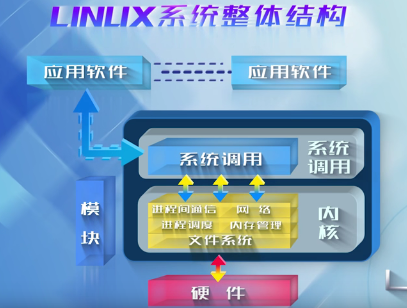
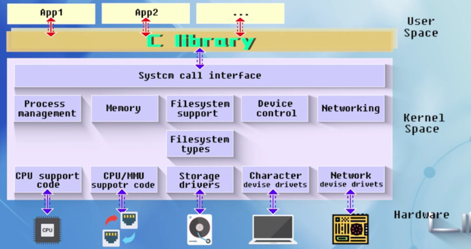
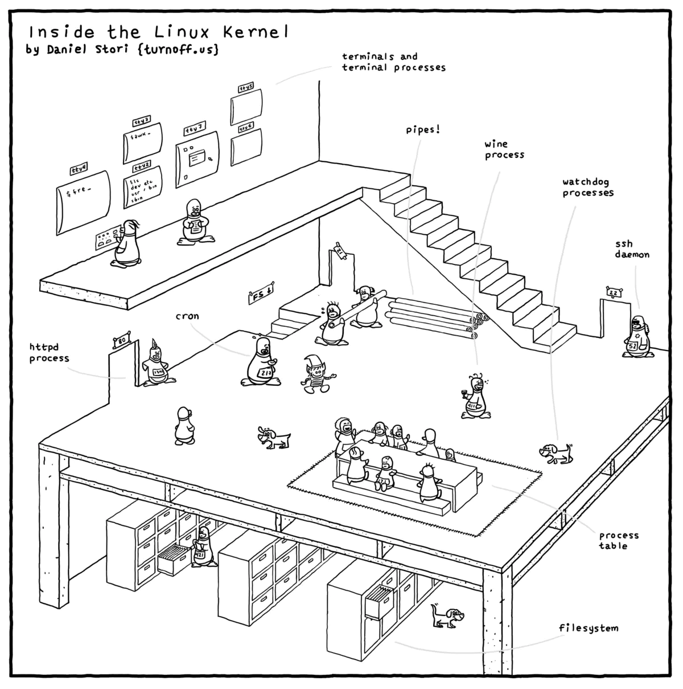
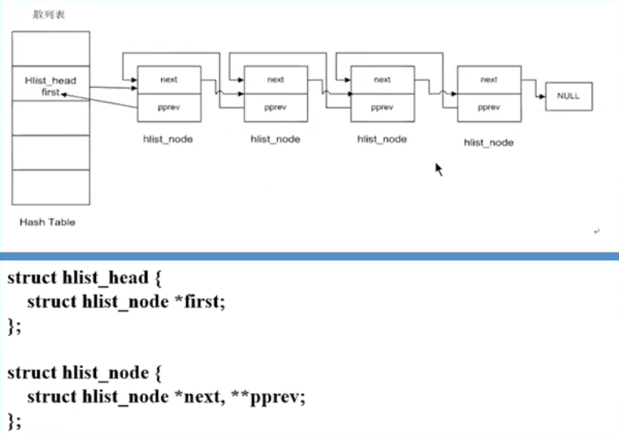

# Linux内设设计与实现

## 一、了解Linux

### 1.1 Linux操作系统概述

操作系统主要负责两件事情：

1. 对计算机上的软硬件资源进行管理；
2. 为用户提供服务。

其设计目标是：提高资源的利用率和方便用户的使用。从分层的角度上讲，Linux有着如下的结构：

Linux的核心设计理念是：**机制与策略分离**。机制指的是提供什么样的功能，是系统中不变的部分；而策略是如何使用这些功能，操作系统只负责如何实现这些功能，但用户用这些功能去干什么，它并不管。

其中系统调用的主要功能就是用来隔离变化，在用户的应用程序和内核之间起到一个接口的作用，因此我们说系统调用使用来实现机制与策略的隔离。

inside  the Linux kernel：

### 1.2 Linux内核结构

单内核和微内核之间的主要区别：

1. **单内核**：内核从整体上作为一个单独的大过程来实现，存放在一个单独的地址空间，内核内各个服务（IPC、网络、进程管理、内存管理等）之间可以以直接函数调用的方式来实现；
2. **微内核**：与单内核实现相反，只有核心的代码放在内核内，其他的功能（文件系统、内存管理等）被划分为多个独立的进程，以服务器的形式相互之间提供服务。

前者的优点就是性能比较高，但缺点是可维护性比较差；而后者与之相反，与“服务器”之间的关系是通信的关系，通信是有代价的，性能比较差。

实际中Linux就是一个典型的单内核，而其他很多的系统如windows就是微内核。不过Linux也吸收了很多微内核的精华，提供了一种“可加载的Linux内核模块（LKM）”的机制，它允许在Linux在需要的时候将模块加载到内核中，在不需要的时候将其卸载。

内核模块不是独立的可执行文件，但在运行时其目标文件被链接到内核中。只有超级用户才能加载和卸载内核模块。

### 1.3 内核链表list和哈希表hlist

Linux双链表list的实现可以查看https://gitee.com/xiebaoyou/linux-2.6.12/blob/master/include/linux/list.h，哈希链表的实现也在相同的位置。哈希链表的结构体类似于如下的样子：

至于书中介绍的