## 三、数据存储与查询

### 6. 数据存储架构

在先前的学习中我们主要了解什么是关系数据库、操纵关系数据库的SQL语言如何使用、以及如何合理地设计关系以及关系上的约束并保证在数据冗余最小的情况下方便数据的查询获取。这些内容都是数据库系统中逻辑层面的东西，我们可以认为它是数据库系统物理层向上提供的外在功能，而这里的物理层则负责实现这些功能的内在的逻辑并且保持透明，从而满足数据库管理者以及用户的需求。

从广义概念上讲，物理层就是整个DBMS，它应该包括1）查询计划Query Planning；2）操作执行Operator Execution；3）访问接口Access Methods；4）缓存池管理器Buffer Pool Manager；5）硬盘管理器Disk Manager等多个模块，用来帮助DBMS实现存储、查询、并发控制、恢复、分布式管理等多种功能。

由于大多数的数据库（在这里特指关系型数据库）最终的存储目的地一般是硬盘，特别是常见的磁盘，因此如何将关系型数据库中的数据存储到硬盘上的文件是一个非常重要的话题（或者说如何在硬盘上的文件中表示数据库），这也是DBMS中存储管理器Disk Manager最先需要解决的问题。这种DBMS也被称为**面向硬盘的DBMS**：在这个架构下数据主要存储在文件所对应的多个硬盘页上，并且通过**硬盘管理器**以一定的方式来进行记录的组织管理；当上层需要执行访问操作时**缓冲池管理器**就会按照一定的页面替换算法淘汰无效页面，然后将对应数据的页加载到内存的缓冲池当中，方便后续的**执行引擎**快速访问。


在本章中，主要介绍的就是上述DBMS数据存储功能：

- **存储引擎Disk Manger**：实现将关系型数据库中的数据存储在非易失性硬盘上；
- **缓冲区管理器Buffer Pool Manager**：实现将非易失性硬盘上的关系型数据库数据加载到内存中并进行缓存以避免频繁的硬盘访问，并按照一定的页面替换算法淘汰不需要的页面。


#### 6.1 文件组织

由于关系型数据库需要将数据（元组记录）保存在硬盘上的文件之中（一般的实现是一个关系对应一个文件），而在操作系统的层面上讲硬盘上的文件实际上是由多个物理页面page组成，它是存储分配和数据传输的基本单元，一般为4k或者8k等。因此，**如何将关系上的多个记录保存在文件之中本质上就是将这些元组记录保存在文件对应的多个物理页面page上并进行有效的组织管理问题**——这便是数据库的文件组织问题。因此硬盘管理器必须解决如下两个问题：

1. 如何在物理页面page上存放元组记录并方便后续的记录定位访问？（页面布局问题）
2. 如何设计元组记录的格式，使其能够被有效地读取并解释？（元组布局和数据表示问题）
3. 如何在实现元组记录的快速定位并记录物理页面的空闲情况？（记录组织及空闲空间管理问题）
4. 如何根据指定的条件或者主键等信息快速地确定相应元组记录的地址信息，方便后续这些记录的快速定位？（索引问题）


##### 6.1.1 页面布局

在文件所对应的物理页面上存储数据库中数据主要有两种方式：一种称为**面向日志结构Log-Structured**，即在文件所对应的所有页面中按照历史操作顺序记录数据插入、修改和删除等命令；另一种则称为**面向元组Tuple-Oriented**，即在文件所对应的数据页面中记录真正的元组记录，因此这种页面也被称为元组页面Tuple Page。在本文的页面布局中，我们主要讨论的是后者，而前者在一些日志型数据库中非常常见。

但无论哪种数据存储方式，在一个实际的物理页面中，其起始位置都会包含一个首部header字段，在这个header中主要记录如下内容：1）页面大小；2）校验和；3）DBMS版本；4）事务可见性；5）压缩信息以及6）页面中存储记录数量等信息，如下所示：

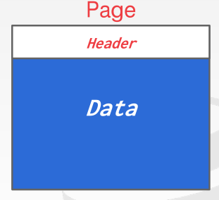

而页面中剩下的部分则全是数据部分，它用来存储数据库关系中的元组记录。元组存储在数据部分最简单的实现方法就是保持记录定长，然后依次插入，但显然这种方式对于删除中间位置元组以及删除元组后再插入等情况的处理会比较复杂（需要进行移动覆盖甚至跨页操作），同时它也无法有效存储具有可变长度属性字段的元组。因此在实际中我们更多的采用**槽页式Slotted Page结构**。在这种页面布局中，页面被分成了如下几个部分：

1. **起始处的首部字段Header**：其中会记录上面所述的各种信息，同时还会记录当前页面所保存元组的个数以及指向空闲空间末尾的指针；
2. **槽矩阵Slot Array**：该矩阵中的每一个槽会有一个指向元组的偏移量字段和保存该元组大小的长度字段，如果该槽实际没有指向任何元组，那么它的长度字段会被设置为-1；
3. **空闲空间Free Space**：该空间介于槽矩阵和实际元组存储区域之间，在新元组插入时槽矩阵和元组存储区域会向空闲空间中间拓展，如果空闲空间小于新插入数据所需的空间这说明当前页面已满；
4. **元组存储区域Tuple Data Area**：该区域存储实际的元组，比较特别的是它是从页面的末尾处开始放置，然后向空闲空间中间拓展。

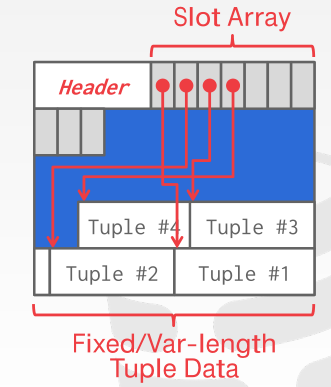

槽页式结构的好处在于它可以非常容易地解决元组删除和处理不定长元组存储等问题。例如中间位置的元组发生删除，那么槽页式就会将该元组对应槽slot的长度size字段设置为-1，表示该元组被删除，然后将该元组前面的所有有效元组向后移动，这样的页内元组移动成本非常低，最后更新所有剩下有效元组对应槽slot的偏移量信息以及首部header中的信息。至于这个被删除元组对应的废槽slot与其他槽之间是否会发生移动取决于具体的DBMS实现，有些DBMS会使用删除元组对应的槽slot后面的槽向前移动覆盖之，有另外一些则什么也不动，因为页面还记录着有效元组的长度信息，即使slot array中间位置上有无效的槽slot，我们也只要遍历判断跳过之就行了。

同时采用槽页式布局之后，我们就可以使用`page-id+slot-id`这一”虚拟地址“来快速地对元组记录进行定位，而不是直接记录元组的实际物理地址，这样每一次记录移动之后就不再需要更新索引等模块中的信息了。此时当我们想要根据某一信息访问指定的元组时，只需要先使用索引获取该记录的`page-id+tuple-id`，然后加载指定的页面，访问相应的槽位slot获取元组的偏移量和长度，最后读取这一元组，从而标准化这一流程。例如在postgresql中我们就可以用`ctid`属性打印出关系上每一条记录的虚拟地址：

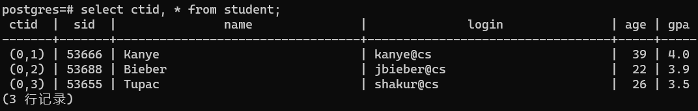

从上面的结果可以看出关系表student上的数据都放在ID为0的页上，其对应的槽位slot ID分别为0、1、2。如果我们将中间的一条记录进行删除，我们就可以发现其操作之后的槽矩阵slot array位置并没有发生改变，但中间位置的槽slot已经失效（至于元组存储区域中的数据是否发生了移动覆盖等操作这里不得而知，可能没有移动如果需要考虑并发的话）。


如果再向其插入一条新的数据，postgresql也不会复用原来的槽位，只是在后面的槽位继续占据一个新的位置，如下所示：


除非我们显式的使用`vacuum full`或其他命令对关系中的数据进行整理，那么上面所述记录的槽矩阵就会变得整齐：


##### 6.1.2 元组布局

在实现数据库关系数据在硬盘文件上的存储过程中，元组的格式或者布局与页面的布局一样都非常重要。不同的数据库实现对于元组的布局有着不同的思路，但无论如何，必须保证对于一个包含可变长度属性的元组记录而言，我们都能够从中较为容易地提取出各个字段的信息。一种思路是将元组分成如下两个部分进行存储：

1. **具有固定长度数据的部分**：将具有固定长度的可见性信息（用于并发控制）、记录空值NULL情况的位图、存储后面可变长度属性的起始偏移量和长度、定长属性字段数据存放于此，至于这些固定长度数据的存放顺序由数据库实现以及模式本身共同决定。
2. **具有可变长度数据的部分**：将具有可变长度的属性字段存放于此，并将各个可变长度字段的起始偏移量和长度信息存放在前面定长部分中。

<u>至于元组记录中包含哪些属性/字段（模式Schema），在一般的数据库中，元组本身并不存储</u>。因为这样会造成巨大的数据冗余，所以常规的实现是将这些数据存放在下一节介绍的数据字典中。如果需要将这些模式信息存储在当前元组或当前页中，那么我们称之为self-contained（自给型）元组或页。例如对于下表：

```sql
create table instructor (
    id varchar(32),
    name varchar(32),
    dept_name varchar(32),
    salary bigint,
    primary key(id)
);
```

其元组布局会按照"可变长度属性偏移量/长度、定长属性字段、空值位图、变长属性字段"的顺序进行存储：


其中空值NULL位图如果按照建表时的顺序某一位被置为1，那么就说明该属性字段的数据为空，相应存储在磁盘的元组数据部分也会被忽略。但这样可能会造成空间的浪费，因为如果salary属性字段实际为NULL，但页上的元组还是需要为其分配相应的空间，因此另外一些数据库实现可能采用了别的元组布局思路。一种设计思路是将元组分成如下两个部分进行存储：

1. **首部header**：非属性字段数据，包括用于并发控制的可见性信息、空值NULL位图、存储后面可变长度属性字段的起始偏移量和长度存放于此。
2. **数据区域data**：先将固定长度的属性字段存放在该部分的前面、然后存放可变长的属性字段。如果有一个字段为空值，那么该部分不存储任何数据，从而避免硬盘空间的浪费。

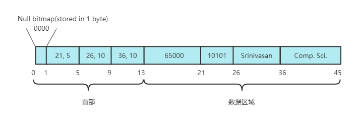

而有的数据库系统实现则更进一步，直接取消了上面首部中关于可变长属性字段的起始偏移量+长度的部分，直接将这部分的信息放置到可变长属性数据前面，在不影响可变长属性数据表示的同时节省了使用空间，而至于数据区域内容完全交给数据库实现按照模式进行解析。


当然不同的数据库实现可能拥有着不同的元组布局方案，且这些方案还需要结合下面的数据表示共同决定。


##### 6.1.3 数据表示

除了需要了解元组的布局方式之外，数据区域的数据表示也非常重要。数据表示决定了一种数据类型的实际存储方式，了解它们可以对建表时数据类型的选择有着更好的帮助，同时能够更好的理解内部的机理。对于各个数据类型的表示方式，主要有如下四种：

1. **表示方式与C/C++类型表示方法相同的数据类型**：包括INTEGER、BIGINT、SMALLINT、TINYINT；

2. **不精确/精确的浮点数/定点数数据类型**：不精确的浮点数包括FLOAT、REAL、DOUBLE，而精确的可任意精度的定点数值类型包括NUMERIC、DECIMAL。其中浮点数遵从IEEE-754标准，这与C/C++的表示方式相同，它们最大的好处就在于原生的由CPU指令支持，运算的速度非常快，但计算可能不精确，尤其舍入错误，如下图：

    

    显然这些数值类型是非常不适合于金融等数值敏感领域的数据存储工作，此时我们可以使用定点值类型来完成这一任务。它主要的实现原理就是将数值以人类可读的方式保存在类似于varchar的数据结构中，然后通过一些元数据来记录相应的小数点位置、精度范围、四舍五入信息，同时实现者自己编写相应的运算代码保证计算的准确性，当然这也意味着运算效率的下降。上述的数据都会封装到一个特定的数据结构中，例如在postgresql中，其结构如下：

    

3. **可变长数据类型或大对象类型**：包括VARCHAR、VARBINARY、TEXT、BLOB等。由于这些数据类型能够存储的数据长度可以非常大，而大多数的数据库管理系统DBMS并不允许单个元组的长度超过一个页的大小（至于这个边界标准不同的实现各不相同），因此我们需要采用一些方法来避免这种情况的发生。一种最为常见的方法就是溢出页Overflow Page：使用另外一个页来存储实际的数据，然后在当前的元组相应的属性字段存储一个指向之的指针。如果数据无法使用单独一个页存储，那么我们可以使用多个页来记录，并在各个页的header中存储一个指向下一个数据页的指针进行串链，同时属性字段的指针指向首个数据页，如下图所示：

    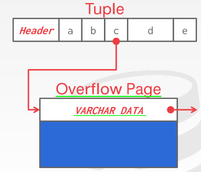

    还有一种比较少采用的额外文件External File方法：即直接创建一个文件记录该数据字段中的数据，一般适合于像BLOB这样的数据类型使用，如下图所示。不过这样方法必须考虑文件的安全性，因为外部用户可以直接通过文件系统修改这个文件。

    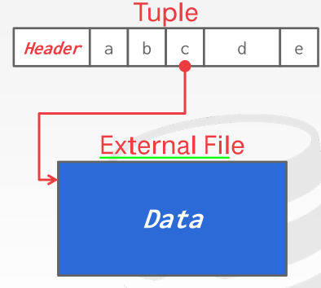

4. **日期时间类型**：它们一般实际保存的是32/64位整数记录从1970年1月1日起的微秒数，这些数据类型包括TIME、DATE、TIMESTAMP。


##### 6.1.4 记录的组织方式

在前面的内容中我们主要介绍了我们如何在一个文件结构中表示元组记录，包括一个元组本身的布局以及其在作为文件最基础组成单元的页/块内部的组成布局。但并没有告诉我们①一个记录应该放置在哪个页；②记录应该在多个页中如何进行组织管理以及③如何实现对文件中空闲页的管理，这些问题被称为**文件中记录的组织方式问题**。因为一旦记录得到了有效的组织，那么一个元组记录应该放置到哪个页是有迹可循的；同时由于不同记录可能存放在不同的页中，因此我们需要对这些页进行管理，使得硬盘管理器能够高效地知道文件中页面的使用情况，从而方便我们实现在给定“虚拟地址”的情况下对元组的快速定位以及元组插入删除操作。常见的文件中组织记录的方式主要有如下几种：

**（1）堆文件组织Heap File Organization方法**

在这种记录组织方法中，一个记录可以放置在文件中的任意页面内（只要这个页面有足够的空间），且记录之间没有顺序可言。这样的好处在于元组的删除、插入储存等操作非常方便，开销非常小。由于记录的存放非常随意，因此我们必须使用一些特定的手段来跟踪各个页面的使用情况。一种常用的方法就是使用**空闲链表**将各个空闲页面进行串链，每一个页面的header内放置一个指向下一个空闲页面的指针，当需要插入一个新的元组记录时，DBMS就会顺序扫描空闲链表直到找到合适的页面为止，如下图所示：


但实际上这种方法并不好用，大多数的数据库实现主要使用**空闲空间图Free-Space Map**的方式来追踪页面的空闲情况。该空闲空间图实际上也是一个数组，其存储在另外一个文件（或者同一个文件的额外页）上，其每一个条目反映了相应数据页上的空闲空间百分比情况。如果一个条目大小为$n$比特，上面所记录的数值为$m(0\leq{m}\leq{2^n-1})$，则条目表示其所对应的数据页至少有$m/2^n$的空间是空闲的。此时数据库关系对应的文件组织结构如下（其中的Directory就是我们所述的空闲空间图）：


此时我们当我们需要向关系中插入新的元组时，只需要扫描一遍空闲空间图，找到一个可用的页面获取编号然后直接访问对应的页面即可，减少了如空闲空间链表那样的多页面访问开销。有时如果关系所对应的数据页太多，进而导致空闲空间图中条目数量增加，从而造成扫描空闲空间图的效率低下。为了解决这个问题，我们可以使用**多级空闲空间图**的方案，即在一级空闲空间图中使用条目记录下一级空闲空间图中多个条目上的最大空闲空间比，从而实现跨越原先单级多个条目的快速扫描。下图就展示了一个一级条目对应4个二级条目的多级空闲空间图结构：


同时DBMS的实现也必须保证在每一次写入/修改操作之后，数据页的信息和空闲空间图之间得到同步，不过每一次更新空闲空间图条目就将其页面刷入硬盘的代价非常昂贵，大多数的处理手段是进行周期性的更新配以其他的措施。

**（2）顺序/有序文件组织Sequential/Sorted File Organization方法**

在这种记录组织方法中，记录会按照指定的搜索键顺序进行排列存储，从而方便特定场景下用户需要顺序访问数据的用途。其中搜索键Search Key指定的是关系中一个或多个属性字段组成的集合，它不一定要符合超键的要求。在实现时，DBMS不仅会按照搜索键的顺序尽可能将元组记录顺序存储，而且为了严格的保证记录的顺序性，还会在元组记录中加入一个指针字段用来指向符合搜索键顺序要求的下一条记录。

因此使用这种记录组织方法会使得记录的读取非常方便，尤其是顺序读取多条记录的情况下。但缺点在于它对于记录的插入和删除非常不方便：频繁的记录可能会造成过多的记录存放在溢出页的现象，导致记录的实际顺序不再与物理顺序一致；而频繁的记录删除则会导致数据在页面上的存储稀疏化、空洞化，从而使得空间利用率不高。在顺序文件组织方法中，元组的删除非常方便，只需要定位到其前驱记录，然后将它的指针指向待删除记录的后继记录即可。而对于元组的插入则会按照如下的规则执行：

1. 在文件中按照搜索键定位到插入记录之前的那条记录；
2. 如果该记录所在的块中有一个足够的空闲空间（例如删除旧有的记录所留下的），就在这里插入新的记录。否则，将新的记录插入到一个溢出页Overflow Page中，然后调整前驱记录的指针和插入记录的指针指向后继记录。


在正常的情况（读多写少）下，溢出页中的记录不会特别多，那么此时该种文件组织方案还算差强人意，但若其中的记录量一多，那么记录的搜索键顺序和物理顺序的一致性就会完全丧失。因此DBMS就不得不在系统负载较低的情况下使用重组reorganized技术来对记录进行重新整理。

从上面的内容可以看出顺序文件组织方法提供了一种有限形式上的记录顺序性（正是由于此使得诸如堆文件组织方法中的页面空闲空间管理对它是没有意义的），方便数据的顺序访问，且元组的插入/删除机制（将元组放置到哪个页面的规则）非常简单，但也很容易造成数据的内部空洞（类似碎片化）以及过多记录插入到溢出页导致失去了物理顺序与记录顺序一致性的天然优势。因此这种方案更适合于那些读多写少、或者数据量较少的嵌入式数据库实现。

**（3）多表聚类文件组织Multitable Clustering File Organization方法**

在大多数的文件组织方式中，一个文件只能存储一个关系。但实际上，让一个文件能够存储多个关系有时候是有用的，尤其是对于那些经常需要频繁执行连接操作的两个或多个表而言，将这些表当中相关联的记录存储在相邻的物理区域可以减少在联结join时所付出的I/O量。例如对于如下的两个关系，其中一个关系`bar`中某个属性`bar.a`外键参照于另一个关系`foo`的主键`foo.a`：

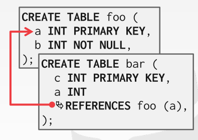

正常情况下普通的DBMS对它们的处理应该是将这两个表分别存储在两个不同的文件中，但是如果它们经常需要联结，且两个文件下的联结操作负担太重的情况下，使用多表聚类文件组织方式可能是一种更好的解决方案。此时，多表聚类文件组织会采用**反规范化denormalize元组布局**来重新组织两个或多个表中相关联的元组，使不同表之间中不同的元组组合成唯一一种元组布局（预联结），并且一般的实现会删除冗余的外键信息，如下：

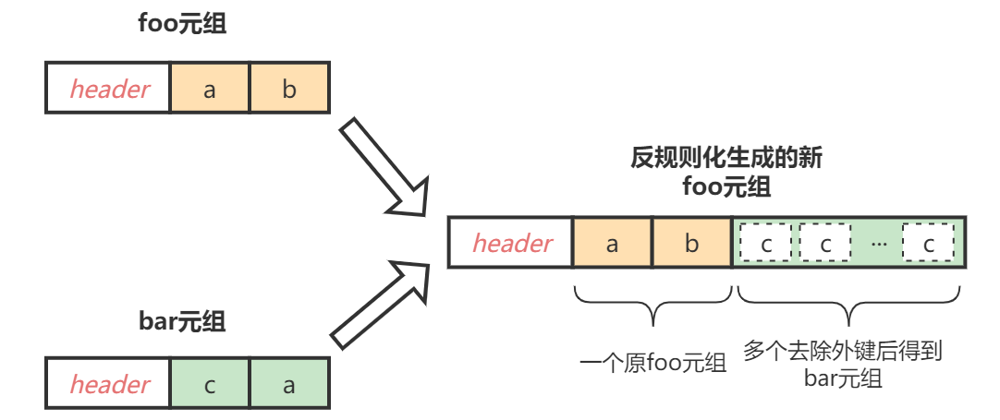

在foo、bar的例子中，所有与foo的主键相关的bar记录会去除外键属性后附加到该foo元组之后，从而形成新的foo元组，从而实现在一个块中存储两个关系上元组的目的。至于，附加的bar元组是否会去掉外键属性完全取决于DBMS的实现，大多数系统会选择去除，这样可以减少存储冗余。而合并之后的记录在文件的组织方式完全可以参照别的记录组织方式进行选择，可以选择堆文件组织方式，也可以使用顺序文件组织方式，都可以。

当然，多表聚类文件组织方式的使用完全取决于特定的使用场景，如果两个表之间经常需要执行`join`操作，那么该组织方式非常有用。但如果联结操作并不频繁，更多的是普通的单表访问操作，那么这样方案的效率非常低。例如在foo、bar例子中要求输出所有的foo元组，它相比于普通的文件组织方式读取更多的物理页面并且其中的大多数信息DBMS基本用不到：

```sql
select * from foo;
```

**（4）B+树文件组织B+-Tree File Organization方法**

虽然上面的顺序文件组织方法能够为数据库提供了有序性支持，即使存在可能改变记录顺序的插入、删除和更新操作。然而，面对大量此类操作，有序访问的效率会受到严重的影响。而B+树文件组织方法则不同，即使存在大量的记录修改操作，它仍然还能够提供对记录的高效访问能力，同时它还支持基于搜索键实现对特定记录的快速访问。它与后续章节中的B+索引结构有着密切的关联。

**（5）哈希文件组织Hashing File Organization方法**

在这种记录组织方法中，每条记录中的某个属性会被散列函数计算得到一个散列值用来指定将该记录存放在文件中的哪一个块中。它与后续章节中的哈希索引结构有着密切的关联。


#### 6.4 数据字典存储

在前面的内容中我们介绍了如何在文件系统中实现对关系的存储，包括元组布局的表示、元组在文件基本单元块/页上的布局，以及记录在文件中的组织方式，但始终没有告知元组中到底有哪些属性，这些属性的名字是什么，所采用的索引是什么。而这些内容就是关系的元数据meta data，这些元数据本身也存储在数据库中的特定关系中，且这些关系是数据库安装之后一开始就存在的，它们被称为**数据字典Data Dictionary**（或**系统目录System Catalog**）。一般，数据字段主要会记录如下几个元数据：

1. 关于关系本身的元数据：包括关系的名字，关系上的属性名、类型、长度，完整性约束等；
2. 关于用户的信息：包括授权用户的名字，账户信息，用户的密码等；
3. 关于关系的统计数据和描述数据：包括关系的元组总数，每个关系所使用的存储方式等；
4. 关于关系的存储组织和每个关系所存储的位置；
5. 关于每个关系上索引的信息：包括索引的名字，构造索引的属性等。

例如我们可以在MySQL的`information_schema`、`performance_schema`和`mysql`等数据库中查看到这些元数据。

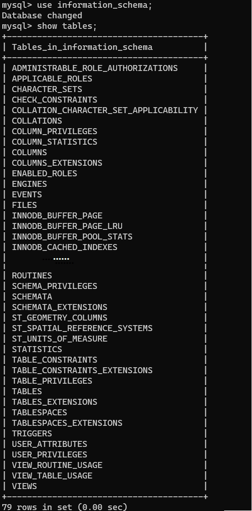

至于数据字典这些关系自身的元数据则是存储在其他地方，一般的方式是将其内嵌在代码段、程序的全局数据区之中。使用这样的元数据存储方式的好处在于管理起来会非常方便。


#### 6.5 数据存储模型

事实上，关系模型并没有规定必须将元组的所有属性存储在一个页面中。<u>针对不同的业务类型，DBMS可以采用不同的数据存储模型来将同一个元组的不同字段存储在同一个页面或者不同的页面中，以实现在不同使用场景下的性能最优化</u>。在数据库业务中，主要如下三种最典型的业务：

- **在线事务处理（On-line Transaction Processing，OLTP）**：这是我们在建表初期最常用的业务类型，它主要指的是那些读取/更新与数据库中单个实体/关系相关的少量数据的简单查询，包括读取、删除、更新符合指定条件的元组。在这个业务中，处理的基本单元实际上是关系中的行。

    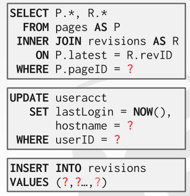

- **在线分析处理（On-line Analytical Processing，OLAP）**：这实际上是我们最常见的一种业务处理，它主要指的是那些需要读取跨越多个实体/关系并且扫描大部分内容的复杂查询。在这种业务中，处理的最基本单元实际上是整个关系中的某些列/属性，而不是完整的行。

    

- **混合事务分析处理（Hybrid Transactional + Analytical Processing，HTAP）**：它实际上上述两种业务类型的混合，即两种业务场景兼而有之。

我们可以将上述的业务类型根据其特点绘制成如下图展示：


##### 6.5.1 面向行的存储模型

面向行的存储模型（Row-Oriented Storage Model）也被称为N元存储模型（N-Ary Storage Model，NSM），也是大多数数据库的默认设定。在这种存储模型下，DBMS会将元组的所有属性字段连续的存储在同一个页面中。因为每一次的数据访问都需要将元组整个行从硬盘中读取出来，所以非常适合以OLTP为代表的基于”行“为作业单位的业务使用。例如下面的`select`简单查询：

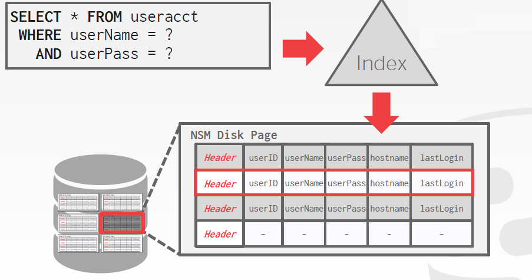

但是对于OLAP业务而言，这种存储模型的效率就显得有点低下。因为在OLAP为代表的业务中，DBMS更多的是访问元组中的部分属性而不是所有字段，甚至其他字段根本没有访问的必要，因此如果将整个行加载内存中就会造成大量的空间、时间上的浪费。例如下面的复杂`select `查询：

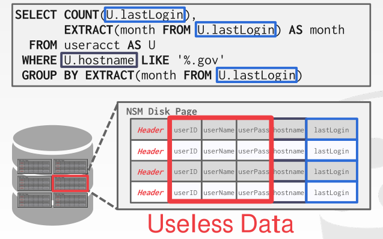

此时采用面向列的存储模型可能是更好的选择。


##### 6.5.2 面向列的存储模型

面向列的存储模型（Column-Oriented Storage Model）也被称为分解存储模型（Decomposition Storage Model，DSM）。在这种存储模型中，DBMS会将元组的各个属性分别单独连续的存储在属于各自的页面中。因为它可以方便的读取到所有元组的某个特定属性而不需要将其他属性一同加载到内存中，因此它非常适合像OLAP这种不需要牵涉整个元组的复杂查询使用。例如上面同一个复杂`select`查询：


不过与面向行的存储模型相反，面向列的存储模型在面对在需要针对基于“行”处理的OLTP任务时就十分低效，包括使用“列”数据重建“行”、元组删除/更新以及解压时都显得非常不友好。同时为了解决某些属性值同属一个元组的共识问题，该模型必须对分布在不同页面上的属性值进行编号，常见的方案有如下两种：

1. **规定长度偏移法**：要求每一个属性具有相同的长度，这样方便使用$i\times{lenOfAttr}$的方式找到一个属性同属一个元组的其他字段。但这样也在一定程度上限制了字段的灵活性。
2. **内嵌元组编号法**：要求在所有元组的所有字段值前面前置一个元组编号，这样也就可以明确知道属性值是属于哪一个元组的。但这样可能造成一定程度上存储空间的浪费，至于字段本身实际上可以通过索引->虚拟地址快速定位。


#### 6.6 ==数据库缓冲==

- Buffer Pool Manager

    1. Buffer Pool Organization
    2. Buffer Pool Meta-Data
    3. Allocation Policies
    4. Buffer Pool Optimizations: Multiple Buffer Pools（多缓冲池策略）、Pre-Fetching（预取）、Scan Sharing（扫描共享）、Buffer Pool Bypass
- Buffer Replacement Policies
    1. LRU
    2. Clock
    3. LRU-K


> #### 6.5 日志记录
>
> 这里可以提一下日志-结构文件组织Log-Structured File Organization。这种文件组织方式并不是将所有的元组都存在磁盘Page中，而是去存储那些如何创建元组以及修改元组的相关信息（命令）。在这情况下我们只需要在页面中追加日志记录，一般的保存形式就是文本，不需要在删除的时候回溯到前面的记录中。这种方式充分地利用了硬盘在顺序写入/读取/访问地情况下速度远远大于随机访问速度的特性，使得其在元组进行更新/删除/写入的时候永远只需要在一个页面或者紧挨着的页面追加新的日志即可完成任务，而对于使用传统文件组织的数据库而言这些操作可能需要访问多个不连续的页面。上述日志文件组织结构如下图所示：
>
> 
>
> 但这种文件组织方式的最大缺点在于数据读取非常麻烦。为了读取一个元组，DBMS必须从后向前扫描整个日志，知道它长什么样以及最终的结果。当然我们也可以采取一些特殊的手段来加快元组的访问，例如通过引入索引的方式以此方便DBMS快速地跳到指定的偏移量位置找到我们想要的数据，或者在空闲的时刻重建整个日志记录对里面的内容进行筛选压缩，使得对于每一个元组只有一条记录对应之。


### 7. 索引与散列

