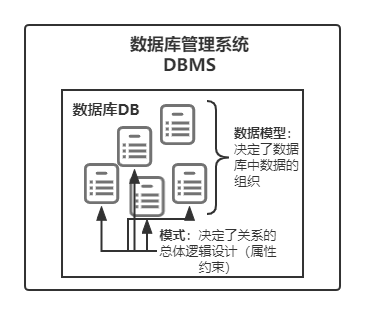
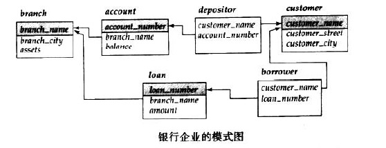
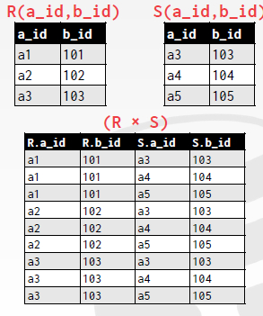
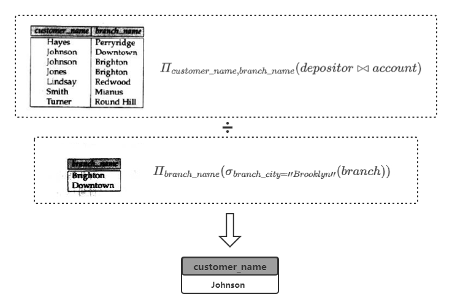

# 数据库系统概念

相关资料推荐：

1. 书籍《数据库系统概念》
2. 视频《CMU数据库系统入门 15-445》[知乎大佬放出的翻译版本](https://www.zhihu.com/people/chihiro2014/zvideos?page=2)和[知秋的翻译版本](https://www.bilibili.com/video/BV1f7411z7dw?from=search&seid=13836230911142310012&spm_id_from=333.337.0.0)。
3. [CMU 15-445课程主页](https://15445.courses.cs.cmu.edu/fall2019/)

推荐阅读章节（基于《数据库系统概念(第五版)》）：

1. 第一部分（**关系数据库**）：第2章 关系模型；第3章 SQL；第4章 高级SQL
2. 第二部分（**数据库设计**）：第6章 数据库设计和E-R模型；第7章 关系数据库设计
3. 第四部分（**数据存储和查询**）：第11章 存储和文件结构；第12章 索引和散列；第13章 查询处理；第14章 查询优化
4. 第五部分（**事务管理**）：第15章 事务；第16章 并发控制；第17章 恢复系统
5. 第六部分（**系统体系结构**）：第20章 数据库系统体系结构；第21章 并行数据库；第22章 分布式数据库。

## 一、关系数据库

### 1. 关系模型

在了解关系数据库之前我们必须知道一些概念，包括数据库管理系统DBMS、数据库、数据库模型以及数据库模式，我们也可以通过下图来粗略地了解它们的大致关系。其中：

- **数据库管理系统**（database manage system）指的是用于管理、存储和分析具有相互关联的数据集合的应用程序。设计数据库管理系统DBMS的目的是为了能够使得我们更好地实现对数据库的定义、创建、查询、升级以及管理，从而能够针对不断变化的数据检索需求做出更为通用、快速的反应。当然这样的管理系统也必须面对各种各样的问题，包括数据孤立问题、数据完整性问题、原子性问题、并发访问异常问题以及安全性等问题，如何实现数据库管理系统DBMS并对上述问题加以解决是本文所讨论的主要话题。
- **数据库**（database）指的就是上述数据库管理系统DBMS所管理的数据集合。虽然本文的课题是数据库，但实际上我们围绕的主要还是数据库管理系统DBMS（而且在实际生活中我们接触的“数据库”实际上正是数据库管理系统DBMS）。而进一步，数据库结构的基础为数据模型。
- **数据模型**（data model）是一个用来描述数据库中的数据、数据间联系、数据语义以及一致性约束的概念集合。换句话说，数据模型决定了我们如何组织数据。常见的数据模型包括关系模型、K-V模型、图模型、文档模型、向量/矩阵模型、层次模型和网络模型等。
- **模式**（schema）指的是在给定数据模型的条件下对特定数据集合的描述，它给出了数据库和数据内容的布局及特性的信息。具体的在关系数据库中它指的就是关系的总体逻辑设计，决定了关系（表）中有哪些属性以及相关的约束（关系中该定义些什么，它们的内容是什么，类型又是什么）。

#### 1.1 关系数据库的结构

**关系数据模型**（relational data model）是IBM科学家Ted Codd于1970年所提出的一种数据模型，也是当前市场主流的选择。其所提出的关系（relation）概念与数学上的概念基本相符，被定义为一系列域（属性所能取的所有值形成的集合）上笛卡尔积的子集。而实际上，关系就是表；而关系中的最小单元称为元组，也就是表中的行。因此可知，**关系就是元组的无序集合**（虽然概念上集合要求不能存在重复的元组，但在实际的实现中并不如此）**，而关系数据库就是关系（表）的集合。**

由于**关系模式**（relation schema）是关系的总体逻辑设计，一般由属性序列以及各属性的对应域组成。因此关系模式常被以如下形式进行表示（大写）：
$$
Schema=(\underline{field1},field2,...,fieldN)
$$
其中括号内的就是关系中所含有的属性字段名。而基于此模式构建的关系则被以如下形式表示（小写）：
$$
relation(Schema)
$$

**（1）键**

键（key）是关系中一个或多个属性的集合，但在这里我们主要讨论的是超键、候选键、主键这些概念（因为它们是关系中最为重要的属性，对于表所描述数据的刻画非常重要）：

1. 其中超键（superkey）可以帮助我们在关系中唯一地标识一个元组。例如在customer表中，customer\_id和customer\_id+customer_name都是超键，因为任何一个元组的customer\_id一定是唯一的。显然，如果一个键是超键，那么它的任意超集都是超键。
2. 若一个超键的任意真子集都不是超键，那么这样的超键就称为候选键（candidate key）。
3. 若一个候选键被数据库设计者选中作为区分关系中不同元组，那么这样的候选键就称为主键（primary key）。主键也是我们数据库用户/设计者最常接触的超键。在上面的模式表达式中那个加了下划线的属性就是主键。

除此之外，我们还有一个外键的概念。如果一个关系模式$r_1$在它的属性中包含了另一个关系模式$r_2$的主键，那么这个属性就被称为<u>$r_1$参照$r_2$的外键</u>（foreign key）。外键是一种属性约束（实际中不常用），它可以防止关系中添加不符合外键约束的元组（例如在$r_1$中添加元组的外键取值不在$r_2$主键域中）。我们可以通过模式图非常方便的展示关系与关系之间的外键参照关系：

#### 1.2 关系代数

关系代数是Ted Codd在提出关系数据模型时一同给出的数学语言，它以过程化的方式描述对关系上的元组的提取和操纵（或者说它定义了在关系数据库上处理查询的原语）。这些操作主要包括基本运算、附加运算和拓展运算三种。区别在于1）*<u>基本运算</u>*是Ted Codd在原论文中提出的一些运算，用来表达最基本的关系代数查询功能；而2）*<u>附加运算</u>*的提出是用来简化基本运算表达式，它不能增加关系代数的表达能力；而3）*<u>拓展运算</u>*是代数运算功能上的拓展，它不仅提高了关系代数的表达能力还提供了更强大的功能。需要注意的是：关系进行关系代数运算之后的结果仍然是关系，这也意味着关系运算可以进行组合使用。

##### 1.2.1 基本运算操作

1. **选择**（select）运算

选择运算选出满足给定谓词的元组集合（即新关系）。可用如下符号表示，其中下标内的就是谓词，且我们可以使用与否非组合多个谓词：
$$
\sigma_{field_i=some\_value}(r)
$$

1. **投影**（project）运算

投影运算返回作为参数的关系中的部分属性组成的新关系。可用如下符号表示，其中下标内的就是选定的属性字段：
$$
\varPi_{field_i,field_{i+1},...field_n}(r)
$$

3. **并**（union）、**交**（intersection）以及**差**（difference）运算

关系的并、交以及差用如下符号进行表示，其中关系r集合差关系s表示找出那些在关系r中但不在关系s中的元组，并将这些元组集合作为结果关系：
$$
r \cup s \\
r \cap s \\
r - s
$$

4. **笛卡尔积**（Cartesian-product）

笛卡尔积运算也称为叉积，用来创建包含两个输入关系所有可能组合的新关系，可用如下符号表示并以如下图进行演示：
$$
r\times{s}
$$

5. **更名**（rename）运算

有时候我们想对关系运算产生的临时关系进行引用，但它没有一个具体的名字，那么此时我们就可以使用更名操作为其赋名。可用如下符号表示，其中$x$表示该临时关系的新名字，下标括号内的为给该临时关系中各个属性字段取得新名字（也可省略）：
$$
\rho_{x(A_1,A_2,...,A_n)}(r) 1.2.2 附加运算操作
$$

##### 1.2.2 附加运算操作

1. **自然连接**（natural join）

在实际的数据库查询过程中，在两个关系之间的笛卡尔积的基础上进行选择运算是非常常见的，因此为了简化这一查询运算，科学家提出了自然连接运算。

自然连接是一个二元运算，它可以使得我们将某些选择和笛卡尔积运算合并成一个运算，用符号$\Join$表示。自然连接运算首先会形成两个入参关系的笛卡尔积，然后基于两个关系模式中都出现的属性上的相等性进行选择，最后去除结果的重复属性。我们可以给出如下的形式化定义：

设$r(R)$和$s(S)$是两个关系，$r$和$s$的自然连接表示为$r\Join{s}$，是模式$R\cup{S}$上的一个关系，其形式化定义为：

$$
r\Join{s}=\varPi_{R\cup{S}}(\sigma_{r.A_1=s.A_1\bigwedge{r.A_2=s.A_2}\bigwedge{...}\bigwedge{r.A_3=s.A_3}}(r\times{s})))\\
其中R\cap{S}=\{A_1,A_2,...,A_n\}
$$
例如我们想在两个表borrower和loan中找出“所有在银行中有贷款的客户名字以及贷款金额”，就可以使用如下的关系表达式表示：
$$
\varPi_{customer\_name,\ amount}(\sigma_{borrower.loan\_number=loan.loan\_number}(borrower\times{loan}))\\
=\varPi_{customer\_name,\ amount}(borrower\Join{loan})
$$

2. **除**（division）运算

除法运算的理解有一点难，它主要适用于短语“对所有的”的查询，可以用符号$\div$表示。为了概念的具象化，我们可以从问题“找出在Brooklyn的所有支行都有账户的的客户名”，为了得到这个答案，我们必须找出在布鲁克林的所有支行名（关系a），然后列出所有客户所使用的支行名（关系b），如果某一个客户所使用的支行名组成的集合包含上述所有的支行名，那么这个客户就是符合问题要求的一个答案。而$b\div{a}$正是上述问题的解答，我们可以用如下运算表达式表示（结果如下图）：
$$
b\div{a}=\varPi_{customer\_name,branch\_name}(depositor\Join{account})\\
\div{\varPi_{branch\_name}(\sigma_{branch\_city="Brooklyn"}(branch))}
$$

我们可以看到在代数除法中，作为除数的关系中的属性消去了被除数与之相同的属性，而作为被除数的关系剩下的属性值所对应的被消属性的取值集合一定是包含作为除数属性的取值集合，因此上述运算得到的结果客户名就是那些“在Brooklyn的所有支行都有账户的的客户名”。因此我们可以对上述代数出发给出如下的形式化定义：

设$r(R)$和$s(S)$是两个关系，且模式$S\subseteq{R}$，即除数关系模式$S$的每个属性都在被除数关系模式$R$中。关系$r\div{s}$是模式$R-S$上的关系，即除法结果模式中包含所有在被除数模式$R$中但不在除数模式$S$中的属性，则除法就是如下表达式的简化：
$$
r\div{s}=\varPi_{R-S}(r)-\varPi_{R-S}((\varPi_{R-S}(r)\times{s})-\varPi_{R-S,S}(r))
$$
其中上式$\varPi_{R-S}((\varPi_{R-S}(r)\times{s})-\varPi_{R-S,S}(r))$视图在找出“不是所有满足指定条件的”属性值结果关系。

3. **赋值**（assignment）运算

赋值运算主要是用来解决临时关系变量定义的问题，可以用如下的符号表示：
$$
temp1\gets{E}
$$

##### 1.2.3 拓展运算操作

1. **广义投影**（generalized-projection）运算

广义投影运算允许在原先的投影列表中使用算数运算符来改变投影属性上的值，从而实现功能拓展。它可以用如下的表达式表示：
$$
\varPi_{F_1,F_2,...,F_n}(E)
$$
其中$E$是关系代数表达式，$F_i$是作用在属性i上涉及常量以及属性的表达式。例如我们想统计班级里学生的文科总成绩，可用运算表达式$\varPi_{studnet\_name,\ chinese\_score+english\_score\ as \ total\_score}(class)$计算。

2. **聚集函数**（aggregate function）

如果我们想对输入的一个关系以单个值作为结果返回，例如统计某一个属性的平均值avg、最大值max、最小值min、总和sum或者元组计数count，那么我们就可以使用聚集函数。对于这样一般性的要求，我们可以将聚集函数以如下形式化定义表示：
$$
\mathcal{G}_{F_1(A_1),F_2(A_2),...,F_n(A_n)}(E)
$$
其中$E$表示关系代数表达式，$F_i$是第i个聚集函数，$A_i$是关系运算表达式中的第i个属性。分组后，同一个组的$G_1,G_2,...,G_n$相同，但不同组的$G_1,G_2,...,G_n$不同。例如我们想要统计班级学生的平均成绩、最高成绩以及最低成绩，那么可以用表达式$\mathcal{G}_{avg(score),max(score),min(score)}(class)$来计算这一结果。

但是有时候我们并不是想对整个关系进行聚集计算，而是想先对关系中的元组进行分组，然后对每一个组再进行聚集计算，例如想对班级中的男生女生分别统计平均、最高、最低成绩，那么我们就可以使用带分组功能的一般性聚集运算来解决上述的问题，其可用如下形式化定义表示：
$$
_{G_1,G_2,...,G_n}\ \mathcal{G}_{F_1(A_1),F_2(A_2),...,F_m(A_m)}(E)
$$
其中$G_1,G_2,...,G_n$表示用于分组的属性组合。此时，上述男女学生的成绩统计可以通过运算表达式$_{gender}\mathcal{G}_{avg(score),max(score),min(score)}(class)$来进行计算。

3. **外连接**（outer join）

外连接是连接运算的拓展，它可以用来弥补（内）连接运算因两个关系之间指定共有属性值不匹配造成的信息缺失问题。其有三种形式：左外连接，用⟕表示；右外连接，用⟖表示；全外连接，用⟗表示（这几个符号非拓展latex打不出来）。这几个外连接都在计算自然连接的基础上，补充一些额外的元组，只不过补充的额外元组不同（不过在SQL中的规定是加在内连接结果上）。其中：

- 左外连接（left outer join）取出左侧关系中所有与右侧关系的任一元组都不匹配的元组，用空值null填充所有来自右侧关系的属性，再把产生的元组加到自然连接（SQL中为内连接）的结果上。

- 右外连接（right outer join）与左外连接相对称：用空值null填充来自右侧关系的所有与左侧关系的任一元组都不匹配的元组，将结果加载自然连接（在SQL中为内连接）的结果上。

- 全外连接（full outer join）完成左外连接和右外连接运算，既填充左侧关系中与右侧关系的任一元组都不匹配的元组，又填充右侧关系中与左侧关系的任一元组都不匹配的元组，并把结果都加到自然连接（在SQL中为内连接）的结果上。我们可以用如下形式化定义表示：
  $$
  (r\Join{s})\cup((r-\varPi_R(r\Join{s}))\times\{(null,...,null)\})
  \cup(\{(null,...,null)\}\times(s-\varPi_R(r\Join{s})))
  $$
  其中$((r-\varPi_R(r\Join{s}))\times\{(null,...,null)\})$表示与右侧关系任一元组都不匹配的元组用空值null填充所有来自右侧关系属性产生的元组集合（关系），$(\{(null,...,null)\}\times(s-\varPi_R(r\Join{s})))$则正好与对称。

#### 1.3 数据库的更新

在关系代数中，我们都是通过赋值运算符来表达数据库的更新，这与编程语言的做法相类似。

1. 对于（关系中部分或全部元组的）删除操作，我们通过如下的表达式表示：
   $$
   r\gets{r-E}
   $$

2. 对于关系的若干元组插入操作，我们通过如下的表达式表示：
   $$
   r\gets{r\cup{E}}
   $$

3. 

3. 对于关系中若干元组的更新操作，可用表达式来表示：
   $$
   r\gets{(r-\sigma_P(r))\cup\varPi_{F_1,F_2,...,F_n}(\sigma_P(r))}
   $$
   其中$(r-\sigma_P(r))$不需要参加更新操作的元组集合，关系投影$\varPi_{F_1,F_2,...,F_n}(\sigma_P(r))$指的是需要参加更新操作的元组集合，$F_i$表示针对关系中第i个属性的设置$r$和常量的表达式。

### 2. SQL

#### 2.1 数据定义

#### 2.2 SQL查询的基本结构

 

#### 2.3 集合运算和聚集函数

##### 2.3.1 集合运算

##### 2.3.2 聚合函数

##### 2.3.3 窗口函数

#### 2.5 子查询和视图

##### 2.5.1 嵌套子查询

##### 2.5.2 复杂查询

##### 2.5.3 视图

#### 2.6 连接关系

##### 2.6.1 连接类型和条件

#### 2.7 数据库修改

### 3. 高级SQL

#### 3.1 SQL数据类型

#### 3.2 完整性约束

#### 3.3 授权

##### 3.3.1 权限的授予

##### 3.3.2 角色

##### 3.3.3 权限的撤回

#### 3.4 动态SQL

#### 3.5 函数和过程化结构

#### 3.6 触发器

#### 3.7 其他高级用法

## 二、数据库设计

### 4. 数据库设计和E-R模型

#### 4.1 实体-联系模型

#### 4.2 E-R模型约束

#### 4.3 实体-联系图

#### 4.4 实体-联系设计问题

#### 4.5 弱实体集

#### 4.6 扩展E-R特性

#### 4.7 转换为关系模式

### 5. 关系数据库设计

#### 5.1 关系数据库设计过程

#### 5.2 原子域和1NF

#### 5.3 函数依赖与BCNF、3NF

##### 5.3.1 函数依赖

##### 5.3.2 Boyce-Codd范式

##### 5.3.3 第三范式

#### 5.4 函数依赖理论

##### 5.4.1 函数依赖集闭包

##### 5.4.2 属性集闭包

##### 5.4.3 无关属性与正则覆盖

##### 5.4.4 保持依赖

#### 5.5 关系分解算法

##### 5.5.1 无损分解

##### 5.5.2 BCNF分解

##### 5.5.3 3NF分解

#### 5.6 多值依赖与4NF

##### 5.6.1 多值依赖

##### 5.6.2 第四范式

##### 5.6.3 4NF分解

## 三、数据存储与查询

### 6. 索引与散列

