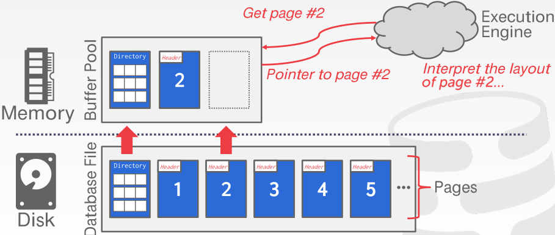
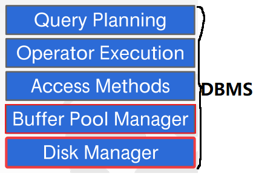

# 数据库系统概念

相关资料推荐：

1. 书籍《数据库系统概念》
2. 视频《CMU数据库系统入门 15-445》：[知乎大佬放出的翻译版本](https://www.zhihu.com/people/chihiro2014/zvideos?page=2)和[知秋的翻译版本](https://www.bilibili.com/video/BV1f7411z7dw?from=search&seid=13836230911142310012&spm_id_from=333.337.0.0)。
3. [CMU 15-445课程主页](https://15445.courses.cs.cmu.edu/fall2019/)

推荐阅读章节（基于《数据库系统概念(第五版)》）：

1. 第一部分（**关系数据库**）：第2章 关系模型；第3章 SQL；第4章 高级SQL
2. 第二部分（**数据库设计**）：第6章 数据库设计和E-R模型；第7章 关系数据库设计
3. 第四部分（**数据存储和查询**）：第11章 存储和文件结构；第12章 索引和散列；第13章 查询处理；第14章 查询优化
4. 第五部分（**事务管理**）：第15章 事务；第16章 并发控制；第17章 恢复系统
5. 第六部分（**系统体系结构**）：第20章 数据库系统体系结构；第21章 并行数据库；第22章 分布式数据库。

在我们入门数据库系统之前，有必要先了解下数据库系统。数据库系统（Database System）有别于数据库管理关系（Database Manage System），是一些相互关联的数据以及一组使得用户可以访问和修改这些数据的程序（这个才是DBMS）的集合，其主要目的是给用户提供数据的抽象视图。为了达到这个目的系统必须隐藏关于数据存储和维护的某些细节，并以如下的几个层次上的抽象来实现用户对复杂性的屏蔽和简化人机交互：

1. **物理层**：它是数据库系统中最低层次的抽象，用来实现对数据库中数据的实际存储。
2. **逻辑层**：它是数据库系统中的中间层次，用来描述数据库中可以存储哪些数据以及数据之间存在什么样的关系。我们常见的数据模型、数据模式这些概念实际上就用在这个位置之中，它也是数据库管理人员、设计人员最常接触的层次。
3. **视图层**：它是数据库系统中的最高层次，只描述整个数据库的某个部分，它可以使得数据库使用者在不完全了解、接触数据库模式、数据表中到底存在些何种字段的情况下访问到部分或者其所需要的数据，简化用户与系统的交互。我们可以认为大多数的数据库用户实际上都是在这个位置。


## 一、关系数据库

### 1. 关系模型

在了解关系数据库之前我们必须知道一些概念，包括数据库管理系统DBMS、数据库、数据库模型以及数据库模式，我们也可以通过下图来粗略地了解它们的大致关系。其中：

- **数据库管理系统**（database manage system）指的是用于管理、存储和分析具有相互关联的数据集合的应用程序。设计数据库管理系统DBMS的目的是为了能够使得我们更好地实现对数据库的定义、创建、查询、升级以及管理，从而能够针对不断变化的数据检索需求做出更为通用、快速的反应。当然这样的管理系统也必须面对各种各样的问题，包括数据孤立问题、数据完整性问题、原子性问题、并发访问异常问题以及安全性等问题，如何实现数据库管理系统DBMS并对上述问题加以解决是本文所讨论的主要话题。
- **数据库**（database）指的就是上述数据库管理系统DBMS所管理的数据集合。虽然本文的课题是数据库，但实际上我们围绕的是数据库管理系统DBMS（而且在实际生活中我们接触的“数据库”实际上正是数据库管理系统DBMS）。而进一步，数据库结构的基础为数据模型。
- **数据模型**（data model）是一个用来描述数据库中的数据、数据间联系、数据语义以及一致性约束的概念集合。换句话说，数据模型决定了我们如何组织数据。常见的数据模型包括关系模型、K-V模型、图模型、文档模型、向量/矩阵模型、层次模型和网络模型等。
- **模式**（schema）指的是在给定数据模型的条件下对特定数据集合的描述，它给出了数据库和数据内容的布局及特性的信息。具体的在关系数据库中它指的就是关系的总体逻辑设计，决定了关系（表）中有哪些属性以及相关的约束（关系中该定义些什么，它们的内容是什么，类型又是什么）。


#### 1.1 关系数据库的结构

**关系数据模型**（relational data model）是IBM科学家Ted Codd于1970年所提出的一种数据模型，也是当前市场主流的选择。其所提出的关系（relation）概念与数学上的概念基本相符，被定义为一系列域（属性所能取的所有值形成的集合）上笛卡尔积的子集。而实际上，关系就是表；而关系中的最小单元称为元组，也就是表中的行。因此可知，**关系就是元组的无序集合**（虽然概念上集合要求不能存在重复的元组，但在实际的实现中并非如此）**，而关系数据库就是关系（表）的集合。**

由于**关系模式**（relation schema）是关系的总体逻辑设计，一般由属性序列以及各属性的对应域组成。因此关系模式常被以如下形式进行表示（大写）：
$$
Schema=(\underline{field1},field2,...,fieldN)
$$
其中括号内的就是关系中所含有的属性字段名。而基于此模式构建的关系则被以如下形式表示（小写）：
$$
relation(Schema)
$$

**（1）键**

键（key）是关系中一个或多个属性的集合，但在这里我们主要讨论的是超键、候选键、主键这些概念（因为它们是关系中最为重要的属性，对于表所描述数据的刻画非常重要）：

1. 其中超键（superkey）可以帮助我们在关系中唯一地标识一个元组。例如在customer表中，customer\_id和customer\_id+customer_name都是超键，因为任何一个元组的customer\_id一定是唯一的。显然，如果一个键是超键，那么它的任意超集都是超键。
2. 若一个超键的任意真子集都不是超键，那么这样的超键就称为候选键（candidate key）。
3. 若一个候选键被数据库设计者选中作为区分关系中不同元组，那么这样的候选键就称为主键（primary key）。主键也是我们数据库用户/设计者最常接触的超键。在上面的模式表达式中那个加了下划线的属性就是主键。

除此之外，我们还有一个外键的概念。如果一个关系模式$r_1$在它的属性中包含了另一个关系模式$r_2$的主键，那么这个属性就被称为<u>$r_1$参照$r_2$的外键</u>（foreign key）。外键是一种属性约束（实际中不常用），它可以防止关系中添加不符合外键约束的元组（例如在$r_1$中添加元组的外键取值不在$r_2$主键域中）。我们可以通过模式图非常方便的展示关系与关系之间的外键参照关系：


#### 1.2 关系代数

关系代数是Ted Codd在提出关系数据模型时一同给出的数学语言，它以过程化的方式描述对关系上的元组的提取和操纵（或者说它定义了在关系数据库上处理查询的原语）。这些操作主要包括基本运算、附加运算和拓展运算三种。区别在于1）*<u>基本运算</u>*是Ted Codd在原论文中提出的一些运算，用来表达最基本的关系代数查询功能；而2）*<u>附加运算</u>*的提出是用来简化基本运算表达式，它不能增加关系代数的表达能力；而3）*<u>拓展运算</u>*是代数运算功能上的拓展，它不仅提高了关系代数的表达能力还提供了更强大的功能。需要注意的是：对关系进行关系代数运算之后的结果仍然是关系，这也意味着关系运算可以进行组合使用。


##### 1.2.1 基本运算操作

1. **选择**（select）运算

选择运算选出满足给定谓词的元组集合（即新关系）。可用如下符号表示，其中下标内的就是谓词，且我们可以使用与$\and$或$\or$非$\neg$组合多个谓词：
$$
\sigma_{field_i=some\_value}(r)
$$

1. **投影**（project）运算

投影运算返回作为参数的关系中的部分属性组成的新关系。可用如下符号表示，其中下标内的就是选定的属性字段：
$$
\varPi_{field_i,field_{i+1},...field_n}(r)
$$

3. **并**（union）、**交**（intersection）以及**差**（difference）运算

关系的并、交以及差用如下符号进行表示，其中关系r集合差关系s表示找出那些在关系r中但不在关系s中的元组，并将这些元组集合作为结果关系：
$$
r \cup s \\
r \cap s \\
r - s
$$

4. **笛卡尔积**（Cartesian-product）

笛卡尔积运算也称为叉积，用来创建包含两个输入关系元组所有可能组合的新关系，可用如下符号表示并以如下图进行演示：
$$
r\times{s}
$$


5. **更名**（rename）运算

有时候我们想对关系运算产生的临时关系进行引用，但它没有一个具体的名字，那么此时我们就可以使用更名操作为其赋名。可用如下符号表示，其中$x$表示该临时关系的新名字，下标括号内的为给该临时关系中各个属性字段取得新名字（也可省略）：
$$
\rho_{x(A_1,A_2,...,A_n)}(r)
$$

##### 1.2.2 附加运算操作

1. **自然连接**（natural join）

在实际的数据库查询过程中，在两个关系之间的笛卡尔积的基础上进行选择运算是非常常见的，因此为了简化这一查询运算，科学家提出了自然连接运算。

自然连接是一个二元运算，它可以使得我们将某些选择和笛卡尔积运算合并成一个运算，用符号$\Join$表示。自然连接运算首先会形成两个入参关系的笛卡尔积，然后<u>基于两个关系模式中都出现的属性上的相等性进行选择</u>，最后去除结果中的重复属性。我们可以给出如下的形式化定义：

设$r(R)$和$s(S)$是两个关系，$r$和$s$的自然连接表示为$r\Join{s}$，是模式$R\cup{S}$上的一个关系，其形式化定义为：


$$
r\Join{s}=\varPi_{R\cup{S}}(\sigma_{r.A_1=s.A_1\bigwedge{r.A_2=s.A_2}\bigwedge{...}\bigwedge{r.A_3=s.A_3}}(r\times{s})))\\
其中R\cap{S}=\{A_1,A_2,...,A_n\}
$$
例如我们想在两个表borrower和loan中找出“所有在银行中有贷款的客户名字以及贷款金额”，就可以使用如下的关系表达式表示：
$$
\varPi_{customer\_name,\ amount}(\sigma_{borrower.loan\_number=loan.loan\_number}(borrower\times{loan}))\\
=\varPi_{customer\_name,\ amount}(borrower\Join{loan})
$$

2. **除**（division）运算

除法运算的理解有一点难，它主要适用于短语“对所有的”的查询，可以用符号$\div$表示。为了概念的具象化，我们可以从问题“找出在Brooklyn的所有支行都有账户的的客户名”，为了得到这个答案，我们必须找出在布鲁克林的所有支行名（关系a），然后列出所有客户所使用的支行名（关系b），如果某一个客户所使用的支行名组成的集合包含上述所有的支行名，那么这个客户就是符合问题要求的一个答案。而$b\div{a}$正是上述问题的解答，我们可以用如下运算表达式表示（结果如下图）：
$$
b\div{a}=\varPi_{customer\_name,branch\_name}(depositor\Join{account})\\
\div{\varPi_{branch\_name}(\sigma_{branch\_city="Brooklyn"}(branch))}
$$


我们可以看到在代数除法中，作为除数的关系中的属性消去了被除数与之相同的属性，而作为被除数的关系剩下的属性值所对应的被消属性的取值集合一定是包含作为除数属性的取值集合，因此上述运算得到的结果客户名就是那些“在Brooklyn的所有支行都有账户的的客户名”。因此我们可以对上述代数出发给出如下的形式化定义：

设$r(R)$和$s(S)$是两个关系，且模式$S\subseteq{R}$，即除数关系模式$S$的每个属性都在被除数关系模式$R$中。关系$r\div{s}$是模式$R-S$上的关系，即除法结果模式中包含所有在被除数模式$R$中但不在除数模式$S$中的属性，则除法就是如下表达式的简化：
$$
r\div{s}=\varPi_{R-S}(r)-\varPi_{R-S}((\varPi_{R-S}(r)\times{s})-\varPi_{R-S,S}(r))
$$
其中上式$\varPi_{R-S}((\varPi_{R-S}(r)\times{s})-\varPi_{R-S,S}(r))$视图在找出“所有不满足指定条件的”属性值结果关系。

3. **赋值**（assignment）运算

赋值运算主要是用来解决临时关系变量定义的问题，可以用如下的符号表示：
$$
temp1\gets{E}
$$

##### 1.2.3 拓展运算操作

1. **广义投影**（generalized-projection）运算

广义投影运算允许在原先的投影列表中使用算数运算符来改变投影属性上的值，从而实现功能拓展。它可以用如下的表达式表示：
$$
\varPi_{F_1,F_2,...,F_n}(E)
$$
其中$E$是关系代数表达式，$F_i$是作用在属性i上涉及常量以及属性的表达式。例如我们想统计班级里学生的文科总成绩，可用运算表达式$\varPi_{studnet\_name,\ chinese\_score+english\_score\ as \ total\_score}(class)$计算。

2. **聚集函数**（aggregate function）

如果我们想对输入的一个关系以单个值作为结果返回，例如统计某一个属性的平均值avg、最大值max、最小值min、总和sum或者元组计数count，那么我们就可以使用聚集函数。对于这样一般性的要求，我们可以将聚集函数以如下形式化定义表示：
$$
\mathcal{G}_{F_1(A_1),F_2(A_2),...,F_n(A_n)}(E)
$$
其中$E$表示关系代数表达式，$F_i$是第i个聚集函数，$A_i$是关系运算表达式中的第i个属性。例如我们想要统计班级学生的平均成绩、最高成绩以及最低成绩，那么可以用表达式$\mathcal{G}_{avg(score),max(score),min(score)}(class)$来计算这一结果。

但是有时候我们并不是想对整个关系进行聚集计算，而是想先对关系中的元组进行分组，然后对每一个组再进行聚集计算，例如想对班级中的男生女生分别统计平均、最高、最低成绩，那么我们就可以使用带分组功能的一般性聚集运算来解决上述的问题，其可用如下形式化定义表示：
$$
_{G_1,G_2,...,G_n}\ \mathcal{G}_{F_1(A_1),F_2(A_2),...,F_m(A_m)}(E)
$$
其中$G_1,G_2,...,G_n$表示用于分组的属性组合。分组后，同一个组的$G_1,G_2,...,G_n$相同，但不同组的$G_1,G_2,...,G_n$不同。此时，上述学生的成绩统计可用运算表达式$_{gender}\mathcal{G}_{avg(score),max(score),min(score)}(class)$来进行计算。

3. **外连接**（outer join）

外连接是连接运算的拓展，它可以用来弥补（内）连接运算因两个关系之间指定共有属性值不匹配造成的信息缺失问题。其有三种形式：左外连接，用⟕表示；右外连接，用⟖表示；全外连接，用⟗表示（这几个符号非拓展latex打不出来）。这几个外连接都在计算自然连接的基础上，补充一些额外的元组，只不过补充的额外元组不同（不过在SQL中的规定是加在内连接结果上）。其中：

- 左外连接（left outer join）取出左侧关系中所有与右侧关系的任一元组都不匹配的元组，用空值null填充所有来自右侧关系的属性，再把产生的元组加到内连接的结果上。

- 右外连接（right outer join）与左外连接相对称：用空值null填充来自右侧关系的所有与左侧关系的任一元组都不匹配的元组，将结果加在内连接的结果上。

- 全外连接（full outer join）完成左外连接和右外连接运算，既填充左侧关系中与右侧关系的任一元组都不匹配的元组，又填充右侧关系中与左侧关系的任一元组都不匹配的元组，并把结果都加到内连接的结果上。我们可以用如下形式化定义表示：
  $$
  (r\Join{s})\cup((r-\varPi_R(r\Join{s}))\times\{(null,...,null)\})
  \cup\\(\{(null,...,null)\}\times(s-\varPi_R(r\Join{s})))
  $$
  ​        其中$((r-\varPi_R(r\Join{s}))\times\{(null,...,null)\})$表示与右侧关系任一元组都不匹配的元组用空值null填充所有来自右侧关系属性产生的元组集合（关系），$(\{(null,...,null)\}\times(s-\varPi_R(r\Join{s})))$则正好与对称。


##### 1.2.4 数据库的更新

在关系代数中，我们都是通过赋值运算符来表达数据库的更新，这与编程语言的做法相类似。

1. 对于（关系中部分或全部元组的）删除操作，我们通过如下的表达式表示：
   $$
   r\gets{r-E}
   $$

2. 对于关系的若干元组插入操作，我们通过如下的表达式表示：
   $$
   r\gets{r\cup{E}}
   $$

3. 对于关系中若干元组的更新操作，可用表达式来表示：
   $$
   r\gets{(r-\sigma_P(r))\cup\varPi_{F_1,F_2,...,F_n}(\sigma_P(r))}
   $$
   ​        其中$(r-\sigma_P(r))$不需要参加更新操作的元组集合，关系投影$\varPi_{F_1,F_2,...,F_n}(\sigma_P(r))$指的是需要参加更新操作的元组集合，$F_i$表示针对关系中第i个属性的设置$r$和常量的表达式。


### 2. SQL

虽然Ted Codd在提出关系模型的时候一同给出了关系代数这样的数学语言来描述关系模型下数据库的查询修改更新等任务，但它几乎没有任何的实际可操作性，因此IBM在上个世纪提出了结构化查询语言（Structure Query Language，SQL）。SQL不仅提供了最基本数据库查询的功能，还提供了数据结构定义、修改数据库中数据以及说明安全性约束条件等多种功能，在实际中我们经常将其分成如下三种：

- **数据定义语言DDL**：负责提供定义关系模式、删除关系、修改关系模式、定义视图以及定义保存在数据库中数据必须满足的完整性约束条件的命令，具体包括`create`、`drop`、`alter`等。在本文中2.1和3.1节主要讲述这些知识点。
- **数据操纵语言DML**：负责提供基于关系代数和元组关系演算实现的查询语言，还包括对关系元组的更新、插入、删除等命令，实现对数据库的操纵，具体包括`select`、`insert`、`update`、`delete`等。在本文中2.2\~2.6.1以及3.3、3.4节主要讲述这些知识点。
- **数据控制语言DCL**：负责提供对数据库中数据进行的变更的确认和取消，以及用户、关系的权限的授予和撤销等命令，具体包括`commit`、`rollback`、`grant`、`revoke`等命令。在本文中主要由2.6.1、3.2节来讲述部分的知识点。

我们需要明确一点，那就是：SQL和关系代数是不同的，它实际上是bag algebra（背包代数）的产物。在背包中，元素没有固定位置，也没有顺序可言，甚至允许重复元素的存在，这也是实际工作在计算机上的数据库关系与关系代数理论的不同之处。而在关系代数中，关系是一个集合，是不允许重复的。

若我们想让元素变得有顺序，或想保证没有重复元素的出现，那么数据库管理系统DBMS必须为我们做一些额外的工作才能提供上述的额外功能。而我们提供给DBMS的SQL就是想表达这些内容，在查询时所需要的功能都必须明确指出，因此我们说SQL并不是关系代数的直接产物。但关系代数作为关系数据库理论的一部分，对于我们理解SQL仍然具有很好的帮助作用。


#### 2.1 数据定义

在关系型数据库中，所有的关系集合的创建以及相关设置都是由DDL来负责指定，DDL不仅能够提供定义关系的能力，还能够设定每个关系其他重要的信息（这些信息不少可以在关系创建的时候一同设置），包括：

1. 每个关系的模式
2. 每个属性的类型/值域
3. 完整性约束
4. 每个关系维持的索引集合
5. 每个关系的安全性和权限信息
6. 磁盘上每个关系的物理存储结构

在本节中我们只介绍前两个内容，下一章介绍完整性约束。


##### 2.1.1 SQL数据类型

由于用户自定义类型在许多数据库DBMS上没有得到广泛的支持，例如PostgreSQL支持但MySQL不支持，因此这里并不介绍这种特殊的数据类型，主要还是介绍SQL标准支持的基本域类型。在大多数的SQL中主要包含有1）串数据类型；2）数值数据类型；3）日期和时间类型；4）二进制数据类型这四种，下表总结了常见的这几种常用的细分类型：

|    细分种类    |                         常见数据类型                         |                描述                |
| :------------: | :----------------------------------------------------------: | :--------------------------------: |
|   串数据类型   |                    `char(n)`、`varchar`等                    |          定长、变长字符串          |
|  数值数据类型  | `int`、`smallint`、`numeric(p,d)`、<br />`real`、`double`、`float(n)`等 |   整数、指定精度的定点数、浮点数   |
| 日期和时间类型 |                `date`、`time`、`timestamp`等                 | 日期、时间和混合前两者的时间戳类型 |
| 二进制数据类型 |                           `blob`等                           |   名为基于`byte`的`large object`   |

上述的一些类型也进行一定程度上的相互转换，但这些转换必须用户强制指定且目标类型与源类型相兼容，且在MySQL上目标类型有着严格的限制。例如目标整数类型只能指定为`signed`，目标无符号整数只能指定为`unsigned`，目标日期时间相关的必须在`date`、`time`、`datetime`内。我们可以使用如下的语法来进行强制类型转换：

```sql
cast(<src> as <dst_type>) 或者 cast(<src> to <dst_type>)
```

特别的在日期时间类型上，绝大多数的SQL都提供了一些函数来实现信息的提取和转换。其中`<field>()`函数或者语法`extract(<field> from <d>)`可以帮助我们从日期或时间`d`中提取出某一个域（`year`、`day`、`hour`、`second`等）、`date()`/`unix_timestamp()`能够帮助我们将传入的数据转换到期望的日期时间类型，`current_date()`/`now()`能够帮助我们获取当前的日期时间、以及其他一些功能非常强大的函数。例如我们想要知道今天是今年的第几天，在MySQL上可以通过如下语句查询：

```mysql
select round(
    (
      unix_timestamp(now()) - unix_timestamp(concat(year(now()), "-01-01"))
    ) /(60 * 60 * 24)
) as nth_day;

-- 或者直接调用MySQL上的函数
select dayofyear(now()) as nth_day;
```

除以上数据类型之外，SQL中还定义了一种特殊的数据类型，即空值null。这个数据值null并不代表0，而是表示数据值未知unknown，任何值与null的结算结果要不也是null，要么在数值计算的过程中将其视为0，或者将其忽略。


##### 2.1.3 基本模式定义与其他

我们可以通过如下形式的语法来创建关系：

```sql
create table <r> (
	A1 D1 [行约束],
	A2 D2 [行约束],
	...,
	An Dn [行约束],
	[完整性约束1],
	...,
	[完整性约束k],
);
```

其中`r`是关系名，`Ai`是关系r模式的一个属性名，Di是属性Ai的数据类型，上面的行约束本质上也是完整性约束的一部分，它们将在3.1节中介绍。为了后续内容的介绍，我们创建了如下三个关系并插入如下数据：


同时SQL还提供了另外两种机制来实现关系的创建，一种是使用**like**关键字来用已有关系创建另一个模式相同的关系；另一种则是使用**as**关键字用已有关系创建出模式、内容与查询结果相同的新关系。语法如下所示：

```sql
-- 创建出与another_r关系模式相同的关系，新关系中内容为空
create table <r> like <another_r>;

-- 创建出模式、内容与查询结果相同的新关系
create table <r> as <查询语句>;
```

至于DDL的其他方面，SQL也提供了一些相关的机制。我们可以通过drop命令来删除整个关系：

```sql
drop table <r>;
```

我们可以通过alter命令来修改关系的模式，为其添加或删除一些属性：

```sql
-- 向已有关系添加属性
alter table <r> add A D;

-- 删除已有关系中的指定属性
alter table <r> drop A;
```

其中`A`表示需要添加或删除的属性（attribution），`D`表示要添加属性的域类型。


#### 2.2 SQL查询的基本结构

 ##### 2.2.1 查询基本结构

SQL查询表达式的基本结构由select、from、where三个子句组成：

1. **select**子句：对应关系代数中的投影运算$\varPi$，用来控制输出属性；
2. **from**子句：对应关系代数中的笛卡儿积$\times$，它不仅能指出入参关系，还能够使用入参关系生成所有可能的元组组合；
3. **where**子句：对应关系代数中的选择运算$\sigma$，用来指出作用在入参关系上的属性谓词，起到元组过滤。

> 由于历史使用习惯，使得SQL使用select关键字来表达关系代数中的投影操作而不是project。而由于该关键字的占用，所以SQL使用了where关键字来表达关系代数中的选择运算。

一个典型的SQL查询有着如下的形式：

```sql
select A1, A2, ..., Am
from r1, r2, ..., rn
where P;
```

上述SQL查询等价于如下形式的关系代数：
$$
\varPi_{A_1,A_2,...,A_m}(\sigma_P(r_1\times{r_2}\times{...}\times{r_n}))
$$
该**SQL查询基本结构首先构造from子句中入参关系的笛卡儿积，然后根据where子句中的谓词进行关系代数的选择操作对元组进行过滤，最后根据select子句中的属性将结果进行投影输出**。

在上述基本查询结构上我们可以使用一些方式来增加查询的灵活度以及功能性：

1. 对于select子句，我们可以在指定的属性前增加**distinct**关键字来过滤重复的元组，因为在实际中关系本质上就是一个背包，默认输出结果中可能存在重复行；同时在select子句中我们可以使用带+-*/且运算对象为常数或元组属性的表达式，起到广义投影的功能；等等。
2. 对于where子句，我们可以使用基本的与and或or非not来构建最基本的元组过滤条件，还可以使用in、between等关键字来简化表达；等等。
3. 对于from子句，其自带的笛卡儿积功能本身就非常强大，一种最为常见的拓展就是在其中使用连接功能来实现多表数据协同；以及诸如派生关系等等。

SQL还提供了更名操作，我们可以使用**as**子句来实现对关系以及属性的重命名。除此之外，as子句还可以起到定义元组变量的作用，当我们在from子句中将某一个关系重命名，然后在where子句中以"重命名关系名.属性名"的形式进行使用时，这个关系名就是隐式的元组变量。元组变量在比较同一个关系中的两个元组时非常有用，例如我们想要找出“资产至少比位于Brooklyn的某一家支行高的支行名”，我们就可以使用如下SQL语句解决：

```sql
select distinct T.branch_name
from branch as T, branch as S
where T.assets > S.assets and S.branch_name = 'Brooklyn';
```


##### 2.2.2 字符串运算

字符串是我们在使用数据库过程中非常常见的数据格式，一般使用单引号或者双引号来对其进行标示。由于字符串灵活多变，因此使用!=或者=符号进行相等性判断过滤的作用可能非常小。最常见的字符串运算就是使用**like**运算符的模式匹配，我们通常使用如下两个特殊字符来构建模式：

- %：匹配任意一个子串；
- _：匹配任意一个字符。

有时候待寻找的字符串中本身就带有这两个特殊字符，为了避免在模式中将其当成特殊字符，我们可以使用escape关键字来定义一个转义字符（一般为"\\"），在特殊字符前面加上转义字符就可以避免它们被当成特殊字符。例如想要匹配一个类似“percentage: 89% ...”这样的字符串，我们就可以使用如下的SQL语句进行描述：

```sql
select * from <r> 
where <str_column> like "percentage: %\%%" escape '\';
```

除此之外，SQL还提供了一些的函数方便字符串的处理，包括uppper、lower等函数，以及similiar to这样的运算符来提供更强大的功能。


##### 2.2.3 输出控制

SQL为用户提供了一些非常有用的结果关系输出控制方式：

1. **order by**子句：可以用来控制查询结果元组按照指定的属性值进行排列显示。我们还可以在末尾加上desc来要求结果按照降序排序，或者加上asc按照升序进行排序。其语法格式如下：

    ```sql
    order by <column*> [asc|desc]
    ```

2. **limit**子句：可以控制查询元组的显示数量，以及从何处开始显示，该语句在我们网页浏览过程中翻页显示内容时非常有用。其语法格式如下：

    ```sql
    limit <count> [offset]
    ```


#### 2.3 集合运算和聚集函数

##### 2.3.1 集合运算

SQL也提供了关系代数中所描述的关系并、交、差等运算操作，它们分别使用关键字**union**、**intersect**以及**except**等运算符进行表示，且要求参加运算的关系必须相容（即模式相同）。不过需要注意一下两点：

1、**MySQL中并不直接支持intersect和except这两个操作**，不过我们可以通过许多种替代的方法来解决这个问题。因为寻找交集的本质就是执行相等性测试的过程，因此我们很容易通过连接join的方式来解决；同样的，因为差集本质上就是某一个集合去掉两个集合的交集所剩下的部分，因此只要我们能够求出交集，并要求结果集合not in该交集就可以解决这个问题。

例如我们想要找出“计算机学院中所有与电气工程学院不存在同名的学生的名单”，那么我们就可以用如下的SQL语句进行查询：

```sql
select name from student where login like "%@cs"
except
select name from student where login like "%@ee";

-- 一种MySQL替代解决方案
select name from student
where login like "%@cs" and 
	name not in (
        -- 计算交集
        select s1.name
        from student as s1, student as s2
        where s1.login like "%@cs" and s2.login like "%@ee"
            and s1.name = s2.name
    );
```

2、默认的上述操作都会在结果中去除掉重复的元组，如果我们想要保留这些重复的元组，那么我们可以在union等关键字的后面加上关键字all。


##### 2.3.2 聚集函数

**聚集函数是以多个元组作为输入，返回单个值的函数**。多个元组聚合成单一值就是聚集的核心含义。SQL内建聚集函数主要包括avg、min、max、sum、count，对于求表的平均值、最小值、最大值、总和以及计数值非常有用。如果我们想要在执行聚集函数的过程忽略那些重复的元组，那么我们可以在聚集函数表达式内部使用关键字distinct来实现这一目的。

但大多数情况下我们对聚合函数的需求并不只是作用于单个元组集合之上，<u>更多情况是对元组进行分而治之，分成多个分组集合，然后对这些元组集合再使用聚集函数</u>。因此SQL引入了**group by**子句，它可与将该子句中指出的所有属性上都具有相同值的元组分在同一个组中。故而，聚集函数有着如下的最为基本的使用格式：

```sql
select f1(A1), f2(A2), ..., fm(Am)
from E
where P
group by G1, G2, ..., Gn;
```

该SQL语句正好等价于如下关系代数：
$$
_{G_1,G_2,...,G_n}\ \mathcal{G}_{F_1(A_1),F_2(A_2),...,F_m(A_m)}(E)
$$
其中$E$是输入关系或者关系代数表达式，$G_1,G_2,...,G_n$是用来分组的属性集，$A_i$是用来计算聚合值的第i个属性，$F_i$是作用在前者的聚合函数。

如果我们在上述group by分组之后对于其中部分的元组集合不感兴趣，那么我们可以通过**having**子句来实现对部分元组集合的过滤。且having中出现的谓词一般也会使用到聚集函数，因为基于单个属性或者一个属性组合无法来描述具有多个元组的元组集合。例如，我们想要在enrolled表格中找出“学生的平均分大于60的课程名单”，那么我们就可以使用如下的SQL语句：

```sql
select c.name, avg(e.score)
from enrolled as e join course as c on e.cid = c.cid
group by e.cid
having avg(e.score) > 60;
```

如果在一个使用聚集函数的SQL语句中包含了where、group by以及having子句，我们可以很容易的知道数据库一定是先执行了where子句过滤了无效的元组，然后再执行group by对元组进行分组，最后才是having过滤不符合谓词的分组，剩下的会被select子句生成最后的查询结果。


##### 2.3.3 窗口函数

窗口函数也称为了OLAP（Online Analytical Processing）函数，其设计目的就是为了对数据库中的数据进行实时分析处理。窗口函数只能使用在select子句中，拥有如下的语法：

```sql
<window_func>() over ([partitioin by <column*>] order by <sorting_column*> [desc|asc])
```

其中括号中的partition by制定了如何对数据进行分组，分组后的记录集合就被称为窗口（或者一个范围），这也是窗口函数名称的由来；order by指出了组内的数据记录按照何种方式进行排序；而对于使用的窗口函数主要有如下两种：

1. **对数据计算排名、分组排名**，这些功能无法使用普通的SQL order by命令解决。需要使用专门用于OLAP排名用途的rank、dense_rank、row_number函数解决。

    > ​        这些函数都具有排名的作用，但是rank的特点在于当数据中存在相同位次的记录时它会跳过后续的位次，而dense_rank遇到相同的记录不会跳过后续的位次，row_number则即使遇到相同的记录也会为每一条记录赋予一个唯一的位次。例如包含4个元组的表中拥有三条相同内容的记录时，rank的结果为{1,1,1,4}，dense_rank的结果为{1,1,1,2}，row_number的结果为{1,2,3,4}。
    >
    > ​        例如我们需要在enrolled表中计算出各个科目下学生的成绩排名，那么我们就可以用如下的SQL语句来完成这一任务：
    >
    > ```sql
    > select c.name as course_name, s.name as student_name, e.score, 
    >  rank() over (partition by e.cid order by e.score desc) as ranking
    > from student as s join enrolled as e join course as c
    > on s.sid = e.sid and e.cid = c.cid;
    > ```

2. **计算累计统计值或者移动统计值**。需要使用能够用作窗口函数的聚集函数来解决，包括sum、avg、count、max和min函数。

    > ​        当被聚集函数用在窗口函数上时，它主要有两种作用。一种是用来计算累计统计值，包括累加和、累计平均值、累计最值等工作；另一种是用来计算移动统计值，包括移动平均值、移动最值等工作。例如我们想要计算enrolled表中每一个学生记录之前所有记录的累计平均值，则可以用如下的SQL语句：
    >
    > ```sql
    > select *, avg(score) over (order by score asc) as currrent_avg
    > from enrolled;
    > ```
    >
    > ​        在上面这个任务中，每一个记录前面的包括自身的所有记录范围就是一个窗口。如果我们想在这个窗口的基础上指定更详细的汇总范围大小，那么我们就可以使用”**框架**“的功能。具体的实施措施就是在括号order by语句的后面加上`rows <n> preceding`或者`rows <n> following`或者共同使用的子句，此时窗口函数就进化成了计算移动统计值的功能。例如我们想要计算enrolled表中学生的移动平均值，该平均值由当前记录的前两条加上自身共同得到，则可用如下SQL语句解决：
    >
    > ```sql
    > select *, avg(score) over (order by score asc rows 2 preceding) as moving_avg
    > from enrolled;
    > ```
    >
    > 


#### 2.4 子查询和视图

##### 2.4.1 嵌套子查询

SQL提供了嵌套子查询（Nested Queries）机制，它也是SQL中非常常用的查询功能。其中子查询指的是嵌套在另一个查询语句中select-from-where表达式，<u>它在需要对集合中成员/记录的资格、集合之间的比较以及集合的基数进行检查的场景下使用</u>。我们将外面的查询称为外层查询，内部的子查询称为内层查询，如下图所示。且内层查询可以使用外层查询的元组变量，则被称之为作用域规则。


在绝大多数的情况下嵌套子查询主要还是出现在where子句中，其他情况下我们将在下一小节中讲述。由于放置在where子句中的嵌套子查询中需要涉及到一个元组与一个集合或者集合之间进行测试的工作，例如“检查外层查询入参关系中的元组是否在内层子查询的结果集合中”、“外层查询的元组是否都大于内层子查询的结果集合中所有的元组”、或者“检测与当前元组的内层子查询有关联的查询结果是否为空，若为空则保留该元组”等任务，因此子查询SQL语句需要非常频繁地使用到如下几个关键字：

**（1）ALL**

<u>该关键字指出只有当外层入参关系上的元组满足子查询中所有的结果才能得到保留</u>。它经常出现在集合比较的任务上，适用于短语“比所有的都大”等任务，配以使用`>all()`、`<all()`、`<>all()`、`=all()`等子句解决。例如找出“enrolled表中成绩大于所有参加Database System课程学生的成绩的学生名单”就可以用如下SQL语句解决：

```sql
select s.name as student_name
from student as s join enrolled as e
on s.sid = e.sid
where e.score > all(
    select score from enrolled where cid='15-445' -- 子查询
);
```

**（2）ANY/SOME**

<u>该两个关键字同义，用来指出当外层入参关系上的元组只要满足子查询上部分结果就可以得到保留</u>。它也经常用于集合比较的任务上，适用于短语“至少比某一个大”等任务，配以使用`>any()`、`=any()`、`<some()`等子句解决。

**（3）IN**

<u>该关键字实际上等价于`=any`子句，用于指出当外层入参关系中的元组只要包含在子查询的结果集合中就可以得到保留</u>。例如找出“所有参加Database System课程的学生名单”就可以使用如下SQL语句解决：

```sql
select name from student
where sid in (
    select sid from enrolled where cid = '15-445'
);
```

**（4）EXISTS**

该关键字用来测试一个子查询的结果是否为空，但它的使用相交于上述其他关键字较为特殊，在它使用的过程经常需要内层子查询引用外层查询的元组变量。而与之相反，结构not exists则可以用来测试某一个子查询的结果集合是否为空。例如找出“course表中所有学生都不参加的课程”任务就可以使用如下的SQL语句解决：


显然上述的SQL语句中的内子查询中引用了外部查询的course元组变量（注意在这里不是关系）。查询时它首先遍历整个course表，对于每一个元组它都会到enrolled表中执行一次子查询，找出是否在enrolled中有这个课程被学生参加，如果结果集合为空（not exists）则说明该课程没人参加。这样当外层入参关系元组遍历完毕后就可以得到所有没人参加的课程了。

同时NOT EXISTS结构还有另外一个功能，它可以用来模拟集合包含运算：我们可以将“关系A包含B”写成如下SQL表达式`not exists(B except A)`，这个结论可以通过下图易知，因为只有当A包含B的时候，`B - A`得到的关系才为空。


例如我们想要找出”所有参加了全部已开设课程的学生名单“，则可以用如下SQL语句来完成该任务：

```sql
select name from student
where not exists (
    (select distinct cid from enrolled)
    except
    (select cid from enrolled
     where enrolled.sid = student.sid)
);

-- 由于MySQL不支持except关键字，我们可以用如下的语句来替代实现上述相同的功能
select name from student
where not exists (
    -- 找出所有当前学生不参加的课程ID
    select distinct cid from enrolled
    where cid not in (
        -- 找出所有当前学生参加的课程ID
        select cid from enrolled
        where sid = student.sid
    )
);
```

该语句执行的时候会首先遍历外层查询入参关系，对于每一个学生元组它会到子查询中计算”所有开设的课程名-该学生所有参加的课程“，如果得到的结果集合为空则说明该学生参加了所有的课程。

**（5）UNIQUE**

该关键字用来测试一个子查询结果集合中是否包含重复的元组，如果重复则保留当前元组。与EXISTS相同，使用该关键字的子查询中也一般需要引用外层查询的入参关系。


##### 2.4.2 派生关系与标量子查询

在上述中，我们已经知道在绝大多数的情况下所讨论的嵌套子查询主要指的就是放置在where子句的子查询。但实际上，**子查询既可以放在where子句中，也可以放在select子句中，甚至可以放在from子句中**。一般，放置在from子句的子查询我们称之为**派生关系**，而放置在select子句中的子查询我们指的就是**标量子查询**。

**（1）派生关系**

派生关系可以认为是一种查询过程中所使用的中间临时关系，它用来暂时存储外层查询所需要使用到的短暂结果。在SQL中我们可以对其进行更名操作，方便外层查询的使用。例如我们想要找出“enrolled表中每一个课程中成绩第一的学生名单”，就可以在不使用视图或者其他方式的情况下使用派生关系进行解决：

```sql
select t.course_name, t.student_name, t.score
from ( -- 派生关系用来对每个科目下学生的成绩进行从高到低的排名
    select c.name as course_name, s.name as student_name, e.score,
        rank() over (partition by e.cid order by e.score desc) as ranking
    from student as s join enrolled as e join course as c
    on s.sid = e.sid and e.cid = c.cid
) as t
where t.ranking = 1;
```

**（2）标量子查询**

标量子查询指的是允许外层查询每当请求一个值的时候引发一次子查询，只要保证该子查询只返回一个值。例如在上一小节讲述IN关键字的部分中，我们曾试图找出“所有参加Database System课程的学生名单”，这一任务当时使用的是包含IN关键字放置在where子句的子查询进行解决，但实际上这个问题也可以通过标量子查询进行解决：

```sql
select (select s.name from student as s
        where s.sid = e.sid) as name
from enrolled as e
where e.cid = '15-445';
```

显然在student表中每一个sid都有唯一对应的学生，因此我们可以保证上面放置在select子句中的子查询一定只返回一个值。值得注意的是，虽然这两个SQL语句解决的问题是相同的，但是它们两实现的途径是不同的。前者先使用子查询找出所有参加Database System课程的同学的学号，然后遍历student表中的所有元组，保留那些包含（in）在子查询结果中的所有元组，然后投影输出name列。而后者也是先使用外层查询找出所有参加该课程的同学学号集合，然后一边遍历该集合上的元组，一边到student表中查询该元组cid所对应的学生名字（执行标量子查询）。不过我们可以发现两者的最差时间复杂度其实是差不多的，都是$O(N+M*K)$（假设student表大小为$M$，enrolled表大小为$N$，参加Database System课程的学生数量为$K$，默认查询是顺序的）。


##### 2.4.3 视图

我们可以发现在上述所有查询语句中的入参关系都是实实在在存储在数据库中的关系，但是有时候我们可能并不需要用户接触到这个实际的关系，这种考虑可能出于屏蔽底层关系实现细节方便用户的使用，或者安全性避免用户修改查看敏感信息等多方面的因素。因此我们有必要在用户与实际关系之间构建一个虚拟的中间层，而视图则是SQL所提供的最好解决方式。

**视图指的是任何不属于逻辑模型中的一部分但对用户可见的一种虚关系**，它实际上保存的是一个SQL查询语句而非SQL查询得到的结果关系（当然在一些特定的DBMS上是允许结果关系被存储下来，这种视图称为物化视图materialized view），它在一定程度上可以用来替代嵌套子查询。它有着如下的命令格式：

```sql
create view <vname>[(A1, A2, ..., An)] as <查询表达式>;
```

例如在上面的例子中我们曾经试图找出“enrolled表中每个已开设课程的最高分学生名单”，为了解决这个问题使用了派生关系，实际上我们可以将这个子查询抽象化成一个视图，用来给出一个描述每个已开设课程所有参加学生的成绩排名的虚关系，这样也方便上述问题的解决和后续复用，如下SQL所示：

```sql
create view class_ranking as 
select c.name as course_name, s.name as student_name, e.score,
    rank() over (partition by e.cid order by score desc) as ranking
from student as s join enrolled as e join course as c
on s.sid = e.sid and e.cid = c.cid;
```

除了在更新表达式中使用视图时的限制之外，视图可以出现在关系名能够出现的任何地方，因此视图也可以用来定义另一个视图。这种视图定义的方式会涉及到一个视图展开的过程，即定义时一旦遇到另一个视图名，SQL就会用其定义替换这个视图名，如此递归最终完成定义的过程。


##### 2.4.4 通用表表达式

SQL还提供了一种使用**with**子句定义临时视图的方法，我们将其称之为通用表表达式（Common Table Expression，CTE）。它有着如下的语法结构：

```sql
with cte_name[(A1, A2, ..., An)] as (
	<该临时视图定义的查询表达式>
)
<使用该CTE的查询语句>;
```

例如对于上面同样的问题，用CTE解决的SQL语句如下：

```sql
with cte_class_ranking(course_name, student_name, score, ranking) as (
    select c.name, s.name, score, rank() over (partition by e.cid order by score desc)
    from student as s join enrolled as e join course as c
    on s.sid = e.sid and e.cid = c.cid
)
select course_name, student_name, score as max_score
from cte_class_ranking
where ranking = 1;
```


除了上述定义临时视图的功能之外，通用表表达式CTE还可以用来实现有限形式的**递归查询**。而递归查询非常适合于涉及树状多层次的查询任务，例如对于在员工直接管理关系中找出“所有由A直接或者间接负责的所有员工名单”这样的任务就非常适合递归查询完成，虽然迭代查询也可以完成相同的功能，但后者的代码显得更为臃肿。

定义递归视图的方法非常简单，我们只需要在with后加上关键字**recursive**，且保证**递归视图必须被定义为两个子查询的并：一个非递归的基查询（base query）和一个使用递归视图的递归查询（recursive query）**。该递归视图生效时，会<u>首先执行基查询并将结果加入到视图关系中，然后递归查询在当前视图关系的基础上继续执行，并将新的结果加入到视图关系中，当重复上述递归查询到再也没有新的结果加入到视图关系中时才终止</u>，此时这个最终得到的视图关系实例就被称之为递归视图定义的一个不动点。具体语法如下所示：

```sql
with recursive <recursive_cte_name>[(A1, A2, ..., An)] as (
	<base query>
    union
    <recursive query>
)
<使用递归CTE的查询语句>;
```

例如对于查询”Jones的所有直接或间接管理的员工名单“任务，假设给定的员工直接管理表如下所示，那么我们就可以用下面的SQL语句来进行解决：


实际上我们可以发现这个递归视图搜寻的过程实际上就是一个类似于多叉树层序遍历的过程，类似于如下图所示的过程：


#### 2.5 连接关系

在第一章关系代数一节中我们就知道连接运算实际是用来简化“笛卡尔积+选择运算组合”的一种拓展运算，从而将两张或以上张表汇聚到同一张表中，方便信息查询，几乎所有的SQL实现都提供了这一机制。例如一个普通的内连接$r\Join{s}$（假设关系$r$的模式为$R$，关系$s$的模式为$S$），用如下的SQL语句进行表示：

```sql
select *
from r join s
on r.A1 = s.A1 and ... and r.An = s.An;
```

那么其有着如下等价的关系代数表达式。我们可以很容易的发现，连接操作实际上就是两个或者多个入参关系通过笛卡儿积运算再经过选择操作筛选有效元组之后得到的结果。
$$
r\Join{s}=\sigma_{r.A_1=s.A_1\and{r.A_2=s.A_2}\and{...}\and{r.A_n=s.A_n}}(r\times{s})
$$


##### 2.5.1 连接类型和条件

当然连接的使用也是多种多样的。**SQL中每一种连接操作都包含一个连接类型和一个连接条件**。连接条件决定了两个关系经笛卡儿积后产生的元组如何进行匹配测试，并且基于原关系中哪些属性来进行匹配，或者说决定了原来两个关系中哪些元组相互匹配；而连接类型决定了如何处理那些条件不匹配的元组。在SQL中主要有如下几种连接类型和连接条件：


其中各个连接条件之间的不同之处在于：

1. 自然连接**natural join**是一个二元运算，它会对笛卡儿积产生的元组基于两个入参关系模式中的所有公共属性（也称为公共连接属性）上的相等性测试来完成元组的匹配（或者选择）过程。自然连接比较有意思的一点是，它还会去除查询结果中公共属性的重复性，且结果中属性的出现顺序一定是：按照原先左侧关系顺序的公共连接属性、左侧关系中所有非连接属性、右侧关系中所有非连接属性。

    > 需要注意的是它并不适用于具有三个以及以上入参关系的SQL语句，因此并不常用。

2. 基于**on**的连接条件用户必须人为地给出匹配判断表达式，也即谓词。这种方法也是最为常用，且具有非常好的灵活性。

3. 基于**using**的连接条件使用风格类似自然连接，提供有限的自由性，可以选择哪些公共属性来完成相等性匹配测试，因此也并不常用。

而各个连接类型之间的不同之处在于：

1. 内连接**inner join**仅保留符合连接条件的元组；
2. 左外连接**left outer join**在内连接的基础上，去除左侧关系中所有与右侧关系的任一元组都不匹配的元组，用空值null填充所有来自右侧关系的属性，然后加到内连接的结果上；
3. 右外连接**right outer join**与左外连接相对，填充的空值放在左侧，然后加到内连接结果上；
4. 全外连接**full outer join**则是左外连接和右外连接的结合体。它在内连接基础上加上左侧关系不匹配右侧关系补上空值的元组以及右侧关系不匹配左侧关系不上空值的元组；
5. 交叉连接**cross join**指的是没有连接条件的内连接，实际上就等于“笛卡儿积+选择运算组合”失去了匹配选择的过程，这使得其退化成了一个简单的笛卡儿积运算。而from子句本身就提供了该功能，因此在实际中很少用到；
6. 归并连接**union join**等价于使用false条件的全外连接，即全外连接减去内连接的结果，只留下那些左右侧关系中不匹配但被填充空值null的元组集合。


#### 2.6 数据库修改

##### 2.6.1 删除/插入/更新

**（1）删除**

相比于SQL查询命令的复杂，用于数据库修改的删除、插入、更新操作就显得非常简单。在SQL中，删除**delete**语句格式如下：

```sql
delete from r where P;
```

其中$r$是需要修改的关系，$P$是一个谓词，SQL会删除满足了该谓词条件的元组。特殊的，如果我们将where子句删除，那么该语句默认就会删除掉关系中所有的元组。与之类似，SQL还提供了另外`truncate table <r>`命令来实现表中数据的全部删除。

**（2）插入**

而要在关系数据库中插入**insert into**数据也非常简单。我们既可以向其插入一条或者多条直接给定数据的元组，也可以向其插入一个查询的结果，但需要注意查询的结果必须满足待插入关系的模式要求。需要特别注意的是，向关系插入查询结果中所包含的数据时不需要使用关键字**values**，而这很容易犯错。插入语句格式如下：

```sql
-- 向关系r插入一条或者多条直接给定数据的元组
insert into <r>[(A1, A2, ..., An)] values (
	a1v, a2v, ..., anv
)[, (
	a1v1, a2v1, ..., anv1
), ..., (
	a1vm, a2vm, ..., anvm
)];

-- 向关系r插入查询结果所包含的数据
insert into <r>[(A1, A2, ..., An)]
	select A1, A2, ..., An
	from r1, r2, ..., rm
	where P;
```

**（3）更新**

SQL中的**update**语句可以帮助我们在不改变整个元组的情况下更新其部分属性的值。其一般格式如下所示：

```sql
update r
set col = new_val
where P;
```

其中$r$是需要更新的关系，col则是需要更新的属性，而谓词P帮助我们找到符合修改要求的元组。这种更新方式显然非常有效，但其缺点在于它只能对那些满足单一条件的元组进行更新，而无法在各种不同的情况下选择不同的更新策略。因此我们又有了另一种形式的update语句格式，它可以使用**case-when-then-end**子句来完成上述不同情况下的更新任务，如下所示：

```sql
update r
set col = case
			when P1 then new_val1
			when P2 then new_val2
			...
			when Pn then new_valm
			else new_valn
		  end
where P;
```

其中case-when-then-end子句完整的定义了满足谓词P的元组在不同更为具体的条件下对属性col的更新方式。例如我们想对enrolled表中“不是Advanced Database Systems课程中大于等于80分的学生成绩乘以1.06的权重，小于80的学生成绩乘以1.05的权重”，那么我们就可以用如下的SQL语句解决：

```sql
update enrolled
set score = case
                when score >= 80 then score * 1.06
                else score * 1.05
            end
where cid != '15-721';
```

**（4）视图更新**

一般情况下SQL是不允许对视图进行修改的，除非能够满足如下的条件，那么我们就称视图是可更新的：

1. from子句中只有一个数据库关系；
2. select子句中只包含关系的属性名，不包含任何表达式、聚集或distinct声明；
3. 任何没有出现在select子句中的属性都可以取空值；
4. 查询中不含有group by子句和having子句。


##### 2.6.2 事务

在SQL中，事务是一个特殊的存在，它实际上就是一个由多条查询或更新语句组成的序列，并且满足重要的ACID性质。每一个事务都有一个起点和终点，作为事务终点的命令的动作也被称为提交，默认情况下会开启事物的自动提交，也就说是每一条SQL命令都是一个事务，当输入完毕之后就会自动提交执行。

在SQL中我们可以用`start transaction`来显式地开启一个事务，使用`commit work`命令或者`rollback work`来结束一个事务。其中前者表示提交当前事务将事务中的更新持久化保存；而后者则回滚当前事务，撤销当前事务中所有的更新并结束事务。


### 3. 高级SQL

#### 3.1 完整性约束

完整性约束是SQL为了保证当授权用户对数据库进行修改时不会破坏数据的一致性，即防止数据被意外破坏。它主要包括两种，一种是使用**在单个关系上的约束**，诸如保证课程表course上的name属性不为空、课程表course上的cid属性必须唯一以方便进行区分、向课程成绩表enrolled表中插入的学生成绩必须大于0等限制；另一种则是使用**在关系之间上的约束**，诸如要求向课程成绩表enrolled中插入的课程必须已登记在在course表，否则无效。


##### 3.1.1 单个关系上的约束

单个关系上的约束一般是在建表`create table`的时候就设置完毕，最为常有单表约束主要包含如下几种：

1. **primary key主键约束**：用来唯一的区分关系中的元组。如果新插入的元组中主键属性数据已经在原先的表中存在，那么SQL就会报错。

2. **not null为空约束**：用来禁止在该属性上插入一个空值。如果新插入的元组中在该已限制非空约束的属性上为空值的话都会导致SQL报错。

3. **default默认值约束**：在添加新元组时若对以default约束的属性没有赋予值，那么自动使用默认值填充。

4. **auto_increment自增约束**：对于数值属性，若以此约束，那么在添加新元组的时候对该字段没有赋予特殊值，那么就会使用上一个添加元组的该字段值+1来进行填充。

5. **unique唯一约束**：它与主键约束类似，可以保证在指定属性集上的元组在整个关系中独一无二，但地位没有主键重要。

6. **check检测子句**：用来保证属性值满足指定的条件，起到插入值检查的功能。如果插入时元组的指定属性值不能满足check子句中的谓词，那么SQL就会报错。check子句有时候可以非常复杂，它甚至允许在子句中使用涉及到另一个关系的子查询，这种约束实际上就变成了参照完整性约束（MySQL不支持，但可以用下一小节中的外键约束解决）。例如我们想要建一个表`scores`记录每一个学生的平均分，但必须要求所记录的学生学号必须在`student`表中已经给出，且学生的平均分数一定大于等于0，那么我们就可以用如下的SQL解决：

    ```sql
    create table scores (
        sid int not null,
        sname char(32) not null,
        avg_score decimal(10,1),
        primary key(sid),
        check(sid in (select sid from student)), -- MySQL不支持在check子句中使用子查询
        check(avg_score >= 0.0)
    );
    ```


##### 3.1.2 参照完整性

在上面中，MySQL虽然不支持使用check子句中加入子查询来实现参照完整性，但几乎所有的SQL实现都提供了正式的保证参照完整性约束的方式。参照完整性（referential integrity）是一种非常常见且需要涉及到两个关系之间用来保证一个关系中给定属性集上的取值也在另一个关系中的某一个属性集的取值当中的多关系约束。外键约束就是SQL中保证参照完整性的最好方式，它有如下形式化定义：

令关系$r_1(R_1)$和$r_2(R_2)$的主键分别为$K_1$和$K_2$，若我们称<u>$R_2$的属性子集$\alpha$</u>为<u>被参照关系$r_1$中$K_1$</u>的外键**foreign key**，那么必须满足要求"对$r_2$中的任意元组$t_2$，均存在参照关系$r_1$中的元组$t_1$使得$t_2[\alpha]=t_1[K_1]$"。这种要求称为参照完整性约束（referential integrity constraint），或子集依赖（subset dependencies），可以用如下代数表示：
$$
\varPi_\alpha(r_2)\subseteq\varPi_{K_1}(r_1)
$$
为了更加清晰地表达这种约束，我们用下图简化了上述的数学描述：


为了实现上述的外键约束功能，不同的SQL实现给出不同的语法规则，在MySQL上有如下语法在`create table`的时候来添加外键约束（需要注意的是在MySQL中我们必须显式地给出被参照关系的相关属性）：

```sql
constraint [外键约束名] foreign key (<外键字段>) references <被参照关系名>(<参照字段>)
```

但是一般我们并不全推荐上面的方法，我们可以在创建表之后使用`alter table`命令向已有的表中添加外键约束，或者删除外键约束，这样可以带来更大的灵活性，当然这样做的前提是相关的关系之间事先已经满足了参照完整性。如下命令所示：

```sql
-- 添加外键约束
alter table <r> add
	constraint [外键约束名] foreign key (<外键字段>) references <被参照关系>(<参照字段>);
	
-- 删除外键约束
alter table <r> drop foreign key <外键约束名>;
```

> 在上面中我们在添加一个新的关系时是可以忽略外键约束名，此时SQL就会自动生成一个名字，如果我们在想删除该约束名的时候不知道，则可以使用`show create table <r>`命令来进行查看。


**级联操作**

在一般的情况下，当我们在表之间设置了参照完整性约束，若此时某些修改操作可能会破坏该约束，那么通常的处理方式是拒绝执行并报错。但SQL实际上也提供了其他的选项：允许在被参照关系上的一个删除或者更新操作违反了参照完整性约束时，修改参照关系中的相应元组来恢复约束。这些特定动作包含如下三种：

1. **级联删除/更新on delete/update cascade**：表示如果被参照关系$r_1$上部分元组被删除/更新而导致参照完整性破坏，那么系统就会自动将参照关系$r_2$中相关的元组删除/更新。
2. **级联置空on delete set null**：表示如果被参照关系$r_1$上部分元组被删除而导致参照完整性破坏，那么系统就会自动将参照关系$r_2$中相关元组的参照域置空，当然这样做的前提是该参照域是允许置空的。
3. **级联置默认值on delete set default**：表示如果被参照关系$r_1$上部分元组被删除而导致参照完整性破坏，那么系统就会自动将参照关系$r_2$中相关元组的参照域置为默认值，当然这样做的前提是该参照域是存在一个默认值的。

> 注意：英文cascade才是级联的意思，后面两个操作被称为级联显然是不准确的，但这些操作的思想都是相通的，故也称为级联操作。


#### 3.2 授权

##### 3.2.1 权限的授予


##### 3.2.2 角色


##### 3.2.3 权限的撤回


#### 3.3 函数和过程化结构

##### 3.3.1 SQL函数


##### 3.3.2 过程化结构


#### 3.4 触发器


#### 3.5 动态SQL


## 二、数据库设计

### 4. 数据库设计和E-R模型

#### 4.1 实体-联系模型


#### 4.2 E-R模型约束


#### 4.3 实体-联系图


#### 4.4 实体-联系设计问题


#### 4.5 弱实体集


#### 4.6 扩展E-R特性


#### 4.7 转换为关系模式


### 5. 关系数据库设计

#### 5.1 关系数据库设计过程


#### 5.2 原子域和1NF


#### 5.3 函数依赖与BCNF、3NF

##### 5.3.1 函数依赖


##### 5.3.2 Boyce-Codd范式


##### 5.3.3 第三范式


#### 5.4 函数依赖理论

##### 5.4.1 函数依赖集闭包


##### 5.4.2 属性集闭包


##### 5.4.3 无关属性与正则覆盖


##### 5.4.4 保持依赖


#### 5.5 关系分解算法

##### 5.5.1 无损分解


##### 5.5.2 BCNF分解


##### 5.5.3 3NF分解


#### 5.6 多值依赖与4NF

##### 5.6.1 多值依赖


##### 5.6.2 第四范式


##### 5.6.3 4NF分解


## 三、数据存储与查询

### 6. 数据存储架构

在先前的学习中我们主要了解什么是关系数据库、操纵关系数据库的SQL语言如何使用、以及如何合理地设计关系以及关系上的约束并保证在数据冗余最小的情况下方便数据的查询获取。这些内容都是数据库系统中逻辑层面的东西，我们可以认为它是数据库系统物理层向上提供的外在功能，而这里的物理层则负责实现这些功能的内在的逻辑并且保持透明，从而满足数据库管理者以及用户的需求。

从广义概念上讲，物理层就是整个DBMS，它应该包括1）查询计划Query Planning；2）操作执行Operator Execution；3）访问接口Access Methods；4）缓存池管理器Buffer Pool Manager；5）硬盘管理器Disk Manager等多个模块，用来帮助DBMS实现存储、查询、并发控制、恢复、分布式管理等多种功能。

由于大多数的数据库（在这里特指关系型数据库）最终的存储目的地一般是硬盘，特别是常见的磁盘，因此如何将关系型数据库中的数据存储到硬盘上的文件是一个非常重要的话题（或者说如何在硬盘上的文件中表示数据库），这也是DBMS中存储管理器Disk Manager最先需要解决的问题。这种DBMS也被称为**面向硬盘的DBMS**：在这个架构下数据主要存储在文件所对应的多个硬盘页上，并且通过**硬盘管理器**以一定的方式来进行记录的组织管理；当上层需要执行访问操作时**缓冲池管理器**就会按照一定的页面替换算法淘汰无效页面，然后将对应数据的页加载到内存的缓冲池当中，方便后续的**执行引擎**快速访问。



在本章中，主要介绍的就是上述DBMS数据存储功能：

- **存储引擎Disk Manger**：实现将关系型数据库中的数据存储在非易失性硬盘上；
- **缓冲区管理器Buffer Pool Manager**：实现将非易失性硬盘上的关系型数据库数据加载到内存中并进行缓存以避免频繁的硬盘访问，并按照一定的页面替换算法淘汰不需要的页面。




#### 6.1 文件组织

由于关系型数据库需要将数据（元组记录）保存在硬盘上的文件之中（一般的实现是一个关系对应一个文件），而在操作系统的层面上讲硬盘上的文件实际上是由多个物理页面page组成，它同时也是内存和硬盘进行数据交换的最小单元，一般为4k或者8k等。因此，**如何将关系上的多个记录保存在文件之中本质上就是将这些元组记录保存在文件对应的多个物理页面page上并进行有效的组织管理问题**——这便是数据库的文件组织问题。因此硬盘管理器必须解决如下两个问题：

1. 如何在物理页面page上存放元组记录并方便后续的记录定位访问？（页面布局问题）
2. 如何设计元组记录的格式，使其能够被有效地读取并解释？（元组布局和数据表示问题）
3. 如何在实现元组记录的快速定位并记录物理页面的空闲情况？（记录组织及空闲空间管理问题）
4. 如何根据指定的条件或者主键等信息快速地确定相应元组记录的地址信息，方便后续这些记录的快速定位？（索引问题）


##### 6.1.1 页面布局

在文件所对应的物理页面上存储数据库中数据主要有两种方式：一种称为**面向日志结构Log-Structured**，即在文件所对应的所有页面中按照历史操作顺序记录数据插入、修改和删除等命令；另一种则称为**面向元组Tuple-Oriented**，即在文件所对应的数据页面中记录真正的元组记录，因此这种页面也被称为元组页面Tuple Page。在本文的页面布局中，我们主要讨论的是后者，而前者在一些日志型数据库中非常常见。

但无论哪种数据存储方式，在一个实际的物理页面中，其起始位置都会包含一个首部header字段，在这个header中主要记录如下内容：1）页面大小；2）校验和；3）DBMS版本；4）事务可见性；5）压缩信息以及6）页面中存储记录数量等信息，如下所示：


而页面中剩下的部分则全是数据部分，它用来存储数据库关系中的元组记录。元组存储在数据部分最简单的实现方法就是保持记录定长，然后依次插入，但显然这种方式对于删除中间位置元组以及删除元组后再插入等情况的处理会比较复杂（需要进行移动覆盖甚至跨页操作），同时它也无法有效存储具有可变长度属性字段的元组。因此在实际中我们更多的采用**槽页式Slotted Page结构**。在这种页面布局中，页面被分成了如下几个部分：

1. **起始处的首部字段Header**：其中会记录上面所述的各种信息，同时还会记录当前页面所保存元组的个数以及指向空闲空间末尾的指针；
2. **槽矩阵Slot Array**：该矩阵中的每一个槽会有一个指向元组的偏移量字段和保存该元组大小的长度字段，如果该槽实际没有指向任何元组，那么它的长度字段会被设置为-1；
3. **空闲空间Free Space**：该空间介于槽矩阵和实际元组存储区域之间，在新元组插入时槽矩阵和元组存储区域会向空闲空间中间拓展，如果空闲空间小于新插入数据所需的空间这说明当前页面已满；
4. **元组存储区域Tuple Data Area**：该区域存储实际的元组，比较特别的是它是从页面的末尾处开始放置，然后向空闲空间中间拓展。


槽页式结构的好处在于它可以非常容易地解决元组删除和处理不定长元组存储等问题。例如中间位置的元组发生删除，那么槽页式就会将该元组对应槽slot的长度size字段设置为-1，表示该元组被删除，然后将该元组前面的所有有效元组向后移动，这样的页内元组移动成本非常低，最后更新所有剩下有效元组对应槽slot的偏移量信息以及首部header中的信息。至于这个被删除元组对应的废槽slot与其他槽之间是否会发生移动取决于具体的DBMS实现，有些DBMS会使用删除元组对应的槽slot后面的槽向前移动覆盖之，有另外一些则什么也不动，因为页面还记录着有效元组的长度信息，即使slot array中间位置上有无效的槽slot，我们也只要遍历判断跳过之就行了。

同时采用槽页式布局之后，我们就可以使用`page-id+slot-id`这一”虚拟地址“来快速地对元组记录进行定位，而不是直接记录元组的实际物理地址，这样每一次记录移动之后就不再需要更新索引等模块中的信息了。此时当我们想要根据某一信息访问指定的元组时，只需要先使用索引获取该记录的`page-id+tuple-id`，然后加载指定的页面，访问相应的槽位slot获取元组的偏移量和长度，最后读取这一元组，从而标准化这一流程。例如在postgresql中我们就可以用`ctid`属性打印出关系上每一条记录的虚拟地址：


从上面的结果可以看出关系表student上的数据都放在ID为0的页上，其对应的槽位slot ID分别为0、1、2。如果我们将中间的一条记录进行删除，我们就可以发现其操作之后的槽矩阵slot array位置并没有发生改变，但中间位置的槽slot已经失效（至于元组存储区域中的数据是否发生了移动覆盖等操作这里不得而知，可能没有移动如果需要考虑并发的话）。


如果再向其插入一条新的数据，postgresql也不会复用原来的槽位，只是在后面的槽位继续占据一个新的位置，如下所示：


除非我们显式的使用`vacuum full`或其他命令对关系中的数据进行整理，那么上面所述记录的槽矩阵就会变得整齐：


##### 6.1.2 元组布局

在实现数据库关系数据在硬盘文件上的存储过程中，元组的格式或者布局与页面的布局一样都非常重要。不同的数据库实现对于元组的布局有着不同的思路，但无论如何，必须保证对于一个包含可变长度属性的元组记录而言，我们都能够从中较为容易地提取出各个字段的信息。一种思路是将元组分成如下两个部分进行存储：

1. **具有固定长度数据的部分**：将具有固定长度的可见性信息（用于并发控制）、记录空值NULL情况的位图、存储后面可变长度属性的起始偏移量和长度、定长属性字段数据存放于此，至于这些固定长度数据的存放顺序由数据库实现以及模式本身共同决定。
2. **具有可变长度数据的部分**：将具有可变长度的属性字段存放于此，并将各个可变长度字段的起始偏移量和长度信息存放在前面定长部分中。

<u>至于元组记录中包含哪些属性/字段（模式Schema），在一般的数据库中，元组本身并不存储</u>。因为这样会造成巨大的数据冗余，所以常规的实现是将这些数据存放在下一节介绍的数据字典中。如果需要将这些模式信息存储在当前元组或当前页中，那么我们称之为self-contained（自给型）元组或页。例如对于下表：

```sql
create table instructor (
    id varchar(32),
    name varchar(32),
    dept_name varchar(32),
    salary bigint,
    primary key(id)
);
```

其元组布局会按照"可变长度属性偏移量/长度、定长属性字段、空值位图、变长属性字段"的顺序进行存储：


其中空值NULL位图如果按照建表时的顺序某一位被置为1，那么就说明该属性字段的数据为空，相应存储在磁盘的元组数据部分也会被忽略。但这样可能会造成空间的浪费，因为如果salary属性字段实际为NULL，但页上的元组还是需要为其分配相应的空间，因此另外一些数据库实现可能采用了别的元组布局思路。一种设计思路是将元组分成如下两个部分进行存储：

1. **首部header**：非属性字段数据，包括用于并发控制的可见性信息、空值NULL位图、存储后面可变长度属性字段的起始偏移量和长度存放于此。
2. **数据区域data**：先将固定长度的属性字段存放在该部分的前面、然后存放可变长的属性字段。如果有一个字段为空值，那么该部分不存储任何数据，从而避免硬盘空间的浪费。


而有的数据库系统实现则更进一步，直接取消了上面首部中关于可变长属性字段的起始偏移量+长度的部分，直接将这部分的信息放置到可变长属性数据前面，在不影响可变长属性数据表示的同时节省了使用空间，而至于数据区域内容完全交给数据库实现按照模式进行解析。


当然不同的数据库实现可能拥有着不同的元组布局方案，且这些方案还需要结合下面的数据表示共同决定。


##### 6.1.3 数据表示

除了需要了解元组的布局方式之外，数据区域的数据表示也非常重要。数据表示决定了一种数据类型的实际存储方式，了解它们可以对建表时数据类型的选择有着更好的帮助，同时能够更好的理解内部的机理。对于各个数据类型的表示方式，主要有如下四种：

1. **表示方式与C/C++类型表示方法相同的数据类型**：包括INTEGER、BIGINT、SMALLINT、TINYINT；

2. **不精确/精确的浮点数/定点数数据类型**：不精确的浮点数包括FLOAT、REAL、DOUBLE，而精确的可任意精度的定点数值类型包括NUMERIC、DECIMAL。其中浮点数遵从IEEE-754标准，这与C/C++的表示方式相同，它们最大的好处就在于原生的由CPU指令支持，运算的速度非常快，但计算可能不精确，尤其舍入错误，如下图：

    

    显然这些数值类型是非常不适合于金融等数值敏感领域的数据存储工作，此时我们可以使用定点值类型来完成这一任务。它主要的实现原理就是将数值以人类可读的方式保存在类似于varchar的数据结构中，然后通过一些元数据来记录相应的小数点位置、精度范围、四舍五入信息，同时实现者自己编写相应的运算代码保证计算的准确性，当然这也意味着运算效率的下降。上述的数据都会封装到一个特定的数据结构中，例如在postgresql中，其结构如下：

    

3. **可变长数据类型或大对象类型**：包括VARCHAR、VARBINARY、TEXT、BLOB等。由于这些数据类型能够存储的数据长度可以非常大，而大多数的数据库管理系统DBMS并不允许单个元组的长度超过一个页的大小（至于这个边界标准不同的实现各不相同），因此我们需要采用一些方法来避免这种情况的发生。一种最为常见的方法就是溢出页Overflow Page：使用另外一个页来存储实际的数据，然后在当前的元组相应的属性字段存储一个指向之的指针。如果数据无法使用单独一个页存储，那么我们可以使用多个页来记录，并在各个页的header中存储一个指向下一个数据页的指针进行串链，同时属性字段的指针指向首个数据页，如下图所示：

    

    还有一种比较少采用的额外文件External File方法：即直接创建一个文件记录该数据字段中的数据，一般适合于像BLOB这样的数据类型使用，如下图所示。不过这样方法必须考虑文件的安全性，因为外部用户可以直接通过文件系统修改这个文件。

    

4. **日期时间类型**：它们一般实际保存的是32/64位整数记录从1970年1月1日起的微秒数，这些数据类型包括TIME、DATE、TIMESTAMP。


##### 6.1.4 记录的组织方式

在前面的内容中我们主要介绍了我们如何在一个文件结构中表示元组记录，包括一个元组本身的布局以及其在作为文件最基础组成单元的页/块内部的组成布局。但并没有告诉我们①一个记录应该放置在哪个页；②记录应该在多个页中如何进行组织管理以及③如何实现对文件中空闲页的管理，这些问题被称为**文件中记录的组织方式问题**。因为一旦记录得到了有效的组织，那么一个元组记录应该放置到哪个页是有迹可循的；同时由于不同记录可能存放在不同的页中，因此我们需要对这些页进行管理，使得硬盘管理器能够高效地知道文件中页面的使用情况，从而方便我们实现在给定“虚拟地址”的情况下对元组的快速定位以及元组插入删除操作。常见的文件中组织记录的方式主要有如下几种：

**（1）堆文件组织Heap File Organization方法**

在这种记录组织方法中，一个记录可以放置在文件中的任意页面内（只要这个页面有足够的空间），且记录之间没有顺序可言。这样的好处在于元组的删除、插入储存等操作非常方便，开销非常小。由于记录的存放非常随意，因此我们必须使用一些特定的手段来跟踪各个页面的使用情况。一种常用的方法就是使用**空闲链表**将各个空闲页面进行串链，每一个页面的header内放置一个指向下一个空闲页面的指针，当需要插入一个新的元组记录时，DBMS就会顺序扫描空闲链表直到找到合适的页面为止，如下图所示：


但实际上这种方法并不好用，大多数的数据库实现主要使用**空闲空间图Free-Space Map**的方式来追踪页面的空闲情况。该空闲空间图实际上也是一个数组，其存储在另外一个文件（或者同一个文件的额外页）上，其每一个条目反映了相应数据页上的空闲空间百分比情况。如果一个条目大小为$n$比特，上面所记录的数值为$m(0\leq{m}\leq{2^n-1})$，则条目表示其所对应的数据页至少有$m/2^n$的空间是空闲的。此时数据库关系对应的文件组织结构如下（其中的Directory就是我们所述的空闲空间图）：


此时我们当我们需要向关系中插入新的元组时，只需要扫描一遍空闲空间图，找到一个可用的页面获取编号然后直接访问对应的页面即可，减少了如空闲空间链表那样的多页面访问开销。有时如果关系所对应的数据页太多，进而导致空闲空间图中条目数量增加，从而造成扫描空闲空间图的效率低下。为了解决这个问题，我们可以使用**多级空闲空间图**的方案，即在一级空闲空间图中使用条目记录下一级空闲空间图中多个条目上的最大空闲空间比，从而实现跨越原先单级多个条目的快速扫描。下图就展示了一个一级条目对应4个二级条目的多级空闲空间图结构：


同时DBMS的实现也必须保证在每一次写入/修改操作之后，数据页的信息和空闲空间图之间得到同步，不过每一次更新空闲空间图条目就将其页面刷入硬盘的代价非常昂贵，大多数的处理手段是进行周期性的更新配以其他的措施。

**（2）顺序/有序文件组织Sequential/Sorted File Organization方法**

在这种记录组织方法中，记录会按照指定的搜索键顺序进行排列存储，从而方便特定场景下用户需要顺序访问数据的用途。其中搜索键Search Key指定的是关系中一个或多个属性字段组成的集合，它不一定要符合超键的要求。在实现时，DBMS不仅会按照搜索键的顺序尽可能将元组记录顺序存储，而且为了严格的保证记录的顺序性，还会在元组记录中加入一个指针字段用来指向符合搜索键顺序要求的下一条记录。

因此使用这种记录组织方法会使得记录的读取非常方便，尤其是顺序读取多条记录的情况下。但缺点在于它对于记录的插入和删除非常不方便：频繁的记录可能会造成过多的记录存放在溢出页的现象，导致记录的实际顺序不再与物理顺序一致；而频繁的记录删除则会导致数据在页面上的存储稀疏化、空洞化，从而使得空间利用率不高。在顺序文件组织方法中，元组的删除非常方便，只需要定位到其前驱记录，然后将它的指针指向待删除记录的后继记录即可。而对于元组的插入则会按照如下的规则执行：

1. 在文件中按照搜索键定位到插入记录之前的那条记录；
2. 如果该记录所在的块中有一个足够的空闲空间（例如删除旧有的记录所留下的），就在这里插入新的记录。否则，将新的记录插入到一个溢出页Overflow Page中，然后调整前驱记录的指针和插入记录的指针指向后继记录。


在正常的情况（读多写少）下，溢出页中的记录不会特别多，那么此时该种文件组织方案还算差强人意，但若其中的记录量一多，那么记录的搜索键顺序和物理顺序的一致性就会完全丧失。因此DBMS就不得不在系统负载较低的情况下使用重组reorganized技术来对记录进行重新整理。

从上面的内容可以看出顺序文件组织方法提供了一种有限形式上的记录顺序性（正是由于此使得诸如堆文件组织方法中的页面空闲空间管理对它是没有意义的），方便数据的顺序访问，且元组的插入/删除机制（将元组放置到哪个页面的规则）非常简单，但也很容易造成数据的内部空洞（类似碎片化）以及过多记录插入到溢出页导致失去了物理顺序与记录顺序一致性的天然优势。因此这种方案更适合于那些读多写少、或者数据量较少的嵌入式数据库实现。

**（3）多表聚类文件组织Multitable Clustering File Organization方法**

在大多数的文件组织方式中，一个文件只能存储一个关系。但实际上，让一个文件能够存储多个关系有时候是有用的，尤其是对于那些经常需要频繁执行连接操作的两个或多个表而言，将这些表当中相关联的记录存储在相邻的物理区域可以减少在联结join时所付出的I/O量。例如对于如下的两个关系，其中一个关系`bar`中某个属性`bar.a`外键参照于另一个关系`foo`的主键`foo.a`：


正常情况下普通的DBMS对它们的处理应该是将这两个表分别存储在两个不同的文件中，但是如果它们经常需要联结，且两个文件下的联结操作负担太重的情况下，使用多表聚类文件组织方式可能是一种更好的解决方案。此时，多表聚类文件组织会采用**反规范化denormalize元组布局**来重新组织两个或多个表中相关联的元组，使不同表之间中不同的元组组合成唯一一种元组布局（预联结），并且一般的实现会删除冗余的外键信息，如下：


在foo、bar的例子中，所有与foo的主键相关的bar记录会去除外键属性后附加到该foo元组之后，从而形成新的foo元组，从而实现在一个块中存储两个关系上元组的目的。至于，附加的bar元组是否会去掉外键属性完全取决于DBMS的实现，大多数系统会选择去除，这样可以减少存储冗余。而合并之后的记录在文件的组织方式完全可以参照别的记录组织方式进行选择，可以选择堆文件组织方式，也可以使用顺序文件组织方式，都可以。

当然，多表聚类文件组织方式的使用完全取决于特定的使用场景，如果两个表之间经常需要执行`join`操作，那么该组织方式非常有用。但如果联结操作并不频繁，更多的是普通的单表访问操作，那么这样方案的效率非常低。例如在foo、bar例子中要求输出所有的foo元组，它相比于普通的文件组织方式读取更多的物理页面并且其中的大多数信息DBMS基本用不到：

```sql
select * from foo;
```

**（4）B+树文件组织B+-Tree File Organization方法**

虽然上面的顺序文件组织方法能够为数据库提供了有序性支持，即使存在可能改变记录顺序的插入、删除和更新操作。然而，面对大量此类操作，有序访问的效率会受到严重的影响。而B+树文件组织方法则不同，即使存在大量的记录修改操作，它仍然还能够提供对记录的高效访问能力，同时它还支持基于搜索键实现对特定记录的快速访问。它与后续章节中的B+索引结构有着密切的关联。

**（5）哈希文件组织Hashing File Organization方法**

在这种记录组织方法中，每条记录中的某个属性会被散列函数计算得到一个散列值用来指定将该记录存放在文件中的哪一个块中。它与后续章节中的哈希索引结构有着密切的关联。


#### 6.4 数据字典存储

在前面的内容中我们介绍了如何在文件系统中实现对关系的存储，包括元组布局的表示、元组在文件基本单元块/页上的布局，以及记录在文件中的组织方式，但始终没有告知元组中到底有哪些属性，这些属性的名字是什么，所采用的索引是什么。而这些内容就是关系的元数据meta data，这些元数据本身也存储在数据库中的特定关系中，且这些关系是数据库安装之后一开始就存在的，它们被称为**数据字典Data Dictionary**（或**系统目录System Catalog**）。一般，数据字段主要会记录如下几个元数据：

1. 关于关系本身的元数据：包括关系的名字，关系上的属性名、类型、长度，完整性约束等；
2. 关于用户的信息：包括授权用户的名字，账户信息，用户的密码等；
3. 关于关系的统计数据和描述数据：包括关系的元组总数，每个关系所使用的存储方式等；
4. 关于关系的存储组织和每个关系所存储的位置；
5. 关于每个关系上索引的信息：包括索引的名字，构造索引的属性等。

例如我们可以在MySQL的`information_schema`、`performance_schema`和`mysql`等数据库中查看到这些元数据。


至于数据字典这些关系自身的元数据则是存储在其他地方，一般的方式是将其内嵌在代码段、程序的全局数据区之中。使用这样的元数据存储方式的好处在于管理起来会非常方便。


#### 6.5 数据存储模型

事实上，关系模型并没有规定必须将元组的所有属性存储在一个页面中。<u>针对不同的业务类型，DBMS可以采用不同的数据存储模型来将同一个元组的不同字段存储在同一个页面或者不同的页面中，以实现在不同使用场景下的性能最优化</u>。在数据库业务中，主要如下三种最典型的业务：

- **在线事务处理（On-line Transaction Processing，OLTP）**：这是我们在建表初期最常用的业务类型，它主要指的是那些读取/更新与数据库中单个实体/关系相关的少量数据的简单查询，包括读取、删除、更新符合指定条件的元组。在这个业务中，处理的基本单元实际上是关系中的行。

    

- **在线分析处理（On-line Analytical Processing，OLAP）**：这实际上是我们最常见的一种业务处理，它主要指的是那些需要读取跨越多个实体/关系并且扫描大部分内容的复杂查询。在这种业务中，处理的最基本单元实际上是整个关系中的某些列/属性，而不是完整的行。

    

- **混合事务分析处理（Hybrid Transactional + Analytical Processing，HTAP）**：它实际上上述两种业务类型的混合，即两种业务场景兼而有之。

我们可以将上述的业务类型根据其特点绘制成如下图展示：


##### 6.5.1 面向行的存储模型

面向行的存储模型（Row-Oriented Storage Model）也被称为N元存储模型（N-Ary Storage Model，NSM），也是大多数数据库的默认设定。在这种存储模型下，DBMS会将元组的所有属性字段连续的存储在同一个页面中。因为每一次的数据访问都需要将元组整个行从硬盘中读取出来，所以非常适合以OLTP为代表的基于”行“为作业单位的业务使用。例如下面的`select`简单查询：


但是对于OLAP业务而言，这种存储模型的效率就显得有点低下。因为在OLAP为代表的业务中，DBMS更多的是访问元组中的部分属性而不是所有字段，甚至其他字段根本没有访问的必要，因此如果将整个行加载内存中就会造成大量的空间、时间上的浪费。例如下面的复杂`select `查询：


此时采用面向列的存储模型可能是更好的选择。


##### 6.5.2 面向列的存储模型

面向列的存储模型（Column-Oriented Storage Model）也被称为分解存储模型（Decomposition Storage Model，DSM）。在这种存储模型中，DBMS会将元组的各个属性分别单独连续的存储在属于各自的页面中。因为它可以方便的读取到所有元组的某个特定属性而不需要将其他属性一同加载到内存中，因此它非常适合像OLAP这种不需要牵涉整个元组的复杂查询使用。例如上面同一个复杂`select`查询：


不过与面向行的存储模型相反，面向列的存储模型在面对在需要针对基于“行”处理的OLTP任务时就十分低效，包括使用“列”数据重建“行”、元组删除/更新以及解压时都显得非常不友好。同时为了解决某些属性值同属一个元组的共识问题，该模型必须对分布在不同页面上的属性值进行编号，常见的方案有如下两种：

1. **规定长度偏移法**：要求每一个属性具有相同的长度，这样方便使用$i\times{lenOfAttr}$的方式找到一个属性同属一个元组的其他字段。但这样也在一定程度上限制了字段的灵活性。
2. **内嵌元组编号法**：要求在所有元组的所有字段值前面前置一个元组编号，这样也就可以明确知道属性值是属于哪一个元组的。但这样可能造成一定程度上存储空间的浪费，至于字段本身实际上可以通过索引->虚拟地址快速定位。


#### 6.6 数据库缓冲


### 7. 索引与散列


