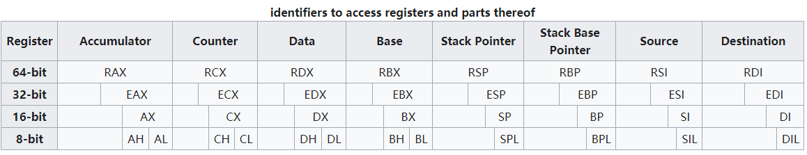
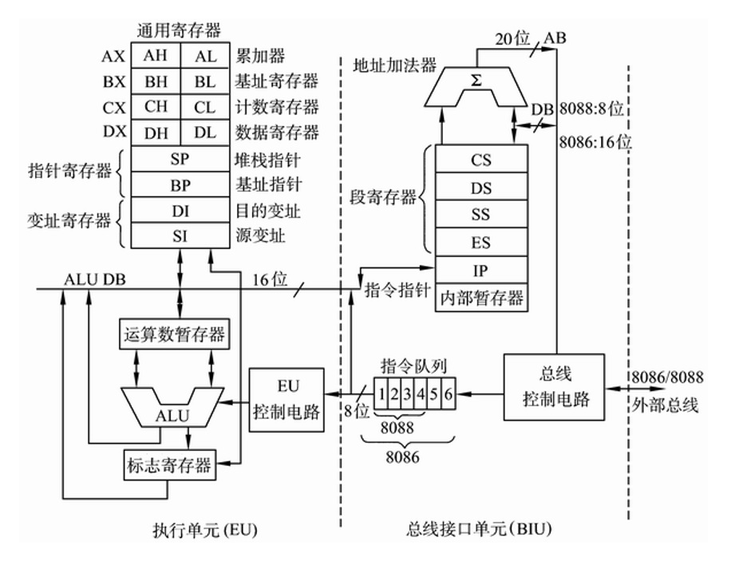
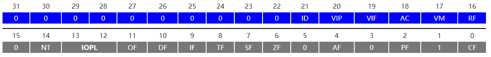
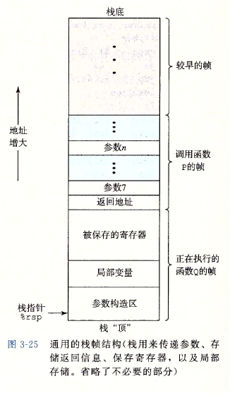
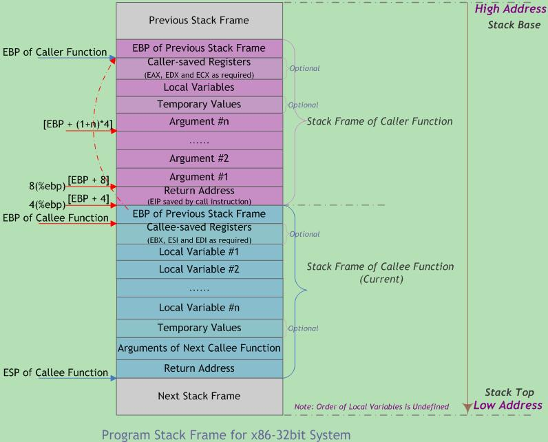
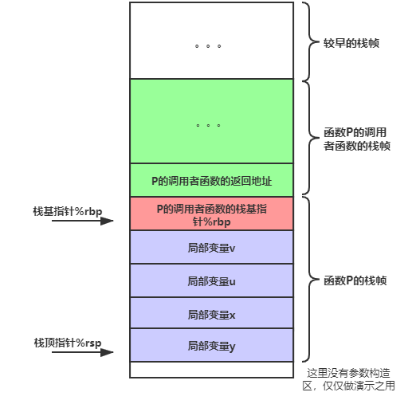
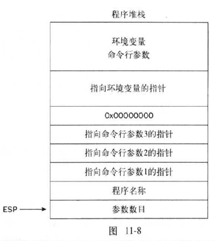
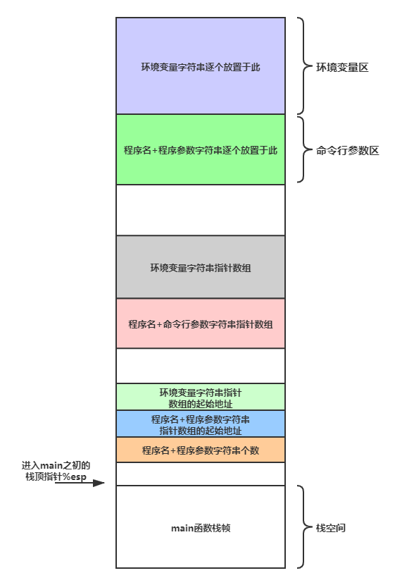

# x86-64汇编语言

## 一、寄存器

### 1.1 通用目的寄存器

| 寄存器 |    子寄存器     |      功能      | 参数寄存器 | 调用时是否需要保存 |
| :----: | :-------------: | :------------: | :--------: | :----------------: |
| `%rax` | `%eax/%ax/%al`  | 累加器、返回值 |            |         x          |
| `%rbx` | `%ebx/%bx/%bl`  |   基址寄存器   |            |    被调函数保存    |
| `%rcx` | `%ecx/%cx/%cl`  |     计数器     |  第四参数  |         x          |
| `%rdx` | `%edx/%dx/%dl`  |   数据寄存器   |  第三参数  |         x          |
| `%rsi` | `%esi/%si/%sil` |  源索引寄存器  |  第二参数  |         x          |
| `%rdi` | `%edi/%di/%dil` | 目的索引寄存器 |  第一参数  |         x          |
| `%rbp` | `%ebp/%bp/%bpl` |    栈基指针    |            |    被调函数保存    |
| `%rsp` | `%esp/%sp/%spl` |    栈顶指针    |            |         x          |
| `%r8`  |  `%r8(d/w/b)`   |                |  第五参数  |         x          |
| `%r9`  |  `%r9(d/w/b)`   |                |  第六参数  |         x          |
| `%r10` |  `%r10(d/w/b)`  |                |            |     调用者保存     |
| `%r11` |  `%r11(d/w/b)`  |                |            |     调用者保存     |
| `%r12` |  `%r12(d/w/b)`  |                |            |    被调函数保存    |
| `%r13` |  `%r13(d/w/b)`  |                |            |    被调函数保存    |
| `%r14` |  `%r14(d/w/b)`  |                |            |    被调函数保存    |
| `%r15` |  `%r15(d/w/b)`  |                |            |    被调函数保存    |



其中`%r8`~`%r15`这部分的寄存器都是自x86-64体系架构之后引入进来的，在此之前的IA-32并不使用它们。除此之外，大多数x86CPU GPR寄存器的由来都是有一定的历史渊源的，从8086CPU设计之初就一直存在，我们可以通过如下的8086CPU结构大致的了解到各个寄存器的作用。




### 1.2 段寄存器

由于历史的因素，在x86-64体系架构中仍然会保留着最早追溯于8086CPU那一个时代的段寄存器。以8086为例之所以需要使用它们最主要的一个原因在于8086CPU中具有这个20条地址总线，这意味着它可以最大寻址$2^{32}$的地址范围，但实际上8086CPU中的寄存器最大也就只有2个字节的长度，即如果仅仅使用单个寄存器来记录内存地址并以此来进行寻址，那么它不可能完整的寻址地址总线提供给它的最大内存地址空间。因此8086CPU的设计人员设计了段+偏移的寻址方式，即让一个段寄存器中的短地址左移一位，然后与另一个寄存器中地址一起组合成一个实际的物理内存地址。

显然在使用x86-64体系的年代，这样段寻址的方式已经没有什么意义了，不过CPU中仍然保留了这些寄存器，并且在现代的操作系统中也很少回去使用它们（可以说是禁止，除了FS和GS这两个寄存器之外）。如下展示了常见的x86-64CPU中的段寄存器：

| 寄存器 |       功能       |
| :----: | :--------------: |
| `%ss`  |   堆栈段寄存器   |
| `%cs`  |   代码段寄存器   |
| `%ds`  |   数据段寄存器   |
| `%es`  |   附加段寄存器   |
| `%fs`  |  更附加段寄存器  |
| `%gs`  | 更更附加段寄存器 |


### 1.3 EFLAGS寄存器

EFLAGS寄存器也被称为标志寄存器或者条件码寄存器，下面我都以标志寄存器进行称呼之。



其中最常用的标志位有如下几个：

| 标志位 |          作用          |
| :----: | :--------------------: |
|   CF   |        进位标志        |
|   PF   |        奇偶标志        |
|   AF   |      辅助进位标志      |
|   ZF   |         零标志         |
|   SF   |        符号标志        |
|   TF   | 陷阱标志(单步中断标志) |
|   IF   |        中断标志        |
|   DF   |        方向标志        |
|   OF   |        溢出标志        |
|  IOPL  |     I/O特权级别域      |


### 1.3 寻址模式

在x86-64中，操作数或寻址方式主要是通过如下三种方式给出：①立即数$\$Imm$；②寄存器$r_a$；③内存引用$(r_a)$。不过实际中它提供了非常多的寻址模式，一种最为通用的方式可以用如下的公式表示：
$$
Imm(r_b,r_i,s)=Imm+R[r_b]+R[r_i]\times{s}
$$

其中Imm是立即数，$r_b$是基址寄存器中的值，$r_i$是变址寄存器中的值，s是比例因子，这种通用的寻址模式在内存数组元素中非常常见，不过更多的是它的衍生方式。下面展示了所有的寻址模式：

|  类型  |       格式       |          操作数          |      名称       |
| :----: | :--------------: | :----------------------: | :-------------: |
| 立即数 |     $\$Imm$      |          $Imm$           |   立即数寻址    |
| 寄存器 |      $r_a$       |         $R[r_a]$         |   寄存器寻址    |
| 存储器 |      $Imm$       |         $M[Imm]$         |    绝对寻址     |
| 存储器 |     $(r_a)$      |       $M[R[r_a]]$        |    间接寻址     |
| 存储器 |    $Imm(r_a)$    |     $M[Imm+R[r_b]]$      | 基址+偏移量寻址 |
| 存储器 |   $(r_b,r_i)$    |    $M[R[r_b]+R[r_i]]$    |    变址寻址     |
| 存储器 |  $Imm(r_b,r_i)$  |  $M[Imm+R[r_b]+R[r_i]]$  |    变址寻址     |
| 存储器 |    $(,r_i,s)$    |      $M[R[r_i]*s]$       |  比例变址寻址   |
| 存储器 |  $Imm(,r_i,s)$   |    $M[Imm+R[r_i]*s]$     |  比例变址寻址   |
| 存储器 |  $(r_b,r_i,s)$   |   $M[R[r_b]+R[r_i]*s]$   |  比例变址寻址   |
| 存储器 | $Imm(r_b,r_i,s)$ | $M[Imm+R[r_b]+R[r_i]*s]$ |  比例变址寻址   |


## 二、汇编指令

### 2.1 数据传送指令

#### 2.1.1 MOV指令

在x86-64汇编语言中我们可以通过如下指令来实现数据在寄存器、存储器或者自立即数之间的数据交换操作：

- **MOV S, D系列指令**：实现将源S中的数据传送到目的位置D中，不过x86-64要求源和目的都不能指向存储器内存位置！
- **MOVZ S，D系列指令**：这种指令和下面的MOVS指令类似，适用于将较小的源值复制到较大的目的时使用，至于怎么填充高端字节位置各有各的不同。在这里MOVZ的作用是将高端字节置为0，Solaris的汇编手册对其的解释是“move and zero extend”。
- **MOVS S，D系列指令**：这种指令与MOVZ不同，它是将高端字节按照较小的源中存储的数据的符号位进行填充，Solaris的汇编语言手册对齐的解释是"move and signextend"。在《汇编语言程序设计》一书中指出这条指令还有无操作数的版本，经常和`rep`重复指令一起用作字符串数据的传送作业（而源地址和目标地址通过%rsi和%rdi进行指定）。

下面仅展示MOV系列指令：

|   指令    |  效果  |        功能        |
| :-------: | :----: | :----------------: |
|  `movb`   | S -> D |      传送字节      |
|  `movw`   | S -> D | 传送字（两个字节） |
|  `movl`   | S -> D |      传送双字      |
|  `movq`   | S -> D |      传送四字      |
| `movabsq` | I -> R |   传送绝对的四字   |


#### 2.1.2 栈操作指令

x86-64体系中压栈和出栈操作指令也是典型的数据传送指令，其中栈的所在（或者说栈的边界）由栈基指针%rbp和栈顶指针%rsp定位。

|       指令        |                  效果                   |            功能            |
| :---------------: | :-------------------------------------: | :------------------------: |
| `push(q/l/w/b) S` | `R[%rsp]=R[%rsp]-8`<br />`M[R[%rsp]]=S` | 将指定大小的数据压入到栈中 |
| `pop(q/l/w/b) D`  | `D=M[R[%rsp]]`<br />`R[%rsp]=R[%rsp]+8` |  从栈中弹出指定大小的数据  |

> 这里并没有介绍`pusha`这个指令，因为这个指令已经在x86-64中失效了，详见https://stackoverflow.com/questions/6837392/how-to-save-the-registers-on-x86-64-for-an-interrupt-service-routine 。


### 2.2 算术与逻辑类指令

#### 2.2.1 加载有效地址

加载有效地址leaq（load effective address）指令虽然听上去是一个取内存单元地址的指令，但实际上它常常用作算术运算指令，而且它常常和上面所述的“寻址模式通用范式”一起使用。

|    指令     |  效果   |         功能         |
| :---------: | :-----: | :------------------: |
| `leaq S, D` | &S -> D | 加载内存单元有效地址 |

例如当我们使用如下指令的时候：

```asm
leaq Imm(%rdi, %rsi, s),  %rax
```

其产生的效果并不是将$M[Imm+R[\%rdi]+R[\%rsi]*s]$这块内存单元中的数据加载到%rax寄存器中，实际产生的效果是将这一内存单元的有效地址，也就是$Imm+R[\%rdi]+R[\%rsi]*s$这一地址传送到%rax寄存器中。

实际上，它在做的是一个算术操作，如果我们将$R[\%rdi]$记作x，将$R[\%rsi]$记作y，那么这个`leaq`指令可以完成$Imm+x+s\times{y}$的复合运算，这显然比下面介绍的`mul`、`add`等指令高级了很多！最后将结果存放到%rax寄存器中。这也是为什么一个取地址的指令会被分类到算术运算指令的缘故。


#### 2.2.2 算术操作指令

算术操作主要有一元操作和二元操作两种，且每一种都有适用于不同字/字节大小的b/w/l/q等变种，如下表所示：

|         指令         |         效果          |   功能   |
| :------------------: | :-------------------: | :------: |
|   `inc(b/w/l/q) D`   |         D=D+1         |   自增   |
|   `dec(b/w/l/q) D`   |         D=D-1         |   自减   |
|  `neg(b/w/l/q) D `   |         D=-D          |   取负   |
|   `not(b/w/l/q) D`   |         D=~D          |   取反   |
| `add(b/w/l/q) S, D`  |         D=D+S         |    加    |
| `sub(b/w/l/q) S, D`  |         D=D-S         |    减    |
| `imul(b/w/l/q) S, D` |         D=D*S         | 有符号乘 |
|  `idiv(b/w/l/q)  S`  | $R[\%rax]=R[\%rax]/S$ | 有符号除 |
| `xor(b/w/l/q) S, D`  |        D=D ^ S        |   异或   |
|  `or(b/w/l/q) S, D`  |       D=D \| S        |    或    |
| `and(b/w/l/q) S, D`  |         D=D&S         |    与    |

> 注意：使用指定的x86-64指令的时候一定要使用对应大小的寄存器。例如试图对%eax进行取反，就不能使用negq，必须使用negl！如果不想犯这个错误，那么我们实际上可以使用干脆地不指定字节或者字的大小，例如对于前面的例子我们可以直接使用neg，而不是negq就不会犯错了。
>
> 还有就是上面的乘法和除法指令会涉及到不止一个寄存器的使用，具体这里因为用不上也就不介绍了。


#### 2.2.3 移位操作指令

x86-64汇编语言包含如下的常见的移位操作（其中sal和sar中的a表示算术Arithmetic，而shl和shr是用来表示逻辑移位的，即指的对最高位不加考虑的无符号形式，所以也叫做无符号移位）：

|        指令         |       效果        |       功能       |
| :-----------------: | :---------------: | :--------------: |
| `sal(b/w/l/q) k, D` |     D <- D<<k     |       左移       |
| `shl(b/w/l/q) k, D` |     D <- D<<k     | 左移（与上相同） |
| `sar(b/w/l/q) k, D` |     D <- D>>k     |       右移       |
| `shr(b/w/l/q) k, D` |     D <- D>>k     | 右移（与上相同） |
| `rol(b/w/l/q) k, D` | D <- D<<(rotate)k |     循环左移     |
| `ror(b/w/l/q) k, D` | D <- D>>(rotate)k |     循环右移     |

其中移位值可以是一个立即数，或者也可以放在寄存器%cl（必须是该寄存器）中给出。在x86-64体系中，移位操作有一个比较麻烦的规则：如果移位操作是对一个w位长的数据值进行操作，那么移位量就会由%cl寄存器中的低m位决定，其中$2^m=w$。

也就说，若%cl寄存器中的数据为0xFF（即1111 1111），那么若使用`salb %cl, %al`，那么由于操作的是一个8位长度寄存器，所以由于$2^3=8$，所以CPU只会取%cl中的低3位。而正由于%cl中的低3位是111b，所以%al左移7位！


#### 2.2.4 其他特殊算术指令

除了上述的一些常见的算术指令之外，x86-64汇编指令还支持一些其他的特殊算术指令，包括一元操作的无符号乘法、一元操作的有符号乘法、二元操作的乘法等等。具体如下表所示：

|         指令         |                        描述                         |             功能              |
| :------------------: | :-------------------------------------------------: | :---------------------------: |
|   `mul(b/w/l/q) S`   |                $R[\%rax]=R[\%rax]*S$                |        一元无符号乘法         |
|  `imul(b/w/l/q) S`   |                $R[\%rax]=R[\%rax]*S$                |     一元有符号(补码)乘法      |
| `imul(b/w/l/q) S, D` |                       D<=D*S                        |           二元乘法            |
|   `div(b/w/l/q) S`   | $R[\%rax]=R[\%rax]/S$<br />$R[\%rdx]=R[\%rax]mod S$ |        一元无符号除法         |
|  `idiv(b/w/l/q) S`   | $R[\%rax]=R[\%rax]/S$<br />$R[\%rdx]=R[\%rax]mod S$ |        一元有符号除法         |
|        `cqto`        |      $R[\%rdx]:R[\%rax]$<-$符号拓展(R[\%rax])$      | 将%rax符号拓展成8字(用于除法) |

> 对于上面的指令，特别需要注意下除法指令被除数、结果的存放，以及它们实际操作的被除数达到的位数。实际上被除数一般就是操作指令的所表达的位数的两倍，结果也是操作指令所表达的位数的两倍，分别都是存放在%?dx和%?ax中。


### 2.3 控制流指令

#### 2.3.1 条件码和比较指令

在x86-64汇编指令中，绝大多数算术和逻辑操作指令（除了leaq指令）的执行结果都有可能会影响到上述标志寄存器中的条件码，最常用的条件码包括如下4个要素，它们是进行分支跳转时的有效依据：

1. CF：进位标志
2. ZF：零标志
3. SF：符号标志
4. OF：溢出标志

在x86汇编指令中，基于条件码的分支跳转更多的是依靠cmp和test这两类指令而不是算术逻辑操作指令，因为它们并不会改变任何寄存器中的值，只会设置标志寄存器中的标志位。就功能而言，cmp类指令功能更像是sub指令；test类指令功能更像是and指令（）。这两类寄存器如下所示：

|      指令      |    描述    |   功能   |
| :------------: | :--------: | :------: |
| `cmpb S1, S2`  | $S_2-S_1$  | 比较字节 |
| `cmpw S1, S2`  | $S_2-S_1$  |  比较字  |
| `cmpl S1, S2`  | $S_2-S_1$  | 比较双字 |
| `cmpq S1, S2`  | $S_2-S_1$  | 比较四字 |
| `testb S1, S2` | $S_1\&S_2$ | 测试字节 |
| `testw S1, S2` | $S_1\&S_2$ |  测试字  |
| `testl S1, S2` | $S_1\&S_2$ | 测试双字 |
| `testq S1, S2` | $S_1\&S_2$ | 测试四字 |

> cmp类指令的作用我们比较好理解，不过test类指令不熟悉的话就会点难以理解。我们知道test类指令的作用类似于and指令，只不过它并不会改变任何目标寄存器的值。所以我们可以预料到这种指令执行的结果并不会导致任何进位或者溢出现象的发生，这也意味着test类指令不会导致进位标志CF和溢出标志位OF的改变；它顶多只会导致零标志ZF和符号标志SF的改变。因此我们可以利用test类指令这个特性来判断两个操作数是否相同，是否是正数，是否是负数（类似于`testq %rax, %rax`这样的指令）。


#### 2.3.2 转移指令

在x86汇编语言中，大多数的转移指令都是有条件的，只有jmp指令是无条件的。它有如下的两种跳转方式：

- **直接跳转**：即跳转目标是指令中的一部分编码，通常它是直接以一个标号的形式给出，如下所示：

  ```bash
  	movq $1, %rax
  	jmp .L1
  	...
  .L1:
  	pushq %rax
  	...
  ```

- **间接跳转**：即跳转目标是从CPU寄存器或者内存单元中读出，通常它的写法是在“*”后面跟一个操作指示符（典型的就是一个寄存器，而寄存器中的数据就是需要跳转的目标地址），如下所示：

  ```bash
  	# 以寄存器%rdx中的数据作为目标跳转地址
  	jmp *%rdx
  	# 以寄存器%rax中的数据所指向的内存单元上的值作为目标跳转地址
  	jmp *(%rax)
  ```

同时x86汇编语言中，如同它远古的祖先8086CPU提供的汇编语言一样，无条件跳转指令jmp主要有两种编码方式：

1. 一种是常用的**PC相对跳转方式**（在8086中称为基于位移或偏移的跳转指令）。在这种编码方式中，目标指令的地址与紧跟在跳转指令后面的那条指令的地址之间的差作为jmp中的编码；
2. 另一种则是**绝对地址跳转方式**（在8086中称为基于目的地址的跳转指令）。在这种编码方式中，目标地址通过绝对地址的形式给出。


#### 2.3.3 条件控制指令

对于标志寄存器而言，任务标志位都是不能直接读取，其主要常用来在其他的控制指令上起作用。最常用的使用方法有如下三种：

- 根据条件码的某种组合将一个字节设置为0或者1，也叫做条件置位
- 根据条件码进行分支跳转，也叫做条件转移
- 根据条件码进行数据传送，也叫做条件传送


##### 2.3.3.1 条件置位指令

条件置位指令如上所述指的就是根据标志寄存器中条件码反应的情况将给定的单字节寄存器或者一个字节大小的存储器元素置为0或者1，常见的部分如下所示：

|   指令    | 同义指令 |         效果         |       设置条件       |
| :-------: | :------: | :------------------: | :------------------: |
| `sete D`  |  `setz`  |       D <- ZF        |       相等/零        |
| `setne D` | `setnz`  |       D <- ~ZF       |      不等/非零       |
| `sets D`  |          |       D <- SF        |         负数         |
| `setns D` |          |       D <- ~SF       |        非负数        |
| `setg D`  | `setnle` | D <- \~(SF^OF)\&\~ZF |    >大于(有符号)     |
| `setge D` | `setnl`  |    D <- ~(SF^OF)     |  >=大于等于(有符号)  |
| `setl D`  | `setnge` |      D <- SF^OF      |    <小于(有符号)     |
| `setle D` | `setng`  |  D <- \~(SF^OF)\|ZF  |  <=小于等于(有符号)  |
| `seta D`  | `setnbe` |    D <- \~CF&\~ZF    |    >超过(无符号)     |
| `setae D` | `setnb`  |      D <- \~CF       | >=超过或等于(无符号) |
| `setb D`  | `setnae` |       D <- CF        |    <低于(无符号)     |
| `setbe D` | `setna`  |     D <- CF\|ZF      | <=低于或等于(无符号) |

>  由于这些条件置位命令只会使得一个字节大小存储单元或者低位字节的寄存器元素置1或0，若我们需要获得更大的32位或64位结果，就必须对高位的字节进行清零。我们可以通过`movzbl`这样的数据传送指令完成删除的任务。例如我们想要得到一个32位乃至64位的结果，可以使用`movzbl %al, %eax`指令。


##### 2.3.3.2 条件转移指令

在x86-64中主要包含如下的条件转移指令：

|    指令     | 同义名 |    跳转条件    |           描述           |
| :---------: | :----: | :------------: | :----------------------: |
| `je Label`  |   jz   |       ZF       |      相等/零时跳转       |
| `jne Label` |  jnz   |      ~ZF       |      不等/非零跳转       |
| `js Label`  |        |       SF       |        负数时跳转        |
| `jns Label` |        |      ~SF       |       非负数时跳转       |
| `jg Label`  |  jnle  | \~(SF^OF)&\~ZF |    (有符号)大于时跳转    |
| `jge Label` |  jnl   |    ~(SF^OF)    | (有符号)大于或等于时跳转 |
| `jl Label`  |  jnge  |    (SF^OF)     |    (有符号)小于时跳转    |
| `jle Label` |  jng   |  (SF^OF)\|ZF   | (有符号)小于或等于时跳转 |
| `ja Label`  |  jnbe  |   \~CF&\~ZF    |    (无符号)超过时跳转    |
| `jae Label` |  jnb   |      ~CF       | (无符号)超过或等于时跳转 |
| `jb Label`  |  jnae  |       CF       |    (无符号)低于时跳转    |
| `jbe Label` |  jna   |     CF\|ZF     | (无符号)低于或等于时跳转 |


##### 2.3.3.3 条件传送指令

在一般的情况下，像if-else这样的分支判断更多的是使用x86-64中的条件转移指令来实现。但实际上由于现代CPU动态多发射、多流水线的特性，使用这种条件转移指令来完成上述的操作往往不得不需要CPU做出分支预测才能得到执行。但问题是分支预测存在错误的可能，若是这样，那么CPU就不得不将先前执行的指令进行回撤，从而浪费了多个CPU时钟周期。

因此为了避免分支预测错误所造成的指令工作丢弃现象，尽可能最大程度的提高程序执行的性能，x86汇编语言中出现了条件传送指令。这种指令要求程序同时计算两种分支情况下的所有结果，然后再根据条件是否满足从中选取一个作为最终的结果，这样的好处在于CPU不需要做分支预测的工作，也就使得流水线中能够更好地充满执行的指令。常见的条件传送指令如下所示：

|     指令      | 同义名  |    跳转条件    |           描述           |
| :-----------: | :-----: | :------------: | :----------------------: |
| `cmove S, R`  |  cmovz  |       ZF       |      相等/零时传送       |
| `cmovne S, R` | cmovnz  |      ~ZF       |      不等/非零传送       |
| `cmovs S, R`  |         |       SF       |        负数时传送        |
| `cmovns S, R` |         |      ~SF       |       非负数时传送       |
| `cmovg S, R`  | cmovnle | \~(SF^OF)&\~ZF |    (有符号)大于时传送    |
| `cmovge S, R` | cmovnl  |    ~(SF^OF)    | (有符号)大于或等于时传送 |
| `cmovl S, R`  | cmovnge |    (SF^OF)     |    (有符号)小于时传送    |
| `cmovle S, R` | cmovng  |  (SF^OF)\|ZF   | (有符号)小于或等于时传送 |
| `cmova S, R`  | cmovnbe |   \~CF&\~ZF    |    (无符号)超过时传送    |
| `cmovae S, R` | cmovnb  |      ~CF       | (无符号)超过或等于时传送 |
| `cmovb S, R`  | cmovnae |       CF       |    (无符号)低于时传送    |
| `cmovbe S, R` | cmovna  |     CF\|ZF     | (无符号)低于或等于时传送 |

例如对于条件表达式`v = test-expr? then-expr: else-expr;`，使用条件转移指令会议如下形式进行实现（使用伪代码来展示）：

```c
    if(!test-expr)
        goto false;
    v=then-expr;
    goto done;
false:
	v=else-expr;
done:
```

而对于条件传送指令，它会以如下的形式进行实现：

```c
v = then-expr;
ve = else-expr;
t = test-expr;
if(!t) v = ve; // 实际中这条即用cmovxx来表示
```


#### 2.3.4 实现C语言条件分支

在一般的情况下（不考虑上面介绍的条件传送所带来的指令优化），C语言中的条件分支功能（包括if-else语句、do-while循环、while循环、for循环、switch语句）基本上都是由x86-64汇编语言中的条件转移指令来实现的。我们使用C伪代码来表示这些实现，其中我们用`if(!t) goto ...;`来表示`jne`、`jge`等条件转移指令。

对于**if-else语句**，编译器会将其转化为如下形式的汇编语言：

```c
	t=test-expr;
	if(!t)
        goto false;
	then-statement;
	goto done;
false:
	else-statement;
done:
```

对于do-while循环，编译器会将其转换为如下形式的汇编语言：

```c
loop:
	body-statement;
	t=test-expr;
	if(t)
        goto loop;
```

对于while循环，编译器会将其转换为如下形式的汇编语言：

```c
// 第一种实现方式：跳转到中间的实现方式
	goto test;
loop:
	body-statement;
test:
	t=test-expr;
	if(t)
        goto loop;

// 第二种实现方式：guarded-do实现方式：条件分支+do-while的形式
	t=test-expr;
	if(!t)
        goto done;
loop:
	body-statement;
	t=test-expr;
	if(t)
        goto loop;
done:
```

对于for循环，由于它可以转换成while语句，所以相应的编译器也就会对其在适当时机转换成如下两种形式：

```c
// 跳转到中间的实现方式：
	init-expr;
	goto test;
loop:
	body-statement;
	update-expr;
test:
	t=test-expr;
	if(t)
        goto loop;

// guarded-do实现方式：
	init-expr;
	t=test-expr;
	if(!t)
        goto done;
loop:
	body-statement;
	update-expr;
	t=test-expr;
	if(t)
       goto loop;
done:
```

对于switch语句，如果语句所具有的选择项数比较少，那么switch语句相应的就会被编译器使用较为简单的if-else转换形式所实现。但如果语句的选择项数较多，使用条件转移指令所造成的分支预测性能开销较大，那么编译器就会使用跳转表的形式来实现之。

跳转表可以认为是一个内含目标跳转地址的数组，采用了这种方式的汇编代码会根据switch开关索引值i来对跳跃表中的元素进行选择，然后跳转到指定的目标地址上继续执行，从而以固定成本的方式实现switch分支转移（相较于直接使用条件转移指令少了不少性能开销）。一般其形式类似如下所示：

```c
	index=calculate_index_statement;
	if(index out of range)
        goto default;
	goto jmpTbl[index];
L1:
	L1-statement;
	goto done;
L2:
	L2-statement;
	goto done;
L3:
	L3-statement;
	goto done;
L4:
	L4-statement;
	goto done;
default:
	default-statement;
done:
	...
        
// 只读数据区
jmpTbl:
	L1
    L2
	L3
    L4
```


### 2.4 其他指令

AT&T汇编指令远远不止上述的那些，我们可以通过Oracle公司提供的[Solaris x86-64汇编指令参考手册](docs/817-5477.pdf)来进行详细的查询，不过这个手册虽然全面，但并没有对每一个指令做出非常详细的解释和用法，或者在Richard Blum所著的《[汇编语言程序设计](docs/Professional Assembly Language.pdf)》中进行查询。


## 三、==过程调用==

为了实现过程，汇编语言（以及计算机体系本身）必须提供如下的三种机制，这样才能使得子过程的调用能够得到顺利的执行并且能够顺利的返回：

- **传递控制机制**：即必须能够支持转移控制的能力，使得在进入子过程Q时，程序计数器PC能够设置为Q代码中的起始地址，并在返回的时候将PC设置为调用者过程P中调用Q后面那条指令的地址。
- **传递数据机制**：调用者过程P必须能够向Q提供一个或多个参数，而子过程则必须能够向P返回一个值。
- **分配和释放内存**：在开始时，子过程Q可能需要为局部变量分配空间，而在返回前又能够释放这些内存空间。


### 3.1 运行时栈



上图展示了一个典型的x86-64体系架构下的调用函数运行栈和被调用函数运行栈内存布局。

与上一代IA-32相同，在被调函数被执行的前一刻，调用函数的返回地址会被压入到调用者P栈帧的最后，然后开始执行被调用函数。进入后，程序会先保存原先的CPU寄存器（包括栈基指针%rbp并用当前的%rsp重新设定它，此时标志着一个实际意义的新函数栈帧的出现），然后通过减少栈顶指针%rsp的方式分配出栈帧中的局部空间，依次作为函数局部变量和形参变量存储之所。如果这个函数在内部还需要调用别的函数，那么该函数栈帧还可能会分配出新的空间来展示保存函数实参。

不过与前面几代x86体系架构不同的是，**在x86-64体系中改变了函数调用过程中参数的存放位置**。在IA-32甚至更早版本的x86体系中，函数调用过程中的参数无论数量有多少都会被压入到调用函数的运行栈中（位于它的局部变量存放区之后、返回地址存放位置之前）。但现在在x86-64中，这种布局被彻底的改变。

为了提高空间和时间的效率，x86-64过程只会为分配自己需要的栈帧部分，而在大多数的过程调用中，很少有函数需要多于6个以上的参数。**所以x86-64过程在调用之时会将前6个参数存放到%rdi、%rsi、%rdx、%rcx、%r8和%r9这6个参数寄存器中，只有在多于6个参数的情况下才会在调用函数的栈帧中压入从第7个开始的参数。**这一特点也就导致了x86-64体系下编译产生的汇编代码与IA-32体系下编译产生的汇编代码有着截然不同的样子，而且我自己也之前固执的认为所有的过程调用栈帧应该是下面的样子，实际上这只不过是在IA-32体系下的样子：



> 这个问答解释了为什么在x86-64上是通过参数寄存器而不是使用压栈的方式来传递函数参数的原因：https://stackoverflow.com/questions/38955064/why-parameters-stored-in-registers-and-not-on-the-stack-in-x86-64-assembly。


### 3.2 传递控制

我们知道了为了实现函数的调用，程序必须将程序计数器PC（即%rip）设置为目标函数的入口地址才能完成控制的转移。不过为了能够在执行完子函数之后返回到调用者函数中继续执行，我们必须将调用函数指令后面的那条指令的地址记录起来，这样我们就可以在被调函数执行完之后继续执行下一条指令。

在x86-64汇编语言中，控制的转移主要依靠call和ret指令来完成，如下所示：

|      指令       |             描述             |                 功能                 |
| :-------------: | :--------------------------: | :----------------------------------: |
|  `call Label`   |        过程(直接)调用        | 压栈返回地址并设置%rip为目标函数地址 |
| `call *Operand` |        过程(间接)调用        | 压栈返回地址并设置%rip为目标函数地址 |
|      `ret`      | 从被调函数中返回到调用者函数 |      弹出返回地址并以之设置%rip      |

> 与无条件跳转指令相同，call指令也有直接转移和间接转移之分，例如`call *rdx`就是典型的间接调用，我们在C++虚函数调用的产生的汇编语言中经常见到这条指令。


### 3.3 传递数据

调用者函数和被调函数之间需要进行数据传送，我们通过参数的方式向被调用函数传送数据，与之相反被调用函数通过返回值的方式向调用者函数传送数据。

如上所述，在x86-64体系中前6个函数参数通过6个参数寄存器的方式向被调函数进行数据传送，而从第7个开始的参数则只能以压入调用者函数栈帧，然后让被调用函数依据相对于%rbp的偏移来进行访问。不过，被调用函数的返回值存放地点总是固定的，它永远都是存放在%rax之中。


### 3.4 分配和释放空间

一般来说，如果函数简单且仅仅需要CPU寄存器就可以完成执行任务，那么函数并不会为函数的运行栈分配更多的空间，只有当如下情况才会为在栈上进行局部存储（我们把这块区域称为局部变量区）：

- 寄存器不足以存放所有本地数据
- 对一个局部变量使用了取地址运算符&
- 某些局部变量是数组或结构体

一般而言，**过程通过减少栈顶指针%rsp的方式来达到在栈上分配局部变量空间的目的，与之相反则是通过增大栈顶指针的方式来实现运行栈中局部变量空间的回收释放**。

对于前者我们可以直接使用`subq`指令来完成，而后者既可以通过`addq`指令来完成，也可以通过`leaveq`指令来完成。`leaveq`这条指令等同于如下两条指令的结合：

```c
	movq %rbp, %rsp
    popq %rbp
```

它的作用很简单，就是通过将栈顶指针%rsp重设成%rbp，这样整个被调用函数的栈帧除保存的上一个函数栈帧的栈基指针old %rbp都会被自动丢弃，然后弹出old %rbp恢复到栈底指针%rbp中，从而实现整个被调函数栈帧的回收释放。


除了为函数执行过程中的局部变量分配“局部变量空间”之外，函数执行之初还有可能为其所使用到的寄存器保存在函数的栈帧之中。由于寄存器是所有过程共享的资源，我们很难保证在函数执行的过程中是否还会继续调用别的函数，因此函数需要在其执行的过程中保存那些当前函数会使用到的CPU寄存器数据。这些数据的保存并不是通过`subq`指令来完成，而是通过`pushq`指令来完成。我们把这块栈帧中的局部存储空间称为“被保存的寄存器区”。上一个过程栈帧的栈基指针%rbp就是一个每个函数都会保存的寄存器。

根据x86-64的惯例**，寄存器%rbx、%rbp和%r12~%r15被定义为“被调用者保存寄存器”**，这说明这些寄存器都是由被调用函数在执行之初根据实际使用情况通过`pushq`指令保存的。而所有其他除了栈顶指针%rsp的寄存器都被定义为“调用者保存寄存器”，这说明任何函数都可以随意的修改它们，保存与否的责任是当前函数自己的责任，别的函数不关心。

> 因此按照这条规则推测，一般在汇编语言中尽可能将重要的数据都保存在上述的“被调用者保存寄存器”中，因为其他的函数在被调用时会对其进行自动保存，所以它可以放心的使用。


### 3.5 一个过程实例

我们以如下CSAPP使用的两个函数来展示一个实际的x86-64过程调用中发生了什么。

```c
long Q(long a) {
	return a;
}

long P(long x, long y) {
	long u = Q(y);
	long v = Q(x);
	return u + v;
}

int main() {
    P(1, 2);
    return 0;
}
```

下面是上述函数经过无优化编译产生的x86-64汇编代码（其中endbr64指令意为end branch 64bit，表示用来终止64位间接分支，主要由处理器管道用作标记指令以检测是否存在违反控制流的行为，我们可以将其视为nop指令）：

```c
0000000000001149 <Q>:
    1149:	f3 0f 1e fa          	endbr64 
    114d:	55                   	push   %rbp
    114e:	48 89 e5             	mov    %rsp,%rbp
    1151:	48 89 7d f8          	mov    %rdi,-0x8(%rbp)
    1155:	48 8b 45 f8          	mov    -0x8(%rbp),%rax
    1159:	5d                   	pop    %rbp
    115a:	c3                   	retq   

000000000000115b <P>:
    115b:	f3 0f 1e fa          	endbr64 
	// 保存栈基指针%rbp，然后将当前栈顶指针%rsp赋给它
    115f:	55                   	push   %rbp
    1160:	48 89 e5             	mov    %rsp,%rbp
	// 分配栈帧局部存储空间，并保存参数寄存器到被调函数栈帧上
    1163:	48 83 ec 20          	sub    $0x20,%rsp
    1167:	48 89 7d e8          	mov    %rdi,-0x18(%rbp)
    116b:	48 89 75 e0          	mov    %rsi,-0x20(%rbp)
	// 准备参数然后开始第一次调用函数Q()
    116f:	48 8b 45 e0          	mov    -0x20(%rbp),%rax
    1173:	48 89 c7             	mov    %rax,%rdi
    1176:	e8 ce ff ff ff       	callq  1149 <Q>
	// 将第一次Q的返回结果放入到栈帧相应的位置上
    117b:	48 89 45 f0          	mov    %rax,-0x10(%rbp)
	// 准备参数然后开始第二次调用函数Q()
    117f:	48 8b 45 e8          	mov    -0x18(%rbp),%rax
    1183:	48 89 c7             	mov    %rax,%rdi
    1186:	e8 be ff ff ff       	callq  1149 <Q>
	// 将第二次的返回结果放入到栈帧相应的位置上
    118b:	48 89 45 f8          	mov    %rax,-0x8(%rbp)
	// 计算最后的返回结果并最终放入到%rax中
    118f:	48 8b 55 f0          	mov    -0x10(%rbp),%rdx
    1193:	48 8b 45 f8          	mov    -0x8(%rbp),%rax
    1197:	48 01 d0             	add    %rdx,%rax
	// 释放被调函数的栈帧并恢复调用者函数的栈基指针%rbp，然后返回
    119a:	c9                   	leaveq 
    119b:	c3                   	retq   
        
000000000000119c <main>:
    119c:	f3 0f 1e fa          	endbr64 
    11a0:	55                   	push   %rbp
    11a1:	48 89 e5             	mov    %rsp,%rbp
    11a4:	be 02 00 00 00       	mov    $0x2,%esi
    11a9:	bf 01 00 00 00       	mov    $0x1,%edi
    11ae:	e8 a8 ff ff ff       	callq  115b <P>
```

从上面gcc编译器产生的汇编代码可以看出，实际的x86-64函数调用过程基本上与我们前面几个小节所述的内容基本上没有什么差别，从开始调用到结束调用（以调用`Q()`为例）主要做了如下的几个工作：

1. **调用者函数准备好参数，将其传送到参数寄存器中或调用者栈帧中**
2. **使用call指令开始调用指定函数**
3. **进入被调函数之后，首先使用push保存该函数会使用到的”被调用者保存寄存器“**（其中每一个函数都会保存上一个栈帧的栈基指针%rbp）
4. **使用sub指令减少栈顶指针来分配局部变量空间并初始化**
5. 开始处理，期间可能调用别的函数，此时可能会为在栈帧中分配出参数构造区
6. **基本到了末尾就会计算出函数的返回值放入到%rax中**
7. **使用pop恢复寄存器，并调用leaveq指令回收当前栈帧，恢复到上一个过程的栈基指针**
8. **使用retq返回到调用者函数，此时%rip恢复为原先调用指令的下一条指令的地址**

下图展示了上面Q函数调用过程中呈现的函数运行栈：



我们可以通过gdb调试工具验证这一布局的正确性：

```bash
Breakpoint 1, P (x=1, y=2) at main.c:10
10              return u + v;
(gdb) print /x $rbp   # 栈基的地址
$1 = 0x7fffffffdd70
(gdb) print &v
$2 = (long *) 0x7fffffffdd68
(gdb) print &u
$3 = (long *) 0x7fffffffdd60
(gdb) print &x
$4 = (long *) 0x7fffffffdd58
(gdb) print &y
$5 = (long *) 0x7fffffffdd50
(gdb) print /x $rsp
$6 = 0x7fffffffdd50   # 栈顶的地址
```


### 3.6 System V ABI约定

实际上对于x86-64的过程调用是有着一份十分详细的约定的，这个约定非常复杂，简单的说主要是如下几个常用的点：

- **整数参数(包含指针）依次放在%rdi, %rsi, %rdx, %rcx, %r8, 和 %r9 寄存器中**；
- **浮点参数依次放在寄存器%xmm0-%xmm7中**；
- **寄存器不够用时，参数放到栈中**；
- **可变参数函数(如printf), 寄存器%eax需记录下浮点参数的个数**（这也是为什么在printf之前有一个操作%eax的动作的原因）；
- **被调用的函数可以使用任何寄存器，但它必须保证%rbx, %rbp, %rsp, and %r12-%r15恢复到原来的值**（如果它改变了它们的值）；
- **返回值存储在%rax中**。若为128位数据，则高64位保存在%rdx中；
- **信号处理程序在同一堆栈上执行，但是在将任何内容压入堆栈之前，会从堆栈中减去称为红色区域的`128`个字节。** 这允许小的叶子函数使用`128`字节的堆栈空间，而无需通过从堆栈指针中减去来保留堆栈空间。 众所周知，红色区域会给x86-64内核开发人员造成问题，因为在调用中断处理程序时，CPU本身并不尊重红色区域。 由于ABI与CPU行为相矛盾，这会导致微妙的内核损坏。 解决方案是使用`-mno-red-zone`或通过在内核模式下在当前堆栈以外的其他堆栈上处理中断来构建所有内核代码（从而实现ABI）。

具体这份文档可以访问[www.x86-64.org](www.x86-64.org)进行查看。


## 四、再探堆栈

### 4. 1 防止缓冲区溢出

缓冲区溢出是程序运行时最基本最需要避免的，因为这种现象导致的内存越界访问从小的角度讲很有可能会导致程序运行过程中数据的错乱，从大的角度讲它会给非法分子攻击系统留下破绽，最典型的就是蠕虫。蠕虫正是利用程序中缓冲区溢出的bug，向缓冲区中写入可以运行的二进制攻击指令（code injection attack），并同时覆盖当前函数的调用者栈帧中的返回地址，从而使得在当前函数返回之时自动让CPU开始从攻击代码的地方运行，从而达到攻击系统的目的。

因此防止缓冲区溢出步进需要从程序编写着的角度进行防范，操作系统、编译器都需要对其进行一定的防范。


#### 4.1.1 栈随机化

在Linux操作系统中一种最为常见的防范缓冲区溢出引发的蠕虫攻击的方法就是使用栈随机化。它的核心思想就是让函数运行栈位置在程序每次运行的过程中都发生变化。最简单的实现方式就是在栈上分配以断0~n字节之间的随机大小的空间。这样攻击者就不能准确的判断上一个栈帧的返回地址存放在何处，从而在一定程度上避免了蠕虫攻击。

同时栈随机化还有这更大的拓展，即地址空间布局随机化ASLR。操作系统不仅会将程序执行过程中的栈位置进行随机化，而且它会将程序的不同部分，包括代码、库代码、栈、全局变量和堆数据都在每次运行时加载到不同的地址区域中。


#### 4.1.2 栈帧金丝雀

防止缓冲区溢出的另一种方法就是使用“栈保护机制”来检测缓冲区是否发生溢出现象。其思想就是在栈帧中的的任何局部缓冲区于栈状态之间存储一个特殊的金丝雀值，我们称这个值为“堆栈金丝雀”或“栈帧金丝雀”。

该金丝雀值会在程序运行时随机产生，并在进入函数之后放置到指定的位置（一般是在局部缓冲区的上面）。如果在函数执行的过程中发生了缓冲区溢出，那么这个金丝雀值就会被覆盖。因此在函数返回之前通过与原先放入的金丝雀值进行相等性比对就可以知道执行过程中是否发生了缓冲区溢出的现象。如果是，那么程序就会被异常中止，从而避免了缓冲区溢出造成的恶果。

我们使用一个实际的C语言程序产生的x86-64汇编代码来展示“堆栈金丝雀”，其原C代码如下所示：

```c
char * _get(char* s) {
    return s;
}

char * _put(char* s) {
    return s;
}

void test() {
    char buf[8];
    _get(buf);
    _put(buf);
}
```

下面是其使用gcc编译产生的汇编代码（准确的说是我自己在gdb中用了反汇编），可以看到在该函数`test()`的栈帧中不仅分配了一个8字节大小的局部缓冲区，而在它的上面分配并放置了一个金丝雀值，同时在函数的最后还会有一个检测金丝雀值是否改变的代码片段：

```c
(gdb) disas 
Dump of assembler code for function test:
   0x000055555555516d <+0>:     endbr64 
   0x0000555555555171 <+4>:     push   %rbp
   0x0000555555555172 <+5>:     mov    %rsp,%rbp
   0x0000555555555175 <+8>:     sub    $0x10,%rsp
   // 向堆栈数组的末尾位置放入一个“堆栈金丝雀”，它可以用来检测程序执行过程
   // 中是否发生了缓冲区溢出问题，所以这个栈帧分配了16字节的内存空间
   0x0000555555555179 <+12>:    mov    %fs:0x28,%rax
   0x0000555555555182 <+21>:    mov    %rax,-0x8(%rbp)
   // 调用_get()
   0x0000555555555186 <+25>:    xor    %eax,%eax
   0x0000555555555188 <+27>:    lea    -0x10(%rbp),%rax
   0x000055555555518c <+31>:    mov    %rax,%rdi
   0x000055555555518f <+34>:    callq  0x555555555149 <_get>
   // 调用_put()
   0x0000555555555194 <+39>:    lea    -0x10(%rbp),%rax
   0x0000555555555198 <+43>:    mov    %rax,%rdi
   0x000055555555519b <+46>:    callq  0x55555555515b <_put>

=> 0x00005555555551a0 <+51>:    nop
   // 重新加载”堆栈金丝雀“的值，将其与栈帧中的“堆栈金丝雀”值是否相同，如果
   // 相同那么说明发生了缓冲区溢出，此时调用__stack_chk_fail终止程序运行
   0x00005555555551a1 <+52>:    mov    -0x8(%rbp),%rax
   0x00005555555551a5 <+56>:    xor    %fs:0x28,%rax
   0x00005555555551ae <+65>:    je     0x5555555551b5 <test+72>
   0x00005555555551b0 <+67>:    callq  0x555555555050 <__stack_chk_fail@plt>
   
   0x00005555555551b5 <+72>:    leaveq 
   0x00005555555551b6 <+73>:    retq 
```

> 我们可以在编译时有选择的指定-fno-stack-protector /-fstack-protector / -fstack-protector-all (关闭 / 开启 / 全开启)来使用栈帧金丝雀。


#### 4.1.3 限制可执行区域

另一种最简单的防止缓冲区溢出造成的蠕虫攻击的方法就是限制程序地址空间中可执行代码的区域。自然的将程序指令可执行的区域仅仅限制在程序地址空间的代码段中，而不允许程序在别的区域（包括栈空间）中执行，那么蠕虫即使将可执行代码放入到栈空间的缓冲区中并覆盖更多的缓冲区以外的栈空间，也不可能使蠕虫攻击代码真的生效。

> 我们可以在编译时有选择地指定-z execstack / -z noexecstack (关闭 / 开启)来限定可执行区域。


### 4.2 变长栈帧

在默认情况下的我们进行C编程的时候定义的数组都是指定常量大小的，因此编译器能够根据代码预先知道自己需要为当前函数的栈帧分配多少的局部存储空间。但由于C98中变长数组（并不是指数组大小可以动态增减，而是指数组长度在定义时可以以变量的形式提供）的出现显然使得这样的编译器预先判定行为不再有效，因此在含有这样变长数组的函数中不再能以立即数的方式（例如`subq $64, %rsp`）分配局部数组变量的空间。

不过万变不离其宗，这个变长数组所在局部存储空间的分配仍然是通过减少栈顶指针%rsp的方式来实现，只是这次需要通过动态的加载数组长度变量到某一个寄存器，然后用这个寄存器的值去减去%rsp。这种方式所带给函数栈帧空间管理的变化在于：

1. 由于栈帧空间的分配和释放不能再以立即数的形式用一条指令实现，所以**为了变长栈帧空间管理的方便，其所产生的汇编引入了栈基指针%rbp来对函数栈帧进行定界管理**：在函数进入之初使用`push`保存旧的栈基指针%rbp，在函数返回之前使用`leave`恢复%rbp和%rsp。
2. **同时为了数组地址对齐的考虑，函数的汇编代码中就可能引入非常多看上去无关的计算代码**。实际上很多情况下它们是在为变长数组需要分配多大的空间进行计算，以及计算数组应该从哪个地址开始才能符合对齐的要求等等。


正如CSAPP中的例子所示，在函数之初使用了`pushq %rbp`这样的指令来保存栈基指针，而在返回之前使用了`leave`指令。同时函数中”无端“的出现了很多的andq、subq、leaq、shrq的算术指令，实际上它们要不就是在考虑数组对齐因素，计算到底应该为变长数组分配多大的局部存储空间（实际分配的局部存储空间会比变长数组真正需要的多一些），要不就是在计算变长数组的起始地址。在自己的测试中，gcc产生的汇编语言确实会像上面一样考虑内存对齐因素，但它分配的空间可能真的不是8n字节，好像是直接分配4096大小的空间？？且汇编代码非常难以阅读。。。不过上述的知识点我们只要了解即可。


> 这里可能产生疑问，为什么是因为变长数组/变长栈帧才引入栈基指针%rbp的使用？不是实际上所有函数的汇编语言都在使用%rbp吗？
>
> 实际上在x86-64体系中，设计者认为只有在栈帧长度可变的情况下才需要使用栈基指针%rbp来对栈帧进行定界，这样可以方便栈帧空间分配和释放的管理；而其他情况下只需要把%rbp当作是一个普通的被调用者保存寄存器即可，因为这些情况下不使用%rbp也可以很好的管理栈帧空间。
>
> 只不过在实际中，gcc编译器产生的代码并没有改变IA-32中对栈基指针%rbp的使用习惯，导致每一个函数所产生的汇编代码仍然都在函数之初压栈%rbp，在返回之前恢复之。如果想要消除这个现象，那么我们可以编译代码的时候加入`-fomit-frame-pointer`选项，此时输出的汇编代码只有在使用变长栈帧的时候使用栈基指针%rbp来对过程栈帧进行定界。


## 五、使用汇编程序

### 5.1 AT&T汇编程序范例

AT&T汇编程序有着如下的最基本的通用程序模板：

```assembly
.section .data
	# 初始化的全局/静态数据放在这里
.section .bss
	# 未初始化的全局/静态数据放在这里
.section .text
.globl _start
_start:
	# 执行代码可以放在这里
```

一般而言，汇编程序中必然是有代码段的部分，所以`.section .text`后面的部分必然是存在的，而对于数据段和bss段需要根据自身的情况进行选择。其中还有一些在汇编程序中常见的指示符（汇编器命令）也需要在此进行交代，如下为组成程序的基本指示符：

|             指示符             |                             描述                             |
| :----------------------------: | :----------------------------------------------------------: |
|     `.align integer, pad`      |      下面的数据以integer字节进行对齐，并以pad值进行填充      |
| `.section section, attributes` | 声明当前段的类型，其类型主要包括<br />`.data`、`.rodata`、`.bss`、`.text`4种类型 |
|  `.globl symbol1, symbol2...`  | 表示当前程序中可外部链接的代码段标签，特别的<br />`_start`标签会被程序认定是程序的起始执行点 |
|  `.type funcname, @function`   |          为汇编器声明函数名称，并以funcname标签开始          |

如下为在程序中定义数据的基本指示符：

|             指示符             |                          描述                           |
| :----------------------------: | :-----------------------------------------------------: |
|       `.ascii "string"`        |         表示后面的是一个以非空字符结尾的字符串          |
|       `.asciz "string"`        |          表示后面是一个以以空字符结尾的字符串           |
| `.comm name, size, alignment`  |        在bss段中声明未初始化的数据的通用内存区域        |
| `.lcomm name, size, alignment` |      在bss段中声明未初始化的数据的本地通用内存区域      |
|       `.string "string"`       | 在当前的位置放入一个以空字符结尾的字符串，不能放在bss段 |
|        `.equ name, val`        |              定义静态符号，使之代表一个值               |
|    `.byte byte1, byte2,...`    |                      定义单字节值                       |
|  `.2byte expr1, expr2, ...,`   |                       定义2字节值                       |
|  `.4byte expr1, expr2, ...,`   |                       定义4字节值                       |
|  `.8byte expr1, expr2, ...,`   |                       定义8字节值                       |
|        `.double float`         |                    定义双精度浮点数                     |
|         `.float float`         |                    定义单精度浮点数                     |
|           `.int int`           |                      定义4字节整数                      |
|          `.long long`          |                      定义4字节整数                      |
|          `.octa octa`          |                     定义16字节整数                      |
|          `.quad quad`          |                      定义8字节整数                      |
|         `.short short`         |                      定义2字节整数                      |
|        `.single single`        |                    定义单精度浮点数                     |


下面以一个调用printf输出当前计算机CPUID的程序为例展示AT&T汇编语言的使用：

```assembly
    .align 8
.section .data
cpustr:
    .asciz "The processor Vendor ID is '%s'\n"

.section .bss
    .lcomm buffer 12
    
.section .text
.globl main
main:
	# 执行cpuid指令
    movq $0, %rax
    cpuid
    # 将cpuid指令产生的字符串送入到buffer中
    movq $buffer, %rsi
    movl %ebx, 0(%rsi)
    movl %edx, 4(%rsi)
    movl %ecx, 8(%rsi)
    movq $cpustr, %rdi
    xorq %rax, %rax
    # 准备好参数之后，调用C库中的printf函数
    callq printf
    # 准备返回值，最后调用C库中的exit函数
    movq $0, %rdi
    callq exit

```

为了方面C库中`printf`和`exit`函数的链接，我们使用gcc来进行汇编、链接产生可执行文件，gcc会自动地动态链接上述的库函数。这相比于使用gnu的gas汇编器+链接器ld方便了很多，不过前提是需要将`.globl`指示符中的`_start`标签修改成`main`标签，因为gcc是默认认定`main`作为程序的起始执行点的。

随便提一句如果我们不想通过`exit()`函数来完成程序的退出，我们可以使用系统调用syscall（调用号60）来实现这一切：

```assembly
	movq $60, %rax
    movq $0, %rdi
    syscall
```

如果想用IA-32来实现这一切，就有很大的变化了，甚至连系统调用号都发生了改变。例如exit在IA-32中的系统调用号为1，但在x86-64中的编号却为60！我们可以在目录`/usr/include/asm/unistd_64.h `窥探这一切。另一个区别在上面我也讲过了就是参数的传递，在IA-32中虽然不同的函数过程调用中的参数传递是通过push来完成的，但系统调用比较特殊，它也是通过参数寄存器来进行传递的。不过第1到第5参数寄存器的顺序略有不同，分别为%ebx、%ecx、%edx、%esi和%edi，但若参数超过6个，那么就会在%ebx中存放一个指针，指向连续排列超过6个的参数内存位置。而在x86-64中也是有类似的想法，不过参数寄存器的顺序不同。下面展示了IA-32实现`exit`的方式：

```assembly
	movl $1, %eax
	movl $0, %ebx
	int $0x80
```


### 5.2 环境变量和程序参数的内存布局

在Richard Blum所著的《[汇编语言程序设计](docs/Professional Assembly Language.pdf)》的第11章部分描述了程序名+命令行参数字符串数组argv和环境变量字符串数组env在进程虚拟地址空间中的布局，我饶有兴趣的看了下，并且经过实际测试，发现它的观点在我的计算机平台上完全不能运行，且他对于这块的内存布局的描述在自己的平台上完全是错误的！

为此我特地使用gdb对随意一个使用`-m32`编译的32位汇编程序生成的可执行文件进行了调试，让程序在main这一标签停下，并查看自%esp之上的内存区域所存储的具体数据（通过gdb的x命令，使用方法如下所示），

>  gdb x命令格式：x/nyz <addr>。其中
>
> n表示要显示的字段数，y表示输出的格式，它可以是：
>
> - c用于字符
> - d用于十进制
> - x用于十六进制
>
> z表示要显示的字段长度，它可以是：
>
> - b用于字节
> - h用于16位字（半字）
> - w用于32位字
>
> 例如x/32xw 0xffffce9c表示从内存地址0xffffce9c开始输出32个字段，每个字段长度32位。还有一个比较常用的x命令是x/s 0xffffce9c，表示以字符串的形式输出从地址0xffffce9c的数据，如果遇到0x00则停止。

可以发现程序名+命令行参数字符串和环境变量在栈空间之上的内存分布并不如《[汇编语言程序设计](docs/Professional Assembly Language.pdf)》下图所描述的那样，这张图如下所示;



这样图至少在我的计算机平台上是错误的，下面展示我调试的输出信息：

```bash
(gdb) r 1 2 3 4 5 6 7 8 9
The program being debugged has been started already.
Start it from the beginning? (y or n) y
Starting program: /home/yexinhai/CodeFxcker/test/Assembly/param 1 2 3 4 5 6 7 8 9

Breakpoint 2, main () at param.s:9
9           movl (%esp), %ecx
(gdb) print $esp
$10 = (void *) 0xffffce9c
# 从栈底指针所指向的内存位置开始向上打印256个字节的数据，试图发现程序名、程序参数
# 共同组成的字符串数组argv、以及这个数组的长度argc、环境变量字符串数组在内存中的
# 布局。要求字段以4字节16进制的方式进行展示
(gdb)
(gdb) x/256xw 0xffffce9c
# 可以看出从下面%esp+4的位置依次放着程序名+参数字符串组成的字符串数组的长度，之后
# 就是这个字符串指针数组的起始地址0xffffcf34，然后就是环境变量字符串指针数组的起始地址
0xffffce9c:     0xf7df3ee5  <   0x0000000a      0xffffcf34      0xffffcf60 >
0xffffceac:     0xffffcec4      0xf7fbc000      0xf7ffd000      0xffffcf18
0xffffcebc:     0x00000000      0xf7ffd990      0x00000000      0xf7fbc000
0xffffcecc:     0xf7fbc000      0x00000000      0xe3385db7      0xa2d85ba7
0xffffcedc:     0x00000000      0x00000000      0x00000000      0x00000000
0xffffceec:     0x00000000      0x00000000      0x00000000      0xf7fe217d
0xffffcefc:     0x56558fd4      0x0000000a      0x56556080      0x00000000
0xffffcf0c:     0x565560b5      0x565561bd      0x0000000a      0xffffcf34
0xffffcf1c:     0x565561e0      0x56556250      0xf7fe22d0      0xffffcf2c
# 程序名、第一/二...个命令参数指针组成的指针数组从0xffffcf34这个内存单元开始
0xffffcf2c:     0x0000001c      0x0000000a < 34:0xffffd0af      0xffffd0dd
0xffffcf3c:     0xffffd0df      0xffffd0e1      0xffffd0e3      0xffffd0e5
0xffffcf4c:     0xffffd0e7      0xffffd0e9      0xffffd0eb      0xffffd0ed
# 环境变量字符串指针数组从0xffffcf60这个内存单元开始
0xffffcf5c:     0x00000000>< 60:0xffffd0ef      0xffffd0fd      0xffffd105
0xffffcf6c:     0xffffd119      0xffffd148      0xffffd15f      0xffffd170
0xffffcf7c:     0xffffd190      0xffffd1a5      0xffffd1d5      0xffffd1e9
0xffffcf8c:     0xffffd6d7      0xffffd6e4      0xffffd6f7      0xffffd723
0xffffcf9c:     0xffffd733      0xffffd755      0xffffd773      0xffffd77e
0xffffcfac:     0xffffd786      0xffffd7a6      0xffffdd88      0xffffdd9c
0xffffcfbc:     0xffffddb8      0xffffddcc      0xffffde02      0xffffde78
0xffffcfcc:     0xffffdee0      0xffffdf67      0xffffdfb5      0xffffdfbe
0xffffcfdc:     0x00000000  >   0x00000020      0xf7fd0a40      0x00000021
0xffffcfec:     0xf7fd0000      0x00000010      0x1f8bfbff      0x00000006
0xffffcffc:     0x00001000      0x00000011      0x00000064      0x00000003
0xffffd00c:     0x56555034      0x00000004      0x00000020      0x00000005
0xffffd01c:     0x0000000b      0x00000007      0xf7fd1000      0x00000008
0xffffd02c:     0x00000000      0x00000009      0x56556080      0x0000000b
0xffffd03c:     0x000003e8      0x0000000c      0x000003e8      0x0000000d
0xffffd04c:     0x000003e8      0x0000000e      0x000003e8      0x00000017
0xffffd05c:     0x00000000      0x00000019      0xffffd08b      0x0000001a
0xffffd06c:     0x00000000      0x0000001f      0xffffdfca      0x0000000f
0xffffd07c:     0xffffd09b      0x00000000      0x00000000      0x98000000
0xffffd08c:     0x8ebfad28      0x09240e52      0x90bcf537      0x6969918a
0xffffd09c:     0x00363836      0x00000000      0x00000000      0x00000000
# 程序名+命令参数就以此从地址0xffffd0ac+3的内存单元逐个开始放置（下面这一小部分
# 就是程序名，它从根节点开始，实际值为"/home/yexinhai/CodeFxcker/test/Assembly/param"）
0xffffd0ac:   < 0x2f000000      0x656d6f68      0x7865792f      0x61686e69
0xffffd0bc:     0x6f432f69      0x78466564      0x72656b63      0x7365742f
0xffffd0cc:     0x73412f74      0x626d6573      0x702f796c      0x6d617261
# 程序的其他参数从下面地址0xffffd0dc+1开始逐个放置，依次为1、2...8、9
0xffffd0dc:     0x32003100      0x34003300      0x36003500      0x38003700
# 环境变量字符串数组从下面地址0xffffd0ef的内存单元位置开始，因为下面是通过4字节这样的
# 字段进行展示的，所以字符数据难免有一些交叉，0xffffd0ec中的55其实就环境变量字符串的
# 第一个字符
0xffffd0ec:     0x55003900 > <  0x3d524553      0x69786579      0x6961686e
0xffffd0fc:     0x4c485300      0x313d4c56      0x4d4f4800      0x682f3d45
0xffffd10c:     0x2f656d6f      0x69786579      0x6961686e      0x444c4f00
0xffffd11c:     0x3d445750      0x6d6f682f      0x65792f65      0x686e6978
0xffffd12c:     0x432f6961      0x4665646f      0x656b6378      0x65742f72
0xffffd13c:     0x412f7473      0x6d657373      0x00796c62      0x5f4c5357
0xffffd14c:     0x54534944      0x4e5f4f52      0x3d454d41      0x6e756255
0xffffd15c:     0x4c007574      0x414e474f      0x793d454d      0x6e697865
0xffffd16c:     0x00696168      0x5f4c5357      0x45544e49      0x3d504f52
0xffffd17c:     0x6e75722f      0x4c53572f      0x5f34312f      0x65746e69
0xffffd18c:     0x00706f72      0x454d414e      0x5345443d      0x504f544b
0xffffd19c:     0x5456342d      0x43514f48      0x2f3d5f00      0x656d6f68
0xffffd1ac:     0x7865792f      0x61686e69      0x6f432f69      0x78466564
0xffffd1bc:     0x72656b63      0x7365742f      0x73412f74      0x626d6573
0xffffd1cc:     0x702f796c      0x6d617261      0x52455400      0x74783d4d
0xffffd1dc:     0x2d6d7265      0x63363532      0x726f6c6f      0x54415000
0xffffd1ec:     0x682f3d48      0x2f656d6f      0x69786579      0x6961686e
0xffffd1fc:     0x73762e2f      0x65646f63      0x7265732d      0x2f726576
0xffffd20c:     0x2f6e6962      0x61343530      0x35393239      0x38303333
0xffffd21c:     0x64653038      0x65633437      0x64646561      0x36333261
0xffffd22c:     0x62333532      0x39336634      0x35333361      0x6e69622f
0xffffd23c:     0x73752f3a      0x6f6c2f72      0x2f6c6163      0x6e696273
0xffffd24c:     0x73752f3a      0x6f6c2f72      0x2f6c6163      0x3a6e6962
0xffffd25c:     0x7273752f      0x6962732f      0x752f3a6e      0x622f7273
0xffffd26c:     0x2f3a6e69      0x6e696273      0x69622f3a      0x752f3a6e
0xffffd27c:     0x672f7273      0x73656d61      0x73752f3a      0x6f6c2f72
0xffffd28c:     0x2f6c6163      0x656d6167      0x6d2f3a73      0x632f746e
# 从0xffffd0ef到这个位置，以及后面的位置都是存储环境变量字符串的内存区域...
(gdb) 
(gdb) x/s 0xffffd0af # 即0xffffd0ac+3
0xffffd0af:     "/home/yexinhai/CodeFxcker/test/Assembly/param"
(gdb) x/s 0xffffd0dd
0xffffd0dd:     "1"
(gdb) x/s 0xffffd0df
0xffffd0df:     "2"
...
(gdb) x/s 0xffffd0ef
0xffffd0ef:     "USER=yexinhai"
(gdb) x/s 0xffffd0fd
0xffffd0fd:     "SHLVL=1"
...
```

可以发现在自己平台上，进程栈空间之上的数据并不直接就是参数数目，而是具有一个不知道记录何值的数据区域，在32位平台上大小为4个字节，在64位平台上大小8+8+4个字节，由栈顶指针%rsp或者%esp指向，但实际上我们的程序还没有向栈中放入任何数据啊！（而且栈顶指针指向的那块内存单元应该是有效的，或者是程序分配的，即使这个内存单元实际不放数据）

我姑且把这个栈顶指针指向的这块区域认为是一块无效区域，在其之上才是真正的参数数据值，占据4字节，然后紧接着就是存储参数字符串指针数组的起始地址和环境变量字符串指针数组的起始地址，还不是指针数组！！！它们所指向的两个连着的区域才是各自字符串的指针数组，然后这些数组中的指针再指向参数字符串和环境变量字符串，且这两个字符串区域也是连续的。具体如下图所示：



我们可以使用如下的简单的x86-64汇编程序来显示这个程序中输入了多少个命令行参数：

```assembly
.section .data
output:
    .asciz "There are %d parameters\n"
.section .text
.globl main
main:
    movl 28(%rsp), %esi
    movq $output, %rdi
    xorq %rax, %rax
    call printf
    movq $0, %rdi
    call exit

# 汇编链接时使用如下的命令：
# gcc -o param param.s -no-pie
# 进行如下的测试：
$ ./param 1 2 3 4 5 6 7 8 9      
There are 10 parameters
```


## 六、==在C/C++中使用汇编==

### 6.1 使用内联汇编

在C/C++中使用汇编语言主要有3种方式：

1. 使用外联汇编，在一个文件中从头开始编写一个汇编语言函数，然后在C/C++程序中调用它；
2. 使用内联汇编，在原始的C代码中创建函数的汇编语言版本，然后使用标准C编译器进行编译；
3. 使用gcc/g++的-S选项先生成汇编语言版本，然后在此之上进行修改。

在这一小节讨论第二种方法，下一小节讨论第一种方法，至于第三种方法不做讨论。

对于内联汇编，在GNU的编译器平台上主要有两种实现方式：一种称为基本asm格式，这种方式使用局限很大，在实际中很少使用；另一种则称为拓展asm格式，这种内联汇编实现方式比较灵活，实际中也经常使用。


#### 6.1.1 基本asm格式

基本asm格式规范如下：

```c
	asm [volatile] ("assembly code");
// ANSI C对基本asm的约定为：
	__asm__ [__volatile__] ("assembly code");
```

它仅仅只能够使用C程序中的全局变量，而对于局部变量一概不能使用，正是因为这个原因也就限制了它的使用范围。除此之外，如果我们希望编译器在编译的时候不要对这段内联汇编代码进行优化的话，最好在关键字asm之后加上一个volatile关键字。还有一个需要注意的就是在汇编代码中如果有多个行，那么必须在每一行的结尾加上`"\n\t"`。

下面我以一个加法add程序为例：

```c
#include <stdio.h>

int a = 10;
int b = 32;
int result;

int main() {
  __asm__ ("push %rax\n\t"
           "push %rbx\n\t"
           "movl a, %eax\n\t"
           "movl b, %ebx\n\t"
           "addl %ebx, %eax\n\t"
           "movl %eax, result\n\t"
           "pop %rbx\n\t"
           "pop %rax");
  printf("result: %d\n", result);
  return 0;
}
```


#### 6.1.2 拓展asm格式

拓展asm格式规范如下：

```c
	asm [volatile] ("assembly code"
                   	: output locations
                  	: input operands
                   	: changed registers);
```

这种格式有如下的4部分组成：

- **汇编代码**：使用和基本asm格式相同语法的内联汇编代码。比较特别的是在拓展asm格式中如要直接使用寄存器，那么必须使用两个百分号%对寄存器进行引用；
- **输出位置**：该列表指定内联汇编代码中输出值应该存放哪些寄存器或内存位置中；
- **输入操作数**：该列表指定内联汇编代码中输入值应该存放在哪些寄存器或内存位置中；
- **改动的寄存器**：该列表指出内联汇编代码中改变了哪些寄存器的值，告知编译器在内联汇编代码之前不应该将有用的值放在这些寄存器中，或者干脆不要使用它们。


##### 6.1.2.1 指定输入输出

在拓展asm格式中，我们解脱了基本asm格式对变量使用的限制，可以开始使用局部变量，而且它的功能也大为丰富。我们甚至可以认为是一个可内联的闭包汇编函数，它有着自己的输入，可以将局部变量或者全局变量作为自己的输入，也同时将执行的结果输出到一个指定的位置上。因此我们需要在拓展asm格式中指定需要输入哪些变量？如何输入它们？输出哪些结果？如何输出？输出到哪里？

在拓展asm格式中，输入值和输出值列表有着如下的规范：

```c
	// ...
	: "constraint" (variable)
    // ...
```

其中variable指定了这个“闭包汇编函数”以哪个变量作为输入，或者它将执行结果输出到哪个变量/内存单元上去。而约束constraint指定了这个输入变量以何种方式进行输入，是先放入到某个指定寄存器中作为输入还是直接通过内存位置引用的方式进行输入？或者指定执行结果应该以何种方式进行输出，是将执行结果放置到指定寄存器中作为输出还是将执行结果放置到指定的内存位置作为输出。常见的约束代码如下表所示：

| 约束 |                 描述                 |
| :--: | :----------------------------------: |
|  a   |    使用%rax或%eax或%ax或%al寄存器    |
|  b   |    使用%rbx或%ebx或%bx或%bl寄存器    |
|  c   |    使用%rcx或%ecx或%cx或%cl寄存器    |
|  d   |    使用%rdx或%edx或%dx或%dl寄存器    |
|  D   |      使用%rdi或%edi或%di寄存器       |
|  S   |      使用%rsi或%esi或%si寄存器       |
|  r   |       使用任何可用的通用寄存器       |
|  q   | 使用%rax、%rbx、%rcx或%rdx寄存器之一 |
|  m   |           使用变量内存位置           |
|  g   |    使用任何可用的寄存器或内存位置    |

对于输出变量比较特别，还有一个约束修饰符，它指示如何处理输出值，常见的如下：

| 输出修饰符 |                   描述                   |
| :--------: | :--------------------------------------: |
|     +      |           可以读取和写入操作数           |
|     =      |              只能写入操作数              |
|     %      |  如有必要，操作数可以和下一个操作数切换  |
|     &      | 在内联函数完成之前，可以删除或重用操作数 |

> 当然并不是所有的拓展asm格式下的内联汇编代码都需要输入或者输出。如果没有输出，那么最好使用`volatile`关键对`asm`进行修饰，防止内联汇编代码被GNU的编译器优化掉。


下面以一个类似于`max()`的函数作为演示展示拓展asm格式的使用：

```c
#include <stdio.h>

int maxInt(int a, int b) {
    int result;

    // 为了阅读的方便，我多加了点缩进
    asm(    "cmpl %%edx, %%ebx\n\t"
            "jge greater\n\t"
            "movl %%edx, %%eax\n\t"
            "jmp end\n\t"
        "greater:\n\t"
            "movl %%ebx, %%eax\n\t"
        "end:"
        : "=a"(result)
        : "b"(a), "d"(b));
    return result;
}

int main() {
    int a = 12;
    int b = 32;
    printf("the bigger one is: %d\n", maxInt(a, b));
}
```

在上面的内联汇编代码中我们使用了%ebx作为输入函数局部变量a的载体（也就是说执行时变量a会被先放置到%eax再执行内联汇编代码），%edx作为输入函数局部变量b的载体，而最终的执行结果输出到%eax中（后续的C代码编译产生的汇编代码可能将这个%eax值写入到result之中，但这并不是我们所关心的，只要我们知道result会最终得到正确的结果就行）。其所产生的汇编代码如下所示：

```assembly
maxInt:
.LFB0:
	.cfi_startproc
	endbr64
	pushq	%rbp
	.cfi_def_cfa_offset 16
	.cfi_offset 6, -16
	movq	%rsp, %rbp
	.cfi_def_cfa_register 6
	pushq	%rbx
	.cfi_offset 3, -24
	movl	%edi, -28(%rbp)
	movl	%esi, -32(%rbp)
	movl	-28(%rbp), %eax
	movl	-32(%rbp), %edx
	movl	%eax, %ebx
	# 内联汇编代码产生的内敛拓展代码
#APP
# 6 "extend1.c" 1
	cmpl %edx, %ebx
	jge greater
	movl %edx, %eax
	jmp end
	greater:
	movl %ebx, %eax
	end:
# 0 "" 2
#NO_APP
	# 可以看到这个没优化的汇编代码最终会将内联汇编代码的执行结果
	# 从%eax寄存器中写入到result所在的内存之中。而经过优化之后
	# 编译器其所产出的汇编代码就优化了下面的这一段！
	movl	%eax, -12(%rbp)
	movl	-12(%rbp), %eax
	popq	%rbx
	popq	%rbp
	.cfi_def_cfa 7, 8
	ret
	.cfi_endproc
```


##### 6.1.2.2 使用占位符

在上面的拓展asm格式内联汇编代码中我们在代码中直接指定了变量到底使用哪个寄存器来承载变量的输入和输出，实际上我们并不需要如此。我们可以使用拓展asm格式提供的**占位符功能来避免直接指定寄存器的使用：它会为输入值和输出值列表中的每一个寄存器或内存位置从0开始编号，这样我们在汇编代码中就可以直接使用占位符编号来替代对寄存器或内存位置的指定**。

一般来说这种占位符功能会与"r"或者“m”等约束一起使用，这样也可以让程序员远离在汇编代码中指定具体使用哪一个寄存器的痛苦。同时在拓展asm格式中还能够支持引用占位符的功能，即输入值或者输出值表中指定一个已经声明的寄存器或内存位置，这样可以尽可能少的使用寄存器。

同样的，我以上面出现过的功能类似`max()`的内联汇编代码来展示占位符的使用，如下所示：

```c
#include <stdio.h>

int maxInt(int a, int b) {
    int result;
    
    // 为了阅读方便，加入了一点缩进
    asm (   "cmpl %1, %2\n\t"
            "jge 0f\n\t"
            "movl %1, %0\n\t"
            "jmp 1f\n"
        "0:\n\t"
            "movl %2, %0\n\t"
        "1:"
        : "=r"(result)
        : "r"(a), "r"(b));
    return result;
}

int main() {
    int a = 12;
    int b = 32;
    printf("the bigger one is: %d\n", maxInt(a, b));
}
```

在上面的代码中我们使用了占位符来解决汇编代码中对寄存器的引用，其中承载result的寄存器被编号%0所引用，承载输入变量a的寄存器被编号%1所引用，承载输入变量b的寄存器被编号%2所引用。而输入输出值列表中使用了约束“r”要求编译器自动选择可用的通用寄存器来承载变量的输入和结果的输出，这样我们就不用手动为汇编代码指定具体的寄存器了。

> 在上面的代码中我们还是用了另一个技巧：使用数字对跳转指令的目标进行标记，而跳转指令中数字后面的f则表示向前forward寻找标签，若数字后面是b则表示向后backward寻找标签。这种局部标签的好处在于在使用同一个内联asm汇编代码段的时候通过指定寻找方向可以避免标签名冲突。


占位符除了上述的特性之外，还有一个比较好用的功能就是为占位符“起别名”，即使用一个别名字符串来替代对数字编码的直接使用。这一特性在具有多个输入变量，导致使用数字占位符来编写内联汇编代码不方便的时候非常有用。同样的我是用一个实例来解释这一特性的使用，同时还介绍下占位符引用减少寄存器使用的功能：

```c
#include <stdio.h>

int maxInt(int a, int b) {
    asm(    "cmp %[val2], %[val1]\n\t"
            "jge 0f\n\t"
            "movl %[val2], %[val1]\n\t"
        "0:"
        : [val1] "=r"(a)
        : "0"(a), [val2] "r"(b));
    return a;
}

int main() {
    int a = 12;
    int b = 32;
    printf("the bigger one is: %d\n", maxInt(a, b));
    return 0;
}
```

在上面的代码中我们使用了占位符引用这一技术，在输入值列表中用“0”这一编号引用了承载变量a的寄存器，使得这一寄存器既作为内联汇编代码的输入寄存器（用来承载a），同时在输出时也会将执行结果送入到这个寄存器中。而占位符替换——“起别名”的特性使得我们为输入变量a和b分别起了val1和val2的别名，这样也方面我们在内联汇编代码中进行寄存器辨识（不过这个内联汇编代码输入比较少，所以没有特别展现这方面的优势）。


##### 6.1.2.3 改动的寄存器列表

在最上面的拓展asm格式规范中我们指出，其格式中实际上是有一个改动的寄存器列表，这个列表的作用就是：**告诉编译器我的内联汇编代码可能会使用到该列表中的寄存器，这样编译器就不会在内联汇编代码之前避免使用这些寄存器或者避免在这些寄存器中放入有效的值，防止寄存器使用冲突**。

我们以如下的C代码作为测试，来展示改动的寄存器列表对产生的汇编代码的影响：

```c
int maxInt2(int a, int b) {
    asm(    "cmp %[val2], %[val1]\n\t"
            "jge 0f\n\t"
            "movl %[val2], %[val1]\n\t"
        "0:"
        : [val1] "=r"(a)
        : "0"(a), [val2] "r"(b)
#define DEBUG // 如果定义DEBUG，就引入改动的寄存器列表，否则不引入
#ifdef DEBUG 
        : "%eax");
#else
    );
#endif
    return a;
}
```

不加入改动的寄存器列表和加入改动的寄存器列表使得gcc编译器产生的汇编代码之间的不同如下所示：

```assembly
# 拓展asm格式中不加入改动的寄存器列表时，gcc编译器产生的汇编代码：
maxInt2:
.LFB2:
	.cfi_startproc
	endbr64
	pushq	%rbp
	.cfi_def_cfa_offset 16
	.cfi_offset 6, -16
	movq	%rsp, %rbp
	.cfi_def_cfa_register 6
	movl	%edi, -4(%rbp)
	movl	%esi, -8(%rbp)
	# 由于拓展asm格式中没有改动的寄存器列表，所以编译器产生的
	# 汇编代码可以在内联代码之前正常的使用寄存器%eax
	movl	-4(%rbp), %eax
	movl	-8(%rbp), %edx
#APP
# 34 "extend1.c" 1
	cmp %edx, %eax
	jge 0f
	movl %edx, %eax
	0:
# 0 "" 2
#NO_APP
	movl	%eax, -4(%rbp)
	movl	-4(%rbp), %eax
	popq	%rbp
	.cfi_def_cfa 7, 8
	ret
	.cfi_endproc
	
# 拓展asm格式中加入改动的寄存器列表时，gcc编译器产生的汇编代码
maxInt2:
.LFB2:
	.cfi_startproc
	endbr64
	pushq	%rbp
	.cfi_def_cfa_offset 16
	.cfi_offset 6, -16
	movq	%rsp, %rbp
	.cfi_def_cfa_register 6
	movl	%edi, -4(%rbp)
	movl	%esi, -8(%rbp)
	movl	-4(%rbp), %eax
	movl	-8(%rbp), %ecx
	# 由于改动的寄存器列表中有%eax，所以编译器会避免在内联代码中
	# 对寄存器%eax的使用，或者避免在其中存放有意义的数据！
	movl	%eax, %edx
#APP
# 34 "extend1.c" 1
	cmp %ecx, %edx
	jge 0f
	movl %ecx, %edx
	0:
# 0 "" 2
#NO_APP
	movl	%edx, -4(%rbp)
	movl	-4(%rbp), %eax
	popq	%rbp
	.cfi_def_cfa 7, 8
	ret
	.cfi_endproc
```


##### 6.1.2.4 使用内存位置

在上面的内联汇编代码示例中我们都是将执行的结果存放在寄存器值之中来进行输出，实际上我们可以将输出的结果直接在内联汇编代码中写入到某一个内存单元中（一般就是某一个指定变量所在的内存单元）。实现的方法很简单，就是在输出值列表的约束中使用“m”而不是具体的寄存器或者“r”等约束。

下面我同样的以功能类似于`max()`函数来展示其使用方法：

```c
int maxInt(int a, int b) {
    int result;

    asm (   "cmpl %2, %1\n\t"
            "jge 0f\n\t"
            "movl %2, %0\n\t"
            "jmp 1f\n\t"
        "0:\n\t"
            "movl %1, %0\n\t"
        "1:"
        : "=m"(result)
        : "r"(a), "r"(b));
    return result;
}
```

上面的代码中我们在输出值列表中对变量result使用了“=m”约束，表示内联汇编代码在输出执行结果的时候直接将值输出到变量所指向的内存单元中，而不是某一个寄存器中。因此它会产生如下的汇编代码（仅展示片段）：

```assembly
#APP
# 52 "extend1.c" 1
	cmpl %edx, %eax
	jge 0f
	movl %edx, -12(%rbp)
	jmp 1f
	0:
	movl %eax, -12(%rbp)
	1:
# 0 "" 2
#NO_APP
```


#### 6.1.3 内联汇编宏

内联汇编宏是一种比较好的在C/C++语言中使用内联汇编的方式，它的规矩也很简单。我们稍微需要注意的就是在宏中需要通过一个圆括号`()`和花括号`{}`来对内联汇编代码进行括定，同时其语法也只限定拓展asm格式在此使用。

下面我以上面功能类似`max()`的函数将其写成内联汇编宏来展示它的用法：

```assembly
#include <stdio.h>

#define maxInt5(a, b, result) ({ \
    asm (   "cmpl %2, %1\n\t" \
            "jge 0f\n\t" \
            "movl %2, %0\n\t" \
            "jmp 1f\n\t" \
        "0:\n\t" \
            "movl %1, %0\n\t" \
        "1:" \
        : "=m"(result) \
        : "r"(a), "r"(b)); })

int main() {
    int a = 12;
    int b = 32;
    int result;
    
    maxInt5(a, b, result);
    printf("the bigger one is %d\n", result);
    return 0;
}
```


### 6.2 使用外联汇编

相对于在C/C++中使用内联汇编而言，外联汇编的用法简单了很多。我们只需要在一个独立的汇编程序文件中定义函数，将其函数的原型在C/C++文件中声明然后我们的C/C++程序就可以使用它了。在编译时我们可以选择C/C++文件与汇编程序文件一同编译，或者先将汇编程序文件编译后创建成库文件再使用之。

同时函数的汇编定义也要符合最基本的调用模板，如下所示：

```assembly
.section .text
.type func, @function
.globl func
func:
	pushq %rbp
	movq %rsp, %rbp
	# 将函数中会使用到的被调用者保存寄存器压栈
	# fucntion code
	# 将函数中先前保存的被调用者寄存器弹栈（注意顺序）
	leaveq
	retq

```

注意这个函数的模板是适用于x86-64体系的，它默认认为参数是通过参数寄存器而不是通过压栈的方式来进行传递，则在上面的<过程调用>小节中已经分析过了。当完成上述函数汇编代码的编写后，我们就应该在C/C++程序文件中声明这个函数，例如C++中应该通过`extern "C"`的方式做如下的声明：

```c++
extern "C" {
    void func() asm("func");
    // 上面的asm并不一定需要，我们可以声明成如下的样子
    // void func();
}
```


我以输出CPUID功能的函数实现为例展示外联汇编的使用，如下是函数汇编文件(cputype.s)：

```assembly
.section .bss
    .lcomm cpustr 13
    
.section .text
.type cputype, @function
.globl cputype
cputype:
    pushq %rbp
    movq %rsp, %rbp
    pushq %rbx
    xorq %rax, %rax # 当%rax为0时，cpuid的功能就是输出供应商ID
    cpuid
    movq $cpustr, %rdi
    movl %ebx, 0(%rdi)
    movl %edx, 4(%rdi)
    movl %ecx, 8(%rdi)
    movq %rdi, %rax
    popq %rbx
    leaveq
    retq

```

> 汇编指令cpuid的使用可以参考http://en.wikipedia.org/wiki/CPUID。

下面是使用该函数的C++程序：

```c++
#include <iostream>

extern "C" {
    const char* cputype() asm("cputype");
}

int main() {
    cout << "the CPUID is: " << cputype() << endl;
    return 0;
}
```


## 七、参考资料

1. [维基百科-x86 Assembly](https://en.wikibooks.org/wiki/X86_Assembly#Table_of_Contents)
2. [深入理解计算机系统CSAPP](https://en.wikibooks.org/wiki/X86_Assembly#Table_of_Contents)
3. [translationCSAPP](https://github.com/EugeneLiu/translationCSAPP)
4. [CSAPP习题3.49解答](https://blog.csdn.net/anlian523/article/details/84668215)
5. [Solaris x86-64汇编指令参考手册](docs/817-5477.pdf)
6. [intel x86-64汇编指令参考手册](docs/64-ia-32-architectures-software-developer-instruction-set-reference-manual-325383.pdf)
7. [Professional Assembly Language](docs/Professional Assembly Language.pdf)
8. [CSAPP课件](docs/CSAPP课件)
9. [深入浅出GNU x86-64汇编](https://blog.csdn.net/pro_technician/article/details/78173777?utm_medium=distribute.pc_relevant.none-task-blog-2%7Edefault%7EOPENSEARCH%7Edefault-3.control&depth_1-utm_source=distribute.pc_relevant.none-task-blog-2%7Edefault%7EOPENSEARCH%7Edefault-3.control)

