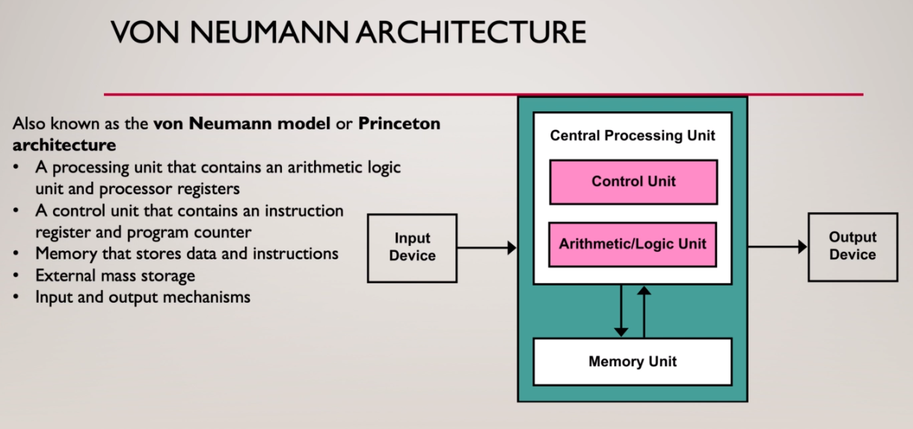

# 汇编语言

#### 1. 基础知识

总线：

- 数据总线：决定了CPU与存储器、外设接口卡等进行数据交换时一次能够传送的最大数据量
- 地址总线：决定了CPU的最大寻址空间
- 控制总线：决定了CPU对系统中其他器件的控制能力，最多能够支持多少种控制指令

内存地址空间：这个内存地址空间不是指进程的地址空间，它是指主存储器+其他各个设备中存储单元共同组成的逻辑地址空间。

#### 2. 寄存器

##### 2.1 通用寄存器

通用寄存器：在8086CPU中AX、BX、CX、DX被称为通用寄存器，用来存放一般性的数据。其中考虑到对上一代8080CPU汇编语言的支持，所以这些寄存器又分成了高低8位可独立的寄存器，例如AX可以被分成AH和AL寄存器。一般这些通用寄存器又有如下的分别：

- AX：累加寄存器
- BX：基地址寄存器
- CX：计数器寄存器
- DX：数据寄存器

在8086 CPU上对于简单的数据操作我们可以通过如下几条汇编指令进行操作：mov、add。

##### 2.2 寻址方式

由于8086CPU中拥有20位的数据总线，最大可以支持2\^20大小空间的寻址能力。但实际上由于8086CPU中最大只有16位的寄存器，这意味着寄存器最大运行存放16位的物理地址，所以Intel搞出了**“段地址x16+偏移地址”（基地址+偏移地址）**的寻址方式，从来实现最大2\^20大小的内存空间的寻址能力。

其中**段寄存器（常见的有CS、DS、SS）专门用来存放某一个内存段的段基地址，而偏移地址则是通过立即数或者像SP、IP这样的寄存器来进行给出**。

段的概念：在实际的内存中并没有“段”的概念，段的划分完全是CPU给出的，这样的好处在于可以通过分段的方式来更好的管理内存。在8086CPU中由于一个字的大小为16位，所以一个段的最大长度为64KB。

##### 2.3 CS:IP和代码段

代码段所在内存单元存放着程序需要执行的二进制指令代码。而CS:IP寄存器中数据的组合给出了CPU下一条需要执行的二进制指令所在的内存地址。其中：

- CS：代码段寄存器，存储着代码段的段基地址（需x16）
- IP：指令指针寄存器，存储着与上相关的偏移地址

当即将被执行的二进制机器指令被加载到CPU中的指令队列之后，IP指令指针寄存器会自动+2（一个8086CPU字的长度）。

需要注意的是mov指令并不能改变CS、IP寄存器中的内容，只有**转移指令**才能改变其中的内容！

#### 3. 寄存器和内存访问

##### 3.1 DS和数据段

##### 3.2 SS:SP和栈段

##### 3.3 GAS/AT&T汇编语言

https://en.wikibooks.org/wiki/X86_Assembly/GAS_Syntax

https://zhuanlan.zhihu.com/p/115915986

https://zhuanlan.zhihu.com/p/53394807

#### 4. bx和loop指令

#### 5. 更加灵活的内存定位方式

##### 5.1 SI、DI、BP寄存器

##### 5.2 各种各样的寻址方式

在8086 CPU中有如下几种常见的寻址方式：

1. 直接寻址方式
2. 寄存器间接寻址
3. 寄存器相对寻址
4. 基址变址寻址
5. 相对基址变址寻址

##### 5.3 数据运算指令

div、mul、and、or、shl、shr等指令

#### 6. 转移指令原理

##### 6.1 无条件跳转指令

包括基于位移（偏移量）的跳转指令和基于目的地址的jmp指令

##### 6.2 条件跳转指令和其他

以及loop循环指令

在8086CPU的汇编语言中处理无条件转移指令之外，还包括如下几种转移指令：

- 条件转移指令：常见的包括jcxz、cmp+jxxx的组合
- 循环指令：常见的包括loop指令
- 过程调用：将在下面的call和ret中讲到
- 中断：将在下面的内中断、int、外中断和iret等内容中讲述

#### 7. CALL和RET指令

##### 7.1 call和ret/retf指令

call指令会将①当前的IP或者CS+IP寄存器中的内容压入到栈中，②然后进行转移

ret指令实现近转移，弹出栈中一个双字节，并将IP修改，然后转移到原调用者过程

retf指令实现原转移，弹出栈中两个双字节，并将CS和IP修改，然后转移到原调用者过程

##### 7.2 模块化程序

过程调用的过程：

- 调用者程序调用call指令进行子程序调用（过程调用）：
  1. 将CS和IP寄存器压栈
  2. 然后修改CS和IP寄存器，使其指向子程序的入口地址
- 执行子程序：
  1. 先将子程序中使用的寄存器入栈，防止寄存器冲突
  2. 执行正式的处理任务
  3. 将先前保存的寄存器出栈，恢复到调用者程序进入时的状态
  4. 调用ret指令，将保存在栈中原CS和IP寄存器恢复到寄存器中，返回到调用者程序中

#### 8. 标志寄存器

##### 8.1 程序状态字PSW

PSW程序状态字中表示的相应标志位：

##### 8.2 与PSW相关的指令

adc：带进/借位标志的加法运算

sbb：带进/借位标志的减法运算

pushf：压栈标志寄存器

popf：出栈标志寄存器

#### 9. 内中断

##### 9.1 内中断的概念

包括中断的概念、中断的分类，以及中断处理程序和中断向量表

##### 9.2 中断处理过程

完整的内中断过程如下所示：

- 中断过程：
  1. 获取中断类型码（从中断信息中）
  2. 标志寄存器入栈：pushf
  3. 屏蔽中断、清空单步中断标志：IF=0、TF=0
  4. 将CS和IP压栈：push CS、push IP
  5. 从中断向量表中获取中断处理程序的入口地址，并将其设置到CS和IP寄存器中
- 中断处理程序：
  1. 保存中断处理程序中需要使用到的寄存器，防止寄存器冲突
  2. 正式的处理中断
  3. 恢复先前保存的使用到的寄存器的值
  4. 使用iret指令返回到中断发生前的程序之中

##### 9.3 int指令

int指令可以手动触发中断处理过程。

通过这个指令我们可以调用BIOS和DOS操作系统提供的中断例程，从而完成强有力的功能。

#### 10. 端口和外中断

##### 10.1 端口的概念

在外设的接口芯片中都会有一组寄存器，这组寄存器即被称为端口。8086CPU会对其进行统一编址，从而建立一个统一的端口地址空间。每一个端口在地址空间中都有一个地址。这在计算机组成原理课中称为统一编址，另一种被称为独立编址。

对于这些外设端口，我们可以通过in和out指令对其进行读写。

##### 10.2 外中断

外中断分成如下两种：

- 可屏蔽中断，一般我们接触的主要就是可屏蔽中断，对于外设的输入等信息都属于可屏蔽中断的范畴。而是否屏蔽可屏蔽中断的能力都主要标志寄存器中的IF标志位决定的，我们可以通过sti和cli两个指令来对这个标志位进行置位和复位。

  可屏蔽中断与普通内中断在处理过程上的不同在于主要还是在中断类型码上的获取方式不同，外中断需要通过数据总线进行读取，其他的话区别不是很大。

- 不可屏蔽中断，这种类型的外中断我们无法屏蔽，但实际中不常见。
